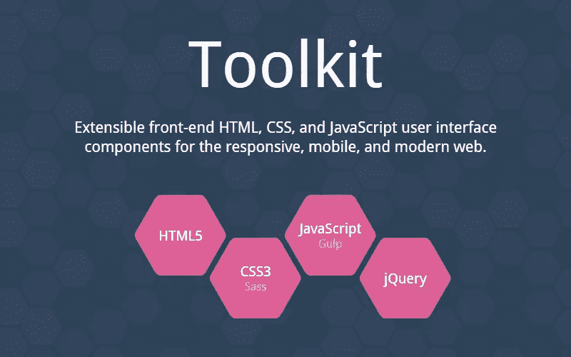

# 工具包:现代网络的前端框架

> 原文：<https://www.sitepoint.com/toolkit-front-end-framework-modern-web/>

Titon Toolkit，简称 Toolkit，是我在过去 4 年的空闲时间里从事的一个项目。它最初是一个 MooTools UI 框架，后来慢慢过渡到 jQuery，并计划在 3.0 中实现无供应商。所以我为什么要写另一个框架呢？在开始的时候，“CSS/JavaScript 框架”的世界还很年轻，Bootstrap 和 Foundation 只有一年左右的历史。我对前端框架的概念很感兴趣，并着手构建自己的框架，主要卖点是可定制性和可扩展性。

那么，工具包到底是什么？Toolkit 是一个前端框架，它提供了一组强大的基于状态的、特定于角色的用户界面组件和实用程序类，用于快速响应的、移动的和现代的 web。它利用了最新最棒的技术——html 5 用于语义，CSS3 用于动画和样式，Sass 用于 CSS 预处理，Gulp 用于任务和包管理，强大的新浏览器 API 用于 JavaScript 层，等等。

[](http://titon.io/en/toolkit)

Toolkit 的核心基于严格但重要的设计原则，包括响应式设计、移动优先设计、语义标记、渐进增强、适度降级、持续集成和超越约定的配置。这些原则最终决定了工具包背后的决策。

那么，Toolkit 只是另一个前端 UI 框架吗？是的，但是，如前所述，有一些关键的区别: **Toolkit 被构建成具有极强的可扩展性、易于定制和高效的架构**。

让我们来看看它的一些独特之处。

## 分离的 JavaScript、CSS 和 HTML

前端开发中的一个运行范例是通过类名和固定的 HTML 结构将 JavaScript 绑定到固定的 CSS 结构。Toolkit 不同意这种方法，并努力尽可能地分离 CSS、JavaScript 和 HTML，这为可定制的替代方案提供了可能性。Toolkit 通过要求特定的数据属性减轻了许多耦合问题——所有这些属性都用于元素遍历、查找和事件绑定。

下面的例子使用[工具包的 carousel 组件](http://titon.io/en/toolkit/2.1.0/components/carousel)作为概念证明。

```
<div class="carousel" data-carousel>
  <div class="carousel-items">
    <ul data-carousel-items>
      <li>...</li>
      <li>...</li>
      <li>...</li>
    </ul>
  </div>

  <button type="button" class="carousel-prev" data-carousel-prev>
  </button>
  <button type="button" class="carousel-next" data-carousel-next>
  </button>
</div>
```

有了解耦，定制 HTML 现在是可能的，而在使用替代框架时却不是这样。标记不再依赖于 JavaScript 组件；JavaScript 组件现在通过`data-*`属性绑定到标记。想给组件添加新标记吗？去吧！想要更改标记以匹配项目吗？随意！想要删除组件功能吗？移开！数据属性提供了我们认为更好的定制级别。

## 更简单的 CSS 样式

厌倦了不得不覆盖样式？或者处理膨胀？工具包当然是。正因为如此，Toolkit 中的 CSS 是非常轻量级的，因为它只定义了组件正确运行的最基本要求——主要是布局和结构样式。你可以说 Toolkit 是一个无主题、无风格的前端框架。由于是无主题的，Toolkit 很容易设计风格，甚至更容易集成。

此外，工具包选择不为 CSS 主题定制提供 Sass 变量(例如，边框大小、背景颜色、文本大小、字体系列等)。如果你想设计一个元素的样式，你可以用老办法，使用 CSS(或者 Sass，或者更少)！您还可以更进一步，将 Toolkit 集成为 Compass 扩展，这允许将 Toolkit 的 Sass 文件导入 scope 并直接编译到您自己的 Sass 文件中。

## 可自定义的 CSS 类名

现有框架中发现的另一个痛点是 CSS 类名冲突。工具包以两种方式之一解决了这个问题。

第一种方法是通过可定制的 Sass 变量，它允许定制大多数 CSS 类名。使用这种方法需要编译 Sass 文件，要么通过 Compass 扩展，要么直接在源代码中编译。

```
// Built-in BEM classes!
$carousel-class-items: bem("carousel", "slides");
```

第二种方法是通过给类加前缀来实现全局命名空间。当把框架集成到一个存在大量冲突的现有代码库中时，这会产生奇迹。启用名称空间就像修改 Sass 变量和 JavaScript 属性一样简单。

```
$namespace: "tk-"; // Sass
```

```
Toolkit.namespace = 'tk-'; // JavaScript
```

但是，请注意，名称空间不适用于状态、动画或行为类名。

## 可扩展 JavaScript

Toolkit 中的整个 JavaScript 层是围绕一个灵活的基于继承的面向对象的类系统而构建的。每个类管理自己的状态、事件和行为，这允许复杂的交互，因为每个实例都是唯一的。由于这个类层非常灵活，它允许编写自定义类，或者通过继承扩展现有类。

```
var Toolkit.Tooltip = Toolkit.Component.extend({
  constructor: function() {
    // ...
  }
});
```

最重要的是，每个类都支持一组可定制的选项。这些选项可以通过构造函数[或数据属性](http://titon.io/en/toolkit/2.1.0/development/js/component#options)进行全局设置。选项组甚至响应选项都内置在核心中。

```
$('.carousel').carousel({
  itemsToShow: 1,
  itemsToCycle: 1,
  autoCycle: false,
  responsive: {
    tablet: {
      breakpoint: '(min-width: 641px)',
      itemsToShow: 2
    },
    desktop: {
      breakpoint: '(min-width: 1281px)',
      itemsToShow: 3
    }
  },
  groups: {
    static: {
      infinite: false,
      loop: false
    },
    dynamic: {
      infinite: true,
      autoCycle: true
    }
  }
});
```

## 柔性盒支架

虽然是实验性的，但是 Toolkit 通过 [Flex 组件](http://titon.io/en/toolkit/2.1.0/components/flex)提供了内置的 flexbox 支持。通过区域和块的概念，Flex 组件在构建布局和基于网格的结构方面大放异彩。区域是包含块或其他区域的对象，而块是包含内容并在主轴和横轴内对齐的对象。虽然类似于行和列，但是区域和块被打包为具有对增长、收缩、排序、包装、嵌套、对齐和响应的额外支持。

```
<div class="region region--grid flow-center">
  <div class="block no-shrink">...</div>
  <div class="block">...</div>
  <div class="block order-2">...</div>
  <div class="block order-1">...</div>
  <div class="block">...</div>
  <div class="block no-grow">...</div>
</div>
```

## 功能齐全

除了已经提到的亮点之外，Toolkit 还支持一系列特性，包括:

*   [咏叹调支持](http://titon.io/en/toolkit/2.1.0/development/aria)
*   [从右到左(RTL)支持](http://titon.io/en/toolkit/2.1.0/development/rtl)
*   [BEM 命名惯例](http://titon.io/en/toolkit/2.1.0/development/bem)
*   [选项组](http://titon.io/en/toolkit/2.1.0/development/js/component#option-groups)
*   [响应选项](http://titon.io/en/toolkit/2.1.0/development/js/base#responsive-options)
*   [嵌套组件](http://titon.io/en/toolkit/2.1.0/development/js/component#namespaces)
*   [综合调试](http://titon.io/en/toolkit/2.1.0/development/js/toolkit#debugging)
*   [事件挂钩](http://titon.io/en/toolkit/2.1.0/development/js/base#hooks)
*   [可定制模板](http://titon.io/en/toolkit/2.1.0/development/js/component#templates)
*   [自动冲突解决](http://titon.io/en/toolkit/2.1.0/development/js/no-conflict)
*   [新的 jQuery 事件和方法](http://titon.io/en/toolkit/2.1.0/development/js/extensions)
*   [新的 Sass 混合和功能](http://titon.io/en/toolkit/2.1.0/development/sass)
*   [定制构建的模块化架构](http://titon.io/en/toolkit/2.1.0/setup/custom-builds)
*   [较小的 CSS 和 JS 文件大小](http://titon.io/en/toolkit/2.1.0/support/comparison)
*   强大的测试套件
*   Travis CI 支持
*   还有更多…

如果你想测试工具包的一些组件，你可以访问[这个互动演示页面](http://demo.titon.io/)。

## 沿着管道

JavaScript 生态圈随着新的技术、功能和规范不断发展。Toolkit 的目标是通过与最新的 JavaScript 开发保持同步，成为这一发展的一部分。目前的路线图包括下一个 3.0 主要版本的以下突破性但有趣的变化，[其中一些已经开始开发](https://github.com/titon/toolkit/issues/107)。

*   以 evergreen 浏览器及其前 3 个版本为目标。
*   删除作为依赖项的 jQuery，并填充任何不存在的功能。
*   使用 ECMAScript 6 功能重写 JavaScript 层，如类、箭头函数、模块、生成器、承诺等。
*   为 ES6 -> ES5 编译集成巴别塔。
*   集成模板渲染而不是 DOM 操作。
*   研究使用 [webpack](http://webpack.github.io/) 作为捆绑和构建工具。
*   通过将 Sass 集成到更少的 transpiler 来增加更少的支持。
*   使用基于通量的单向数据流系统重写组件

也有一些关于与外部框架集成的讨论，但这目前在 RFC 下。

*   [聚合填充](http://polyfill.io)集成缺失的浏览器功能
*   通过[聚合物](https://www.polymer-project.org/)或其他服务定制 web 组件
*   [React](http://facebook.github.io/react/) 和工具包组件集成

为什么不通过提供一些关于它应该采取的方向的建议来帮助我的工具包工作呢？非常感谢社区反馈和贡献！我一直在寻找新的团队成员和贡献者，所以如果你感兴趣，来 freenode.net # titon 聊天吧。

## 最后

向你们所有人展示 Toolkit 及其特性是一次美妙的经历。我希望你喜欢它，并像我一样发现工具包的用处。如果你想了解更多关于 Toolkit 的信息，我建议你访问[官方网站](http://titon.io/en/toolkit)、[我们的 Twitter 账户](https://twitter.com/projecttiton)，或者[GitHub repo](https://github.com/titon/toolkit)。干杯！

## 分享这篇文章