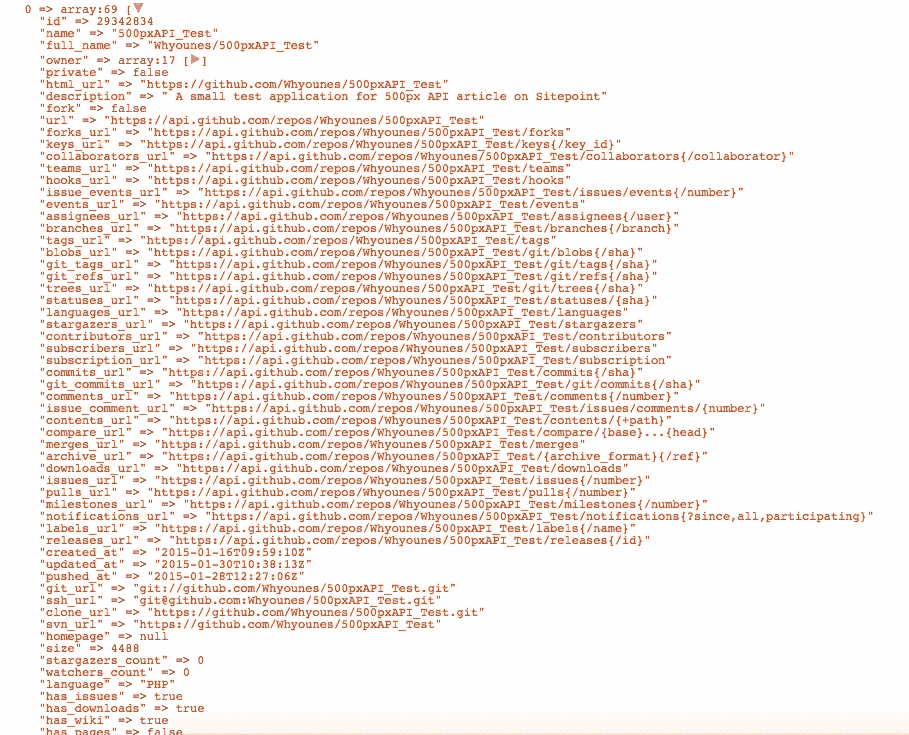
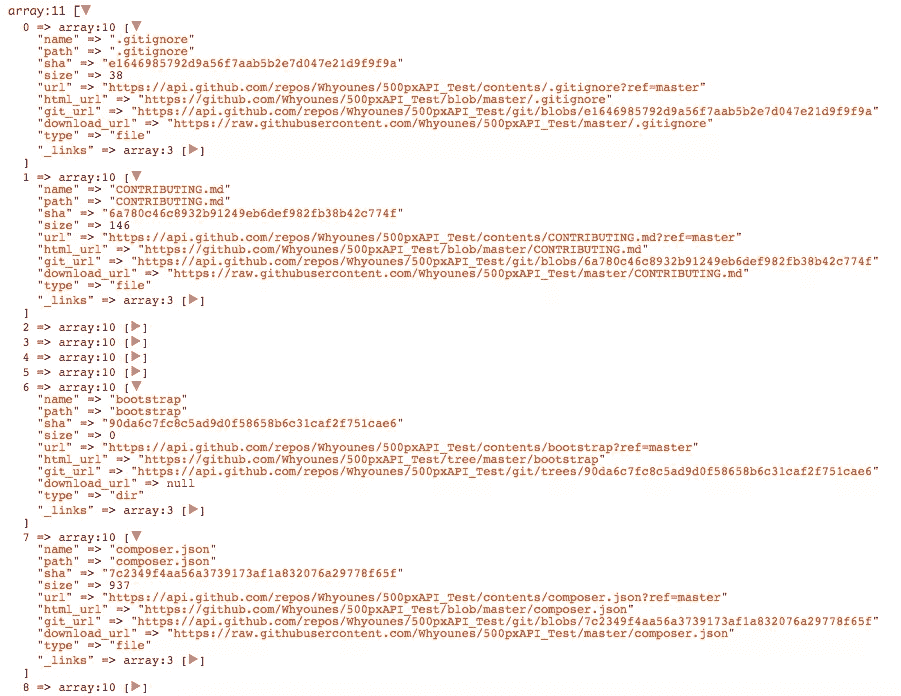
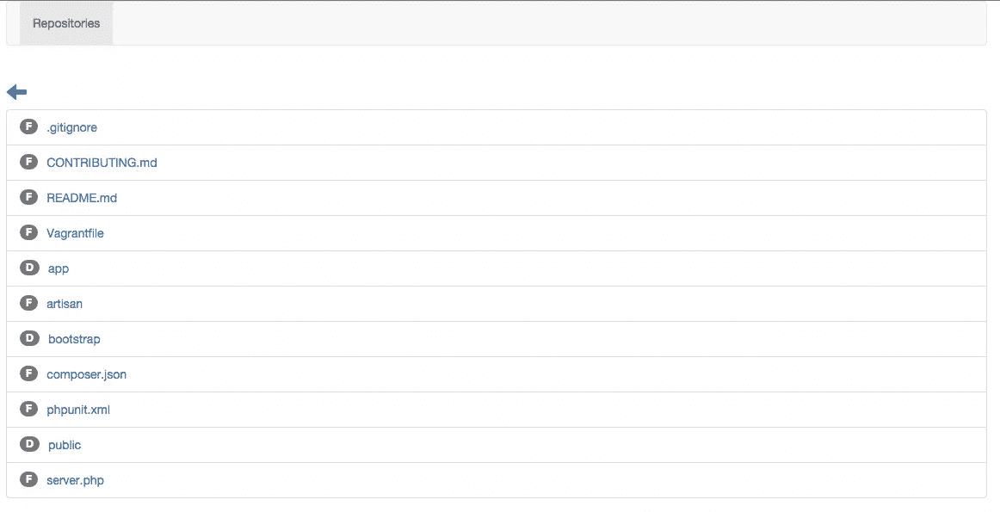
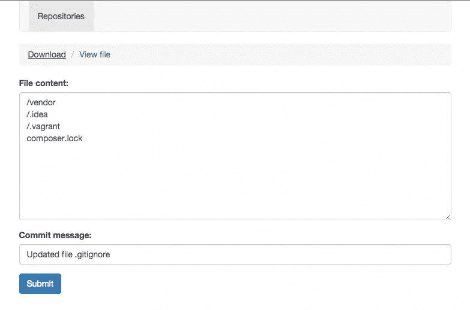
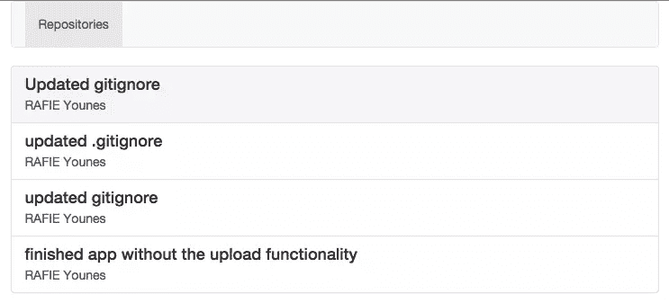

# 如何在 PHP 中使用 Github 的 API

> 原文：<https://www.sitepoint.com/use-githubs-api-php/>

Github 是共享代码和协作的最佳方式之一。在本文中，我们将学习如何使用他们的 API，以及如何使用它来完成一些日常任务。


## 我们正在建造的东西

我们将探索一些可以通过 Github API 完成的日常任务，并使用 Laravel 构建一个小应用程序来说明用例。你可以在 [Github](https://github.com/sitepoint-editors/GithubAPI_Demo) 上查看最终结果。

## 批准

在开始使用 API 之前，我们需要设置某种形式的授权。API 允许您访问所有公开可用的数据，但是有些端点需要用户许可。您可以使用[应用程序设置](https://github.com/settings/applications)创建一个具有特定访问范围的新令牌。范围取决于您的应用程序的需求，如访问用户电子邮件、更新用户配置文件等。

只有在某些特殊情况下才需要密码授权，比如访问用户[授权的应用程序](https://github.com/settings/applications)。在这种情况下，您需要提供您的用户名或电子邮件以及密码。

## 设置我们的应用程序

对于我们的示例应用程序，我将使用 [Laravel 5](https://github.com/laravel/laravel/tree/v5.0.0) 和 [KnpLabs](https://github.com/KnpLabs/php-github-api) Github PHP 实现。请务必更新您的`composer.json`文件。创建一个新的 Laravel 项目(`composer create-project laravel/laravel`)后，将`.env.example`重命名为`.env`，并用您的凭证更新它。

```
// .env
APP_DEBUG=true
GITHUB_EMAIL=USER_EMAIL
GITHUB_USERNAME=USERNAME
GITHUB_PASSWORD=PASSWORD
GITHUB_TOKEN=ACCESS_TOKEN
```

你真的不需要添加你的用户名和密码，我们只是用它们来说明使用令牌认证的局限性。

## 绑定 Github 客户端

```
// bootstrap/app.php

$app->singleton(‘Github\Client', function(){
  $client = new Github\Client();

  return $client;
});
```

你可能已经注意到我们没有使用我们的代币。这是因为大多数公共操作都是在没有任何授权的情况下进行的，但是对于每个端点，您都会发现访问它所需的身份验证级别。

## 按指定路线发送

我们的演示将包括几个主要功能。

*   列出用户存储库。
*   浏览用户存储库文件。
*   编辑并提交文件。
*   列出存储库的最新提交。

```
// app/Http/routes.php

Route::get('/', ['uses' => 'GithubController@index', 'as' => 'index']);

Route::get('/finder', ['uses' => 'GithubController@finder', 'as' => 'finder']);

Route::get('/edit', ['uses' => 'GithubController@edit', 'as' => 'edit_file']);

Route::post('/update', ['uses' => 'GithubController@update', 'as' => 'update_file']);

Route::get('/commits', ['uses' => 'GithubController@commits', 'as' => 'commits']);
```

## 控制器

`GithubController`类是我们的主控制器，拥有大部分逻辑。当调用类构造函数时，我们从容器中解析出`Github\Client`类，并加载我们的 username 环境变量。

```
// app/Http/Controllers/GithubController.php

class GithubController extends Controller
{

  private $client;

  /*
   * Github username
   *
   * @var string
   * */
  private $username;

  public function __construct(\Github\Client $client)
  {
    $this->client = $client;
    $this->username = env('GITHUB_USERNAME');
  }

}
```

## 列出存储库

### 按用户名存储库

您可以使用`/users/:username/repos`端点通过用户名检索回购。我们可以像这样访问端点:

```
$repos = $this->client->api('user')->repositories($username);
```

`api`方法将根据参数(`user`、`current_user`、`repo`等)解析所需的类。

### 认证用户

另一种方法是使用`/user/repos`端点检索当前经过身份验证的用户存储库。主要区别在于，仅使用用户名端点时，私有回购是隐藏的。

```
// client is our Github\Client
$repos = $this->client->api('current_user')->repositories();
```

现在我们知道了使用认证请求的第一个好处，让我们将令牌添加到`Github\Client`绑定中。

```
$app->singleton('Github\Client', function () {
  $client = new Github\Client();
  $token = env('GITHUB_TOKEN');

  if (!isset($token)) {
    dd("Github token is not set.");
  }

  //$client->authenticate(env('GITHUB_EMAIL'), env('GITHUB_PASSWORD'), Github\Client::AUTH_HTTP_PASSWORD);
  $client->authenticate($token, null, Github\Client::AUTH_HTTP_TOKEN);

  return $client;
});
```

`authenticate`方法使用第三个参数常量决定认证过程，如果您选择了电子邮件和密码方法，请确保更改断言测试。你可以查看[文档](https://github.com/KnpLabs/php-github-api/blob/master/doc/security.md#authenticate)了解更多信息。

```
// app/Http/Controllers/GithubController.php

  public function index()
  {
    try {
      $repos = $this->client->api('current_user')->repositories();

	  return View::make('repos', ['repos' => $repos]);
    } catch (\RuntimeException $e) {
      $this->handleAPIException($e);
    }
  }//index
```



repo 名称被传递给下一个路由，它用于向 API 查询存储库内容。您可以在[文档](https://developer.github.com/v3/repos/)中了解更多信息。

```
// app/resources/views/repos.blade.php

@extends('layouts.master')

@section('content')

    <div class="list-group">
        @foreach($repos as $repo)
            <a class="list-group-item" href="/finder?repo={{ $repo['name'] }}">
                <h4 class="list-group-item-heading">{{ $repo['name'] }}</h4>
                <p class="list-group-item-text">{{ $repo['description'] }}</p>
            </a>
        @endforeach
    </div>

@endsection
```


该页面还可以显示观星者计数，下载计数…等等。当用户点击链接时，我们需要加载存储库内容，并提供浏览存储库文件的能力。

## 存储库内容

要检索存储库的内容，您需要指定所有者、存储库名称和要检索的路径。您可以在[文档](https://developer.github.com/v3/repos/contents/)中了解更多信息。

```
// app/Http/Controllers/GithubController.php

public function finder()
{
  $repo = Input::get('repo');
  $path = Input::get('path', '.');

  try {
    $result = $this->client->api('repo')->contents()->show($this->username, $repo, $path);

    return View::make('finder', ['parent' => dirname($path), 'repo' => $repo, 'items' => $result]);
  } catch (\RuntimeException $e) {
    $this->handleAPIException($e);
  }
}//finder
```

`Github\Api\Repository\Contents@show`方法接受四个参数，第四个是分支，默认为`master`。



当用户选择一个文件夹时，我们用新路径重新加载同一个页面，当选择一个文件时，我们将他们重定向到编辑页面。



```
// app/resources/views/finder.blade.php

<ul class="list-group">
    @foreach($items as $item)
        <li class="list-group-item">
            @if(isset($item['type']) && $item['type'] == 'file')
                <a href="/edit?repo={{ $repo }}&path={{ $item['path'] }}">{{ $item['name'] }}</a>
                <span class="badge">F</span>
            @else
                <a href="/finder?repo={{ $repo }}&path={{ $item['path'] }}">{{ $item['name'] }}</a>
                <span class="badge">D</span>
            @endif
        </li>
    @endforeach
</ul>
```

如果当前项目类型是文件，我们创建指向编辑页面的链接，否则我们创建一个带有新文件夹路径的链接。我们还添加了一个徽章来简化文件类型识别和返回链接。

## 编辑文件

`Github\Api\Repository\Contents@show`方法返回一个项目数组或一个具有[正确文件类型](https://developer.github.com/v3/repos/contents/#response-if-content-is-a-symlink)的项目。


当文件类型为`file`时，内容将采用 base64 编码。我们不会和其他类型的人打交道，比如`submodule`或者`symlink`。

```
// app/Http/Controllers/GithubController.php

public function edit()
{
  $repo = Input::get('repo');
  $path = Input::get('path');

  try {
    $file = $this->client->api('repo')->contents()->show($this->username, $repo, $path);

    $content = base64_decode($file['content']);
    $commitMessage = "Updated file " . $file['name'];

    return View::make('file_update', [
        'file'    => $file,
        'path'    => $path,
        'repo'    => $repo,
        'content' => $content,
        'commitMessage'  => $commitMessage
    ]);
  } catch (\RuntimeException $e) {
    $this->handleAPIException($e);
  }
}//edit
```

```
// app/resources/views/file_update.blade.php

<ol class="breadcrumb">
    <li><a href="{{ $file['download_url'] }}" target="_blank">Download</a></li>
    <li><a href="{{ $file['html_url'] }}" target="_blank">View file</a></li>
</ol>

{!! Form::open(['url' => '/update', 'method' => 'POST']) !!}
    <input name="path" value="{{ $path }}" type="hidden"/>
    <input name="repo" value="{{ $repo }}" type="hidden"/>
    <div class="form-group">
        <label for="content">File content:</label>
        <textarea class="form-control" name="content" id="content" cols="30" rows="10">{{ $content }}</textarea>
    </div>

    <div class="form-group">
        <label for="commit">Commit message:</label>
        <input class="form-control" type="text" id="commit" name="commit" value="{{ $commitMessage }}"/>
    </div>

    <div class="form-group">
        <input type="submit" class="btn btn-primary btn-control" value="Submit" />
    </div>
{!! Form::close() !!}
```

获得文件后，我们解码内容，创建标准提交消息并生成编辑视图。存储文件更新需要其他传递的变量。



除了`owner`、`repo`和`path`之外，`/repos/:owner/:repo/contents/:path`端点还接受另外三个必需的参数。你可以在[文件](https://developer.github.com/v3/repos/contents/#update-a-file)中了解更多关于回购的内容。

*   `message`:提交消息。
*   `content`:文件内容。
*   `sha`:文件校验和。

```
// app/Http/Controllers/GithubController.php

public function update()
{
  $repo = Input::get('repo');
  $path = Input::get('path');
  $content = Input::get('content');
  $commit = Input::get('commit');

  try {
    $oldFile = $this->client->api('repo')->contents()->show($this->username, $repo, $path);
    $result = $this->client->api('repo')->contents()->update(
        $this->username,
        $repo,
        $path,
        $content,
        $commit,
        $oldFile['sha']
    );

    return \Redirect::route('commits', ['path' => $path, 'repo' => $repo]);
  } catch (\RuntimeException $e) {
    $this->handleAPIException($e);
  }
}//update
```

你可以在我们的表单中传递文件校验和作为隐藏输入，就像我们对`path`所做的那样，以避免调用 API，但是我更喜欢这种方式。更新方法的最后一个参数是分支，默认为`master`。成功更新后，我们将用户重定向到提交页面，以查看他们的最新提交。

## 承诺

`/repos/:owner/:repo/commits`端点返回某个存储库的提交列表。我们还能够按日期范围、作者或路径过滤提交。您可以在[文档](https://developer.github.com/v3/repos/commits/#list-commits-on-a-repository)中了解更多关于受支持参数的信息。

```
// app/Http/Controllers/GithubController.php

public function commits()
{
  $repo = Input::get('repo');
  $path = Input::get('path');

  try {
    $commits = $this->client->api('repo')->commits()->all($this->username, $repo, ['path' => $path]);

    return View::make('commits', ['commits' => $commits]);
  } catch (\RuntimeException $e) {
    $this->handleAPIException($e);
  }
}
```



`handleException`方法只是转储发生的异常，但是您可以使用响应代码和异常消息来采取适当的行动。

```
// app/Http/Controllers/GithubController.php

public function handleAPIException($e)
{
  dd($e->getCode() . ' - ' . $e->getMessage());
}
```

## 结论

我喜欢 Github API 的地方在于它可读性很强。您可以通过添加将 repo 下载到您的计算机的功能来扩展演示，或者为提交页面创建一个过滤器来轻松过滤用户提交的内容，等等。

Github 的 API 让你能够使用它的数据构建一些令人惊叹的工具。事实上，有一个很棒的叫做 [GithubArchive](https://www.githubarchive.org/) 的是使用公共 API 构建的，一定要去看看。如果您有任何意见或问题，请在下面留下。

## 分享这篇文章