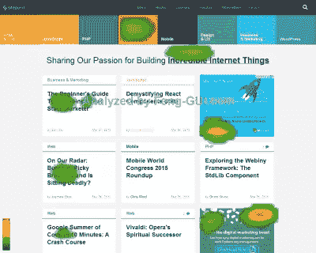

# 使用热图提高可用性和转化率

> 原文：<https://www.sitepoint.com/using-heatmaps-improve-usability-conversions/>

传统的网站分析工具总是为你提供有价值的洞察，让你了解你的内容有多受欢迎，以及用户在你的网站上停留的时间有多长。然而，即使是最好的分析工具也只能提供有限的信息。

例如，您目前是否能够找出导致高弃车率的原因，或者您的文案中哪些部分最吸引用户眼球。

幸运的是，你可以使用热图和鼠标跟踪工具来深入了解用户的想法，而不需要建立正式的焦点小组。除了成本效益之外，热图工具比焦点小组更有优势，因为用户自然地与你的产品互动，通常意识不到他们正在被观看。

冯贵生成的热图

尽管这些工具的好处非常明显，正如之前在 [SitePoint](https://www.sitepoint.com/content-research-click-tracking-heatmaps-recordings/) 上讨论的那样，点击跟踪和热图提供了许多好处，但是知道如何利用这些工具来改进您的网站可能是您所在领域成败的关键。

## 缩小范围

当涉及到热图和鼠标跟踪时，将精力集中在关键页面而不是整个网站上是很重要的。你分析的主要焦点应该是为转化用户而设计的内容，比如产品登陆页面或在线商店的结账区。

由于许多工具使用记录的会话来衡量帐户的使用情况，你会想把你的钱用在跟踪最有洞察力的页面上。

如果你想测试一个博客，你应该把重点放在主页上，因为这将提供关于用户在你的网站中去哪里的最深刻的见解。瞄准受欢迎的博客文章也能为你的读者提供有价值的见解。

另一方面，对于一个电子商务商店，你会希望把精力集中在最活跃的产品上，或者在他们的类别中是顶级的项目。对于公司页面等一般内容，您会希望将重点放在主页、投资组合、证明和常见问题页面上。

## 优先考虑您的测试

不管你的网站规模有多大，对你的测试进行成本效益分析总是很重要的，以确保你没有把精力放在网站的错误领域。完成这一阶段后，你应该给下面的每个方面分配一个从 0 到 10 的数字，其中 10 是最难的。

在选择页面时，应该首先测试得分最低的页面。

评估测试投资回报时要考虑的要点包括:

*   **时长:**考试时间越长，分数应该越高。
*   除非测试像用户工作流这样复杂的东西，否则你的测试应该尽可能简单。
*   影响:即使一个页面很受欢迎，如果它没有产生潜在客户或销售额，它可能不应该被测试。另一方面，登陆页面几乎总是应该被测试。
*   **成本:**如果你不需要付费广告，那么你的成本将为零。否则，你的关键词越有竞争力，你就越难将付费广告控制在合理的预算内。

另一方面，尽管点击付费广告可能是一个令人生畏的话题，但 [SitePoint](https://www.sitepoint.com/create-ads-people-want-click/) 有一篇文章介绍了如何让你的广告文案更具吸引力，让你的广告更贴近你的目标受众。

## 确定您的理想样本量

当分析鼠标跟踪和热图数据时，你应该确保你的样本大小适合你所测试的。

不幸的是，没有一个神奇的数字，因为规模取决于项目的范围。如果你试图获得一个样本大小的精确估计， [Wikipedia](http://en.wikipedia.org/wiki/Sample_size_determination) 有一个关于这个主题的详细页面。

对于那些不太倾向于数学的人来说，一般来说，你的研究至少要有 100 个样本。

## 记住:它只是众多工具中的一个

当收集见解来优化你的网站时，重要的是要确保你不要把自己局限于只使用一种工具来满足你的所有需求。热图和鼠标跟踪可以有效地洞察用户如何与你的网站互动，但它们只有在分析你网站相对较小的部分时才有用。

通过使用传统的分析工具，您不仅可以从整个网站中获得洞察力，还可以根据一般用户参与度来确定问题点。

就像生活中的任何事情一样，除非你对一件事或一个问题有背景，否则你需要在试图解决问题之前有背景。如果没有外部信息，您可以从与最终用户完全不同的角度来看待它。

## 分享这篇文章