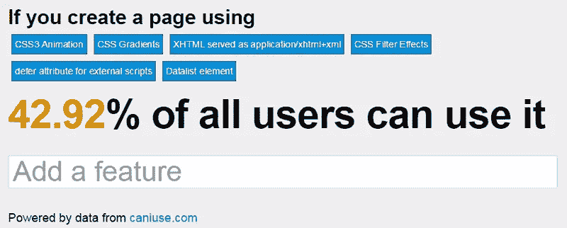
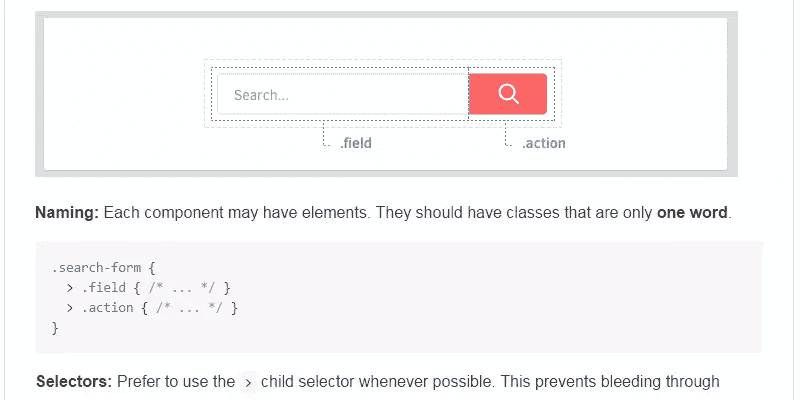
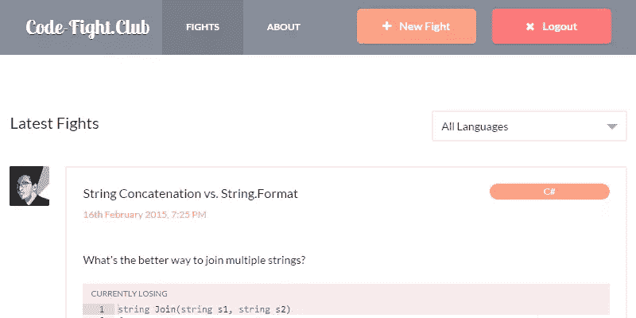
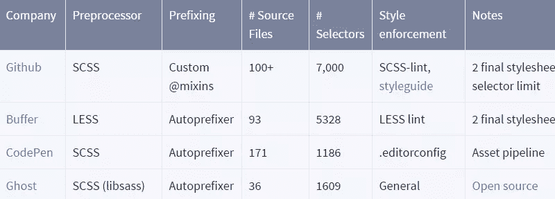

# 面向前端开发人员的另外 20 个文档和指南

> 原文：<https://www.sitepoint.com/another-20-docs-guides-front-end-developers/>

我们已经步入 2015 年，我相信你现在有两种感受:

1.  [真的被这个行业需要学习的东西压垮了，或者](https://www.sitepoint.com/drowning-in-tools-web-development-industry/)

2.  渴望更多，迫不及待地想知道下一步该学什么。

好吧，我想这可能是两者的结合——第一个来自我们的个人感觉，第二个纯粹是出于需要。

所以为了帮助你，我整理了另一个有用的文档、信息网站和指南的列表，它们与前端开发的各个领域相关。

## [1。我想用](http://www.iwanttouse.com/)

根据*上列出的数据和功能，我可以使用*吗，这个应用程序让您能够选择一些前端开发功能，并获得全球将看到您选择的功能的用户数量的百分比读数。

## [2。Regulex](http://jex.im/regulex/)

一个客户端正则表达式可视化工具，如果表达式中有语法错误，它会提供精确的错误指示器。还提供了一个使用 iframe 在任何地方嵌入输出的选项。

## [3。掌握第 n 个孩子](http://nthmaster.com/)

一个单页网站，帮助你掌握如何使用各种有用的，但往往是复杂的基于 n-child 的选择器组合。

## [4。HTML5 视频事件和 API](https://www.w3.org/2010/05/video/mediaevents.html)

本页演示了新的 HTML5 视频元素、其媒体 API 和媒体事件。在整个视频中播放、暂停和搜索，改变音量、静音、改变播放速率(包括进入负值)。请查看对视频以及基础事件和属性的影响。

## [5。XSS 过剩](http://excess-xss.com/)

这可能是所有开发人员都应该熟悉的话题，这可能是一个很好的起点。这是一个关于跨站点脚本的综合教程，描述了潜在的攻击类型，以及防止它们的解决方案。

## [6。rscss〔t1〕](https://github.com/rstacruz/rscss)

意思是“CSS 样式表结构的合理标准”，这是一项正在进行的工作，记录了为大型项目编写 Sass/CSS 的一些技巧和技术。

## [7。CodeFightClub](http://code-fight.club/)

“由 Andrew Hathaway 创建的项目，旨在帮助其他开发人员学习如何以最好、最有效和最受欢迎的方式编写代码。为了决定哪种代码是最受欢迎的方式，用户可以评论并投票反对他们最喜欢的竞争者。”网站是按编程语言分门别类的，这里好像还没有很多，但是你可以通过添加进去，开始一些“代码大战”来帮忙。

## [8。Sass 指南](http://sass-guidelin.es/)

来自 Sass 大师 Hugo Giraudel，“一个有见解的风格指南，用于编写理智的、可维护的和可伸缩的 Sass。”该指南已经被翻译成其他 6 种语言。

## [9。Flexbugs](https://github.com/philipwalton/flexbugs)

“一个由社区管理的 flexbox 问题列表以及针对这些问题的跨浏览器解决方案。我们的目标是，如果你正在使用 flexbox 构建一个网站，而有些东西不能像你预期的那样工作，你可以在这里找到解决方案。”对于那些开始用 Flexbox 构建新布局的人来说，这绝对是一个必须的书签。

## 10。一个前端工程师的宣言

没有什么太深入的，只是一套简单的东西，所有前端开发人员应该考虑纳入他们的开发过程和工作流程的提醒。

## [11。ES5 中的 ECMAScript 6 等价物](https://github.com/addyosmani/es6-equivalents-in-es5)

将 ES6 特性转换成 ES5 兼容代码的好参考。考虑到 [ES5 有很大的支持](http://kangax.github.io/compat-table/es5/)但是 [ES6 没有](http://kangax.github.io/compat-table/es6)，非常有用。

## [12。Flexbox 冒险](http://chriswrightdesign.com/experiments/flexbox-adventures/)

来自澳大利亚的开发者克里斯·赖特对 Flexbox 的深入、实用的研究。他还发布了[使用 Flexbox Today](http://chriswrightdesign.com/experiments/using-flexbox-today/) ，试图帮助你以一种合理、务实的方式迁移到 Flexbox。

## [13。得到好〔t1〕](http://getbem.com/)

一个全面的网站，推广和教育流行的边界元 CSS 方法的使用。

## 14.Sass 兼容性

"报告不同 Sass 引擎之间的不兼容性."

## 15\. HTMLelement.info

一个整洁的，逻辑的，易于使用的指南，从规范中获取不同 HTML 元素的信息。

## 16。JSLint 错误解释

如果你像我一样，你可能遵循了很多 JavaScript 最佳实践，但是可能不理解这些技术背后的所有原因。该网站旨在消除您在流行的林挺工具 JSLint、JSHint 和 ESLint 中发现的错误和警告。

## [17。动画—网络基础知识](https://developers.google.com/web/fundamentals/look-and-feel/animations/)

Google 的 Web Fundamentals 文档中有很多有用的信息，但是这一篇对于前端开发人员来说尤其突出，因为在制作 UI 元素动画时应用一些好的实践是非常重要的。

## 18。图标备忘单

"一个痛苦的痴迷的小抄到 favicon 大小/类型."从许多不同的流行文章中编译而来，这些文章讨论了桌面和移动设备上 favicons 的来龙去脉。

## [19。在…的 CSS](http://css-tricks.com/css/)

如果你想从一些大玩家那里得到 CSS 样式指南，Chris Coyier 整理了一个表格，里面有去年几个月流行的各种帖子的信息和链接。我相信随着其他人公开他们的 CSS 方法和实践，他会继续更新这个。

## 20。破折号

最后，一个本机 Mac 或 iOS 应用程序是“一个 API 文档浏览器和代码片段管理器”。Dash 存储代码片段，并立即在离线文档集中搜索 150 多个 API。”这对于几乎所有类型的开发人员来说都很棒。

## 建议你的

我们在 SitePoint 上不做太多的“列表帖子”,但这是我在过去一年中做的第三个这样的帖子，反响相当好。以下是另外两个，以防你错过了，或者如果你只是一个学习受虐狂:

*   [20 个对前端开发人员有用的文档和指南](https://www.sitepoint.com/20-docs-guides-front-end-developers/)
*   [面向前端开发人员的 20 多份文档和指南](https://www.sitepoint.com/20-more-docs-guides-front-end-developers/)

如果你知道这些帖子中没有包括的任何其他内容，或者如果你已经建立或编写了自己的类似内容，请随时在讨论中让我们知道。

## 分享这篇文章