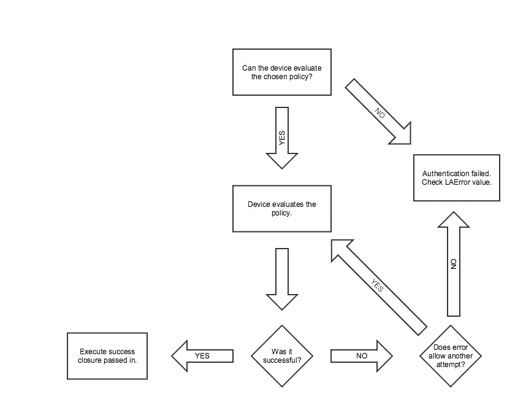
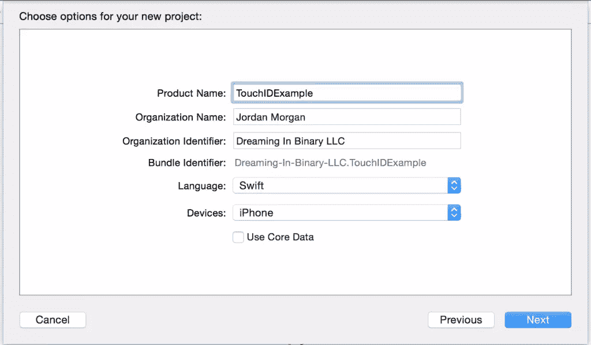
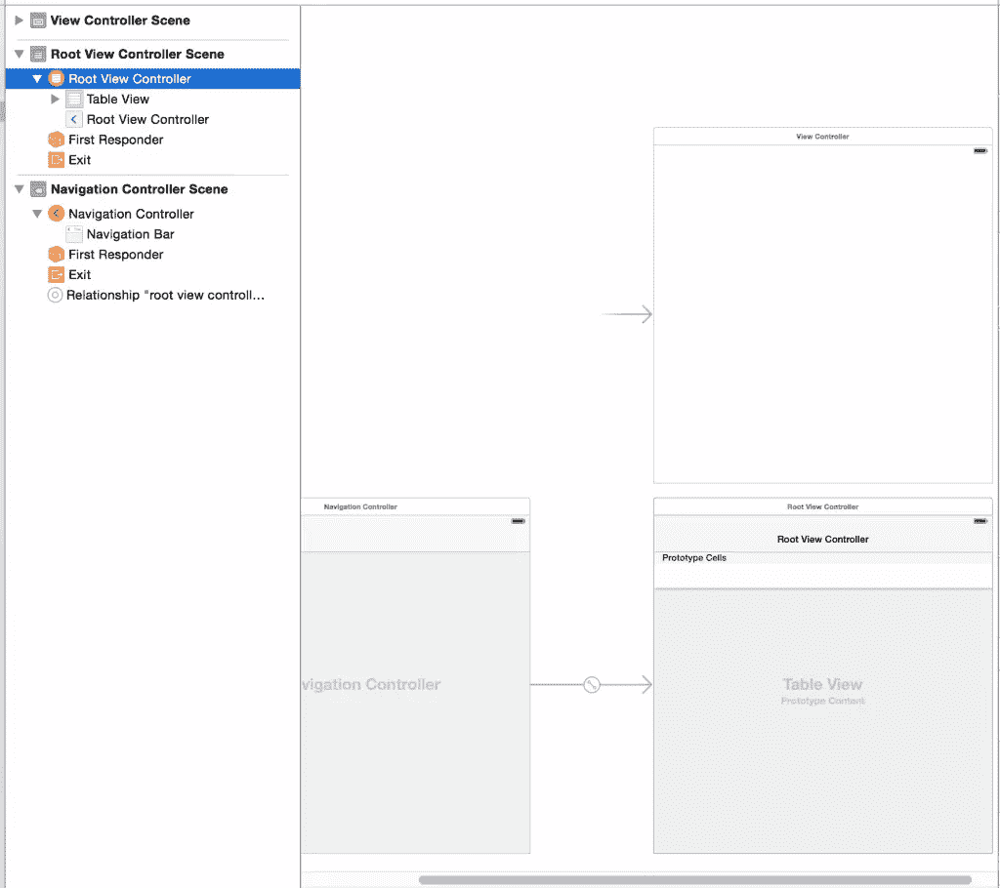
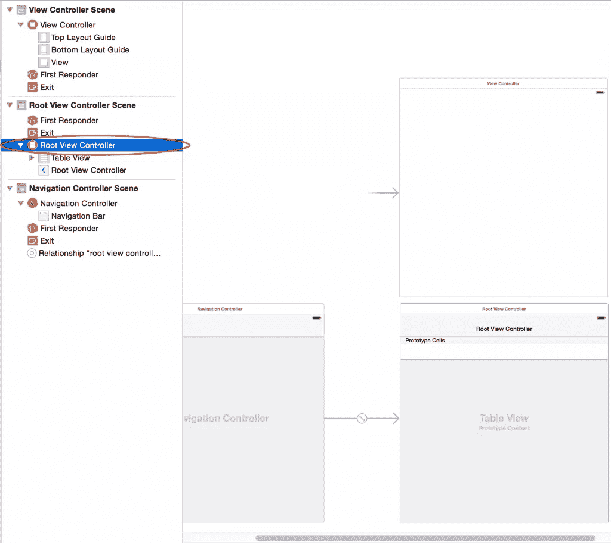
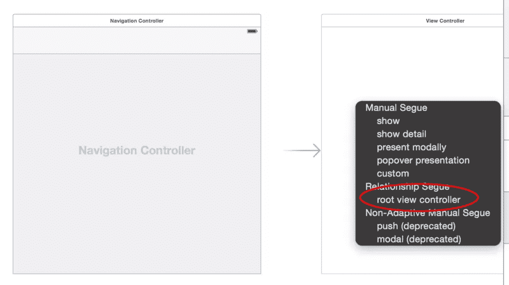
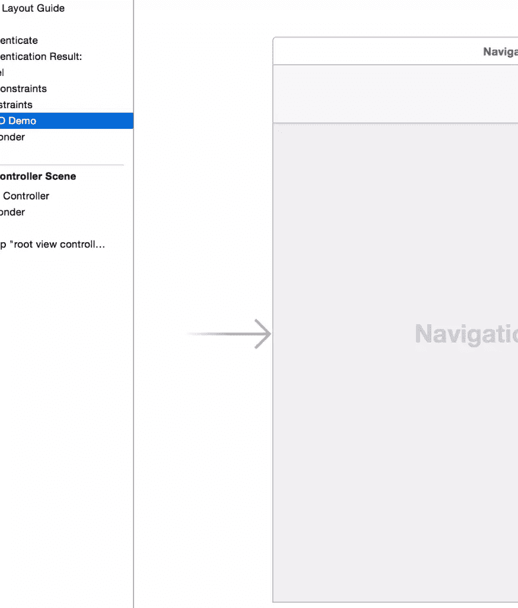
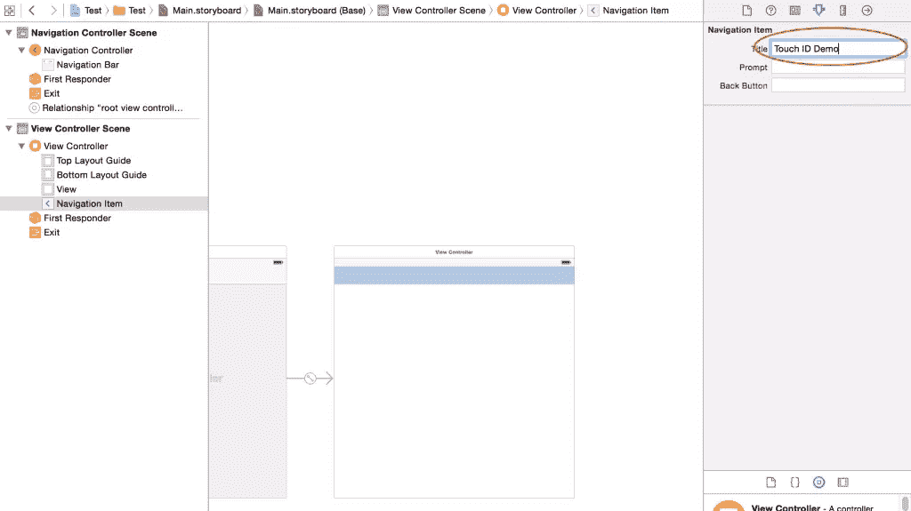
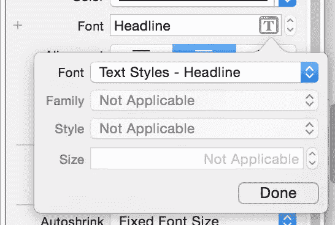
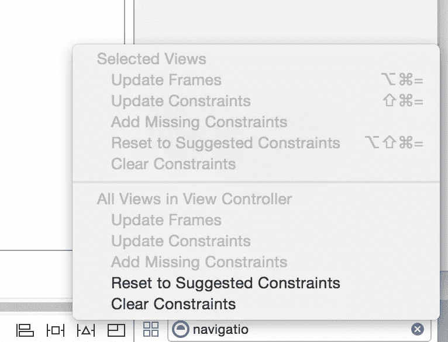
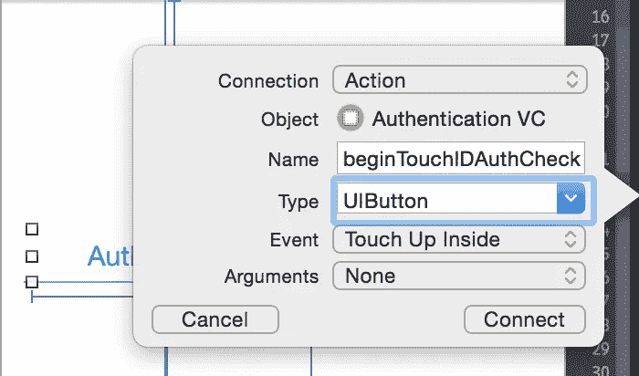

# 将触控 ID 集成到您的 iOS 应用程序中

> 原文：<https://www.sitepoint.com/integrating-touch-id-ios-app/>

app store 拥有数千款包含用户数据的应用。在 iOS 8 之前，如果不使用第三方 API 中的选项，就没有多少方法可以提供这些数据的安全性。

苹果认识到了在 iOS 中可访问和可靠的安全性的需求，并从引入 iOS 7 和 iPhone 5S 触控 ID 开始，它不仅比其他替代品更安全，而且对最终用户来说更容易和方便。

今天，我们将看看如何将触控 ID 集成到您自己的应用程序中。

## 本地认证

触控 ID 及其 API 由 iOS 8 中提供的本地认证框架驱动。有了它，您可以为设备用户评估特定的安全策略。目前，这个框架只包含一个公开的类—`LAContext`。

顾名思义，所有身份验证都严格地特定于设备及其用户。在许多情况下，用户会希望向设备验证自己的身份。一个常见的用途是当用户试图在应用商店购买应用程序时。

## 触控 ID 的驱动力

`LAContext`作为一种方式来执行任何类型的认证，这可以由它的父框架来执行。受支持的身份验证类型包含在`LAPolicy`枚举中，该枚举只包含一个值—`DeviceOwnerAuthenticationWithBiometrics`。将这个唯一的值保存在枚举中可以保持它的可伸缩性，所以除了触控 ID 之外，苹果可能会将它用于未来类型的本地认证。

关于`LAContext`，还有一个重要的枚举需要了解，那就是`LAError`。当认证过程遇到问题时，这将是`LAError`内部表示的错误之一。让我们来看看这些是什么:

*   **认证失败**:无效凭证。
*   **用户取消**:用户取消认证。
*   **用户回退**:用户选择回退方式，即输入密码。
*   **系统取消** : iOS 取消认证。
*   **PasscodeNotSet** :用户尚未设置系统范围的 4 位数密码。
*   **触摸不可用**:设备不支持触控 ID。
*   **触摸未控制**:用户没有设置触控 ID。

## 认证工作流程

现在我们知道了使用哪个框架和对象，让我们讨论一下身份验证工作流。

我们需要做的第一件事是选择一个策略进行身份验证。之后，我们会询问监督办是否可以对该政策进行评估。这有助于提高身份认证的效率，因为如果系统没有成功进行身份认证的机会，就没有理由再继续下去。

接下来，进行实际的身份验证。无论结果如何，提供的闭包都会执行。我很快会给你看一个例子。如果鉴定没有通过，iOS 首先评估是否可以进行另一次尝试。例如，如果无法正确读取指纹，并出现“重试”消息，就会出现这种情况。

如果认证上下文不允许多次尝试，那么一个`NSError`对象将被初始化。它的名为`localizedDescription`的属性也将被设置，表示在`LAError`中找到的值之一。您可以查看错误的`code`属性来查看确切的`LAError`值集。该流程图总结了整个工作流程:



## 项目设置

打开 Xcode 并创建一个新项目。我们将使用单一视图应用程序模板。在下一个屏幕上，确保选择 Swift 作为您的编程语言，并相应地命名项目。



该模板为我们提供了启动应用程序的基本要素。我们将处理的唯一文件是`ViewController.swift`和`Main.storyboard`。我们将首先创建一个简单的用户界面来显示身份验证是否成功。现在打开故事板开始。

## 用户界面

首先，我们将包含的视图控制器嵌入到导航控制器中。在对象检查器中，拖出一个“导航控制器”并放到故事板中。将其放在现有视图控制器的正下方。



现在，在文档检查器中选择*根视图控制器*并按下 delete 键。默认情况下，Xcode 给我们一个表视图控制器作为根视图控制器。我们只想为我们的用户界面设计一个空白的画布。



接下来， *control +拖拽*导航控制器到默认的视图控制器，放开。选择“根视图控制器”，如下所示:



最后，确保起点设置为我们新添加的导航控制器。要更改它，请单击导航控制器，打开属性检查器，并选中“是初始视图控制器”:


您的导航控制器应该有一个指向它的黑色箭头，如下所示:



接下来，点击文档大纲中根视图控制器的“导航项目”。在属性检查器中，将标题更改为“触控 ID 演示”:



### 按钮设置

从现在开始，我们将只处理用户界面的根视图控制器。

现在，将一个按钮拖到视图控制器上。双击它，并将其文本更改为“认证”。打开其大小检查器，并将以下值更改为:

**-X:266
-Y:189
-宽度:149
-高度:30**

### 标签设置

接下来，在按钮下拖动一个标签。将其文本更改为“认证结果”，将其字体更改为“标题”样式。这使用了动态文本，尽管用户界面在这里并不重要，但是开始养成将适应性设计方法融入工作流的习惯是很好的。



对于其大小和坐标，使用以下值:

**-X:186
-Y:273
-宽度:229
-高度:20**

现在，再拖出一个标签。因为这将显示认证结果，所以只需将文本设置为空字符串("")，将其字体样式设置为“Body”。我们希望它位于“身份验证结果”标签的正下方，因此将其大小和坐标设置如下:

**-X:121
-Y:312
-宽度:358
-高度:218**

就约束而言，我们将让 Xcode 为我们添加这些约束。选择视图控制器上的任何标签或按钮，单击底部的“解决自动布局”按钮，然后单击“视图控制器中的所有视图”部分中的“重置为建议的约束”。



## 挂钩网点和行动

当用户点击我们之前添加的按钮时，我们将开始身份验证过程。完成后，空白标签将根据结果进行更新。为此，我们需要一个按钮的`IBAction`和一个空白标签的`IBOutlet`。

选择故事板上的按钮并启用助理编辑器。按住 Control 键并从按钮拖动到`viewDidLoad`功能下方的任意位置`ViewController.swift`，然后放开。这样设置`IBAction`:



对空白标签执行相同的步骤，而不是为连接选择“Outlet”并将其命名为“lblAuthResult”。

## 执行触控 ID 身份验证

如前所述，我们需要导入本地认证框架，以允许我们访问`LAContext`类。为此，打开 ViewController.swift 并将其导入 UIKit 的正下方:

`import LocalAuthentication`

接下来，我们将编写一个实用函数来更新我们刚刚添加了一个出口的标签。身份验证完成后，如果出现问题，此标签将显示红色文本，如果身份验证成功，则显示绿色文本。在`ViewController.swift`内的任意位置添加以下代码:

```
func writeOutAuthResult(authError:NSError?)
    {
        dispatch_async(dispatch_get_main_queue(), {() in
            if let possibleError = authError
            {
                self.lblAuthResult.textColor = UIColor.redColor()
                self.lblAuthResult.text = possibleError.localizedDescription
            }
            else
            {
                self.lblAuthResult.textColor = UIColor.greenColor()
                self.lblAuthResult.text = "Authentication successful."
            }
        })

    }
```

这个函数很容易理解。每当我们执行身份验证时，我们都会调用这个函数让用户知道结果是什么。如果认证没有失败，`NSError`参数将为零。如果不是，说明有问题，我们将在标签中填入错误。

需要注意的一点是[大中央调度](https://developer.apple.com/library/mac/documentation/Performance/Reference/GCD_libdispatch_Ref/index.html)的使用。由于身份验证成功或失败时运行的任何代码都将在另一个线程上运行，因此我们将该函数中的代码提升为在主线程上运行。如果去掉`dispatch_async()`，标签的任何更新可能需要 10-15 秒。

现在，我们将在前面从按钮添加的`beginTouchIDCheck()`函数中添加触控 ID 认证逻辑。

添加这段代码，接下来我将解释它是如何工作的:

```
@IBAction func beginTouchIDAuthCheck()
    {
        let authContext:LAContext = LAContext()
        var error:NSError?

        //Is Touch ID hardware available & configured?
        if(authContext.canEvaluatePolicy(LAPolicy.DeviceOwnerAuthenticationWithBiometrics, error:&error))
        {
            //Perform Touch ID auth
            authContext.evaluatePolicy(LAPolicy.DeviceOwnerAuthenticationWithBiometrics, localizedReason: "Testing Touch ID", reply: {(wasSuccessful:Bool, error:NSError?) in

                if(wasSuccessful)
                {
                    //User authenticated
                    self.writeOutAuthResult(error)
                }
                else
                {
                    //There are a few reasons why it can fail, we'll write them out to the user in the label
                    self.writeOutAuthResult(error)
                }

            })

        }
        else
        {
            //Missing the hardware or Touch ID isn't configured
            self.writeOutAuthResult(error)
        }
    }
```

我们做的第一件事是通过初始化`LAContext`的一个实例来获得一个认证上下文。它的认证函数将期待一个指向`NSError`的指针，所以`error`的下一个声明会处理这个问题。

接下来，我们调用`canEvaluatePolicy`函数，该函数返回一个布尔值，指定是否可以评估给定的策略。在`error`参数前面的“&”符号仅仅意味着我们正在传递操作符的地址。这与 C#中 out 参数的工作方式非常相似。如果发生错误，将使用相关信息初始化错误对象。

如果我们可以评估给定的策略，则调用`evaluatePolicy`,我们提供一个原因，简要解释为什么我们要求执行身份验证。我们包含的闭包是在评估完成后立即调用的。

从这里开始，您需要根据结果采取具体的行动。如果成功，正如布尔参数所指出的，那么您可能会允许用户“继续”做一些事情(例如，解锁文件、登录某些内容、删除数据等)。

如果出了问题，你很可能会根据错误采取某些行动。不管是哪种情况，在这个例子中，我们只是把结果写到标签上。我添加了一些详细的注释，以显示您希望在哪里采取更具体的行动。

这就完成了将触控 ID 集成到您的应用程序中所需的所有编码。如果你需要已完成项目的完整源代码，你可以在 GitHub 上找到[。](https://github.com/sitepoint-editors/TouchIDExample)

## 结论

本地认证框架非常容易使用。此外，它还满足了一个非常重要的需求——保护用户数据的安全。过去，开发人员有责任为应用程序创建一种可行的身份验证形式，但现在，所有 iOS 中最常见的身份验证方法可供任何想要使用它的开发人员使用。

您计划使用本地身份验证做什么？社交登录、数据访问，或者更有创意的东西？请务必在下面的评论中告诉我们，一如既往地感谢您的阅读！

## 分享这篇文章