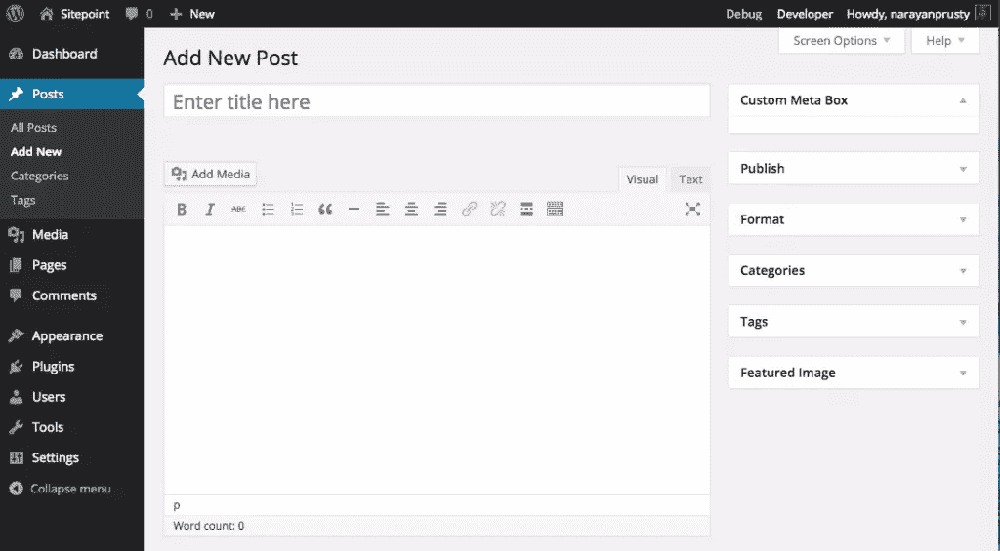

# 向 WordPress 管理界面添加自定义元框

> 原文：<https://www.sitepoint.com/adding-custom-meta-boxes-to-wordpress/>

WordPress 允许我们通过管理界面为文章、页面和自定义文章类型添加自定义元框。WordPress 也提供 API 来定制默认的元框。

在本教程中，我将向您展示如何添加新的自定义元框，保存自定义元数据，验证元数据，在前端检索自定义元数据，并删除默认元框。

### 什么是自定义元框？

除了 WordPress 使用默认元框获取的默认信息外，自定义元框允许用户在文章、页面和自定义文章类型中添加额外的信息。插件和主题可以使用自定义的元框来接受额外的结构化用户输入。

自定义元框也可以添加到仪表板，并附加到管理界面。WordPress dashboard 窗口小部件实际上是元盒。

*除了元框，你还可以[编辑管理栏](https://www.sitepoint.com/customize-wordpress-toolbar/)的内容和外观，登录到管理界面的人可以看到。*

编辑器，自定义字段，特色图像，类别，以及文章，页面或自定义文章页面管理界面上标签是默认的元框。它们是由 WordPress 核心创建的。

### 自定义元框与自定义字段

自定义字段允许用户向帖子、页面或自定义帖子类型添加数据的键/值对。但是元框可以有多种输入域，比如颜色选择器、文件上传、下拉框等等。

### 什么是元数据？

元数据是嵌入在自定义元框中的表单域的值。WordPress 将它们存储为键/值对，比如元键和元值。元键是表单域的名称，元值是表单域的值。

### 创建元框

[add_meta_box](http://codex.wordpress.org/Function_Reference/add_meta_box) 函数用于创建自定义元框。这个函数只负责注册和显示自定义的元框。

下面是向 WordPress 文章添加自定义元框的代码:

```
function custom_meta_box_markup()
{

}

function add_custom_meta_box()
{
    add_meta_box("demo-meta-box", "Custom Meta Box", "custom_meta_box_markup", "post", "side", "high", null);
}

add_action("add_meta_boxes", "add_custom_meta_box");
```

`add_meta_box`里面应该叫`add_meta_boxes`钩子。

`add_meta_box`接受 7 个参数。以下是论据列表:

1.  WordPress 使用它的 id 来唯一地识别每个元框。提供一个 id，并记住在它前面加上前缀以防止被覆盖。
2.  **$title** :管理界面上元框的标题。
3.  **$callback** : `add_meta_box`调用回调来显示自定义元框的内容。
4.  用于指示 WordPress 在哪个屏幕显示元框。可能的值有`"post"`、`"page"`、`"dashboard"`、`"link"`、`"attachment"`或`"custom_post_type"` id。在上面的例子中，我们将自定义的元框添加到 WordPress 文章界面。
5.  **$context** :用于提供自定义元在显示屏上的位置。可能的值有`"normal"`、`"advanced"`和`"side"`。在上面的例子中，我们把元盒放在了边上。
6.  **$priority** :用于提供盒子在所提供的上下文中的位置。可能的值有`"high"`、`"core"`、`"default"`和`"low"`。在上面的例子中，我们放置了元框
7.  **$callback_args** :用于给回调函数提供参数。

下面是元框的外观:



这里，自定义元框内容是空的，因为我们还没有填充内容。

### 在自定义元框中显示字段

为了演示的目的，我将添加一个文本输入，下拉菜单和一个复选框表单字段到自定义元框。

代码如下:

```
function custom_meta_box_markup($object)
{
    wp_nonce_field(basename(__FILE__), "meta-box-nonce");

    ?>
        <div>
            <label for="meta-box-text">Text</label>
            <input name="meta-box-text" type="text" value="<?php echo get_post_meta($object->ID, "meta-box-text", true); ?>">

            <br>

            <label for="meta-box-dropdown">Dropdown</label>
            <select name="meta-box-dropdown">
                <?php 
                    $option_values = array(1, 2, 3);

                    foreach($option_values as $key => $value) 
                    {
                        if($value == get_post_meta($object->ID, "meta-box-dropdown", true))
                        {
                            ?>
                                <option selected><?php echo $value; ?></option>
                            <?php    
                        }
                        else
                        {
                            ?>
                                <option><?php echo $value; ?></option>
                            <?php
                        }
                    }
                ?>
            </select>

            <br>

            <label for="meta-box-checkbox">Check Box</label>
            <?php
                $checkbox_value = get_post_meta($object->ID, "meta-box-checkbox", true);

                if($checkbox_value == "")
                {
                    ?>
                        <input name="meta-box-checkbox" type="checkbox" value="true">
                    <?php
                }
                else if($checkbox_value == "true")
                {
                    ?>  
                        <input name="meta-box-checkbox" type="checkbox" value="true" checked>
                    <?php
                }
            ?>
        </div>
    <?php  
}
```

下面是代码的工作原理:

*   首先，我们设置 nonce 字段，这样我们可以在提交表单时防止 CSRF 攻击。
*   [get_post_meta](http://codex.wordpress.org/Function_Reference/get_post_meta) 用于从数据库中检索元数据。如果没有这样的元数据，它将返回一个空字符串。如果您的用户之前已经提交了表单，那么我们将使用存储在数据库中的元数据。否则，我们切换到默认值。

下面是元框现在的样子:


### 存储元数据

现在，当用户提交表单时，我们需要存储自定义元数据；需要保存帖子。

下面是当用户点击“保存草稿”或“发布”按钮时保存元数据的代码:

```
function save_custom_meta_box($post_id, $post, $update)
{
    if (!isset($_POST["meta-box-nonce"]) || !wp_verify_nonce($_POST["meta-box-nonce"], basename(__FILE__)))
        return $post_id;

    if(!current_user_can("edit_post", $post_id))
        return $post_id;

    if(defined("DOING_AUTOSAVE") && DOING_AUTOSAVE)
        return $post_id;

    $slug = "post";
    if($slug != $post->post_type)
        return $post_id;

    $meta_box_text_value = "";
    $meta_box_dropdown_value = "";
    $meta_box_checkbox_value = "";

    if(isset($_POST["meta-box-text"]))
    {
        $meta_box_text_value = $_POST["meta-box-text"];
    }   
    update_post_meta($post_id, "meta-box-text", $meta_box_text_value);

    if(isset($_POST["meta-box-dropdown"]))
    {
        $meta_box_dropdown_value = $_POST["meta-box-dropdown"];
    }   
    update_post_meta($post_id, "meta-box-dropdown", $meta_box_dropdown_value);

    if(isset($_POST["meta-box-checkbox"]))
    {
        $meta_box_checkbox_value = $_POST["meta-box-checkbox"];
    }   
    update_post_meta($post_id, "meta-box-checkbox", $meta_box_checkbox_value);
}

add_action("save_post", "save_custom_meta_box", 10, 3);
```

下面是代码的工作方式:
–`save_post`当一个帖子、页面和自定义帖子类型被保存时，钩子的回调被触发。我们附加了一个回调来保存元数据。
–我们验证随机数。如果 nonce 不存在或无效，那么我们不保存返回回调。
–我们检查当前登录的管理员用户是否有权限保存该帖子类型的元数据。如果用户没有权限，那么我们返回回调。
–我们检查帖子是否被自动保存。如果保存是自动保存的，那么我们返回回调。
–最后检查帖子类型是否与元框帖子类型相同。如果没有，那么我们返回回调。
–我们使用 PHP `$_POST`变量检索表单字段的值，并使用 [update_post_meta](http://codex.wordpress.org/Function_Reference/update_post_meta) 将它们保存在数据库中。`update_post_meta`如果关键字不存在，在数据库中创建一个新的元数据关键字/值，否则更新关键字值。

### 移除元框

我们可以使用 [remove_meta_box](http://codex.wordpress.org/Function_Reference/remove_meta_box) 移除自定义元框和默认的 WordPress 核心元框。要删除一个元框，你需要它的 ID，屏幕和内容。

以下是一些重要的默认元框的 id:

*   ' Author div '–作者元框
*   ' category div '–类别元框
*   ' commentstatusdiv '–评论状态元框(讨论)
*   ' Comments div '–注释元框
*   ‘formatdiv’ – Formats metabox
*   ' page parent div '–属性元框
*   ' post Custom '–自定义字段元框
*   “postexcerpt”元框除外
*   “后期图像”–特色图像元框
*   ' Revisions div '–修订元框
*   ' Slug div '–Slug metabox
*   “submit div”–日期、状态和更新/保存元框
*   metabox 标记
*   { $ tax-name } div '–分层自定义分类元框
*   ' trackbacksdiv '–引用通告元框

下面是删除自定义字段元框的代码:

```
function remove_custom_field_meta_box()
{
    remove_meta_box("postcustom", "post", "normal");
}

add_action("do_meta_boxes", "remove_custom_field_meta_box");
```

这里我们触发了`do_meta_boxes`钩子中的`remove_meta_box`。但是你不能总是在里面叫`remove_meta_box`。例如，要删除仪表板小部件，您需要在`wp_dashboard_setup`钩子中调用它。

### 最后的想法

如果你正在构建一个插件或者主题，WordPress Meta Box APIs 是非常有用的。SEO、帖子系列和相关内容插件利用自定义元框来获取帖子的附加用户信息。

## 分享这篇文章