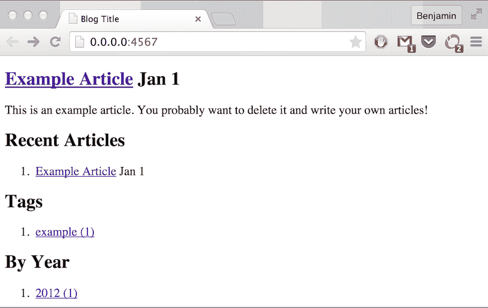
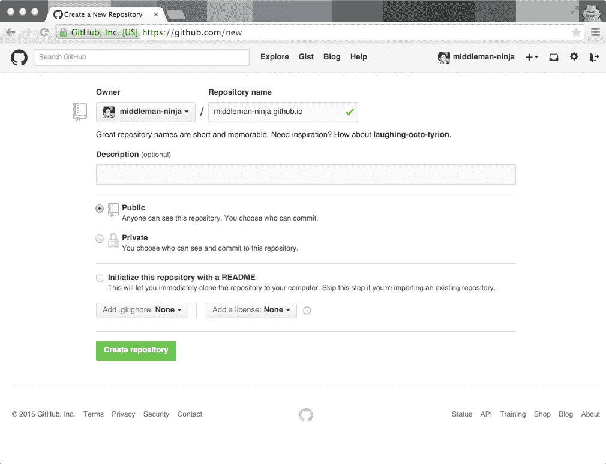
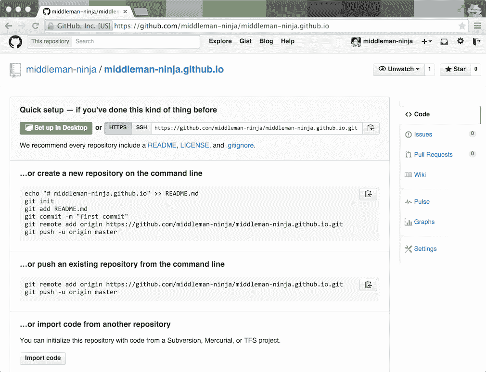

# 有中间人和 GitHub 的免费静态网站

> 原文：<https://www.sitepoint.com/free-static-sites-middleman-github/>


我将教你如何使用一个新的工作流程来建立一个网站，我一直用它来建立我自己的[个人登陆页面](http://benjamintan.io)、[产品页面](http://rubyclosur.es)和[博客](http://benjamintan.io/blog)。你不仅可以定制你的网站来适应你的每一个突发奇想和幻想，而且我将向你展示如何免费做这件事。

我们将学习如何使用[中间人](https://middlemanapp.com/)来开发网站，并使用 GitHub 来托管它。我们开始吧！

## 什么是静态站点？

静态站点没有任何动态内容。博客、登录页面和产品页面都是静态网站的典型例子。因为静态站点是“原样”出现的，所以速度非常快。

## 遇见中间人，静态站点生成器

中间人标榜自己是“使用现代 web 开发中所有快捷方式和工具的静态站点生成器”静态站点生成器到底是什么？这意味着中间人有脚本，可以获取你的源文件(用 Markdown 编写)并将其转换成 HTML。它还包含将部署生成的 HTML 的脚本。

## 设置中间人和 GitHub

让我们立即行动吧。在这一节中，我们将安装中间人，并学习如何将新生成的站点部署到 GitHub。本节还假设您有一个 [GitHub](https://github.com) 帐户。如果没有，您应该创建一个。

### 安装中间人

中间人是用 Ruby 编写的，并且整齐地打包在一个 gem 中。继续启动你的终端，安装宝石:

```
$ gem install middleman
Successfully installed middleman-3.3.7
1 gem installed
```

既然我们正在创建一个博客，那就继续安装`middleman-blog` gem 吧:

```
$ gem install middleman-blog
Successfully installed middleman-blog-3.5.3
1 gem installed
```

### 创建一个中间人驱动的博客

假设您已经创建了一个 GitHub 帐户，现在您可以创建您的第一个中间人项目了。对于这个例子，我的 GitHub 用户名是`middleman-ninja`。因此，我将我的项目命名为`<username>.github.io</username>`:

```
% middleman init middleman-ninja.github.io --template=blog

      create  middleman-ninja.github.io/Gemfile
         run  bundle install from "."
Fetching gem metadata from http://rubygems.org/........
Fetching additional metadata from http://rubygems.org/..
Resolving dependencies...
...
Your bundle is complete!
Use `bundle show [gemname]` to see where a bundled gem is   installed.
      create  middleman-ninja.github.io/.gitignore
      create  middleman-ninja.github.io/config.rb
      create  middleman-ninja.github.io/source
      create  middleman-ninja.github.io/source/2012-01-01-example-article.html.markdown
      create  middleman-ninja.github.io/source/calendar.html.erb
      create  middleman-ninja.github.io/source/feed.xml.builder
      create  middleman-ninja.github.io/source/index.html.erb
      create  middleman-ninja.github.io/source/layout.erb
      create  middleman-ninja.github.io/source/tag.html.erb
      create  middleman-ninja.github.io/source/stylesheets
      create  middleman-ninja.github.io/source/javascripts
      create  middleman-ninja.github.io/source/images
```

中间人将创建一个 Gemfile 并运行`bundle install`来安装必要的依赖项。更重要的是，它生成创建博客所必需的文件。

### 运行中间人服务器

中间人与服务器打包在一起。这使我们能够预览网站或博客文章，这在开发过程中特别有用。我们还没有做任何编码，但是作为一个健康检查，`cd`进入中间人项目并启动服务器:

```
% cd middleman-ninja.github.io
% middleman server
middleman server
WARN: Unresolved specs during Gem::Specification.reset:
      rack (< 2.0, >= 1.4.5)
      uber (~> 0.0.4)
      rack-test (~> 0.6.2)
      thor (< 2.0, >= 0.15.2)
      activesupport (>= 3.1, ~> 4.1.0)
      listen (< 3.0, >= 2.7.9)
WARN: Clearing out unresolved specs.
Please report a bug if this causes problems.
== The Middleman is loading
== The Middleman is standing watch at http://0.0.0.0:4567
== Inspect your site configuration at http://0.0.0.0:4567/__middleman
```

将浏览器指向`http://0.0.0.0:4567`。如果您遇到问题，请尝试使用`http://localhost:4567`。



如果你看到上面的页面，说明你已经成功设置了中间人。如你所见，中间人并没有试图设计你的页面。一切都取决于你。

### 目录结构

中间人使用的结构很简单:

```
|-- Gemfile
|-- Gemfile.lock
|-- config.rb
|-- source
    |-- 2012-01-01-example-article.html.markdown
    |-- calendar.html.erb
    |-- feed.xml.builder
    |-- images
    |-- index.html.erb
    |-- javascripts
    |-- layout.erb
    |-- stylesheets
    |-- tag.html.erb
```

大部分动作都包含在`source`目录中。图像、CSS 样式表和 JavaScript 都存储在各自的文件夹中。帖子，或者中间人称之为*文章*，也存储在`source`文件夹中。配置在`config.rb`文件中完成。

### 创建文章

您可以使用`middleman article "TITLE-GOES-HERE"`创建一篇文章。在中间人项目根文件夹中，运行以下命令:

```
% middleman article "5000 killer Middleman Tips"
==> create  source/2015-01-27-5000-killer-middleman-tips.html.markdown
```

刷新您的浏览器，您应该会找到列出的文章。

### 中间人扩展

我们需要引入更多的宝石，以便用中间人建立一个博客，并处理部署到 GitHub。打开`Gemfile`，确保它看起来像这样:

```
source 'http://rubygems.org'

gem "middleman", "~> 3.3.7"
gem "middleman-blog", "~> 3.5.3"
gem "middleman-deploy", "~> 1.0"

gem "builder", "~> 3.0"
```

不要忘记安装依赖项:

```
% bundle install
```

`middleman-blog`和`middleman-deploy`是中间人*扩展*的例子。中间人的扩展需要*激活*。这是在`config.rb`文件中完成的。您会注意到`blog`已经被激活:

```
activate :blog do |blog|
  # blog configuration
end
```

#### 配置部署

就在这下面，您需要激活其他几个扩展:

```
activate :deploy do |deploy|
  deploy.method = :git
  deploy.branch = 'master'
  deploy.build_before = true
end

activate :directory_indexes
```

### 设置 Git

在设置 GitHub 之前，在我们的项目中初始化一个新的存储库:

```
% git init
```

静态生成的文件将在`master`分支上。这意味着您不应该在`master`分支上进行更改。因此，让我们创建另一个名为`source`的分支:

```
% git checkout -b source
% git commit -am "Initial commit"
% git push --set-upstream origin source
```

一旦 git 完成推送，就去 GitHub 中的仓库。您现在会注意到已经创建了`source`分支。

### 设置 Github

假设您的 GitHub 帐户，创建一个名为`<username>.github.io</username>`的存储库，其中`<username></username>`是您的 GitHub 用户名。因此，我将创建一个名为`middleman-ninja.github.io`的新存储库:



按照 GitHub 的说明，将远程存储库添加到您的项目中。请注意，我们*还没有*在做`git push -u origin master`。



```
git remote add origin https://github.com/middleman-ninja/middleman-ninja.github.io.git
```

现在，您可以使用`middleman deploy`命令直接部署到 GitHub:

```
% middleman deploy
         run  middleman build from "."
      create  build/2012/01/01/example-article.html
      create  build/2015/01/27/5000-killer-middleman-tips.html
      create  build/feed.xml
      create  build/index.html
      create  build/tags/example.html
      create  build/2015.html
      create  build/2015/01.html
      create  build/2015/01/27.html
      create  build/2012.html
      create  build/2012/01.html
      create  build/2012/01/01.html
Deploying via git to remote="origin" and branch="master"
Switched to a new branch 'master'
[master (root-commit) fce6394] Automated commit at 2015-01-27 09:55:04 UTC by middleman-deploy 1.0.0
 11 files changed, 451 insertions(+)
 create mode 100644 2012.html
 create mode 100644 2012/01.html
 create mode 100644 2012/01/01.html
 create mode 100644 2012/01/01/example-article.html
 create mode 100644 2015.html
 create mode 100644 2015/01.html
 create mode 100644 2015/01/27.html
 create mode 100644 2015/01/27/5000-killer-middleman-tips.html
 create mode 100644 feed.xml
 create mode 100644 index.html
 create mode 100644 tags/example.html
```

我们已经将`middleman-deploy`扩展配置为总是在将站点推送到 GitHub 之前构建站点(生成静态文件)。

在这个过程中，GitHub 可能会提示您输入用户名和密码:

```
Username for 'https://github.com': middleman-ninja
Password for 'https://middleman-ninja@github.com':
Counting objects: 20, done.
Delta compression using up to 4 threads.
Compressing objects: 100% (18/18), done.
Writing objects: 100% (20/20), 2.25 KiB | 0 bytes/s, done.
Total 20 (delta 9), reused 0 (delta 0)
To https://github.com/middleman-ninja/middleman-ninja.github.io.git
 * [new branch]      master -> master
```

注意，如果你在 GitHub 中有你的 [SSH 密钥，那么你将不会被提示输入你的凭证。稍等片刻，但很快，您的站点将部署到`http://<username>.github.io</username>`:](https://help.github.com/articles/generating-ssh-keys/)


成功！你在 GitHub 上拥有了一个完全免费的功能齐全(尽管很丑)的博客！

### 中间人工作流程

概括一下，工作流程如下:

1.  首先，使用`middleman article "TITLE"`创建一篇新的博客文章。
2.  第二，你写你的帖子。
3.  第三，使用`middleman deploy`部署到 GitHub。

就是这样！这些是创建博客文章时唯一需要的步骤。

### 设置域名

如果我想让站点指向`www.middleman-ninja.com`呢？你必须做两件事。首先，设置你的域名服务器指向 GitHub。这在 [GitHub](https://help.github.com/articles/tips-for-configuring-an-a-record-with-your-dns-provider/) 中有所涉及。

其次，创建一个 CNAME 文件。在`source`分支中创建 CNAME 文件非常重要，因为每次运行`middleman deploy`时，`master`分支中的文件都会被破坏。进入分支后，在`source`目录下创建 CNAME 文件。

```
% git checkout source
% vim source/CNAME
```

CNAME 文件将只包含一行包含您的域名(没有“www”)。例如:

```
% cat source/CNAME
middleman-ninja.com
```

如果你已经设置好了一切，你很快就可以访问你的网站了。

## 奖金！在 GitHub 上建立多个中间人网站

如果你想在 GitHub 上有不止一个网站怎么办？你会怎么做？设置稍微有点复杂，但没有那么复杂。除了设置 git 分支之外，步骤基本相同。

计划如下:我们将:

*   开始一个新的中间人项目和相同的 Gemfile，让事情开始得更快
*   set up git
*   在`config.rb`中配置`middleman-deploy`扩展
*   将站点部署到 GitHub

### 开始一个新的中间人项目

这一次，我们可以给它取任何我们想要的名字。在一个*新的*目录中(不要在现有的“middleman-ninja.github.io”文件夹中运行该命令)，创建一个新的中间人博客:

```
% middleman init middleman-is-awesome --template=blog
```

让我们建立`source`分支机构:

```
% cd middleman-is-awesome
% git init
% git checkout -b source
```

打开`Gemfile`，确保它看起来如下:

```
# If you have OpenSSL installed, we recommend updating
# the following line to use "https"
source 'http://rubygems.org'

gem "middleman", "~> 3.3.7"
gem "middleman-blog", "~> 3.5.3"
gem "middleman-deploy", "~> 1.0"

# For feed.xml.builder
gem "builder", "~> 3.0"
```

记得使用`bundle install`安装 gems:

```
% bundle install
```

现在，在`config.rb`中，我们需要激活`middleman-deploy`扩展:

```
activate :deploy do |deploy|
  deploy.method = :git
  deploy.branch = 'gh-pages'
  deploy.build_before = true
end
```

注意，这一次，`deploy.branch`被设置为`gh-pages`。

接下来，在 GitHub 中创建新的存储库。为了方便起见，给它取相同的名字。记住也要设置遥控器:

```
% git remote add origin https://github.com/middleman-ninja/middleman-is-awesome.git
```

完成后，您可以继续运行部署命令:

```
% middleman deploy
```

几分钟后，新创建的站点将在`http://<username>.github.io/middleman-is-awesome/</username>`可用。域名呢？这是和以前一样的故事。在`source`分支的`source`目录下创建一个 CNAME 文件，将您的名称服务器指向 GitHub，就可以了。

## 勇往直前去创造吧！

希望您现在认识到，Middleman 和 GitHub 是创建静态网站的一个非常有效和划算的组合。我发现中间人有一个愉快的工作流程。扩展可以是中间人扩展的形式，也可以是 Ruby gems。

这篇文章没有涉及定制外观和感觉。这是因为它与开发和设计任何其他网站没有什么不同！为了获得灵感，你可以看看使用中间人开发的其他网站。感谢阅读！

## 分享这篇文章