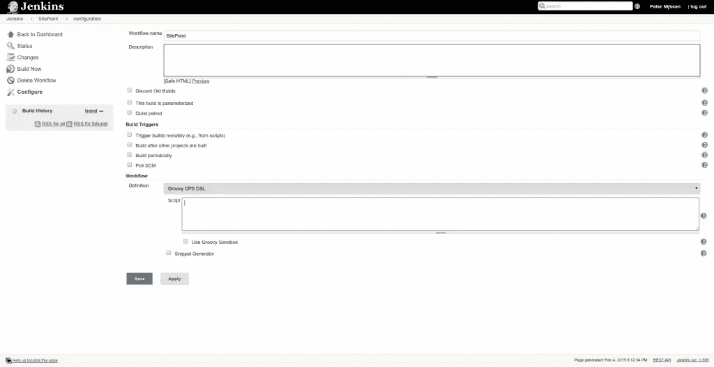
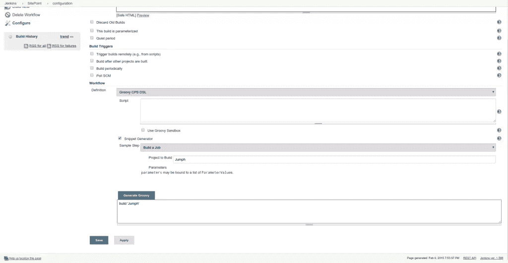

# 在詹金斯用工作流程持续交付增压器

> 原文：<https://www.sitepoint.com/supercharge-continuous-delivery-jenkins-workflow-plugin/>

*本文由 [CloudBees](https://www.cloudbees.com/) 赞助。感谢您对使 SitePoint 成为可能的赞助商的支持！*

最近写了一篇关于 Jenkins 的[系列文章](https://www.sitepoint.com/series/php-quality-assurance-with-jenkins/)，Jenkins 是一种简单易用的企业 IT 持续集成(CI)技术。在这些文章中，我们快速地看了一下如何使用这个工具来保证 PHP 项目的质量。在本文中，我们将深入研究由 CloudBees 和 Jenkins 社区成员创建和维护的 Jenkins 插件“工作流”。这个开源插件建立在行业标准 CI 技术的基础上，并将其扩展为一个完整的连续交付(CD)平台，具有复杂的管道管理。

随着企业扩大对 Jenkins 的使用，并在其系统中引入越来越多的工作流，自动化这些工作流可能会成为一项挑战。工作流插件有助于构建和自动化复杂的工作流。通过编写脚本，您可以混合多种操作，如参数化触发器、复制工件、升级构建和条件构建步骤。通过工作流插件，编写这样的脚本变得相对容易。

## 安装和创建工作流

在你开始之前，你可能想通过阅读我的[以前的文章](https://www.sitepoint.com/series/php-quality-assurance-with-jenkins/)来确保你对 Jenkins 有基本的了解。如果你还没有这样做，我建议把那些文章打开作为参考。

让我们从安装工作流插件开始，以便更好地了解这个特定的插件。在插件页面中，搜索 [Workflow: Aggregator](http://jenkins-ci.org/content/workflow-plugin-10) 并安装它。将自动为您安装所有依赖项。完成后，确保您重新启动詹金斯。

现在可以通过单击左侧菜单中的 new item 来创建一个新作业了。填写表格，并确保选择工作流作为类型。完成后，提交表单并直接进入该职务的配置页面。



配置从外面看起来很基础，但是很强大。最重要的部分是脚本字段，您将在其中编写工作流脚本。脚本是用 groovy 语言编写的。让我们从老式的 helloworld 示例开始，这样我们就了解了这个强大插件的基本知识。将以下内容添加到脚本字段，然后单击保存。

`echo 'Hello SitePoint!'`

如果您开始构建并查看控制台输出，您将看到以下内容。

```
Started by user Peter Nijssen
Running: Print Message
Hello SitePoint!
Running: End of Workflow
Finished: SUCCESS
```

当然，很高兴看到我们可以将消息回显到控制台，但是我们希望编写整个构建过程的脚本。假设我们想要从之前的系列文章中构建我们的项目 Jumph。

如果您像我一样是 groovy 语言的新手，您可能想知道如何开始。插件有一个代码片段生成器，可以帮助你快速启动。在脚本字段下方，您会看到一个代码片段生成器。
选中代码片段生成器前面的复选框，并选择从作业构建。填写 Jumph，点击生成 groovy。您将获得以下输出，您可以将它插入到脚本文本区域中。

```
build 'Jumph'
```



如果您现在运行一个构建，您会注意到 Jumph 实际上正在被启动。不错！然而，我们可以自己开始项目的构建过程。这是工作流术语中所谓的步骤的一个简单例子。一个步骤也可以只是归档项目的工件，或者在完成后发送一封电子邮件。让我们深入工作流，更好地理解它的威力。

假设我们想要构建用于部署的项目。我们希望创建一个 tar.gzfile，以后可以用于部署。有了工作流，我们可以编写这个过程。

```
def src = 'https://github.com/peternijssen/Jumph.git'

stage 'Build'
node {
    git url: src
    sh 'export SYMFONY_ENV=prod &amp;&amp; composer install --no-dev --optimize-autoloader'
    sh 'bower install'
}
```

在上面的脚本中，我们首先定义了 Git 存储库的 URL。在当前节点中，我们引入这个 Git 存储库并运行 composer install，同时将 Symfony 环境设置为生产环境。接下来，我们运行 [Bower](http://bower.io/) 来安装我们的前端依赖项。如果我们运行这个脚本，我们的项目将准备好被部署。

也许你有一个像[吞咽](http://gulpjs.com/)或[咕噜](http://gruntjs.com/)这样的工具在运行，为你的前端做准备。您可以很容易地扩展这个脚本来运行多个脚本，以准备您的应用程序进行部署。

下一步我们要做的是将应用程序打包到一个 tar.gz 文件中，并将其移动到我们的公共根目录，以便可以下载。

```
def timestamp = new Date().format(“yyyyMMddHHmmss”)
def fileName = ‘jumph-’ + timestamp + ‘.tar.gz’

stage 'Package', concurrency: 1
node {
    sh 'tar -zcvf ' + fileName + ' app/ bin/ src/ vendor/ web/'
    sh 'cp ' + fileName + ' /srv/builds/'
   mail body: 'A new build is awaiting: ' + fileName, subject: 'New build available', to: 'example@sitepoint.com'
}
```

我们还将发送一封电子邮件，并确保我们的文件名包含时间戳，这样我们将始终知道文件实际创建的时间。

如果我们认为我们将不止一次地使用这个部分，我们可以将它包装在一个“函数”中。

```
node {
    packageApp(fileName)
   mail body: ‘A new build is awaiting: ’ + fileName, subject: ‘New build available’, to: ‘example@sitepoint.com’
}

/**
 * Package the app in tar.gz file
 *
 * @param fileName name of the file
 */
def packageApp(fileName) {
    sh ‘tar -zcvf ’ + fileName + ’ app/ bin/ src/ vendor/ web/’
    sh ‘cp ’ + fileName + ’ /srv/builds/’
}
```

最终，您的完整脚本将如下所示:

```
def src = ‘<a href="https://github.com/peternijssen/Jumph.git">https://github.com/peternijssen/Jumph.git</a>’
def timestamp = new Date().format(“yyyyMMddHHmmss”)
def fileName = ‘jumph-’ + timestamp + ‘.tar.gz’

<p>stage ‘Build’
node {
    git url: src
    sh ‘export SYMFONY_ENV=prod &amp;&amp; composer install –no-dev –optimize-autoloader’
    sh ‘bower install’
}

stage ‘Package’, concurrency: 1
node {
    packageApp(fileName)
    mail body: ‘A new build is awaiting: ’ + fileName, subject: ‘New build available’, to: ‘example@sitepoint.com’
}

/* FUNCTIONS */

/**
 * Package the app in tar.gz file
 * 
 * @param fileName name of the file
 */
def packageApp(fileName) {
    sh ‘tar -zcvf ’ + fileName + ’ app/ bin/ src/ vendor/ web/’
    sh ‘cp ’ + fileName + ’ /srv/builds/’
}
```

与我们用工作流实际能做的相比，我们仍然有一个相当简单的脚本。例如，我们也可以从运行一些简单的测试开始，以确保我们的构建在实际打包应用程序之前处于正确的状态。除了打包，我们还可以将应用程序直接部署到我们的暂存环境中。在检查了我们的暂存环境之后，我们还可以让 Workflow 询问您是否允许将其部署到生产环境中。

如果你对这些类型的流感兴趣，你可以看看 Java 的例子，你可以在这里找到和。

也许你也注意到了我们把剧本分成了两个阶段。名为 build 的阶段和名为 package 的阶段。通过在包阶段将并发性设置为 1，我们可以确保只执行通过了所有先前阶段的最新构建。接下来，舞台还会将剧本分成几个部分。

随着您整个构建过程的增长，您可以想象它可能需要很长时间才能完成。如果您的服务器遇到问题或关闭，您的整个过程可能会中断。但是，工作流是可暂停的。这意味着 Jenkins 会记住它在脚本的哪一部分停止了，并会在备份后立即继续执行。通过工作流，您可以确保您的流程在关闭前保持运行。

## 结论

正如文章中所见，工作流是 Jenkins 发展过程中的重要一步，它将 it 从 CI 转变为从开发到生产的完整连续交付，这是 DevOps 转换中的关键使能技术。该插件允许您编写一个简单的脚本，从一个简单的工作创建一个连续的交付管道。

如果你对工作流能做什么感兴趣，请查看本教程以获得更好的想法。如果你是一个 Jenkins 插件的作者，你可能会对通过 DSL 让它与工作流结合工作感兴趣。

如果你需要一个比工作流插件更高级的包，你可能想看看 CloudBees 网站上的 CloudBees Jenkins 企业解决方案。

工作流将如何改进你的构建过程？你试过了吗？

## 分享这篇文章