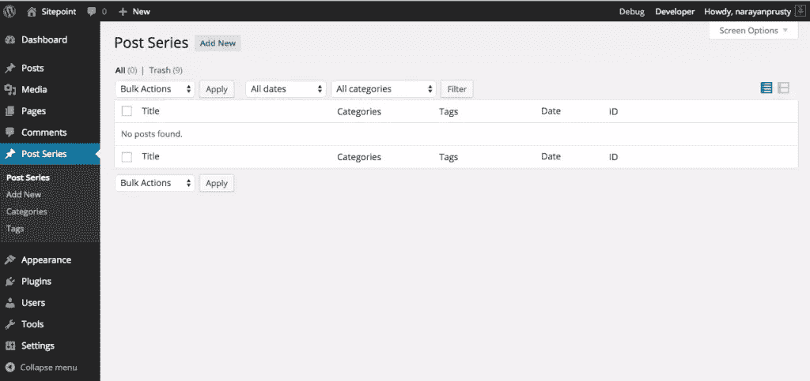
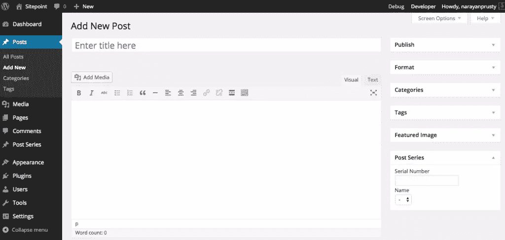

# 为 WordPress 创建文章系列插件

> 原文：<https://www.sitepoint.com/creating-a-post-series-plugin-for-wordpress/>

一个 WordPress 文章系列插件可以让你连续地组织你的文章来创建一本书或者一门课程。它为用户提供了学习的途径。Posts 系列插件也可以用来将一篇长文拆分成多个部分。

在本教程中，我将向你展示如何创建一个插件来显示一系列的文章。您也可以将相同的代码集成到主题中，作为主题功能。

## 分类法与后期系列

在 WordPress 中，分类法被用来将相似的文章组织在一起。但是 WordPress 并没有提供一种以定制的、连续的方式显示特定分类的所有文章的方法。WordPress 分类法是用一个`archive.php`文件显示的，所以我们不能创建一个帖子系列作为一个单独的、可索引的帖子。

所以我们需要一个帖子系列，它实际上是一个以串行方式包含其他帖子的帖子。

## 如何创建帖子系列

创建文章系列有许多不同的方法。在 WordPress 发现的流行文章系列插件使用 WordPress 文章的自定义分类来创建文章系列，但是在本教程中我将使用自定义文章类型。

## 插件文件结构

创建一个名为`sitepoint-post-series`的插件目录，并将两个文件分别命名为`sitepoint-post-series.php`和`sitepoint-post-series.css`。

在`sitepoint-post-series.php`文件中，放入下面的代码，这样 WordPress 就能识别出这个目录是一个插件并让你安装它。

```
<?php

/*
Plugin Name: SitePoint Post Series
Plugin URI: https://www.sitepoint.com/
Description: This used is used to create a post series.
Version: 1.0
Author: Narayan Prusty
*/
```

您还可以向主题添加文章系列功能。在这种情况下，您需要将本教程中提到的所有代码放在主题的`functions.php`文件中。

## 如何创建帖子系列自定义帖子类型

首先，我们需要创建一个自定义帖子类型，其中每个自定义帖子类型代表一个帖子系列。

将下面的代码放在名为`sitepoint-post-series.php`的文件中:

```
function sitepoint_post_series_custom_post_type()
{
	register_post_type("sitepoint-postseries", array(
			"labels" => array("name" => __("Post Series"), "singular_name" => __("Post Series")),
			"public" => true, 
			"has_archive" => true,
			"rewrite" => array("slug"=> "post-series"),
			"supports" => array("editor", "title", "excerpt", "thumbnail", "comments"),
			"capability_type" => "post",
			"publicly_queryable" => true,
			"taxonomies" => array("category", "post_tag"),
		)
	);
}	

add_action("init", "sitepoint_post_series_custom_post_type", 2);

/* Flush Rewrite Rules */

function sitepoint_post_series_activation()
{
	sitepoint_post_series_custom_post_type();
	flush_rewrite_rules();
}

register_activation_hook( __FILE__, "sitepoint_post_series_activation");
register_deactivation_hook( __FILE__, "sitepoint_post_series_activation");
```

在这里，我们创建了一个定制的帖子类型，其分类法与 WordPress 帖子使用的分类法相同。这样你也可以创建一个分类文章系列。

我们还添加了激活和去激活挂钩来刷新重写规则。这样可以在前端查看文章系列。

这是我们的自定义帖子类型在管理屏幕上的外观:



## 向帖子添加帖子系列元框

现在我们需要添加元框到 WordPress 文章管理界面。这样作者可以将一篇文章附加到文章系列中，并提供一个序列号来对文章系列中的文章进行排序。

下面是向文章系列添加元框的代码:

```
/* Add Custom Meta Boxes in WordPress Posts */

function sitepoint_post_series_meta_box_markup($object)
{
	wp_nonce_field(basename(__FILE__), "sitepoint-postseries");

	?>
		<div>
			<label for="sitepoint-postseries-serial-number">Serial Number</label>
            <br>
            <input name="sitepoint-postseries-serial-number" type="text" value="<?php echo get_post_meta($object->ID, "sitepoint-postseries-serial-number", true); ?>">

            <br>

            <label for="sitepoint-postseries-id">Name</label>
            <br>
            <select name="sitepoint-postseries-id">
            	<option value="">-</option>
            	<?php
            		$posts = get_posts("post_type=sitepoint-postseries");
            		$selected_series = get_post_meta($object->ID, "sitepoint-postseries-id", true);
            		foreach($posts as $post) 
            		{
            			$id_post = $post->ID; 
            			if($id_post == $selected_series)
            			{
	            			?>
	            				<option selected value="<?php echo $post->ID; ?>"><?php echo $post->post_title; ?></option>	
	            			<?php
            			}
            			else
            			{
	            			?>
	            				<option value="<?php echo $post->ID; ?>"><?php echo $post->post_title; ?></option>	
	            			<?php	
            			}
		            }
            	?>	
            </select>
        </div>
	<?php
}

function sitepoint_post_series_custom_meta_box()
{
	add_meta_box("sitepoint-postseries", "Post Series", "sitepoint_post_series_meta_box_markup", "post", "side", "low", null);
}

add_action("add_meta_boxes", "sitepoint_post_series_custom_meta_box");
```

这里我们向元框添加两个字段。作者使用文本字段输入序列号，下拉菜单用于选择文章所属的文章系列名称。如果您不想将文章添加到文章系列中，则一个或两个字段都应该留空。

这是它在管理帖子屏幕上的样子:



现在我们需要在保存表单时保存元框字段。下面是实现这一点的代码:

```
/* Callback to Save Meta Data */

function sitepoint_post_series_save_custom_meta_box($post_id, $post, $update)
{

	if(!isset($_POST["sitepoint-postseries"]) || !wp_verify_nonce($_POST["sitepoint-postseries"], basename(__FILE__)))
		return $post_id;

	if(!current_user_can("edit_post", $post_id))
		return $post_id;

	if(defined("DOING_AUTOSAVE") && DOING_AUTOSAVE)
		return $post_id;

	$slug = "post";
	if($slug != $post->post_type)
        return;

	$serial_number = null;
	if(isset($_POST["sitepoint-postseries-serial-number"]))
    {
        $serial_number = $_POST["sitepoint-postseries-serial-number"];
    }
    else
    {
    	$serial_number = "";
    }
    update_post_meta($post_id, "sitepoint-postseries-serial-number", $serial_number);

	$series_id = null;
	if(isset($_POST["sitepoint-postseries-id"]))
    {
        $series_id = $_POST["sitepoint-postseries-id"];
    }
    else
    {
    	$series_id = "";
    }

    $previous_series_id = get_post_meta($post_id, "sitepoint-postseries-id", true);

    update_post_meta($post_id, "sitepoint-postseries-id", $series_id);

    //no series, removing series, adding new series or changing series

    if($previous_series_id == "" && $series_id == "")
    {
    	sitepoint_post_series_save_settings($series_id, $serial_number, $post_id);
    }
    else if($previous_series_id != "" && $series_id == "")
    {
    	sitepoint_post_series_save_settings($previous_series_id, "", $post_id);	
    }
    else if($previous_series_id == "" && $series_id != "")
    {
    	sitepoint_post_series_save_settings($series_id, $serial_number, $post_id);
    }
    else if($previous_series_id != "" && $series_id != "")
    {
    	sitepoint_post_series_save_settings($previous_series_id, "", $post_id);
    	sitepoint_post_series_save_settings($series_id, $serial_number, $post_id);	
    }    
}

add_action("save_post", "sitepoint_post_series_save_custom_meta_box", 10, 3);
```

这里我们保存元框内容，然后根据用户是删除系列、添加系列还是更改系列，用不同的参数值调用函数`sitepoint_post_series_save_settings`。

下面是`sitepoint_post_series_save_settings`函数的代码

```
/* Store WordPress posts and Post Series CTY relations as WordPress Settings. */

function sitepoint_post_series_save_settings($series_id, $serial_number, $post_id)
{
    if($series_id != "" && $serial_number != "")
    {
	    $post_series_list = get_option("post_series_" . $series_id . "_ids", "");

	    if($post_series_list == "")
	    {
	    	$post_series_list_array = array($post_id);
	    	$post_series_list = implode (", ", $post_series_list_array);

	    	update_option("post_series_" . $series_id . "_ids", $post_series_list);
	    }
	    else
	    {
	    	$post_series_list_array = explode(',', $post_series_list);

	    	if(in_array($post_id, $post_series_list_array))
	    	{
	    		//do nothing
	    	}
	    	else
	    	{
	    		$post_series_list_array[] = $post_id;
	    		$post_series_list = implode (", ", $post_series_list_array);
	    		update_option("post_series_" . $series_id . "_ids", $post_series_list);
	    	}
	    }
    }
    else if($series_id == "" || $serial_number == "")
    {
    	$post_series_list = get_option("post_series_" . $series_id . "_ids", "");

    	if($post_series_list == "")
    	{
    	}
    	else
    	{
    		$post_series_list_array = explode(',', $post_series_list);

    		if(in_array($post_id, $post_series_list_array))
    		{
    			//here remove the post id from array.
    			if(($key = array_search($post_id, $post_series_list_array)) !== false) {
				    unset($post_series_list_array[$key]);
				}
    			$post_series_list = implode (", ", $post_series_list_array);
	    		update_option("post_series_" . $series_id . "_ids", $post_series_list);
	    	}
    		else
    		{
    		}
    	}
    }
}
```

这个函数创建一个字符串，存储属于特定系列的 WordPress 文章 ID。然后它将字符串存储为 WordPress 设置。

现在我们已经完成了所有的管理区域代码。现在，您应该能够创建文章并将它们分配到一个系列。并为每个系列分配类别和标签。

现在让我们编写前端代码来显示文章系列。

## 使文章系列在索引页和存档页上可见

自定义文章类型在索引和存档页面中尚不可见。要使它在这些页面上也可见，您只需添加以下代码:

```
/* Displaying Custom Post Types on Index Page */

function sitepoint_post_series_pre_posts($q)
{
	if(is_admin() || !$q->is_main_query() || is_page())
        return;

    $q->set("post_type", array("post", "sitepoint-postseries"));
}

add_action("pre_get_posts", "sitepoint_post_series_pre_posts");
```

这里我们使用`pre_get_posts`钩子向`$q`变量添加一个帖子系列，主循环使用它来显示帖子。

## 显示帖子系列的帖子

我们需要过滤文章系列类型的内容，并添加属于该系列的文章。

下面是在文章系列页面中添加文章系列的代码。

```
function sitepoint_post_series_content_filter($content)
{	
	$slug = "sitepoint-postseries";
	if($slug != get_post_type())
        return $content;

	$post_series_list = get_option("post_series_" . get_the_ID() . "_ids", "");
	$post_series_list_array = explode(',', $post_series_list);

	$post_series_serial_number = array();

	foreach($post_series_list_array as $key => $value)
	{
		$serial_number = get_post_meta($value, "sitepoint-postseries-serial-number", true);
		$post_series_serial_number[$value] = $serial_number;
	}

	asort($post_series_serial_number);

	$html = "<ul class='sitepoint-post-series'>";

	foreach($post_series_serial_number as $key => $value) 
	{

		$post = get_post($key);

		$title = $post->post_title;

		$excerpt = $post->post_content;
		$shortcode_pattern = get_shortcode_regex();
        $excerpt = preg_replace('/' . $shortcode_pattern . '/', '', $excerpt);
        $excerpt = strip_tags($excerpt); 
        $excerpt = esc_attr(substr($excerpt, 0, 150));

        $img = "";

        if(has_post_thumbnail($key))
        {
        	$temp = wp_get_attachment_image_src(get_post_thumbnail_id($key), array(150, 150));
        	$img = $temp[0];
        }
        else
        {
        	$img = "https://lorempixel.com/150/150/abstract";
        }

        $html = $html . "<li><h3><a href='" . get_permalink($key) . "'>" . $title . "</a></h3><div><div class='sitepoint-post-series-box1'></div><div class='sitepoint-post-series-box2'><p>" . $excerpt . " ...</p></div></div><div class='clear'></div></li>";
	} 

	$html = $html . "</ul>";

	return $content . $html;
}

add_filter("the_content", "sitepoint_post_series_content_filter");
```

这显示了使用 HTML 无序列表标签的文章。对于没有图像的帖子，我们从 Lorempixel 云服务加载图像，以生成随机纹理图像。

我们正在从设置字符串中检索一个帖子系列的帖子，该字符串是在保存元数据时保存的。

## 向帖子添加帖子系列信息

我们还可以在属于一个帖子系列的帖子上添加一个帖子系列框，以向用户表明该帖子属于一个特定的帖子系列。下面是实现这一点的代码:

```
/* Adding Content to WordPress Posts which belong to a Series */

function sitepoint_post_series_post_content_filter($content)
{	
	$slug = "post";
	if($slug != get_post_type())
        return $content;

	$serial_number = get_post_meta(get_the_ID(), "sitepoint-postseries-serial-number", true);    
	$series_id = get_post_meta(get_the_ID(), "sitepoint-postseries-id", true);

    if(get_post_status($series_id) == "publish")
    {
        $html = "";

        if($series_id != "" || $serial_number != "")
        {
            $html = "<div class='sitepoint-post-series-post-content'><div>This post is a part " . $serial_number . " of <a href='" . get_permalink($series_id) . "'>" . get_the_title($series_id) . "</a> post series.</div></div>";    
        }

        $content = $html . $content; 
    }

    return $content;
}
```

这里我们只是显示一个帖子系列的名称和这个帖子的哪一部分来自这个系列。

您还可以通过使用下面的`sitepoint_post_series_post_content_filter`函数实现来添加系列文章的下一篇和上一篇:

```
function sitepoint_post_series_post_content_filter($content)
{	
	$slug = "post";
	if($slug != get_post_type())
        return $content;

	$serial_number = get_post_meta(get_the_ID(), "sitepoint-postseries-serial-number", true);    
	$series_id = get_post_meta(get_the_ID(), "sitepoint-postseries-id", true);

	if($serial_number != "" && $series_id != "")
	{
		//find next and previous post too.

		$post_series_list = get_option("post_series_" . $series_id . "_ids", "");
		$post_series_list_array = explode(',', $post_series_list);

		$post_series_serial_number = array();

		foreach($post_series_list_array as $key => $value)
		{
			$serial_number = get_post_meta($value, "sitepoint-postseries-serial-number", true);
			$post_series_serial_number[$value] = $serial_number;
		}

		asort($post_series_serial_number);

		$post_series_serial_number_reverse = array();

		$iii = 1;

		foreach($post_series_serial_number as $key => $value) 
		{
			$post_series_serial_number_reverse[$iii] = $key;
			$iii++;
		}

		$index = array_search(get_the_ID(), $post_series_serial_number_reverse);

		if($index == 1)
		{
			$html = "<div class='sitepoint-post-series-post-content'><div>This post is a part of <a href='" . get_permalink($series_id) . "'>" . get_the_title($series_id) . "</a> post series.</div><div>&#9112; Next: <a href='" . get_permalink($post_series_serial_number_reverse[$index + 1]) . "'>" . get_the_title($post_series_serial_number_reverse[$index + 1]) . "</a></div></div>";
			$content = $html . $content;
		}
		else if($index > 1 && $index < sizeof($post_series_serial_number_reverse))
		{
			$html = "<div class='sitepoint-post-series-post-content'><div>This post is a part of <a href='" . get_permalink($series_id) . "'>" . get_the_title($series_id) . "</a> post series.</div><div>&#9112; Next post in the series is <a href='" . get_permalink($post_series_serial_number_reverse[$index + 1]) . "'>" . get_the_title($post_series_serial_number_reverse[$index + 1]) . "</a></div><div>&#9111; Previous post in the series is <a href='" . get_permalink($post_series_serial_number_reverse[$index - 1]) . "'>" . get_the_title($post_series_serial_number_reverse[$index - 1]) . "</a></div></div>";
			$content = $html . $content;
		}
		else if($index == sizeof($post_series_serial_number_reverse))
		{
			$html = "<div class='sitepoint-post-series-post-content'><div>This post is a part of <a href='" . get_permalink($series_id) . "'>" . get_the_title($series_id) . "</a> post series.</div><div>&#9111; Previous: <a href='" . get_permalink($post_series_serial_number_reverse[$index - 1]) . "'>" . get_the_title($post_series_serial_number_reverse[$index - 1]) . "</a></div></div>";
			$content = $html . $content;
		}
	}

	return $content;

}
```

这种实现的问题是，代码命中 MySQL 的次数等于系列文章的数量。如果某个特定的帖子系列有很多帖子，就会出现性能问题，但我出于教育目的将它包括在内。

## 将我们的插件与其他 Post 系列插件进行比较

这里是 WordPress.org 上的一些插件，可以让你创建一个帖子系列。我将它们与我们上面创建的插件进行了比较。

1.  [组织系列](https://wordpress.org/plugins/organize-series/):组织系列为 WordPress 文章添加了一个自定义分类。当您查看自定义分类时，它会向归档页面添加一个标题，看起来像文章系列的标题。文章系列中的文章像分类法一样显示，从用户的角度来看可能不是很好。相比之下，我们的插件使用自定义帖子类型来显示单个帖子系列，以便您可以向帖子系列添加特色图像、文本或标记内容(以及更多内容)。与插件中的存档页面相比，文章系列的文章看起来有所不同。
2.  WP 文章系列:这也像组织系列插件一样。一个不同之处是它不提供对文章系列页面的任何定制。

我们的插件是高度可定制的，不包括任何 WordPress 黑客。因此，它更加兼容。

### 结论

如果你拥有一个开发博客，那么你可以使用这个插件来创建你自己的文章系列，这可以增加你的参与度和转化率。你甚至可以用它来把你的大帖子分成多个帖子。

请随意评论您使用以下插件的体验。

## 分享这篇文章