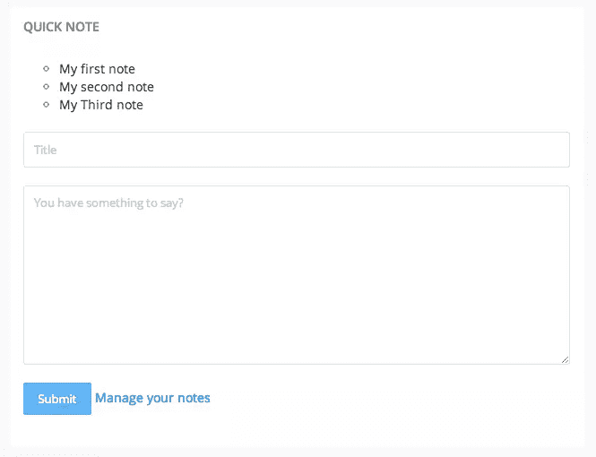
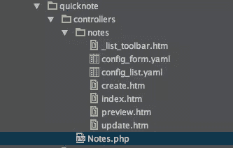
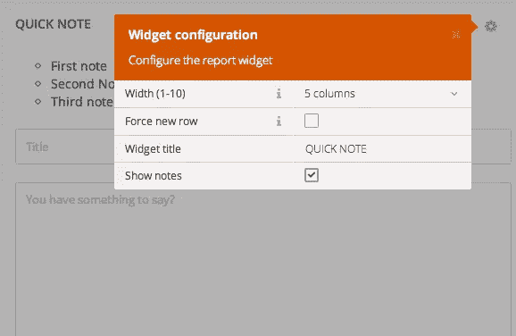

# 如何构建 OctoberCMS 小部件插件

> 原文：<https://www.sitepoint.com/build-octobercms-widget-plugin/>

在之前的一篇文章中，我们讨论了创建一个 OctoberCMS 插件的基础。在这一篇中，我们将深入探讨如何使用小部件扩展 OctoberCMS 后端。


## 我们将要建造的东西

我假设你们中的很多人都用过。在仪表板上，我们有一个快速草稿小部件。在本文中，我们将看到如何为 OctoberCMS 构建一个类似的。




## 插件注册

为了开始构建我们的插件，我们将使用一个用于搭建的命令实用程序。

```
php artisan create:plugin RAFIE.quicknote
```

该命令将创建一个`Plugin.php`文件和一个包含`version.yaml`文件的`updates`文件夹。

```
public function pluginDetails(){
   return [
       'name'        => 'Quick Note Widget',
       'description' => 'Add and manage some drafts when you\'re in a hurry.',
       'author'      => 'RAFIE Younes',
       'icon'        => 'icon-pencil'
   ];
}
```

注册我们的插件后，我们需要更新我们的`version.yaml`文件。

```
// uploads/version.yaml
1.0.1: First version of quicknote
1.0.2:
  - Created Notes Table
  - create_notes_table.php
```

## 使用模型

为了创建我们的迁移和模型文件，我们可以使用`php artisan create:model RAFIE.quicknote Note`命令。我们的`updates/create_notes_table.php`迁移文件处理`notes`表的创建，并将具有以下结构。


因为每个笔记都属于一个用户，所以我们有一个`user_id`字段。我们的迁移文件将如下所示:

```
public function up(){
    Schema::create('rafie_quicknote_notes', function($table){
        $table->engine = 'InnoDB';
        $table->increments('id');
        $table->string('title', 255);
        $table->text('description')->nullable();
        $table->integer('user_id')->unsigned()->index();
        $table->timestamps();
    });
}

public function down(){
    Schema::dropIfExists('rafie_quicknote_notes');
}
```

更新文件后，我们需要使用以下命令刷新插件以反映更改，这将重新安装插件并创建我们的数据库表。

```
artisan plugin:refresh RAFIE.quicknote
```

如果你是 Laravel 的粉丝，你会知道每个模型类都必须扩展`Illuminate\Database\Eloquent\Model`来使用口才，然而 OctoberCMS 有一个`October\Rain\Database\Model`类来扩展口才模型类，并提供更多的可扩展性，如`extend`方法。

```
public function boot(){
    User::extend(function($model){
        $model->hasMany['notes'] = ['RAFIE\Quicknote\Models\Notes'];
    });
}
```

在`Plugin.php`文件中，我们覆盖了每个请求都会调用的`boot`方法，并扩展了`User`模型，使其具有许多注释。

```
class Note extends Model{
    // used for automatic validation using the defined rules.
    use \October\Rain\Database\Traits\Validation;

    public $table = 'rafie_quicknote_notes';

    protected $guarded = ['*'];

    protected $rules = [
        'title'         => 'required|min:4'
    ];

    public $belongsTo = [ 'user' => [ 'Backend\Models\User' ] ];
}
```

在我们的`models/Note.php`文件中，我们有一个基本的模型定义。另外，`belongsTo`属性定义了我们的模型关系。验证由验证特征使用定义的规则自动处理。

## OctoberCMS 小部件

OctoberCMS 小部件是内容块，可以以不同的方式集成到您的前端或后端。有三种不同的小部件。

### 通用部件

通用小部件是可以注入页面的捆绑功能。它们的行为类似于组件，存储在`widgets`文件夹中。你可以在[文档](https://octobercms.com/docs/backend/widgets#generic-widgets)中了解更多信息。

### 表单小部件

表单小部件有点特殊，它们允许你创建新类型的控件，这些控件可以被其他插件或 CMS 本身使用。来自[文档](https://octobercms.com/docs/backend/widgets#form-widgets)的一个很好的例子是用于创建页面的`CodeEditor`控件，还有在很多地方使用的搜索框，默认情况下集成在我们的 notes 管理页面中。

### 报告小部件

报告小部件是最常见的小部件类型。它们在特定的上下文中添加内容，在本例中是仪表板。在新安装的 OctoberCMS 上，我们有一个`SYSTEM STATUS`小部件显示可用的更新和网站状态。

### 搭建我们的小部件

首先，让我们创建一个`QuickNoteWidget.php`文件，在这里我们可以定义我们的 QuickNote 小部件，我们还需要在我们的`Plugin.php`文件中注册我们的小部件。

```
// Plugin.php

public function registerReportWidgets(){
    return [
        'RAFIE\QuickNote\QuickNoteWidget' => [
            'label'     => 'Quick Notes',
            'context'   => 'dashboard'
        ]
    ];
}
```

```
class QuickNoteWidget extends ReportWidgetBase{

   public function render(){
       $notes = BackendAuth::getUser()->notes;

       return $this->makePartial('notes', [ 'notes' => $notes ]);
   }
}
```

报表小部件必须扩展`ReportWidgetBase`类并覆盖 render 方法。

`BackendAuth::getUser`方法返回登录的用户，其中包含相关的注释列表。这是唯一可能的，因为我们已经在模型中定义了关系。

OctoberCMS 将在一个目录中查找我们的资产，该目录与我们的小部件文件名小写同名。目录保存了我们的视图，它们必须以下划线开头。

```
//quicknotewidget/partials/_notes.htm
<div class="report-widget">
    <h3>Quick Note</h3>

    <div class="pane">
    <ul class="list-nostyle">
        <?php foreach( $notes as $note ): ?>
            <li class="list-group-item"><?= $note->title ?></li>
        <?php endforeach ?>
    </ul>
    </div>

    <br/>

    <?= Form::open([
            'url'       => Backend::url('rafie/quicknote/notes/store'),
            'method'    => 'POST'
        ]);
    ?>
    <div class="form-group">
        <input class="form-control" type="text" name="title" placeholder="Title" required />
    </div>

    <div class="form-group">
        <textarea class="form-control" name="description" id="" cols="30" rows="10" placeholder="You have something to say?"></textarea>
    </div>

    <div class="form-group">
        <input type="submit" class="btn btn-primary" value="Submit" />
        <a href="<?= Backend::url('rafie/quicknote/notes/index') ?>">Manage your notes</a>
    </div>

    <?= Form::close(); ?>
</div>
```

小部件的 HTML 代码必须包含在一个`report-widget`类中，并且可以选择为小部件标题添加一个`<h3>`。之后，我们遍历用户注释列表，并显示一个创建新注释的表单。

`Backend::url('rafie/quicknote/notes/store')`将生成一个到 notes 控制器的链接，我们可以在这里处理表单数据。我们可以为表单使用 OctoberCMS 的 AJAX 框架，但是为了简单起见，我们通常会提交表单，稍后再讨论 Ajax 的使用。

## 使用控制器

控制器存储在`controllers`文件夹中，可以使用 scaffolding 命令生成。

```
php artisan create:controller RAFIE.quicknote Notes
```



### 创建笔记

该文件夹包含我们的控制器类，另一个文件夹包含我们的资产。当有人点击一个网址，它被解析如下:`author/plugin/controllerClass/method`。在我们的例子中，它是`rafie/quicknote/notes/store`，如果没有指定方法，默认情况下会触发 index 方法。

```
public function store(){
    $note = new Models\Note;
    $note->title = Input::get('title');
    $note->description = Input::get('description', null);
    $note->user_id = BackendAuth::getUser()->id;

    if( $note->save() ) {
	\Flash::success('Note added successfully.');
    }
    else{
        \Flash::error('Validation error' );
    }

    return \Redirect::to( Backend::url() );
}
```

我们使用我们的模型创建一个新的注释，并将其保存到数据库中。`Flash::success()`将向用户显示一条闪烁消息以确认插入。

您可能已经注意到了指向`rafie/quicknote/notes/index` url 的`Manage your notes`链接。我们将在这里列出我们的注释，以便用户可以添加、编辑和删除注释。

## 小部件配置

假设我们想让用户能够选择小部件的呈现方式。我们可以让他选择隐藏 dashboard 小部件中的注释列表，只保留表单和链接，甚至更改小部件的标题。

```
// QuickNoteWidget.php

public function defineProperties(){
    return [
        'title'     => [
            'title'     => 'Widget title',
            'default'   => 'QUICK NOTE'
        ],
        'showList'  => [
            'title'     => 'Show notes',
            'type'      => 'checkbox'
        ]
    ];
}
```

如果你不知道什么是属性，一定要查看我的文章[如何构建一个 OctoberCMS 插件](https://www.sitepoint.com/building-octobercms-plugins-google-analytics/)。定义属性后，我们可以在视图中检索它们。

```
// quicknotewidget/partials/_notes.htm

<h3><?= $this->property('title') ?></h3>

<?php if( $this->property('showList') ): ?>
    <ul class="list-nostyle">
        <?php foreach( $notes as $note ): ?>
            <li class="list-group-item"><?= $note->title ?></li>
        <?php endforeach ?>
    </ul>

    <br/>
<?php endif; ?>
```



## 使用控制器

到目前为止，我们讨论了如何呈现一个报告小部件并将其提交给控制器。现在，我们将构建列表页面，并讨论如何通过创建列表和管理部分来扩展 OctoberCMS 后端。

### 列表注释

每个控制器都有一个`config_list.yaml`文件，您可以在其中定义您的列表，还可以使用一些配置属性将它映射到一个模型。

```
// controllers/notes/config_list.yaml

# Model List Column configuration
list: $/rafie/quicknote/models/note/columns.yaml

# Model Class name
modelClass: RAFIE\Quicknote\Models\Note

# List Title
title: Manage Notes

# Link URL for each record
recordUrl: rafie/quicknote/notes/update/:id

# Message to display if the list is empty
noRecordsMessage: backend::lang.list.no_records

# Records to display per page
recordsPerPage: 20

# Displays the list column set up button
showSetup: true

# Displays the sorting link on each column
showSorting: true

# Default sorting column
 defaultSort:
     column: created_at
     direction: desc

# Display checkboxes next to each record
showCheckboxes: true

# Toolbar widget configuration
toolbar:
	# Partial for toolbar buttons
	buttons: list_toolbar

	# Search widget configuration
	search:
	    prompt: backend::lang.list.search_prompt
```

这些属性通常都得到了很好的解释，但是让我们对一些属性进行更多的澄清:

*   list:列表列定义的路径。
*   showSetup:切换列显示的小按钮。
*   showCheckboxes:为每行显示一个复选框，用于批量操作。
*   工具栏->按钮:部分名称，如果你想在表格上方显示一些控件，如`New`或`Delete`。

```
// rafie/quicknote/models/note/columns.yaml

columns:
    id:
        label: ID

    title:
        label: TITLE
        searchable: true

    description:
        label: DESCRIPTION
        searchable: true

    created_at:
        label: CREATED AT
        type: date
        invisible: true

    updated_at:
        label: UPDATED AT
        type: date
        invisible: true
```

`columns.yaml`文件使用`label`、`searchable`等将我们的数据库表映射到列表。查看[文档](https://octobercms.com/docs/backend/lists#list-columns)中的完整属性列表。

```
// controllers/Notes.php

public function index(){
    $this->makeLists();
    $this->makeView('index');
}

// controllers/notes/index.htm

<?= $this->listRender() ?>
```

在我们的`Notes@index`方法中，我们解析列表配置，并在索引视图中呈现它。如果您有额外的字段，还可以添加一些额外的标记。

如果你点击索引控制器，你会看到我们的笔记的基本列表。列表配置从表中提取所有注释，包括其他用户的注释，这不是我们想要的，但是我们可以从`ListController`类中扩展`listExtendQueryBefore`方法并过滤用户注释。

```
// controllers/Notes.php

public function listExtendQueryBefore($query){
    $user_id = BackendAuth::getUser()->id;

    $query->where('user_id', '=', $user_id);
}
```

现在您应该看到列表是由登录用户过滤的，为了熟悉它，让我们通过使用`listOverrideColumnValue`方法扩展我们的列来尝试区分没有描述的注释。

```
// controllers/Notes.php

public function listOverrideColumnValue($record, $columnName){
  if( $columnName == "description" && empty($record->description) )
         return "[EMPTY]";
}
```

您可以将`listOverrideColumnValue`和`listExtendColumns`组合起来添加新列和插入新值，比如为每行添加一个“标记为已读”按钮，等等。

```
public function listExtendColumns($list){
    $list->addColumns([
        'action' => [
            'label'     => 'Actions',
            'sortable'  => false
        ]
    ]);
}
```

如果你还记得，在我们的`config_list.yaml`中有一个`list_toolbar`字段:

```
// controllers/notes/_list_toolbar.htm

<div data-control="toolbar">
    <a href="<?= Backend::url('rafie/quicknote/notes/create') ?>" class="btn btn-primary oc-icon-plus">New Note</a>

    <button
            id = "remove_notes"
            class="btn btn-primary oc-icon-trash-o"
            data-request="onDelete"
            data-trigger-type="enable"
            data-trigger = ".list-checkbox input[type='checkbox']"
            data-trigger-condition="checked"
            data-request-success="$el.attr('disabled', 'disabled');"
            disabled
            >
        Remove Note(s)</button>
</div>

<script> $("#remove_notes").click(function(){
        $(this).data('request-data', {
            notes: $('.list-checkbox input[type=\'checkbox\']').listWidget('getChecked')
        })
    }); </script>
```

### 新笔记

我知道我们已经创建了一个添加新注释的表单，但是让我们看看将表单映射到模型的另一种方式。

`controllers/notes/config_form.yaml`文件负责使用指定的模型显示创建/更新表单，也可以使用`models/note/fields.yaml`文件进行配置。

```
// controllers/notes/config_form.yaml

# Record name
name: Note

# Model Form Field configuration
form: $/rafie/quicknote/models/note/fields.yaml

# Model Class name
modelClass: RAFIE\Quicknote\Models\Note

# Default redirect location
defaultRedirect: rafie/quicknote/notes

# Create page
create:
    title: Create Notes
    redirectClose: rafie/quicknote/notes

# Update page
update:
    title: Edit Notes
    redirectClose: rafie/quicknote/notes
```

配置属性是自我描述的。`form`属性映射到`models/note/fields.yaml`,后者决定表单应该如何显示。您可以在[文档](https://octobercms.com/docs/backend/lists#column-options)中了解可用属性。

```
fields:
  title:
    placeholder: Title

  description:
    type: textarea
    size: huge
    placeholder: You have something to say?

  important:
    type: hint
    path: @/plugins/rafie/quicknote/models/note/partials/create_note_hint.htm
```

我们只为标题创建了一个文本输入，为描述创建了一个巨大的文本区域。该提示是您可以用来向用户显示通知的一部分。


如果您注意到页面 url `rafie/quicknote/notes/create`，您可能想知道我们在哪里呈现表单？答案是由我们的控制器实现的`Backend\Behaviors\FormController`——它负责使用我们的配置文件显示表单。

创建新便笺后，您可以访问数据库来验证记录。你会发现`user_id`被设置为`0`而这并不是我们想要的！

```
public function formBeforeCreate($model){
	$model->user_id = BackendAuth::getUser()->id;
}
```

`FormController`类提供了一组挂钩表单事件的方法。`formBeforeCreate`方法用于在保存之前更新模型，您还可以挂钩到`formAfterCreate`来触发一些特殊事件。

### 更新注释

对于更新表单，我们不需要任何修改，因为我们将表单字段映射到了我们的 note 模型。但是，您可能需要添加一些功能。如果你有一些需要执行的代码，可以使用`update`方法，调用父 update 方法作为扩展。一定要研究一下`FormController`类，看看可用方法的列表。

```
public function update($recordId, $context = null)
{
	//some code here

    return $this->asExtension('FormController')->update($recordId, $context);
}
```

### 删除注释

我们有两种方法来实现删除操作:

*   使用更新表单:
    使用更新表单时，浏览器右下角有一个垃圾桶图标，它已经为您配置好了。
*   使用批量操作:
    您记得我们已经在`config_list.yaml`文件中将`showCheckboxes`设置为`true`。我们只需要配置 remove notes 按钮。

`_list_toolbar.htm`部分是我们有`New Note`按钮的地方。我们将使用 OctoberCMS 的 Ajax 框架添加移除注释按钮。如果您不熟悉 AJAX 框架，请务必查看我的[构建 OctoberCMS 主题](https://www.sitepoint.com/build-octobercms-theme/)文章。

```
// controllers/notes/_list_toolbar.htm

<button
    id = "remove_notes"
    class="btn btn-primary oc-icon-trash-o"
    data-request="onDelete"
    data-trigger-type="enable"
    data-trigger = ".list-checkbox input[type='checkbox']"
    data-trigger-condition="checked"
    data-request-success="$el.attr('disabled', 'disabled');"
    disabled
    >
Remove Note(s)</button>
```

唯一的特殊属性是:
–数据触发器:在指定的元素上添加一个事件监听器。
–数据触发条件:条件可以是`checked`或设置了`value[myvalue]`的值。查看[触发 api](https://github.com/octobercms/october/blob/master/modules/backend/assets/js/october.triggerapi.js) 了解更多信息。
–数据请求成功:请求成功后执行的 JavaScript 代码。

```
// controllers/notes/_list_toolbar.htm

<script> $("#remove_notes").click(function(){
        $(this).data('request-data', {
            notes: $('.list-checkbox input[type=\'checkbox\']').listWidget('getChecked')
        })
    }); </script>
```

在点击事件中，我们需要将选择的 id 传递给`request-data`属性，这样我们就可以在服务器端处理它们。我们的控制器必须有一个`onDelete`方法来处理请求。

```
// controllers/Notes.php

public function onDelete(){
    $user_id = BackendAuth::getUser()->id;
    $notes = post("notes");

    Note::whereIn('id', $notes)
			->where('user_id', '=', $user_id)
			->delete();

    \Flash::success('Notes Successfully deleted.');

    return $this->listRefresh();
}
```

删除注释后，我们向用户显示一条 flash 消息作为反馈，并使用`listRefresh`刷新列表，这将重新生成列表并在页面上显示新列表。

## 结论

OctoberCMS 的 widget 系统强大而灵活，它提供了一组组件来创建和扩展其他插件。你可以在 [Github](https://github.com/sitepoint-editors/quicknote) 上看看最终的结果，如果你有任何问题或意见，请在评论中告诉我！

## 分享这篇文章