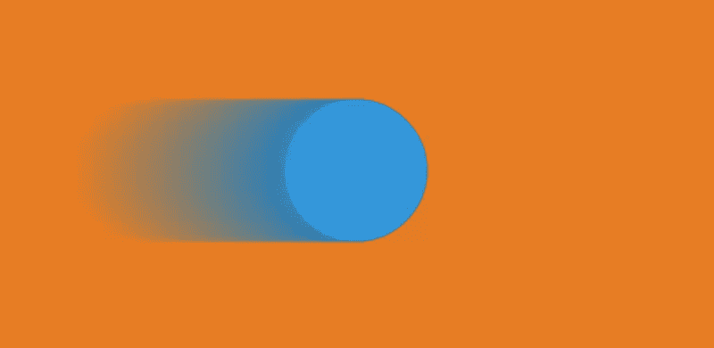

# 终极长影萨斯混音

> 原文：<https://www.sitepoint.com/ultimate-long-shadow-sass-mixin/>

你知道[长影设计潮流](http://www.hongkiat.com/blog/long-shadow-design/)吧？虽然，我甚至不确定这是否是一种趋势，一切都发展得如此之快…无论如何，长阴影曾经是和/或仍然是一种时尚的设计技巧，用来强调一些文本或元素。

在 CSS 中没有简单的方法来创建一个长阴影。最终，要么使用某种基于图像的格式(实际的图像，SVG……)，要么依赖于`text-shadow`和`box-shadow`。后一种选择更好，因为它们只是可以被浏览器很好处理的 CSS。

问题是:写作是一种痛苦。为了实现一个清晰的长阴影效果，你必须建立一个由 50 个左右的阴影组成的链，一次稍微移动一步，可能颜色也是…完全不切实际。这通常是你希望用 Sass 或其他工具自动完成的事情。

事实上，已经有很多尝试来制作长影混合。在我看到的解决方案中，我注意到了一些问题，包括:

*   没办法定义方向；
*   没有办法定义阴影的数量；
*   仅适用于`text-shadow`；
*   过于复杂。

伙计们，请系好安全带，因为我发现了一种我敢称之为*的清洁解决方案*。我构建了一个大约 15 行长的属性不可知的 long-shadow 函数，它接受一个方向(以及一些其他参数)。

## API

因为我们希望我们的工具既能处理`box-shadow`属性又能处理`text-shadow`属性，所以我们不会像文章标题所说的那样实际构建一个 *mixin* ，而是实际构建一个*函数*。然后，你可以这样使用它:

```
.foo {
 box-shadow: long-shadow($args...);
}

.bar {
 text-shadow: long-shadow($args...);
}
```

事实上，框阴影和文本阴影几乎相同，只是框阴影有一个我们不会使用的*模糊*参数。请注意，Internet Explorer 10+也支持文本阴影模糊…真实故事。

我们的函数需要几样东西才能工作:

*   一个方向，类似于`linear-gradient`这样一个关键词或者一个角度(在`deg`、`rad`、`grad`或者`turn`)；
*   一个长度；
*   一种颜色；
*   或者注意阴影是否应该淡化(默认为`false`)；这要么是一个布尔值(其中`true`表示渐变到透明)，要么是一种要渐变到的颜色；
*   要计算的阴影数量(默认为`100`)。

```
/// Function to generate long shadows (because flat is so has-been).
/// Property-agnostic: works for both `box-shadow` and `text-shadow`.
/// `cos` and `sin` might need to be polyfilled if Compass or any
/// equivalent such as SassyMath is not in use.
///
/// @author Hugo Giraudel
///
/// @link https://unindented.org/articles/trigonometry-in-sass/ Pure Sass `cos` and `sin`
///
/// @param {Direction} $direction
///     Shadow's direction (angle or keyword)
/// @param {Length} $length
///     Shadow's length
/// @param {Color} $color
///     Shadow's color
/// @param {Bool | Color} $fade [false]
///     Whether or not shadow should fade:
///     - `false` means no fading, shadow is `$color`
///     - `true`  means fading from `$color` to transparent
///     - a color means fading from `$color` to `$fade`
/// @param {Number} $shadow-count [100]
///     Number of computed shadows
///
/// @return {List} - List of shadows
///
/// @require {function} Compass/helpers/math/cos
///     http://compass-style.org/reference/compass/helpers/math/#cos
/// @require {function} Compass/helpers/math/sin
///     http://compass-style.org/reference/compass/helpers/math/#sin
///
/// @example scss - Usage
/// .foo {
///   text-shadow: long-shadow(42deg, 1em, #16a085);
/// }
/// .bar {
///   box-shadow: long-shadow(to top left, 150px, hotpink, tomato);
/// }
@function long-shadow($direction, $length, $color, $fade: false, $shadow-count: 100) {}
```

## 构建功能

现在让我们从函数开始。我们要做的第一件事是把`$direction`转换成一个角度，如果它是一个关键字的话(例如`to right`是`90deg`)。这样做非常简单；我们只需要一张转换图。

```
$conversion-map: (
  to top: 180deg,
  to top right: 135deg,
  to right top: 135deg,
  to right: 90deg,
  to bottom right: 45deg,
  to right bottom: 45deg,
  to bottom: 0deg,
  to bottom left: 315deg,
  to left bottom: 315deg,
  to left: 270deg,
  to left top: 225deg,
  to top left: 225deg
);

@if map-has-key($conversion-map, $direction) {
 $direction: map-get($conversion-map, $direction);
}
```

至此，只剩下一件事要做了(是的，已经！):从 1 到`$shadow-count`迭代，每次计算一个新的阴影。

```
// ...

$shadows: ();

@for $i from 1 through $shadow-count {
  // ...

 $shadow: ...;
 $shadows: append($shadows, $shadow, 'comma');
}

@return $shadows;
```

现在我们需要计算`$shadow`。起初我以为这会很痛苦，但结果是基本的三角学。我们只需计算 x 偏移角度的 sin 和 y 偏移角度的 cos。然后，我们将两者乘以长阴影的长度除以总阴影的数量，再乘以当前索引`$i`。

```
$x: sin(0deg + $direction) * ($i * $length / $shadow-count);
$y: cos(0deg + $direction) * ($i * $length / $shadow-count);
```

你可能想知道为什么我们把`$direction`(一个角度)附加到`0deg`。实际上，这是将第二个值转换为第一个值的单位的聪明方法。在这种情况下，如果`$direction`用梯度、弧度或转角表示，它会自动转换成相应的度数。

关于颜色，有点棘手。根据`$fade`的值，我们有三个选项:

*   如果`$fade`是`false`，那么颜色就是`$color`；
*   如果`$fade`是`true`，那么我们从`$color`渐变到透明；
*   如果`$fade`是一种颜色，那么我们从`$color`渐变到`$fade`。

因此，除非`$fade`是`false`，否则每次循环运行时颜色都会略有不同，所以我们每次都需要计算它。

```
// If `$fade` is `false`
$current-color: $color;

// If `$fade` is a color
@if type-of($fade) == 'color' {
 $current-color: mix($fade, $color, ($i / $shadow-count * 100);
// If `$fade` is `true`
} @else if $fade {
 $current-color: rgba($color, 1 - $i / $shadow-count);
}
```

…或者作为一条直线:

```
$current-color: if(not $fade, $color, if(type-of($fade) == 'color', mix($fade, $color, ($i / $shadow-count * 100)), rgba($color, 1 - $i / $shadow-count)));
```

因此，在这一点上，我们的阴影(将被追加到阴影列表)是:

```
$shadow: $x $y 0 $current-color;
```

## 整个功能

```
@function long-shadow($direction, $length, $color, $fade: false, $shadow-count: 100) {
 $shadows: ();
 $conversion-map: (
    to top: 180deg,
    to top right: 135deg,
    to right top: 135deg,
    to right: 90deg,
    to bottom right: 45deg,
    to right bottom: 45deg,
    to bottom: 0deg,
    to bottom left: 315deg,
    to left bottom: 315deg,
    to left: 270deg,
    to left top: 225deg,
    to top left: 225deg
  );

 @if map-has-key($conversion-map, $direction) {
 $direction: map-get($conversion-map, $direction);
  }

 @for $i from 1 through $shadow-count {
 $current-step: ($i * $length / $shadow-count);
 $current-color: if(not $fade, $color, if(type-of($fade) == 'color', mix($fade, $color, ($i / $shadow-count * 100)), rgba($color, 1 - $i / $shadow-count)));

 $shadows: append($shadows, (sin(0deg + $direction) * $current-step) (cos(0deg + $direction) * $current-step) 0 $current-color, 'comma');
  }

 @return $shadows;
}
```

## 例子

```
.foo {
 text-shadow: long-shadow(
    // Shadow should have an angle of 42 degrees
 $direction: 42deg,
    // Shadow should be contain within a 100x100 box
 $length: 100px,
    // Shadow should start this color
 $color: #16a085,
    // To finish this color
 $fade: #1abc9c
  );
}
```


```
.bar {
 box-shadow: long-shadow(
    // Shadow should go to bottom right (45deg)
 $direction: to left,
    // With a length of 15em
 $length: 15em,
    // From this color
 $color: #2980b9,
    // To this color
 $fade: #e67e22
  );
}
```



```
.baz {
 box-shadow: long-shadow(
    // Shadow should have an angle of 25deg
 $direction: -125deg,
    // Spread on 120px
 $length: 120px,
    // From this color
 $color: #8e44ad,
    // To transparent
 $fade: true,
    // With only 10 shadows
 $shadow-count: 10
  )
}
```


## 最后的想法

就这样，我的朋友们！我希望您喜欢这种方法的强大和简单。欢迎提出任何改进建议，并且一定要看看 CodePen 上的代码！

在 [CodePen](http://codepen.io) 上看 SitePoint ( [@SitePoint](http://codepen.io/SitePoint) )的钢笔[终极长影 Sass Mixin](http://codepen.io/SitePoint/pen/bNWXdQ/) 。