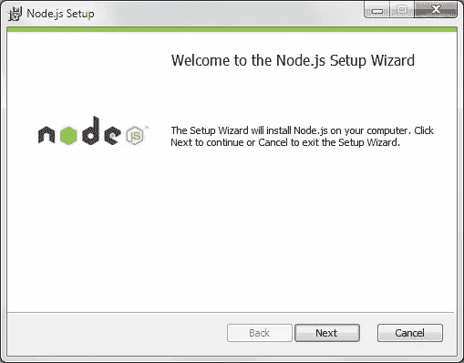
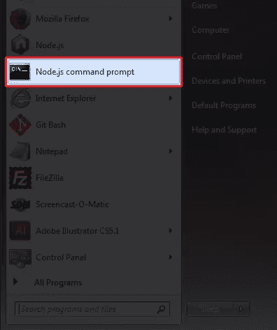
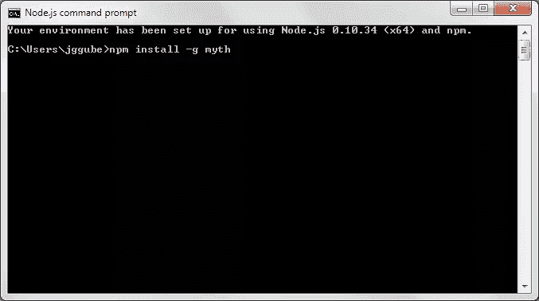
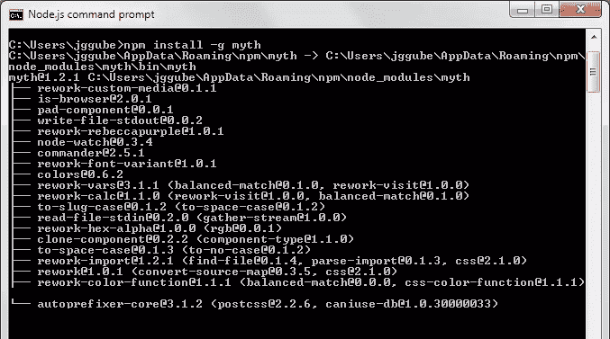

# 神话入门:未来的预处理器

> 原文：<https://www.sitepoint.com/getting-started-myth-preprocessor-future/>

神话是一个 CSS 预处理器，它允许你在你的项目中使用新的和实验性的 CSS 特性。

## 为什么要用神话？

使用 Myth，您可以使用提议的 CSS 特性，即使它们的 W3C 规范仍在开发中，即使大多数浏览器目前不支持它们。

与其他 CSS 预处理程序相比，使用 Myth 的一大优势是你可以使用原生 CSS 编写样式表。您不需要学习新的样式表语言，比如 Less 或 Sass。

当这些新的 CSS 特性在 web 浏览器中获得广泛的本地支持时，您就不需要手动更新样式表了，因为 Myth 会为您做这件事。您只需要重新编译您的开发样式表，这将只需要几秒钟。

以下是 Myth 现在可以实现的一些 CSS 特性:

*   [CSS 变量](http://dev.w3.org/csswg/css-variables/)
*   [自定义媒体查询](http://dev.w3.org/csswg/mediaqueries/#custom-mq)
*   [`color()`功能](http://dev.w3.org/csswg/css-color/#modifying-colors)
*   运行时不进行动态计算的 [`calc()`函数](https://www.w3.org/TR/css3-values/#calc)
*   自动化浏览器供应商前缀

## 一个神话句法的例子

这里有一个快速品尝神话。以下包含一些大多数浏览器尚不支持的 CSS:

```
:root {
  --bgcolor: #0072bc;
  --textcolor: color(var(--bgcolor) lightness(85%));
}

.button {
  display: block;
  width: 90%;
  max-width: 220px;
  padding: 10px;
  background: var(--bgcolor);
  color: var(--textcolor);
  border-radius: 6px;
  transition: background-color 0.4s ease-out,
              color 0.3s ease-out;
}
```

编译时，Myth 会将上述内容翻译成大多数浏览器都能理解的标准 CSS:

```
.button {
  display: block;
  width: 90%;
  max-width: 220px;
  padding: 10px;
  background: #0072bc;
  color: rgb(179, 224, 255);
  border-radius: 6px;
  -webkit-transition: background-color 0.4s ease-out,
                      color 0.3s ease-out;
  transition: background-color 0.4s ease-out,
              color 0.3s ease-out;
}
```

## 安装神话

要设置 Myth，你需要 Node.js。它[有安装向导](http://nodejs.org/download/)，为 Windows 和 Mac OS 用户提供图形用户界面。



对于 Windows 用户，我在我的网站上写了一篇关于如何在 Windows 上安装 Node.js 的教程。在 Mac OS 上安装 Myth 的步骤几乎相同。Linux 用户必须在他们的机器上安装二进制文件。

安装节点后，启动 Node.js 命令提示符。



要安装 Myth，请使用 npm(节点的默认程序包管理器),方法是在命令提示符下执行以下命令:

```
npm install -g myth
```



一旦 Myth 的设置完成，您应该会在命令提示符下看到如下内容:



## 用神话创造响应式设计

让我们使用 Myth 构建一个简单的响应式布局。

SitePoint 会不时删除存放在不同 HTML 页面上的多年前的演示。我们这样做是为了降低过时代码的风险，因为暴露的漏洞会给我们的用户带来风险。谢谢你的理解。

[**下载源文件**](https://uploads.sitepoint.com/wp-content/uploads/2015/01/1420578442myth-demo-files.zip)

### 细节

这是演示页面的目录结构:

```
/demo/
|-- /css/
  |-- dev.css
  |-- styles.css
  |-- styles.min.css
|-img/
|-- index.html
```

*   **`/css/`** 包含项目的样式表和样式表资产
    *   **`dev.css`** 是开发样式表，我们将在这里编写输入 CSS
    *   **`styles.css`** 是神话般编制的样式表。这是站点准备部署时将使用的样式表。
    *   **`styles.min.css`** 是`styles.css`的缩小版。
*   *img/`** 为我们的项目保存着图像。
*   **`index.html`** 当然是我们正在构建的页面。

### 链接输入和输出样式表

使用 Node.js 命令提示符发出适当的命令，以便导航样式表的位置。

```
cd /path/to/your/folder/css
```

其中`/path/to/your/folder/css`是您的样式表在您的计算机或 web 服务器上的位置。

您需要做的下一件事是告诉 Myth 我们的开发样式表是`dev.css`，我们编译的样式表是`styles.css`。我们还希望它能留意对`dev.css`的更改，这样每当我们更改开发样式表时，它就会自动更新和编译`styles.css`。

```
myth --watch dev.css styles.css
```

如果您想手动编译，只需省去`--watch`选项:

```
myth dev.css styles.css
```

注意，必须已经创建了`dev.css`命令才能工作。但是，`styles.css`如果不存在会自动创建。此外，这些样式表可以有您想要的任何文件名。

### 添加神话的 CSS

您可以查看演示文件中的标记，以了解示例站点是如何布局的。一旦 HTML 就绪，下面是我们将在`dev.css`中使用的 CSS。它大量使用实验性的、未来的和提议的 CSS 规范，如变量、自定义媒体查询、颜色函数等等。

**(使用垂直滚动条查看所有代码。)**

```
:root {
  --max-width: 960px;
  --gutter: 2%;
  --base-size: 17px;
  --small-size: 14px;
  --base-lineheight: 1.4;
  --default-color: #464646;
  --default-bgcolor: #fff;
  --link-color: #0072bc;
  --dark-bgcolor: #759ea1;
  --dark-bgcolor-text-color: color(var(--dark-bgcolor) lightness(85%));
  --highlight-color: firebrick;
}

@custom-media --small-devices (max-width: 400px);
@custom-media --medium-devices (min-width: 401px) and (max-width: 750px);

* { 
  margin: 0;
  padding: 0;
}

body {
  background: var(--default-bgcolor);
  color: var(--default-color);
  font: normal var(--base-size)/var(--base-lineheight) "Roboto", sans-serif;
  text-align: center;
}

img {
  width: 100%;
  height: auto;
}

/* Typography */
h1, h2, h3, p {
  margin: 5px auto 20px auto;
}

h1 {
  font-size: calc(var(--base-size) * 3);
  line-height: calc((var(--base-size) * 3) * var(--base-lineheight));
}

h2 {
  font-size: calc(var(--base-size) * 2);
  font-weight: 400;
  line-height: calc((var(--base-size) * 2) * var(--base-lineheight));
  color: color(var(--highlight-color) saturation(-20%));
}

h3 {
  font-size: calc(var(--base-size) * 1.2);
  font-weight: 400;
  line-height: calc((var(--base-size) * 1.2) * var(--base-lineheight));
  color: color(var(--highlight-color) saturation(+50%));
}

a {
  color: var(--link-color);
  text-decoration: none;
  transition: color 0.2s ease-in;
}

a:hover {
  color: color(var(--link-color) lightness(-10%));
  transition: color 0.4s ease-out;
}

/* Layout */
header {
  display: block;
  width: 100%;
  min-height: 500px;
  padding-top: 100px;
  background: var(--dark-bgcolor)
              url(header-bg.jpg) no-repeat center center;
  background-size: cover;
  background-attachment: fixed;
  color: var(--dark-bgcolor-text-color);  
}

.container {
  position: relative;
  width: 96%;
  max-width: var(--max-width);
  margin: 0 auto;
}

.fullcol, .halfcol, .fourthcol {
  float: left;
  box-sizing: border-box;
  margin-left: var(--gutter); 
}

.container .fullcol,
.container .halfcol:first-child,
.container .fourthcol:first-child  {
  margin-left: 0;
}

.fullcol {
  width: 100%;
  text-align: center;
}

.halfcol {
  width: calc((100% - var(--gutter)) / 2);
}

.fourthcol {
  width: calc(((100% - (var(--gutter) * 3)) / 4));
}

section {
  float: left;
  width: 100%;
  padding-top: 80px;
  padding-bottom: 80px;
}

/* Special */
.logo {
  margin-top: 0;
  font-family: "Montserrat", sans-serif;
  font-weight: 400;
  letter-spacing: 2px;
  text-transform: uppercase;
  text-shadow: rgba(0, 0, 0, 0.5) 2px 2px 2px;
}

.tagline {
  text-transform: uppercase;
}

.button {
  display: block;
  width: 90%;
  max-width: 220px;
  margin: 30px auto 50px auto;
  background: var(--link-color);
  color: var(--dark-bgcolor-text-color);
  border-radius: 6px;
  padding: 10px;
  transition: background-color 0.4s ease-out, color 0.3s ease-out;
}

.button:hover {
  background: color(var(--link-color) tint(50%));
  color: color(var(--dark-bgcolor-text-color) whiteness(100%));
  transition: background-color 0.3s ease-in, color 0.2s ease-in;
}

.credits {
  margin: 80px auto 20px auto;
  font-size: calc(var(--base-size) * 0.75);
  color: color(var(--dark-bgcolor-text-color) hue(+120%));
}

#work {
  background: color(var(--dark-bgcolor) lightness(+30%));
}

#contact {
  background: color(var(--highlight-color) saturation(-30%));
  color: var(--dark-bgcolor-text-color);
}

#contact h2 {
  color: color(var(--dark-bgcolor-text-color) saturation(+20%));
}

/* Media Queries */
@media (--small-devices) {
  .fullcol, .halfcol, .fourthcol {
    width: 100%;
    margin-left: 0;
    text-align: center;
  }

  .button, .tagline {
    font-size: var(--small-size);
  }

  .logo {
    margin-top: 0;
    font-size: calc(var(--base-size) * 1.8);
    line-height: calc((var(--base-size) * 1.8) * var(--base-lineheight));
  }
}

@media (--medium-devices) {
  .fourthcol {
    width: calc((100% - var(--gutter)) / 2);
    margin-left: var(--gutter);
    margin-bottom: 20px;
  }

  .container .fourthcol:nth-child(odd) {
    margin-left: 0;
    clear: left;
  }
}
```

### CSS 输出

下面是`styles.css`中编译后的输出。你可以看到，神话翻译我们的 CSS，使今天的浏览器可以呈现它。还要注意，Myth 将自动格式化和缩进 CSS 输出，忽略我们首选的缩进模式。

**(使用垂直滚动条查看所有代码。)**

```
/* Basic */

* {
  margin: 0;
  padding: 0;
}

body {
  background: #fff;
  color: #464646;
  font: normal 17px/1.4 "Roboto", sans-serif;
  text-align: center;
}

img {
  width: 100%;
  height: auto;
}

/* Typography */

h1,
h2,
h3,
p {
  margin: 5px auto 20px auto;
}

h1 {
  font-size: 51px;
  line-height: 71.39999999999999px;
}

h2 {
  font-size: 34px;
  font-weight: 400;
  line-height: 47.599999999999994px;
  color: rgb(159, 56, 56);
}

h3 {
  font-size: 20.4px;
  font-weight: 400;
  line-height: 28.559999999999995px;
  color: rgb(214, 0, 0);
}

a {
  color: #0072bc;
  text-decoration: none;
  -webkit-transition: color 0.2s ease-in;
  transition: color 0.2s ease-in;
}

a:hover {
  color: rgb(0, 83, 138);
  -webkit-transition: color 0.4s ease-out;
  transition: color 0.4s ease-out;
}

/* Layout */

header {
  display: block;
  width: 100%;
  min-height: 500px;
  padding-top: 100px;
  background: #759ea1 url(header-bg.jpg) no-repeat center center;
  background-size: cover;
  background-attachment: fixed;
  color: rgb(209, 223, 224);
}

.container {
  position: relative;
  width: 96%;
  max-width: 960px;
  margin: 0 auto;
}

.fullcol,
.halfcol,
.fourthcol {
  float: left;
  box-sizing: border-box;
  margin-left: 2%;
}

.container .fullcol,
.container .halfcol:first-child,
.container .fourthcol:first-child {
  margin-left: 0;
}

.fullcol {
  width: 100%;
  text-align: center;
}

.halfcol {
  width: 49%;
}

.fourthcol {
  width: 23.5%;
}

section {
  float: left;
  width: 100%;
  padding-top: 80px;
  padding-bottom: 80px;
}

/* Special */

.logo {
  margin-top: 0;
  font-family: "Montserrat", sans-serif;
  font-weight: 400;
  letter-spacing: 2px;
  text-transform: uppercase;
  text-shadow: rgba(0, 0, 0, 0.5) 2px 2px 2px;
}

.tagline {
  text-transform: uppercase;
}

.button {
  display: block;
  width: 90%;
  max-width: 220px;
  margin: 30px auto 50px auto;
  background: #0072bc;
  color: rgb(209, 223, 224);
  border-radius: 6px;
  padding: 10px;
  -webkit-transition: background-color 0.4s ease-out, color 0.3s ease-out;
  transition: background-color 0.4s ease-out, color 0.3s ease-out;
}

.button:hover {
  background: rgb(128, 185, 222);
  color: rgb(228, 228, 228);
  -webkit-transition: background-color 0.3s ease-in, color 0.2s ease-in;
  transition: background-color 0.3s ease-in, color 0.2s ease-in;
}

.credits {
  margin: 80px auto 20px auto;
  font-size: 12.75px;
  color: rgb(224, 209, 223);
}

#work {
  background: rgb(209, 223, 224);
}

#contact {
  background: rgb(148, 66, 66);
  color: rgb(209, 223, 224);
}

#contact h2 {
  color: rgb(202, 230, 232);
}

/* Media Queries */

@media (max-width: 400px) {
  .fullcol,
  .halfcol,
  .fourthcol {
    width: 100%;
    margin-left: 0;
    text-align: center;
  }

  .button,
  .tagline {
    font-size: 14px;
  }

  .logo {
    margin-top: 0;
    font-size: 30.6px;
    line-height: 42.839999999999996px;
  }
}

@media (min-width: 401px) and (max-width: 750px) {
  .fourthcol {
    width: 49%;
    margin-left: 2%;
    margin-bottom: 20px;
  }

  .container .fourthcol:nth-child(odd) {
    margin-left: 0;
    clear: left;
  }
}
```

## 排除故障

当您编译开发样式表时，Myth 会在 Node.js 命令提示符下发出错误通知，因此它是一个关键的调试工具。

例如，如果没有定义自定义介质查询，您将看到以下内容:


神话的错误通知会告诉我们:

*   哪里出了问题？
*   发现问题的行号。
*   流言是如何回应这个错误的？
*   建议的修复。

## 优化 CSS 以获得更好的性能

当您准备将项目部署到 web 服务器时，您可以做一件简单的事情来提高站点的性能，那就是缩小您的样式表。如果您使用`--compress`选项，Myth 可以为您做到这一点:

```
myth --compress dev.css styles.css
```

在我们的例子中，通过使用`--compress`选项，样式表的文件大小**减少了 20%** 。

## 其他神话命令选项

神话命令选项有快捷方式。例如:

```
myth --compress --watch dev.css styles.css
```

可以改为发布为:

```
myth -c -w dev.css styles.css
```

前往 GitHub 上的 Myth README 获取最新的命令列表。

## 结论

对于迫不及待想使用一些实验性 CSS 特性的开发人员来说，Myth 是一个很好的 CSS 预处理器。它很容易设置和使用，而且与其他选项不同，您不需要学习新的样式表语言语法就可以使用它。

同样，这里是演示和下载文件的链接:

不时地，SitePoint 会删除单独的 HTML 页面上的多年前的演示。我们这样做是为了降低过时代码的风险，因为暴露的漏洞会给我们的用户带来风险。谢谢你的理解。)

[**下载源文件**](https://uploads.sitepoint.com/wp-content/uploads/2015/01/1420578442myth-demo-files.zip)

## 分享这篇文章