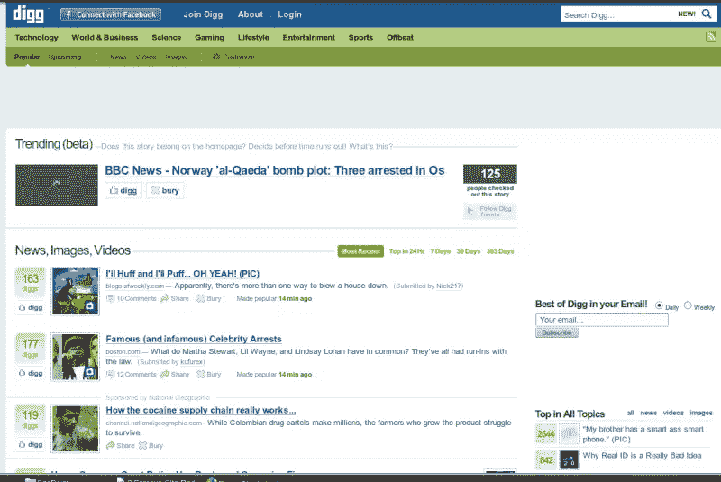
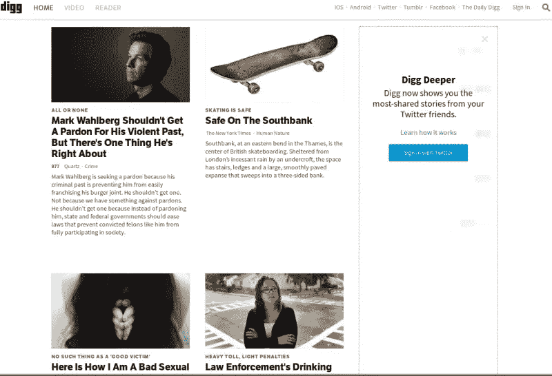

# 3 痛苦的公共网站重新设计灾难

> 原文：<https://www.sitepoint.com/3-painful-site-redesign-disasters/>

## (以及我们能从他们身上学到什么)

照片:本·马戈林

这是一个熟悉的故事:经过多年相同的发霉，旧的网站设计，小号声，天使唱歌，一个光荣的，新的，尖端的重新设计是由自豪的网站所有者推出。

然而，代替感激的，快乐的欢呼，批评开始涌入。也许一开始是令人目瞪口呆的沉默，后来逐渐演变成愤怒的长篇大论。

当然，网站重新设计的相对成功通常在很大程度上是主观的——看一眼我们的衣柜或音乐收藏就知道品味不同，一个人喜欢的东西可能会被其他人讨厌。

然而，即使考虑到这种主观性，历史上也已经充斥着史诗般的网站重新设计失败。网页设计仍处于起步阶段，但不难总结出网站重新设计失败的前 100 名，甚至前 1000 名，这些失败的标准绝不是主观的。

使用流量骤降或转化率大幅下降等指标，很明显——即使许多人坚持认为他们喜欢新设计——如果用户离开网站，重新设计就是失败的。当然，很少有人炫耀他们的灾难，所以描述这些失败的真实数据经常被保密，这使得从他们的错误中学习变得更加困难。

相反，我们需要利用公共信号，如明显的功能故障，或损坏的功能，或公共流量排名服务，如 Alexa 或康姆斯克。这些都不准确，但对于重大失败来说，即使这些间接指标也清楚地表明，重新设计的想法并不是最明智的。

虽然我们没有人能免于失败，但有时导致其他网站灾难的错误是很容易避免的。从别人的伤痕中学习比自己的伤痕更好。

如果说重新设计失败有什么好处的话——不管是你自己的还是别人的——这是一个难得的学习机会。可惜这方面的学习资料并不缺乏。今天，我挑选了三个典型的灾难来进行更深入的回顾。

## 1.Digg 是如何自掘坟墓的

我怀疑有史以来最著名的重新设计失败之一是流行的社会化书签网站 Digg 的重新设计。2010 年，在作为访问量最大的社会化书签网站统治多年后，Digg 决定是时候改变了。

2010 年，脸书和推特风靡一时。可以理解的是，Digg 决定重新关注它的服务，更加强调社交网络而不是社交 T2 书签。他们想让**更容易与你的**朋友**分享**内容，并**关注**他们分享的内容。

Digg 的重新设计不是建立一个集中的“链接股市”( link stockmarket ),让一小撮精英用户的意见凌驾于其他所有人之上，而是重新分配投票权，让用户更多地受到朋友分享内容的影响。

这听起来是一个高尚的概念，也是打破一小部分用户垄断“游戏化系统”的逻辑方法，对吗？

不幸的是，向好友列表优先化内容的转变并没有奏效，因为大多数用户在 Digg 上没有活跃、强大的好友网络。到 2010 年，大多数人已经有了成熟的社交网络，给他们提供的新闻比大多数人能读到的还要多。为什么他们需要在 Digg 上再开一个？

这种核心逻辑的改变导致了观众的急剧下降，因为新的逻辑要求用户改变他们的习惯。所有的证据都表明，大多数人决定不这么做。如果你想和你的朋友交流，你可以去脸书和推特。如果你想给内容加书签，或者查看热门话题，你可以去 Reddit、Stumbleupon 或 Slashdot。

Digg 试图同时提供两个世界的优势(即社交网络和社交书签),实际上却没有提供其中任何一个。

这种不满是如此明显，以至于一些报道称 Digg 因为这一改变失去了超过四分之一的观众。在推出的头几个月，Digg 的流量在美国下降了 26%,在英国下降了 34%

事实上，后来 Digg 设法至少部分恢复了它的地位。后来的重新设计得到了更好的接受，但从未能让 Digg 恢复昔日的辉煌。许多人认为 Digg 一直在走下坡路。

虽然你不能把所有的责任都归咎于重新设计，但是 Digg 的市场估值在经历了这场磨难后确实遭受了巨大的打击。2008 年，该网站的价值约为 1.6 亿美元，但在 2012 年，它以 50 万美元的惊人价格售出。那是一些讨厌的数学。

目前，Digg 的主页看起来就像另一个有文章介绍的博客，不同的是这些文章在其他网站上。Digg 已经失去了许多独特的外观。交通数据可能是可靠的，但它已经失去了对社区的信任。

Digg 很大，但它并没有垄断社会化书签。如果你还记得的话，脸书差不多在同一时间进行了一次重大的重新设计，也遭到了用户的强烈反对。

然而，Digg 从未像脸书对社交网络那样对社交书签感兴趣。脸书几乎垄断了社交网络，用户继续使用它，即使他们声明他们讨厌新的设计。

从 Digg 的失败中吸取的教训是，商业逻辑的巨大变化会疏远用户。新的重新设计在发布时漏洞百出，这一事实也于事无补——第一印象很重要。即使是重新设计引入的明显改进，如简化的链接发布，也不足以止血。

推测一下如果 Digg 没有重新设计会发生什么是很有趣的。我个人的看法是，这将是一个缓慢的死亡。对于普通用户来说，系统被游戏化的味道变得越来越明显。

如果 Digg 继续走这条路，它的相关性可能会随着时间的推移而消失。随着重新设计，它的流量下降很快，它很快死亡。虽然重新设计未能实现其目标，但很难指责他们的尝试。

也许他们只是等了太久才开始——2007 年的一个社交 Digg 可能已经非常成功地与一个新生的 Twitter 和一个青春期的脸书竞争了。

## 2.雅虎邮箱——如果没有(太)坏，就不要修复它

雅虎重新设计失败的原因与 Digg 失败的原因不同。虽然在 Digg 的案例中，重新设计的背后有着合理的逻辑——他们不能继续允许他们的产品被一小撮高级用户所利用——但雅虎邮箱的情况却不同。

他们的服务在不到一年的时间里经历了两次重新设计(分别在 2012 年 12 月和 2013 年 10 月)，每次都以社区中的愤怒和咬牙切齿而告终。

雅虎邮箱的情况可以用一句古老的格言来概括:如果它没有(太)坏，就不要修复它。

这并不是说最初的雅虎邮箱是无可指责的。然而，第二次重新设计是一个很好的例子，说明恐慌是如何把一个小混乱变成一场大灾难的。

有人说，重新设计雅虎邮箱的原因之一纯粹是为了自我提升。在第一次重新设计的几个月前任命了一位新经理，看来重新设计的驱动力是压倒一切的“淘汰旧的，符合新的政策——并且尽可能快地完成。

这种“新世界从我开始”的方法是许多灾难的根源，所以当它遇到麻烦时并不完全令人震惊。然而，让数百万忠实的雅虎邮件用户恼火的是，他们认为自己最喜欢的邮件系统在第一次重新设计之前相当好，他们看不到有令人信服的理由进行改变。

虽然用户确实经常反对任何类型的改变——甚至是改进——但第一次和第二次雅虎邮箱的重新设计绝对不是这样。重新设计只是清除了备受喜爱的功能，如标签和按发件人排序，同时引入了他们不喜欢或不需要的新功能(即 Flickr 集成)。

而雅虎！可以理解的是，谷歌从未公布在改版后放弃该服务的用户数量，看来这个数字可能并不小。只有 25%忠实的雅虎员工愿意使用他们自己的邮件系统，这一事实充分说明了重新设计版本的所有优点。

尽管 Digg 和雅虎邮箱重新设计的失败有所不同，但有一个惊人的相似之处——每个人都试图成为他们不是的人。在第一个案例中，Digg 试图成为脸书的克隆体，而在第二个案例中，雅虎邮箱显然是在模仿谷歌邮箱。

公平地说，试图模仿一个行业领袖*有时会奏效。[kid craft](http://brickfetish.com/kiddicraft/twins_1947.html)比乐高早 10 年生产塑料砖，但是现在谁还记得那个？*

但是，当你有一个长期建立的用户群体，因为你不是脸书和 Gmail 而追随你时，模仿不会有任何结果。

除此之外，Digg 和 Yahoo Mail 在如此糟糕的条件下推出了他们的新网站，这些网站似乎根本没有经过内部测试。用户无法登录，邮件无法加载，关键功能被破坏或完全丢失。

对我来说，雅虎邮箱的失败比在各种网站上被慷慨评论的 Digg 的重新设计灾难要大得多。也许雅虎邮箱的巨大失败并没有引起媒体的太多关注，仅仅是因为对于许多读者和作者来说，雅虎邮箱在这些非常不幸的重新设计之前就已经死亡了。

虽然雅虎邮箱确实是其过去辉煌的一个阴影，但它仍然拥有数亿生锈的用户，当人们开始移动家具时，他们会大声疾呼。

我们能从雅虎那里得到什么？s 痛苦？

1.  如果没坏，就别修。
2.  不要模仿领导者——做真实的自己，因为这是你的用户喜欢你的原因。

## 3.Target.com 是如何错过目标的

与前两次重新设计的灾难相比，[Target.com](http://www.target.com/)的重新设计的不幸根本没什么可担心的，但是与一个完美的网站相比，还有很多不足之处。平心而论，有许多网站躲过了任何真正的批评，它们看起来比 Target.com 糟糕得多。

然而，塔吉特是一个受欢迎的品牌和一个大目标群体…–你知道我的意思–因此吸引了大量的关注。

Target.com 最近的重新设计灾难是网站忘记自己是谁的又一个例子。目标品牌的一个标志性特征是它的极简主义。空白，红圈——这就是人们喜欢它的原因。

http://www . practical commerce . com/articles/64011-Dont-Follow-Target-com-when-redesign-your-Ecommerce-Site

这是旧的目标外观。它于 2011 年推出，是的，这种重新设计在当时也被认为是一个巨大的失败。

然而，当 2013 年推出最新版本时，即使是 2011 年版本的批评者也开始喜欢上它。这是一个冒险的成功秘诀——如果你的用户讨厌你的新设计，推出更糟糕的东西，他们会意识到他们有多幸运。

http://www . practical commerce . com/articles/64011-Dont-Follow-Target-com-when-redesign-your-Ecommerce-Site

2011 年的版本可能有它的小故障，但它仍然忠于目标设计的独特特征——极简主义。设计中有足够的空气，它在适当的时间装载。

新的设计在主页上展示了更多的产品，但它看起来杂乱无章，塔吉特百货的极简主义标志被密集的产品墙所取代。这是该行业反对 2013 年重新设计的主要理由。

具有讽刺意味的是，Target 在 2011 年的重新设计中因更大的功能失误而受到的批评较少，当时一些用户无法完成购买，甚至无法找到一些产品类别。

具有讽刺意味的是，虽然 2013 年的重新设计避免了这种戏剧——想必塔吉特百货在测试关键功能方面吸取了教训——但他们因“偏离品牌”而受到的批评丝毫没有减少。

同样，与许多其他重新设计的灾难相比，目标的灾难没有那么严重。然而，如果他们遵循一条更加进化的重新设计道路，以更小的、分阶段的步骤引入变革，那么所有的负面宣传都可能被避免。

事实上，在连续两次重新设计的灾难之后，Target 很可能选择了温和进化的道路。当我最近查看他们的网站时，我注意到与他们在 2013 年推出的设计相比，只有微小的变化。例如，当菜单回到左边时，招致严厉批评的阴影消失了。

拯救塔吉特百货的是他们拥有坚如磐石的实体商店。如果他们只是一个在线平台，他们可能不会这么幸运。

我们能从目标的焦虑中学到什么？

1.  不要为了短期利益或追逐潮流而牺牲你的长期价值观(塔吉特的情况是极简主义)
2.  渐进的改变对用户来说不那么痛苦——一次引入一个，评估结果，如果有保证就继续。

是的，有一个庞大的跨国帝国作为后盾并没有坏处。

## 最大的问题是:打还是站？

赢[21 点](http://en.wikipedia.org/wiki/Blackjack)(或 21 点)的诀窍是知道什么时候“出牌”——要另一张牌——或“坚持”——保留你手中的牌，希望它们足够好，可以击败庄家。

如果你拿到一张 20，你应该站起来。如果你有一个' 13 '，你会想要击中。17 是更难的决定。

重新设计可能是一场类似的赌博。不知何故，Craigslist 自 20 世纪 90 年代中期以来就成功地“坚持”了同样的设计——可以说是设计术语中的“15”。Digg“击中”并被终结。然而，对于 MySpace 这样的公司来说，游戏变化如此之快，以至于他们甚至还没来得及申请另一张卡就破产了。

这是一场艰苦的比赛。

## 分享这篇文章