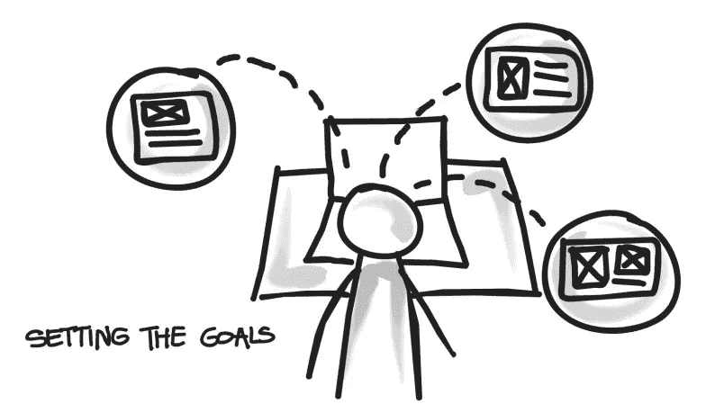
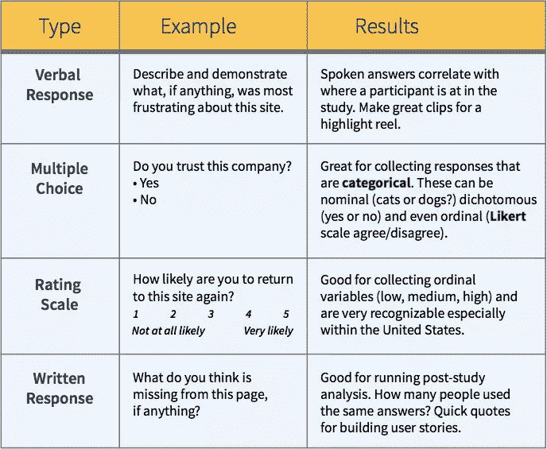
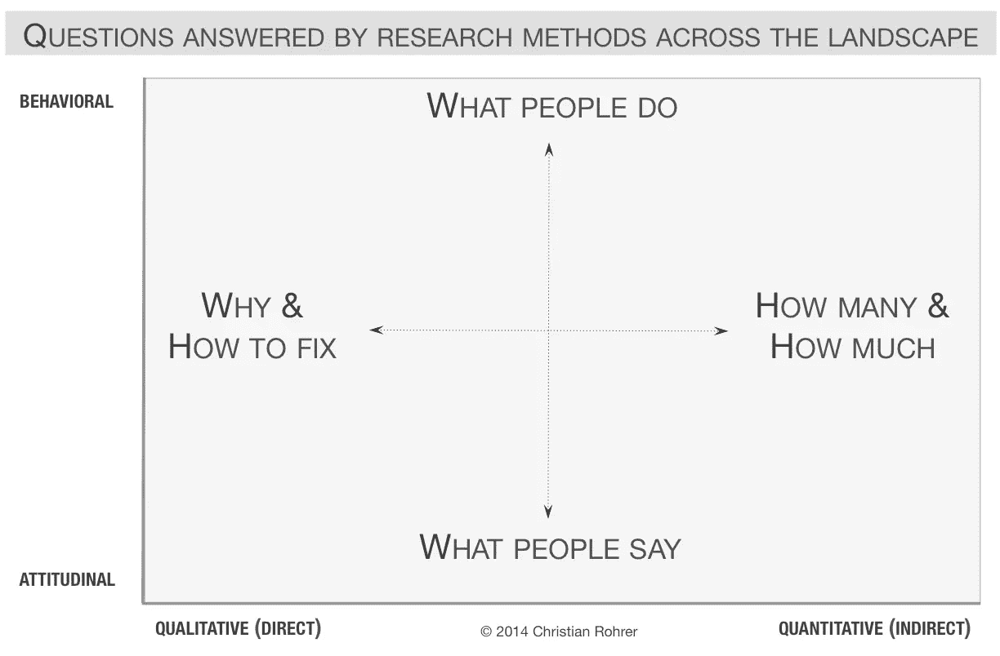
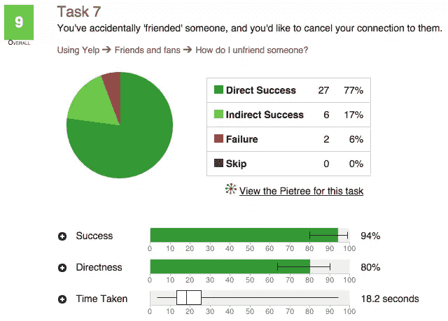

# 可用性测试的目标:在“如何”之前知道“为什么”

> 原文：<https://www.sitepoint.com/usability-testing-goals-knowing/>

## 在测试设计之前，找出你的方向

像所有重要的任务一样，你需要有计划地进行可用性测试。但是正如你将看到的，在开始时多花一点时间计划最终会有回报。

通过遵循一些简单的指导方针，你会知道期待什么，寻找什么，以及从你的可用性测试中学到什么。

来源: [Stippen 咨询](http://konsult.stippen.org/)

显然，每个人都想优化可用性测试的结果。但是要做到这一点，你必须首先知道你在测试什么。我们将解释如何定义你的测试目标和设置你的可用性指标。

## 定义你的可用性目标

毫无疑问，在你打开这本书之前，Waldo 是什么样子的，但是很多公司都不知道他们在找什么，甚至不知道为什么，就草率地进行可用性测试。

为此，可用性研究的第一步应该始终是知道你试图发现什么——但这并不像听起来那么容易。首先，你需要对你的测试目标进行分类，并且知道什么类型的数据是最合适的。

## 1.将你的目标分类

有时候，把你不同的目标分成不同的类别会有所帮助。谷歌风险投资设计工作室的 UX 研究员迈克尔·马戈利斯认为，确定目标的第一步是知道该问什么问题(他把这些问题分类列出)。

首先与利益相关者召开预备会议，评估他们对产品的了解程度(功能、用户、竞争对手等)以及约束条件(时间表、资源等)，会有所帮助。

一旦你知道了这一点，你就可以提出一系列问题来帮助团队关注研究问题("*为什么人们会进入网站而不观看演示视频？*”)相对于仅仅口述方法(*我们现在需要做焦点小组！*)。

*   **相关产品信息** —你了解自己产品的历史吗？你知道未来会发生什么吗？现在是找出答案的好时机。
*   **用户**——谁在使用你的产品？你希望谁使用你的产品？尽可能具体:人口统计、位置、使用模式——任何你能找到的。
*   **成功** —你对该产品的成功有何看法？It 销售、下载、浏览量、参与度或其他指标？确保整个团队步调一致。
*   竞争对手——谁将是你最大的竞争对手？你怎么比较？基于你的竞争，你的用户会期待什么？
*   研究——在计划你的研究时，这似乎是一个显而易见的问题，但是你想知道什么呢？什么数据对你的团队最有帮助？你是否已经可以利用这些研究了，这样你就不会浪费时间了？
*   **时间和范围** —您收集数据的时间框架是什么？什么时候到期？

来源:[设定可用性测试的目标需求](http://www.uxpassion.com/blog/usability-tutorial-setting-goals-requirements-user-testing/)

完成基准问题后，您可以互换角色，让您的团队写下他们的问题。这样，你就能确定他们知道什么，以及他们想知道什么。

Mutual Mobile [的 Becky White 讲述了一个帮助你缩小目标的示例练习](http://www.mutualmobile.com/posts/kick-starter-guide-user-research)。召集你的团队，分发便利贴。然后，让每个人写下他们对用户和 UX 的疑问。收集所有的问题，贴在一块板上。

最后，试着根据相似度来组织所有的问题。您将会看到某些类别比其他类别有更多的问题——这些可能会成为您的测试目标。

正如在[可用性测试指南](http://www.uxpin.com/guide-to-usability-testing.html)中所讨论的，这也有助于确保你的测试目标尽可能简单。你的目标应该很简单，比如“访问者能找到他们需要的信息吗？”而不是复杂的目标，如“访问者能容易地找到我们的产品并做出明智的购买决定吗？”

如果你认为使用可用性测试问题是设定目标的一种方式，Userium [提供了这个有用的网站可用性清单](https://userium.com/)。如果你发现自己在一个或多个方面有所欠缺，那么收集数据将是最有帮助的(如果你的团队在最初的 Q & A 中陷入困境，这也是很好的话题)。

## 2.知道测量什么

现在你知道了你的目标，是时候弄清楚如何应用可用性测试来实现它们了。本质上，您正在阐明您的测试的更大范围。

关于可用性测试的电子书建议你必须首先了解什么样的反馈对你的结果最有帮助。你的团队需要一张图表还是一个等级量表？个人用户账户或号码？书面回复还是原话？

将阅读数据的人可以影响收集的最佳类型:持怀疑态度的利益相关者可能会被图表化的量化评级尺度的冷酷、硬数字所说服，而首席执行官可能会在看到用户在某项任务中失败的视频剪辑时理解问题。

这就是为什么首先知道你的可用性目标是如此重要。如果你不知道总体目标和目的，那么你肯定不知道你需要什么类型的反馈和数据。下面的图表可以帮助你举例说明数据类型如何影响测试类型。

来源:[用户测试你的下一个项目](http://info.usertesting.com/User-Testing-Your-Next-Project-Reg.html)

一旦你知道了你的目标和你要找的数据类型，是时候开始计划实际的测试了。但是在我们开始之前，让我们先谈一谈指标。

### 可用性度量

度量是围绕可用性的定量数据，与我们上面描述的口头和书面的定性研究相反。当您将定性和定量的数据收集结合起来时，您就会知道为什么以及如何解决问题，以及有多少可用性问题需要解决。

你可以从下图中的[定量与定性数据](http://www.nngroup.com/articles/which-ux-research-methods/)中看出这一点。

来源:[UX 的哪些研究方法](http://www.nngroup.com/articles/which-ux-research-methods/)

简而言之，可用性度量是衡量用户在一组给定任务上的表现的统计数据。Usability.gov 列出了一些对定量数据收集最有帮助的焦点:

*   **成功率** —在给定的场景中，用户能够完成分配的任务吗？当我们为 Yelp 网站的[重新设计测试 35 名用户时，这是最重要的底线指标之一。](http://uxpin.com/ux-design-in-action-yelp-website.html)
*   **错误率**——哪些错误最容易让用户犯错？这些可以分为两种类型:关键和非关键。严重错误会阻止用户完成任务，而非严重错误只会降低他们完成任务的效率。
*   **完成时间** —用户完成任务花了多长时间？这在确定你的产品与竞争对手相比如何时特别有用(如果你两者都测试的话)。
*   **主观测量** —对用户自我确定的满意度、易用性、信息可用性等进行数字排名。令人惊讶的是，你实际上可以通过将这个归结为[简单问题](http://www.measuringu.com/blog/seq10.php)来量化定性反馈。

来源:[用户测试&设计](http://uxpin.com/ux-design-in-action-yelp-website.html)

尼尔森诺曼集团的联合创始人、可用性专家 Jakob Nielsen 在《度量标准概述》中明确指出，“制定可用性度量标准很容易，但收集起来很难。”因为收集可用性度量标准是困难的、耗时的和/或昂贵的，许多小预算公司回避它们，即使它们可能被证明是有用的。

那么，度量对你来说是一项值得的投资吗？Nielsen 特别列出了度量标准最有用的几种情况:

*   **跟踪版本之间的进度** —你的最新更新达到目标了吗？这些指标将向您展示您是否已经解决了过去的问题，或者仍然需要调整您的设计。

*   **评估竞争地位** —指标是精确确定你在竞争对手面前的排名的理想方法。数字不会说谎。

*   **发布前的停止/继续决策** —您的产品准备好发布了吗？心中有一个数字目标会让你确切地知道你什么时候准备好释放。

可用性度量总是有帮助的，但可能是一项昂贵的投资，因为你需要测试更多人的统计显著性(可用性测试指南通过查看定量和定性方法更详细地探讨了这一点)。

如果你计划收集定量数据，确保你收集定性数据，这样你就有了一个制衡系统，否则你[会有数字崇拜的风险](http://www.nngroup.com/articles/risks-of-quantitative-studies/)。你实际上可以看到这种风险如何在现实世界中发生，在[user testing 的 Hannah Alvarez 对人造黄油导致离婚的巧妙解释](http://www.usertesting.com/blog/2014/10/27/qualitative-insights-to-understand-data/)。

## 外卖

在某些方面，计划阶段是可用性研究中最重要的。当你用耐心和思考正确地完成时，你的数据将是准确的和最有益的。

但是，如果最初的计划被掩盖，甚至被忽略，你的数据将会受损，并质疑整个努力的价值。牢记我们讨论过的项目，直到你对自己的目标和如何实现目标完全有信心时，再继续前进。

关于 20 种不同类型的可用性测试的解释和实用技巧，请查看免费的 109 页的可用性测试指南。最佳实践来自苹果、Buffer、DirecTV 等公司。

## 分享这篇文章