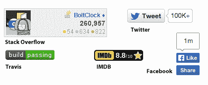

# 实现嵌入式定制徽章的 3 种方式

> 原文：<https://www.sitepoint.com/3-ways-implement-embeddable-custom-badges/>

有机推广你的应用程序的一个好方法是提供“徽章”；人们可以在自己的网站上嵌入的内容片段。


它可以包含应用程序中关于用户、内容或其他对象的最新信息，动态生成并插入到其他网站中。这可能最好用一些例子来说明:



在这篇文章中，我将看看你可以实现这一点的一些方法。

## 设置我们的示例应用程序

本教程的所有代码都可以在 Github 上找到。还有一个在线演示。

首先，我们将使用 Composer 定义应用程序的依赖关系:

```
"silex/silex": "~2.0@dev",
"twig/twig": ">=1.8,<2.0-dev",
"smottt/wideimage": "dev-master"
```

现在，在`index.php`中，让我们引入 Composer 生成的自动加载程序，添加我们的`use`语句，初始化我们的 Silex 应用程序并设置 Twig 模板:

```
require_once __DIR__.'/../vendor/autoload.php';

use Symfony\Component\HttpFoundation\Request,
		Symfony\Component\HttpFoundation\Response,
		WideImage\WideImage;

$app = new Silex\Application();

// Register the Twig service provider
$app->register(new Silex\Provider\TwigServiceProvider(), array(
	'twig.path' => __DIR__.'/../views',
));
```

让我们创建一个用户数据存储库，其中包含一些用户信息，这些信息将构成我们示例“徽章”的基础。为了简单起见，我们将使用一个静态数组；在实践中，您会使用数据库，但是将它换成更动态的东西应该很简单。我们将把它注入应用程序容器，如下所示:

```
/**
 * For simplicity, our datastore is a really simple, static array
 */
$app['datastore'] = function(){
	return [
		'users'	=>	[
			'dave'	=>	[				
				'avatar'			=>	'man1.png',
				'trophies'		=>	1,
				'rank'				=>	'Novice',
			],
			'jim'	=>	[
				'avatar'			=>	'man2.png',
				'trophies'		=>	2,
				'rank'				=>	'Intermediate',
			],
			'helen' => [
				'avatar'			=>	'woman1.png',
				'trophies'		=>	4,
				'rank'				=>	'Grand Master',
			],
		]
	];
};
```

现在我们已经建立了一个基本的应用程序和一些数据，让我们通过三种方法来了解如何提供一个可嵌入的“徽章”,为给定的用户显示这些数据。

## IFrames

IFrames 在 web 圈子里可能是一个肮脏的词，也许这是理所应当的。但是它们是将内容从一个站点嵌入到另一个站点的常见且实用的方法。

让我们从这个方法开始；稍后，当我们尝试 JavaScript 方法时，我们可以重用一些代码。

从一个简单的 Twig 模板开始，它创建一些 HTML——带有内联样式，以最小化 HTTP 请求——它包含我们的“徽章”作为`<div>`:

```
<!-- /views/badge.twig -->
<html>
  <head>
    <title>{{ username }}</title>
    <style>
      .badge {
        width: 250px;
        height: 80px;
        border: solid 1px #ccc;
        clear: both;
      }
      .avatar {
        float: left;
        width: 80px;
      }
      .badge .avatar img {
        margin: 10px 0 0 10px
      }
      .badge .info {
        width: 170px;
        float: right;
      }
      .badge .info h3 {
        margin: 0.25em 0;
      }
      .badge .info h4 {
        margin: 0.25em 0;
        color: #666;
      }
    </style>
  </head> 
  <body>
    <div class="badge">
      <div class="avatar">
        
      </div>
      <div class="info">
        <h3>{{ username }}</h3>
        <h4>{{ user.rank }}</h4>
        <div class="trophies">
          
          
          
        </div>
      </div>
    </div>
  </body>
</html>
```

这一切都很简单。请注意我们是如何加入一个名为`imagepath`的变量的，我们将在服务器端设置这个变量，它将负责一个非常重要的方面——我们加入的任何图像都必须使用绝对 URL 来引用。

现在相应的路线:

```
/**
 * Dynamically-generated HTML for embedding in an iFrame
 */
$app->get('/iframe/{username}', function(Request $request, $username) use ($app) {

	// Check that the user in question exists
	if (!isset($app['datastore']['users'][$username])) {
		// No user with that username, throw a 404
		$app->abort(404, "User $username does not exist.");
	}

	// Get the user record
	$user = $app['datastore']['users'][$username];

	return $app['twig']->render('badge.twig',
		[
			'username'		=>	$username,
			'imagepath'		=>	( ($request->server->get('HTTP_PORT') == 443) ? 'https' : 'http' ) . '://' . $request->server->get('HTTP_HOST') . '/images',
			'user'  			=> 	$user,
		]
	);

});
```

一切都很简单。填充`$imagepath`的位有点快且脏，但现在它将完成工作。

将它嵌入第三方网站非常简单:

```
<iframe src="/iframe/dave" width="300" height="100"></iframe>
```

稍后，我们将看看使用 iframe 方法需要考虑的一些事情；现在，让我们转到第二种方法。

## 动态创建的图像

实现这一点的一个最简单的方法是提供一个图像的 URL，它是在服务器端创建的。

这是我们将要创建的图像的截图:


好吧，它不会赢得任何设计奖项，但你可以用同样的方法创造出比这更具视觉吸引力的图像。

您将在示例应用程序的库中找到必要的资源——背景和奖杯图像、头像和字体。

下面是一些动态生成可嵌入图像的示例代码:

```
/**
 * Dynamically-generated image
 */
$app->get('/image/{username}', function($username) use ($app) {

	// Check that the user in question exists
	if (!isset($app['datastore']['users'][$username])) {
		// No user with that username, throw a 404
		$app->abort(404, "User $username does not exist.");
	}

	// Get the user record
	$user = $app['datastore']['users'][$username];

	// Load the background
	$background = WideImage::load(__DIR__.'/../resourcimg/background.png');

	// Load the avatar
	$avatar = WideImage::load(__DIR__img/' . $user['avatar']);

	// Load the trophy image
	$trophy = WideImage::load(__DIR__img/trophy.png');

	// Paste the avatar onto the background
	$im = $background->merge($avatar, 10, 20);

	// Get the canvas
	$canvas = $im->getCanvas();

	// Set the font for the username
	$canvas->useFont(__DIR__.'/../resources/fonts/VeraBd.ttf', 12, $im->allocateColor(0, 0, 0));

	// Write the username onto the canvas
	$canvas->writeText(70, 15, $username);

	// Choose a slightly smaller, non-bold font
	$canvas->useFont(__DIR__.'/../resources/fonts/Vera.ttf', 9, $im->allocateColor(0, 0, 0));

	// Write the rank
	$canvas->writeText(70, 35, $user['rank']);

	// Now add the appropriate number of trophies
	$x = 70;

	for ($i = 0; $i < $user['trophies']; $i++) {
		$im = $im->merge($trophy, $x, 55);
		$x += 20;
	}

	// Finally, output the image to the screen
	return $im->output('png');

});
```

它基本上是自文档化的，应该很容易适应您的需求或更好的图像。请注意，我们从一个非 web 可访问的目录(`resources`)中获取背景图像，但是头像和奖杯图标在`public`目录中。

将它嵌入第三方网站再简单不过了:

```

```

> 你会注意到没有文件扩展名；不过这没关系，因为 WideImage 的`output()`方法会为您设置合适的标题。

我们可以做一些改进。首先，我们为每个请求生成一个新的图像。然而，您可以使用 WideImage 的`saveToFile()`方法来缓存结果，如下所示:

```
$im->saveToFile('/path/to/badge.png');
```

当找不到所请求的用户时，提供一个默认图像可能比发出 404 错误更好。

现在来看第三种也是最后一种方法。

## java 描述语言

使用 JavaScript 动态创建嵌入式内容是最常见的方法之一，也可能是最灵活的方法。

我们将再次生成一些 HTML，但这一次我们将返回一个简单的 JavaScript 代码片段，它将把它写入主机页面。所有需要的是，主机网站插入一个简单的`<script>`标签，他们希望我们的内容出现。

我们将重复使用之前的树枝模板，但这次路线看起来略有不同:

```
/**
 * Dynamically-generated JavaScript
 */
$app->get('/js/{username}', function(Request $request, $username) use ($app) {

	// Check that the user in question exists
	if (!isset($app['datastore']['users'][$username])) {
		// No user with that username, throw a 404
		$app->abort(404, "User $username does not exist.");
	}

	// Get the user record
	$user = $app['datastore']['users'][$username];

	// Build the HTML
	$html = $app['twig']->render('badge.twig',
		[
			'username'		=>	$username,
			'imagepath'		=>	( ($request->server->get('HTTP_PORT') == 443) ? 'https' : 'http' ) . '://' . $request->server->get('HTTP_HOST') . '/images',
			'user'  			=> 	$user,
		]
	);

	// Minify the HTML, ensuring we wind up with one long string
	$minified = preg_replace(
    array(
			'/ {2,}/',
			'/<!--.*?-->|\t|(?:\r?\n[ \t]*)+/s'
    ),
    array(
			' ',
			''
		),
    $html
  );

	// Return a document.write with the minified, populated HTML as its argument
	return new Response(
		sprintf('document.write(\'%s\');', $minified),
		200,
		[ 'Content-Type', 'text/javascript' ]
	);

});
```

第一部分与 iframe 方法相同。不过，这一次，我们生成一个简单的`document.write`。在我们这样做之前，我们使用一点点`preg_replace`魔法来缩小产生的 HTML——这也确保了它都在一行上——然后将它插入到一些非常简单的动态创建的 JavaScript 中。

将它嵌入到页面中也很简单:

```
<div><script src="/js/jim"></script></div>
```

严格地说，我们甚至不需要那个容器 DIV，但是它可以用来在宿主站点上应用样式。

现在我们已经研究了三种方法，让我们看看在决定采用哪种方法时需要考虑的一些事情。

## 考虑

在选择解决这个问题的方法时，有几件事你需要权衡。

### CMS 的

如果你希望人们能够将内容嵌入到 CMS 驱动的内容体或博客帖子中，那么值得记住的是，任何称职的 CMS 或博客软件都会阻止某些类型的内容。几乎可以肯定，内联脚本已经过时了。IFrames 可能会被去掉。这可能只留下图像标签。

### 式样

有几种方法来处理造型；也许你想控制一切，让你的徽章在不同的网站上保持一致。或者，您可以提供默认样式，但允许网站所有者灵活地覆盖它们，以更好地适应他们网站的设计。

显然图像不能被定制；或许，除了它们的尺寸。如果使用 iframes，值得注意的是，应用于父页面的任何样式都不会被内容继承。另一方面，如果您使用 JavaScript 方法，很可能会覆盖样式，这取决于特殊性以及您如何合并样式。[示例应用程序](https://github.com/sitepoint-examples/Embeddable-Badges)附带的演示页面展示了这一点。

### 用户化

也许，就像 Stackoverflow 和他们的“用户风格”徽章一样，你想提供许多可供选择的风格——例如，浅色和深色。这对于我概述的任何方法都是完全可能的，尽管使用图像标记方法可能会稍微困难一些。

## 先进的

到目前为止，我们的可嵌入内容都是动态生成的，但绝不是交互式的。例如，脸书的“喜欢”按钮不仅仅提供计数，它还允许人们在页面内执行“喜欢”操作。这种交互性将在后面的文章中讨论。

## 摘要

嵌入内容是推广你的网站的好方法。它不仅可以用来链接回你的网站，还可以在第三方“主机”网站上提供“实时”内容。

我们已经研究了三种常见的方法——图像、iframes 和 JavaScript。我们已经看到了在决定使用哪一种时需要考虑的一些事情，以及一些需要警惕的陷阱。

## 分享这篇文章