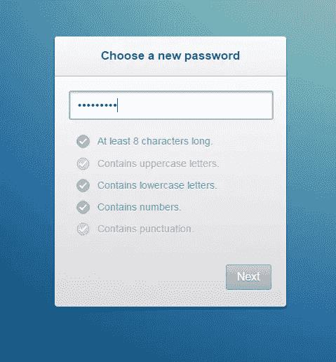
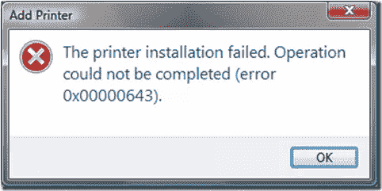
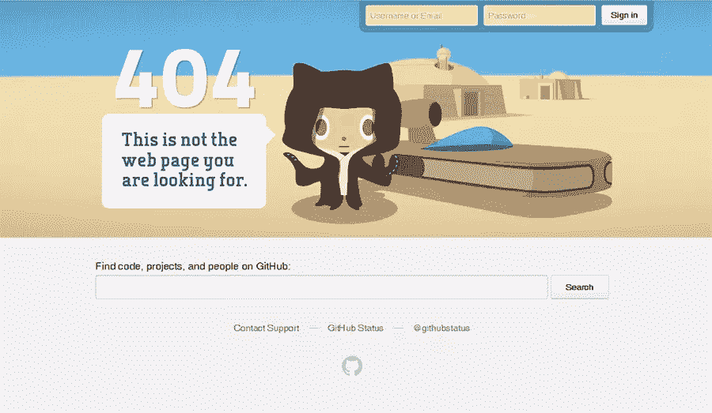
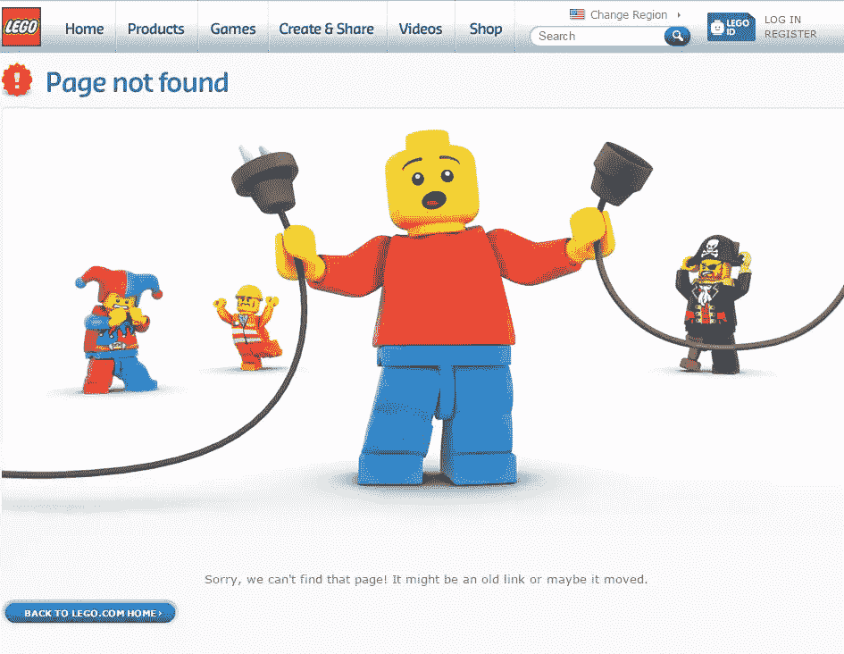

# 错误消息的 UX

> 原文：<https://www.sitepoint.com/error-message-ux/>

它们在网的波浪下滑行，沉默，凶猛，似乎只是在等待攻击的机会。它们有各种形状、大小和烦恼程度，它们几乎总是在你最意想不到的时候攻击你。

错误信息是数字世界的一部分，不管你喜不喜欢，每个人都曾经遇到过，从技术上受到挑战的家庭主妇到铁杆游戏玩家。

作为开发人员，我们可能比大多数人更经常见到他们。它们是不可避免的，但是我们向用户呈现这些错误的方式可能会产生积极的影响(嗯，正如所预期的那样积极)，也可能会产生明显的消极影响。

让我们来看看处理错误消息的方法，让它们传达意义并提供良好的用户体验。此外，我觉得值得注意的是，这里所有的例子都是不带偏见地挑选出来的。我选择它们只是因为它们阐明了一些观点。

## 防胜于治

在开始处理错误消息之前，最好先看看我们如何通过提前引导用户正确的方向来防止错误发生。

例如，新密码是这种方法的经典选择。上面的推文很有趣，但它提到了一个在许多情况下可以完全避免的问题:让用户在事后知道错误的密码。看到那条微博有多受关注了吗？这是一个标志，工业。

一个更好的方法是在用户点击提交之前*告知用户你的密码验证要求，或者如何设置一个好的密码。更好的是，在他们打字的时候教育他们。*

上面这个想法是由非常棒的保罗·刘易斯提出的，你可以在这里找到，这是一个实时反馈的例子。在这里，只要密码满足条件，每个勾就会被激活，这意味着用户永远不会收到烦人的错误消息。

如果您正在使用像 AngularJS 或 EmberJS 这样的数据绑定框架，这种即时反馈甚至不难实现，并且对良好的用户体验大有帮助。

## 援助之手

然而，当不可避免的事情发生时，重要的是要确保错误是有帮助的，并引导用户去他们可能想要去的地方。有点传奇色彩的尼尔森诺曼集团(Nielsen Norman Group)的唐诺曼(Don Norman)提倡在出现错误信息时采取协作方式，给用户提供如何完成任务的有用指导。

哇哦。如果我知道什么是“0x000000643 ”,这条错误消息就太好了，但是因为我既不是机器也不是编写这条错误消息的程序员，所以我不知道。你的用户也不会。

如果我遇到这个错误，我不知道如何继续。在这个过程中，我几乎停滞不前，没有人告诉我该如何继续。虽然这种错误对一些人来说可能显得过时和可笑，但在许多方面，它与我们今天在网上看到的没有太大区别。

这个错误给我的信息和前一个一样多，如果我不在 web 上工作，我就不知道它是什么意思。你的用户可能不在网上工作，他们肯定不知道这意味着什么。

那么我们如何给用户更多有意义的错误信息呢？

也许最好的方法是当用户遇到你的错误时，专注于他们真正想要完成的事情，然后帮助他们实现。Android styleguide 实际上提供了一种以这种方式处理错误的好方法。

“不要”一栏中的信息实际上没有什么技术上的错误；它确切地告诉你需要做什么来操作你的设备的 GPS，不管是多么模糊。

但是我很少特别想“手动操作我的 GPS”；右边的信息更好，因为它切中了问题的根本(你的 GPS 正在消耗你的电池寿命)，并通过指导用户找到精确清晰的解决方案来帮助用户。

同样，这里的想法是创造一个环境，不会因为实际上的“机器问题”而惩罚用户，记住机器进程的存在是为了满足人类的需求。作为人，我们不应该遵从机器做事的方式，而应该是相反的方式。

## 只是为了 Lulz

如果一个错误很常见，而且众所周知，那么还有另一种方法来处理它向用户的呈现:幽默。这种方法的应用非常罕见，最著名的例子可能是臭名昭著的 404 错误。

有很多好的 404 例子。Github 的页面特别好，因为它利用了这样一个事实，即绝大多数用户可能知道《星球大战》,因此确切知道这张图片指的是什么。

事实上，有许多公司使用 404 页面作为一种手段，通过向他们的用户展示有效和适当的信息来扩展他们的品牌声音，尽管 404 是一个计划外的，令人恼火的结果。

不过，请再次注意，几乎每一个 404 页面都包含帮助用户回到原来任务的信息，无论是方便的搜索栏还是一两个带你去适当地方的链接。

## 结论

防止错误发生总是最好的行动方案，但是当这不可能的时候，一个好的错误消息可能是一个返回的用户和一个不满的，甚至是愤怒的，打电话给你或你公司中某个可怜的灵魂的区别。

让你的错误信息变得有帮助、有协作性甚至有趣，可以帮助留住那个用户或客户，如果你幸运的话，甚至可以与你的网站或品牌建立更强的联系。

## 进一步阅读

*   [错误信息是邪恶的](http://www.jnd.org/dn.mss/error_messages_are_e.html)
*   [安卓风格指南](http://developer.android.com/design/style/writing.html)
*   [更好的密码表单字段](http://aerotwist.com/blog/better-password-form-fields/)

## 分享这篇文章