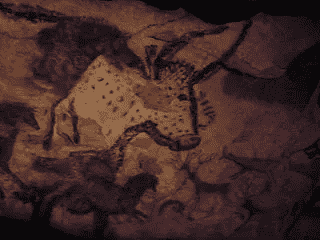
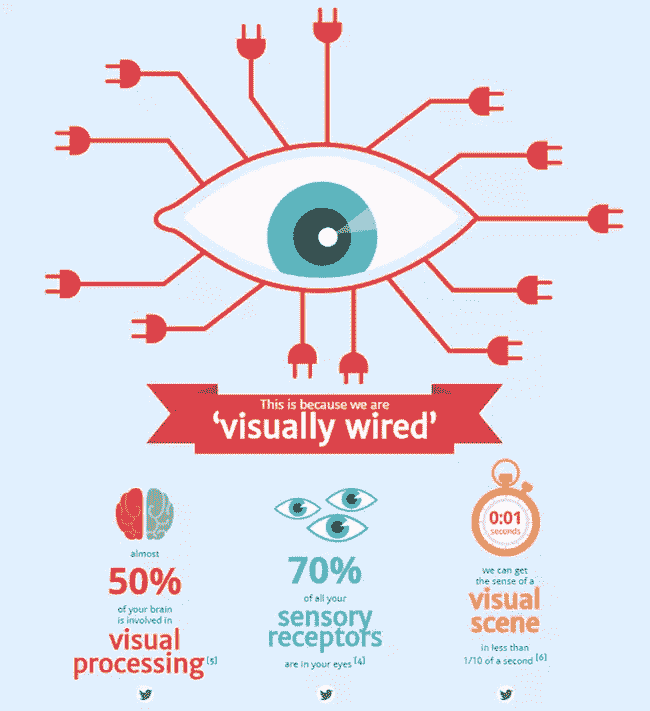
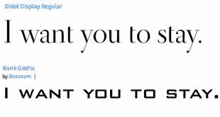
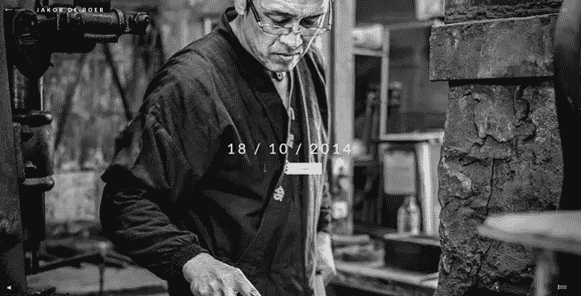
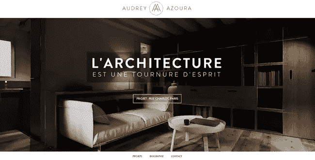
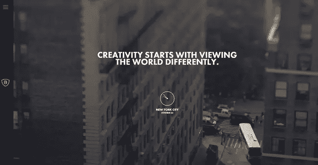
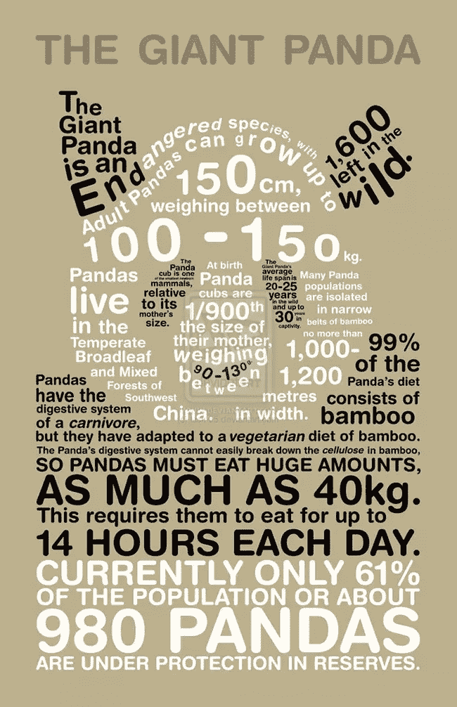

# 设计中图像和文字哪个更重要？

> 原文：<https://www.sitepoint.com/images-text-important/>

近年来，技术极大地改变了现代世界，尤其是改变了我们寻找和接收信息的方式。

人们只是没有那么多时间进行深入透彻的阅读，而我们的父母在一代人以前可能会这样做。我们大多数人都要处理许多输入来源——网络、电子邮件、twitter、短信和即时消息等等——所以我们自然倾向于任何可以在几秒钟内掌握的信息，如果不是即时掌握的话。

我们的大脑天生以视觉形式处理世界。这是我们“原生操作系统”的一部分。在至少 40，000 年的时间里，人类一直在借助图像、象形图和图形符号将信息从一个人传递给另一个人。

照片:goforchris

相比之下，文本信息是一个“小弟弟”。我们拥有的书面交流的第一个证据出现在公元前 2600 年左右的苏美尔——进化的眨眼之间。

小孩子从使用图画书开始他们的学习过程，并且更有可能接触到有图片的书，而不是文本厚重的书。甚至大一点的孩子(也包括许多成年人)通常只有在看过根据一本书改编的电影后，才会对它感兴趣。

## 为什么视觉效果如此吸引人？

人们普遍认为不在网上阅读。最近的一项研究表明，大多数用户在浏览了几行甚至一个标题后，就会签署和分享帖子。

所以，如果你深思熟虑的、啰嗦的脸书式咆哮获得了一批赞，不要假设你的部落真的会读它。代言可能更像是努力的击掌——尤其是如果你在那里有一个很酷的形象。

另一项最近的 Twitter 研究显示，带有照片和图像的推文比纯文本推文更吸引用户。这种趋势的关键原因是**图像直接表达了我们的情感**。图像直接进入我们的潜意识，不像文本符号需要经过“解码步骤”。

视觉元素的颜色、大小和形状会唤起各种各样的感觉——从温暖到愤怒到喜悦——甚至会促使我们参与某个品牌，分享某个帖子或购买某个产品。

 
鸣谢: [NeoMam 工作室](http://neomam.com/interactive/13reasons/ "Infographic Credit: NeoMam Studios")

另一部分解释是，视觉图像同时吸引我们大脑的左右两侧，同时激发我们的逻辑和想象力。事实上，信息图表越来越成功就是这一想法的明显证据。

## 文字呢？

很难想象一个没有文字的世界。它环绕着我们的道路，装饰着我们的建筑、公共汽车和书籍。一张照片可能胜过千言万语，但对我们每个人来说，千言万语可能都不一样。文字给我们的想法提供了一种精确性，这是我们很少单独用图像所能达到的。

文本在 SEO 中也扮演着核心角色，是我们唯一可以肯定地说搜索引擎完全理解的数据。

当然，这可能看起来像是摇尾巴狗的情况:当然不是我们应该为搜索引擎的需求服务，但反之亦然。事实是，我们也需要他们，这不会很快改变。事实是，互联网是一个很大的地方，如果没有你添加的有用标签和关键词，很少有人会找到你漂亮的照片或可爱的猫咪视频。

网页排版是纯文本和可视化重叠的领域。

明智的字体选择提高了文本的可读性，但也改变了传递信息的声音。将荣继敏的歌词“*我希望你留在[迪多特](http://www.myfonts.com/fonts/linotype/didot/)中*，这看起来像是一个发自内心的请求。在 [Bank Gothic](http://www.myfonts.com/fonts/bitstream/bank-gothic/) 中设置相同的文本，它会变成一个直接订单。

迪多特对哥特银行

此外，字体的颜色和大小增加了它的心理和情感影响。因此，印刷元素像图像一样吸引访问者的注意力，并携带文本提供的所有必要信息。

## 如何在网页设计中明智地使用文字和视觉

你的网站需要在文本内容和视觉内容之间取得适当的平衡。没有文字的精彩图片或视频不会给你的访问者提供什么有用的数据。另一方面，你可能会发现用大块纯文本很难吸引用户。

图像是网站的主要视觉吸引物，出现在标志、背景、滑动条等等。它们吸引用户阅读文本，说明文章和博客帖子中提供的信息，有时只是娱乐。

图像是引导眼睛浏览文本信息的完美方式。

 
[雅各布德](http://www.jakobdeboer.com/ "Jakob de Boer Website")

今天的一个大趋势是——大背景图片——在许多网站上被用作中心组织元素。那些经常从全尺寸背景照片中获得最大好处的人包括:

*   摄影师——向潜在客户展示他们最好的摄影作品；
*   **装饰和设计工作室**——展示他们最伟大的项目和产品；
*   **旅行社**–提供他们愿意去的地方的视觉信息。

 
[奥黛丽·阿古拉](http://www.audreyazoura.fr/ "Audrey Azoura Website")

今天，我们也经常看到用作网站背景的**视频**。它们通常用于吸引人们对网站内容的注意，并且通常为用户提供有趣的元素。

 
[比恩维尔资本管理](http://bienvillecapital.com/ "Bienville Capital Management Website")

信息图是网站所有者和互联网用户中最吸引人和最受欢迎的元素之一，它结合了文本和图像。

作为一种格式，它们已经从枯燥的技术图表发展成为信息丰富、功能强大、甚至有趣的故事讲述设备。这有助于为所有类型的用户简化事情。通常情况下，信息图表允许用户用有限的文本和大量引人注目的视觉效果来掌握复杂的想法和数据。

今天，即使是文字也可能以一种美丽而富有创造性的形象呈现出来。有了各种各样的酷字体和字型，你可以释放你的想象力。始终留意支持您的图像的独特排版解决方案。

 
信息图信用: [Lish-55](http://lish-55.deviantart.com/art/Panda-Infographic-142628025 "Infographic Credit: Lish-55")

只有一个限制需要考虑:用户体验！不要在正文中使用花哨或繁琐的字体。用户不会花力气去完成它，你的设计看起来会超负荷。为标题、副标题和其他设计元素保存非常规字体，用于**将用户吸引到内容**——而不是交付。

当谈到 UX，主要的事情是争取平衡！有时候，一个设计可能开始时过于强调文字，但又过于倾向于图像。没有这两个方面的和谐结合，它不会达到其目标。

## 分享这篇文章