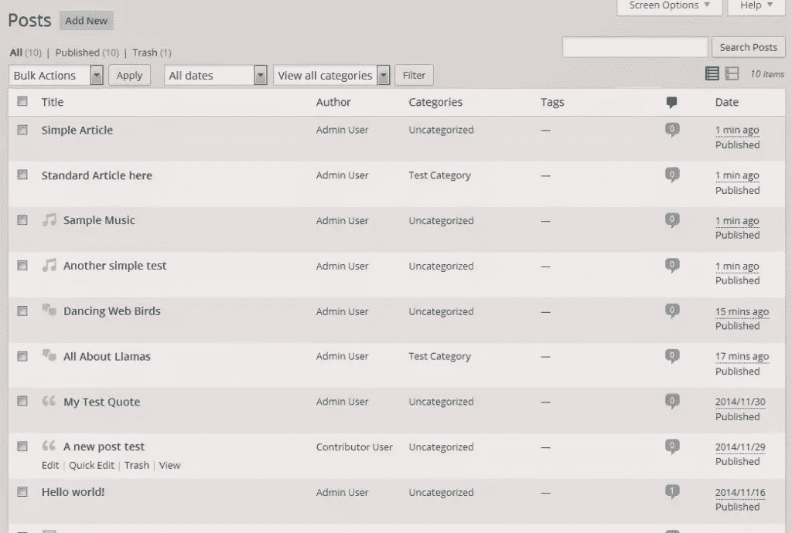
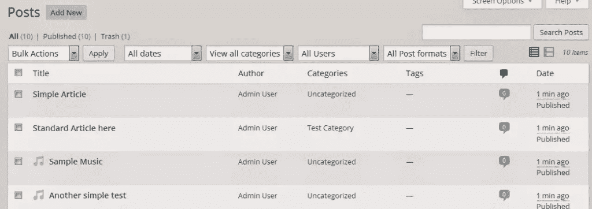

# 定制的 WordPress 管理过滤器

> 原文：<https://www.sitepoint.com/customized-wordpress-administration-filters/>

这篇文章将概述你需要知道的关于 WordPress 和它的过滤机制，你可以通过你的文章管理界面获得。

我们将详细说明 WordPress 过滤器是什么，以及它们在显示你的文章列表中的用途。从那里我们将学习如何扩展你的文章管理区域——通过创建新的定制的 WordPress 管理过滤器。

最后，您将能够将学到的知识应用到自己的项目中，从而为最终用户提供额外的信息和功能。

## 过滤帖子

WordPress 会将其默认的过滤机制输出到文章管理界面。这些过滤器允许您只显示符合设定标准的某些帖子。例如，您可能想要显示在设定的日期周期内发布的帖子(如下所示)。


WordPress 预配置了几个过滤器，你可以在你的文章管理界面上使用。某些主题和插件可能会添加额外的过滤器，并提供额外的过滤器供您使用。

总的来说，这些过滤器的目的是一样的，允许你根据一组标准缩小你的文章列表，只查看与给定标准相关的文章。

## 添加您自己的过滤器

虽然 WordPress 自带了一套很好的过滤器，但是你可能经常想要添加你自己的过滤器来帮助你的用户(或者你自己)在你的管理界面上缩小帖子的范围。

您可以通过使用两个挂钩向您的网站添加额外的过滤器

*   `restrict_manage_posts`
*   `pre_get_posts`

这两个挂钩结合在一起将允许你根据你选择的标准过滤你的文章，并且只返回符合那个标准的文章/条目。

在我们研究这些钩子之前，让我们先来讨论一个真实世界的例子(这样当我们开始构建过滤器时，你就可以看到它们是如何有用的)。

想象一下，我们正在建立一个自我管理的网站，每个`post`将被手动分配一个`post format`和自动分配一个`post author`

当我们在我们的文章的管理列表页面上时，它会向用户显示所有的文章，不管文章是什么格式或者作者是谁。这个屏幕可能会很乱，很难通读(并且经常需要翻阅记录页面来找到您需要的内容)



即使一篇文章会有作者姓名的链接，用户也可能会忽略这一点(以及显示的代表文章格式类型的小图标)。

更直观的做法是在每个管理列表屏幕的顶部添加下拉菜单，暗示您的帖子将被过滤。这就是我们在本教程中要做的。

### 使用“restrict_manage_posts”过滤器创建选择下拉列表

需要做的第一件事是为我们将要制作的两个附加过滤器创建选择下拉菜单。

你需要导航到你的子主题`functions.php`文件(或另一个适用的文件),并添加代码将这两个新的过滤器添加到你的文章管理屏幕。

#### 按作者过滤

```
//defining the filter that will be used to select posts by 'post formats'
function add_post_formats_filter_to_post_administration(){

    //execute only on the 'post' content type
    global $post_type;
    if($post_type == 'post'){

        $post_formats_args = array(
            'show_option_all'   => 'All Post formats',
            'orderby'           => 'NAME',
            'order'             => 'ASC',
            'name'              => 'post_format_admin_filter',
            'taxonomy'          => 'post_format'
        );

        //if we have a post format already selected, ensure that its value is set to be selected
        if(isset($_GET['post_format_admin_filter'])){
            $post_formats_args['selected'] = sanitize_text_field($_GET['post_format_admin_filter']);
        }

        wp_dropdown_categories($post_formats_args);

    }
}
add_action('restrict_manage_posts','add_post_formats_filter_to_post_administration');
```

让我们一步一步地看这段代码，这样你就能准确地理解我们在做什么。

*   我们创建一个函数，并将其附加到`restrict_manage_posts`动作上。这使我们能够访问帖子管理页面顶部显示的筛选区域。
*   我们通过全局`post_type`得到当前显示的文章类型列表。我们用这个来确定我们是否在正确的文章类型上(我们只想对文章执行这个，而不是页面或其他内容类型)。
*   我们打算调用`wp_dropdown_categories` WordPress 函数，该函数将基于一组标准生成所有帖子格式的下拉列表。帖子格式实际上只是 WordPress 的自定义分类法之一(很像类别或标签)，因此我们可以通过提供一个参数列表来使用这个功能。
    *   `show_option_all`–这决定了当我们不想过滤任何内容时将显示的名称(我们使用它，以便您可以显示“所有帖子格式”，并将看到您的所有帖子格式)。
    *   这是它的订购方式，我选择了按它的名字来订购。
    *   这决定了列表的排序方式，我选择了升序。
    *   `name`–这是下拉列表本身的名称。您需要给它一个惟一的名称，以便以后可以获取它所选择的值。
    *   `taxonomy`–(这很重要)这个值决定了哪些元素将被拉入列表。因为 post 格式只是一个分类法，我们可以指定它的分类法名称`post_format`，它将收集 post 格式术语。
*   在我们声明了`wp_dropdown_categories`函数的参数之后，我们搜索全局`$_GET`变量，看看我们是否真的已经选择了一个 post 格式类型来过滤。如果一个值存在，我们需要添加一个新的参数到我们的参数数组中，名为`selected`，它基本上告诉下拉列表默认应该选择哪个值。

#### 按作者过滤

```
//defining the filter that will be used so we can select posts by 'author'
function add_author_filter_to_posts_administration(){

    //execute only on the 'post' content type
    global $post_type;
    if($post_type == 'post'){

        //get a listing of all users that are 'author' or above
        $user_args = array(
            'show_option_all'   => 'All Users',
            'orderby'           => 'display_name',
            'order'             => 'ASC',
            'name'              => 'aurthor_admin_filter',
            'who'               => 'authors',
            'include_selected'  => true
        );

        //determine if we have selected a user to be filtered by already
        if(isset($_GET['aurthor_admin_filter'])){
            //set the selected value to the value of the author
            $user_args['selected'] = (int)sanitize_text_field($_GET['aurthor_admin_filter']);
        }

        //display the users as a drop down
        wp_dropdown_users($user_args);
    }

}
add_action('restrict_manage_posts','add_author_filter_to_posts_administration');
```

让我们一步一步地看这段代码，这样你就能准确地理解我们在做什么

*   我们创建一个函数，并将其附加到`restrict_manage_posts`动作上。这将使我们能够访问帖子管理屏幕顶部的过滤器。
*   我们使用全局`post_type`变量来检查我们当前是否在正确的文章管理屏幕上。我们只想在`posts`执行。
*   我们想使用`wp_dropdown_users`函数来生成网站上的用户列表。我们需要为它提供以下论据。

    *   `show_option_all`–这决定了选择列表的默认选项。在我们的例子中，我们希望它是“所有用户”，这意味着我们根本不想过滤任何东西。
    *   `orderby`–决定列表的排序方式。我选择只按作者的名字来排序。
    *   `order`–决定列表的排序顺序，我选择了升序。
    *   `name`–下拉列表的名称，稍后当我们需要获取所选的值以便过滤帖子时，将会用到它。
    *   `who`–决定谁将被选中。我们唯一可以设置的值是`authors`,它将获取所有可以创建帖子的用户。
    *   为了简单起见，我选择启用它。
*   在我们声明了`wp_dropdown_users`函数的参数之后，我们检查全局`$_GET`来查看我们是否设置了下拉值。如果设置了这个，意味着我们已经被一个用户过滤了，我们需要更新参数。我们将`selected`的值设置为作者的 ID，以确保在页面加载时默认选择作者。

在添加了这两个过滤器之后，你的文章管理界面应该会有一个额外的下拉列表。一个用于你的文章格式，另一个用于你的作者，如下所示



### 使用“pre_get_posts”过滤器过滤帖子

现在我们有了一个用户可以选择文章格式和/或作者的界面，我们需要根据这些下拉列表过滤文章列表。

我们将通过连接到`pre_get_posts`过滤器来实现这一点。

在 WordPress 执行之前,`pre_get_posts`过滤器可以访问当前的`query`,并允许我们修改从数据库中获取的文章。

总体想法是修改`query`，以限制哪些帖子将被纳入管理列表。对于帖子格式和作者来说，这样做略有不同，所以我在下面分解了每种方法

#### 过滤帖子格式

```
//restrict the posts by the chosen post format
function add_post_format_filter_to_posts($query){

    global $post_type, $pagenow;

    //if we are currently on the edit screen of the post type listings
    if($pagenow == 'edit.php' && $post_type == 'post'){
        if(isset($_GET['post_format_admin_filter'])){

            //get the desired post format
            $post_format = sanitize_text_field($_GET['post_format_admin_filter']);
            //if the post format is not 0 (which means all)
            if($post_format != 0){

                $query->query_vars['tax_query'] = array(
                    array(
                        'taxonomy'  => 'post_format',
                        'field'     => 'ID',
                        'terms'     => array($post_format)
                    )
                );

            }
        }
    }   
}
add_action('pre_get_posts','add_post_format_filter_to_posts');
```

让我们将这段代码分解，并仔细检查我们正在做的事情:

*   我们创建一个名为`add_post_format_filter_to_posts`的函数，并将它挂在`pre_get_posts`过滤器上。这个过滤器可以访问全局`query`变量，所以我们也把它传递给我们的函数，这样我们就可以操作它。这个变量是通过引用传递的，所以我们不需要返回或回显任何值，对查询的任何更改都将保留。
*   我们得到全局变量`post_type`和`page_now`，并检查`page_now`是否等于`edit.php`,`post_type`是否等于`post`。本质上，我们正在检查以确保我们在后管理屏幕上。
*   我们通过检查`$_GET`变量来确定是否选择了 post 格式。如果它已经被设置，我们收集它的值。
*   我们比较选择的值，以确保它不是我们的默认值 0(默认值意味着它希望显示所有帖子格式，这与不应用帖子格式过滤器完全相同)。只要我们选择了想要过滤的特定文章格式，我们就创建并修改`query`对象，这样我们就可以告诉它只选择与我们选择的文章格式相匹配的文章。某些职位。
*   我们修改了`query`并改变了它的`tax_query`元素，这样它就可以根据文章格式进行过滤。我们将`taxonomy`设置为`post_format`，将`fields`设置为`ID`，然后将`includes`设置为一个数组`$post_format`(包含我们想要过滤的值)。

一旦你有了这个代码，你就可以根据文章的格式来过滤你的文章。例如，您可能希望过滤您的帖子，只显示`quotes`或`chats`，如下所示:


#### 按作者过滤

```
//restrict the posts by an additional author filter
function add_author_filter_to_posts_query($query){

    global $post_type, $pagenow; 

    //if we are currently on the edit screen of the post type listings
    if($pagenow == 'edit.php' && $post_type == 'post'){

        if(isset($_GET['aurthor_admin_filter'])){

            //set the query variable for 'author' to the desired value
            $author_id = sanitize_text_field($_GET['aurthor_admin_filter']);

            //if the author is not 0 (meaning all)
            if($author_id != 0){
                $query->query_vars['author'] = $author_id;
            }

        }
    }
}

add_action('pre_get_posts','add_author_filter_to_posts_query');
```

让我们将这段代码分解，并仔细检查我们正在做的事情

*   我们创建一个名为`add_author_filter_to_posts_query`的函数，并将它挂在`pre_get_posts`过滤器上。这个过滤器可以访问全局`query`变量，所以我们也把它传递给我们的函数，这样我们就可以操作它。这个变量是通过引用传递的，所以我们不需要返回或回显任何值，对查询的任何更改都将保留。
*   我们得到全局变量`post_type`和`page_now`，并检查`page_now`是否等于`edit.php`,`post_type`是否等于`post`。本质上，我们正在检查以确保我们在后管理屏幕上。
*   我们通过检查`$_GET`变量来确定是否选择了 post 格式。如果它已经被设置，我们收集它的值。
*   我们检查以确保输入的值不是`0`，因为这是我们的默认值。值`0`代表下拉过滤器选项“所有作者”,这意味着我们的过滤器什么也不做。如果我们的值不是`0`，我们访问`query`中的`query_vas`，并将`author`的值设置为我们的 ID。一旦设置了这个，它将只拉属于那个作者 id 的文章。

一旦你有了这些代码，你就可以通过作者来过滤你的文章了。

在我的示例站点中，我有两个用户`admin user`和`contributor user`。我现在可以选择只查看选定作者的帖子，如下所示:


## 最后

现在你已经对 WordPress 管理过滤器有了更好的理解，你可以使用本教程并将其应用到你自己的项目中。

有许多已经提供的文章属性可供您筛选。在本教程中，我们看了按值`author`和分类法`post_format`过滤，但是你也可以很容易地按其他值过滤，比如在 [WordPress 查询类参考页面](https://codex.wordpress.org/Class_Reference/WP_Query)上列出的值。

## 分享这篇文章