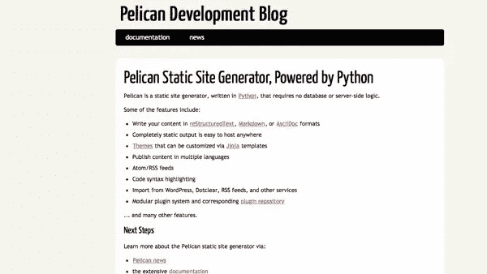
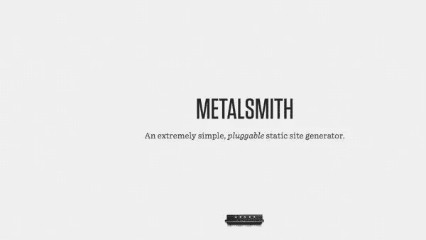

# 6 个非 Jekyll 的静态博客生成器

> 原文：<https://www.sitepoint.com/6-static-blog-generators-arent-jekyll/>

在之前的一篇文章中，我比较了世界上最流行的博客平台 WordPress 和另一种不太传统的博客方式——T2·杰基尔(Jekyll ),根据这种方式，你可以在本地文本文件中创建所有的内容，然后运行一个命令来生成你的博客的纯静态版本。Jekyll 有一系列的好处:

1.  你可以更好地控制你博客的方方面面。
2.  因为不涉及数据库，所以性能是无与伦比的。
3.  许多人发现在桌面上写博客更直观。

虽然 Jekyll 是目前最流行的静态博客生成器，也是我推荐给新手的，但有很多可供选择。

让我们来谈谈一些最有趣的替代方案。

## 1.[中间人](http://middlemanapp.com)

Jekyll 在每个版本中都变得越来越灵活，但其核心是鼓励博客作者遵循一套精确的约定。这是其用户友好性的一大部分，但有些人可能会发现它有局限性。

如果在玩了 Jekyll 之后，你发现自己希望它有 X 或 Y 的特性，看看《中间人》。它建立在相同的语言——Ruby——之上，但是开箱即用，更加灵活。

这里有几个喜欢《中间人》的理由:

1.  虽然有一个“博客”模块，但你并不局限于坚持博客的基本结构。你可以建立更复杂的网站。
2.  有很多优秀的插件可供使用，比如站点地图生成、图像优化、本地 gzipping 和各种部署解决方案。
3.  在主配置文件中可以找到令人难以置信的大量功能和灵活性。

但是由于中间人可以做更多的事情，与 Jekyll 相比，它也更难处理。这并不明显困难，但是你将不得不花费一些额外的时间和注意力来按照你的意愿操纵它。

## 2.[雨果](http://gohugo.io)

静态博客生成器中的一个常见问题是实际生成静态文件所花费的时间。因为动态博客是即时生成的，而静态博客是一次性生成的。对于一个小博客来说，这很好。然而，博客越大，就越令人沮丧。

一些生成器，比如 Middleman，提供增量生成。这将阻止每次都生成整个博客。相反，只会生成已更改的部分。(可惜哲基尔没有这个智能。)

如果你追求纯粹的性能，Hugo 是你最好的选择。就功能而言，它并不逊色，但它最大的吸引力在于它是用 Go——一种以速度著称的语言——构建的。如果我要开一个博客，有频繁的发布时间表和几千页的预期，我会选择 Hugo。

## 3.[己糖](http://hexo.io)

当我不为 SitePoint 写作的时候，我正在写一个关于 Meteor JavaScript 框架的博客，当我整理这个博客的时候，我决定保持一个一致的工具链会很好。如果我要用 JavaScript 写代码，写关于 JavaScript 的*，那么也许我应该用一个基于 JavaScript 的工具来创建我的博客？*

最终，基于 Ruby 的中间人生成器被证明是更好的选择，但是在基于 JavaScript 的选项中，Hexo 是一个强有力的竞争者。它相当快(虽然没有 Hugo 快)，是 JavaScript 爱好者的绝佳选择。

## 4.鹈鹕

我是一个 Ruby 爱好者，所以像 Jekyll 和 Middleman 这样的工具很吸引我。然而，如果你是一个 Python 爱好者，那么 Pelican 的形式很好地满足了你的偏好——这是用 Python 构建的最流行的静态博客生成器，也是第三流行的。

它具备所有标准功能:

*   基于降价的博客文章和页面的生成。
*   文章中代码片段的语法高亮显示。
*   自动创建 RSS 源。

但是由于我对 Jekyll 的偏爱，我推荐 Pelican 的唯一重要原因是为了那些已经使用 Python 开发的人。

## 5.[铁匠](http://metalsmith.io)

Metalsmith 无疑是这个列表中“最奇怪”的博客生成器，但我是在称赞他。这是其工作原理的基本概念:

1.  Metalsmith 本身的核心处理文件夹中的文件。
2.  各种插件用于定义如何操作这些文件。
3.  插件可以链接在一起产生不同的结果。

由于在没有大量例子的情况下解释起来有点棘手，所以浏览官方网站是“了解”这种方法有多酷的最佳方式。这不会是每个人都需要的，但肯定是聪明的。

## 6. [Octopress](https://github.com/imathis/octopress)

好吧，暗示 Octopress 和 Jekyll 是不同的有点虚伪。实际上，Octopress 是基于 Jekyll 的。开箱即用，它只是有一系列额外的功能和一个不同的默认主题。

就我个人而言，我更喜欢从零开始和香草哲基尔一起工作。那样的话，我的博客就不会有比它所需要的更多的东西了。如果你正在寻找一个快速启动的选项，Octopress 已经满足了你。

## 结论

显然，寻找静态博客生成器的人并不缺乏选择。这甚至也不是一个详尽的列表。还有几十个其他选项我没有提到。然而，这六个是我最感兴趣的，它们是一个很好的起点。尽管在评论中提出你自己的建议。我总是很好奇去玩其他软件。

## 分享这篇文章