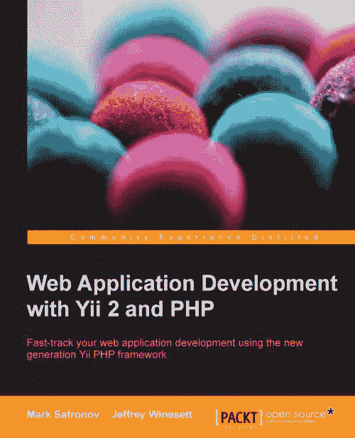

# 《用 Yii 2 开发 Web 应用程序》作者马克·萨夫罗诺夫访谈

> 原文：<https://www.sitepoint.com/interview-mark-safronov-author-web-app-development-yii-2/>

我和 Yii 一起工作并喜欢使用它，这已经不是什么秘密了。我是一个有点老派的人，不介意读一本书来开始。我喜欢他们通常给你逐步介绍你想获得知识的东西的方式。这是一种更微妙的开始方式，你不会立即淹没在大量的信息中。

几年前我在 Yii 1.1 上就是这样开始的。不幸的是，我把当时用的书[扔了一半。对我来说太慢了。反复检查简单的事情让我很快失去了兴趣。我想学得更多，更快。我脑子里有一大堆想法，我想知道如何实现它们。](https://www.packtpub.com/web-development/agile-web-application-development-yii11-and-php5)

我们已经走了几年，随着 Yii 2.0 的引入，在开始使用 Yii 2.0 进行一些严肃的工作之前，我让自己再次被一本书所诱惑。带着复杂的体验，我开始用 Yii 2 和 PHP 复制 [Web 应用程序开发，并以惊喜结束。](https://www.packtpub.com/web-development/web-application-development-yii-2-and-php)

## 内容

这个 2.0 版本的结构有点类似于上一个版本(这使得杰弗里·温塞特的名字出现在封面上)，但这一个完全是由马克·萨夫罗诺夫编写的。

有了一些使用 Yii 的经验，我开始寻找不同之处，并深入了解如何从零开始构建一个应用程序。

像往常一样，这本书通过一个示例应用程序并逐步扩展它来做到这一点。它从测试优先的方法开始。如果你对你的应用程序和长期维护它很认真，你可能会同意测试是一个重要的部分。幸运的是，这种方法放松得很快，不需要在每次添加新的东西时都拼写出如何定义测试。

这本书涵盖了框架的所有关键组成部分；渲染、认证、授权、模块、行为、扩展、事件、网格视图和路由管理。所有组件以及如何使用它们进行了审查。它还经常深入到框架的工作中，展示其中的逻辑并详细解释它们是如何工作的。

它不时带有一点幽默，使它非常容易阅读。

我又一次跳过了一些模块和行为部分，但更多的是因为我很想知道接下来的章节会发生什么。自从我完成这本书并开始我的第一个真正的 Yii 2.0 项目，我已经回到这本书几次。我发现了一些新的东西，并想起了一些很好的改进建议。对我来说，这足以证明它至少值得一读。

## 采访

带着对这本书相当好的感觉，我去联系马克·萨夫罗诺夫，询问关于这本书和 Yii 本身的一些问题。

### 你能告诉我们一些你的背景吗，你是谁？

没什么好吹嘘的。我是 Clevertech 的全职开发者，我是俄罗斯人，生活在一个马骑你的国家。

我每天都在做一个基于 Yii 1.1 的网站，并且已经做了两年多了。这个网站足够大和复杂，可以真正测试深入参与开发的任何人的系统构建技能，需求每天都在变化。所以我敢说自己对构建和维护真实的基于 Yii 的 Web 应用程序略知一二。

与此同时，我维护了开源软件 YiiBooster，并从头开始重写了 T2 项目 YiiBoilerplate。

我已经中毒 5 年了。我在一家俄罗斯网络工作室开始了我的职业生涯，该工作室基于令人生畏的 1C-Bitrix CMS 为其客户制作网站。你们西方人可能不知道 CMS-es 的这个弗兰肯斯坦，但我确实后悔知道它。

多年来，我改变了阅读科幻和奇幻小说的习惯，转而阅读硬核基础技术书籍，比如《有效处理遗留代码》、谷歌、DDD 等。事实证明，这本身更有趣，如果不是启发性的。

### 你最后是怎么写这本书的？

我曾合著过另一个书名《即时 Yii 1.1 应用开发入门》。当时，出版商失去了原作者(字面意思是失去，他给他们发了稿后他们就联系不上他了)，选择了我，因为他们已经有我作为那个书名的审稿人了。

所以，我们在这本书之前已经有过一些合作，他们可能认为我写得令人信服。

### 为什么是 Yii 2.0，因为框架的列表相当长？

首先，我别无选择；出版商给了我一本关于 Yii 的书。Yii 是我每天都要处理的框架。

此外，版本 2 是一个明显的下一步。我认为这是一个了解其内部错综复杂的机会。在我目前从事的一个项目中，钻研框架本身的源代码是一种常见的做法，因为你经常需要**绝对准确的**关于一个方法(像`CController.render()`或`CWebUser.login()`)如何工作的知识。

我需要在这里做一个重要的免责声明。我对 Yii 没有任何偏见。说实话，我其实很反感，但同时也忍了。我对这个框架没有任何依恋，只有严格的专业关系。这无疑影响了这本书的整体风格和它所涵盖的领域。

### 你觉得 Yii 1.1 的弱点是什么？

Yii 最重要的痛点过去是，现在仍然是服务定位器，顺便提一下，它是整个框架的中心习语。如果你习惯于在整个应用程序中处处坚持调用`Yii::$app`,那么我向你保证，当你的项目成长时，你将会经历重大的挫折。甚至更早，如果你尝试自动测试它。

Yii 2 试图通过内置 DI 容器来克服这个问题，但是在文档中几乎没有涉及到它，每个教程都假设你在任何地方都这么做。由于我巨大的思维惯性，我没有在书中涉及到`yii\di\Container`，我很遗憾。

第二个问题是它与类的紧密耦合。大多数时候，当你需要干预 Yii 内置的东西时，你需要*和*子类化你需要的东西*和*从超类中复制旧的行为。

Yii 2 这里有很多改进。但是尽管如此。尝试编写自定义的列类，该类在页脚中自动计算总计，而不复制粘贴列类的某些部分。

### `Yii::$app`的使用确实相当推广。为什么从长远来看使用它会伤害我们呢？

原因很简单:只要你的类中有一个`Yii::app()->something`调用，就不能孤立的测试；这将是集成测试，因为您需要包括 YiiBase 类，实际上，您的应用程序配置，自动加载程序，并且您还需要启动 Yii 应用程序，因为您需要连接和配置您的组件。

如果你不认为这是一种痛苦，好吧，但我个人认为，即使就运行时间而言，这也是一种完全失败的方法。Gary Bernhardt [说即使 100 毫秒的测试运行时间](https://www.destroyallsoftware.com/blog/2014/tdd-straw-men-and-rhetoric)也太多了，我通常更愿意听听他这种水平的人的意见。运行时间并不是这种紧密耦合的唯一问题。

### 那我们应该用什么呢？使用它会如何影响自动化测试？

依赖注入技术，特别是将应用程序对象图的创建和实际执行处理分开。据我所知，人们通过使用某种 IoC 容器来实现这一点，但是我没有使用它们的实际第一手经验，因为我日常工作的项目太遗留了，甚至不能尝试在那里使用这样的东西。

我已经在上面说过它是如何影响自动化测试的。简而言之，我们已经有德米特定律很多年了，坚持它实际上是可行的(对此我有第一手的经验),并导致解耦的、可维护的、可测试的设计。

### 你说 Yii 2“试图克服”这一点。这样表述意味着他们没有成功。

他们将通过完全抛弃`Yii` singleton 并让所有东西在`index.php`入口点中装饰性地构建自己来取得成功。通过这种方式，我们实际上会以 TDD 的方式与 Yii 一起工作。我敢说出我的个人观点:我每天都在阅读专业文献，试图赶上我在大学浪费时间时错过的所有社区知识，有时我认为真正关心已经解决的问题的人的比例极低；社区的大多数人只是以代码修复和写了就忘的方式编写代码，认为没有办法做得更好。我还没有看到埃里克·伊万斯在《DDD》中描述的技术真正在《T2》中实现过，我觉得这完全不可思议。我试着使用我在“用 Yii 2 开发 Web 应用程序”的过程中学到的东西，但是我认为我在这种方法上失败了，因为我在这方面的经验太少了。

### 既然你对 Yii 有相当多的经验，你对 2.0 版本中的变化有什么感觉？这对我们的工作方式有什么影响？

*   我对 Yii 2 框架的改进非常满意。有时候，这是一种生理上的愉悦。
*   他们使用名称空间，这很好，因为我现在有了名称空间接缝，并且可以在我的项目中拥有相同名称的类；
*   现在在关键的地方有了接口，比如 DataProviderInterface，这意味着我可以提供自己的实现，而不需要对整个巨大的 CComponent 进行子类化。
*   另一方面，它们从定制的`Object`类派生出所有的子类，但这个类实际上是一个很好的发明——它是带有自动`getSomething()`和`setSomething()`方法的 stdClass，可通过关联配置数组和一些其他功能进行配置。同时，这个类在它的构造函数中使用了对`Yii::configure()`的静态调用，这再次将依赖关系从里到外颠倒过来。
*   他们最终提取了一些实体作为独立的组件，比如响应和视图。Response 的概念是惊人的，因为我们终于可以以惯用的方式实现合理的 CSV 和 JSON 格式，而不用再疯狂地修改子类。
*   他们实际上在代码库中有一个依赖注入容器，所以我们最终可以希望通过代码库减少对`Yii::$app`的调用。

这正是我现在能回忆起来的。如果可以迁移，完全没有必要继续坚持 Yii 1.1。然而，我很确定*没有人*能够将现有的 Yii 1.1 应用程序迁移到 Yii 2，除非对大部分应用程序进行实质性的重写。

### 我注意到在整本书中，你多次提到 Yii 网站上关于某些主题的“优秀”文档。对书的研究有帮助吗？

老实说，我钦佩 Yii 中文档的数量和质量，不管我对它的总体感觉如何。作为一名开发人员，我使用的软件应该是我工作的基础，我通常需要关于最小细节的精确信息，例如，调用特定功能时需要遵循的合同。尤其是当我们远离编译语言的类型安全时。当我称赞它的文档时，我通常指的是它的*自文档*，它在代码中的文档块。

当我刚开始理解 OOP 的时候，Yii 1.1 对我来说非常难理解，但是随着时间的推移，所有的部分最终都到位了，我弄清楚了它的结构。Yii 2 在架构上没有太大的变化，所以很容易研究。

### 您对将您的代码与 ActiveRecord ORM 层分离做出了坚定的声明。你能告诉我们为什么我们想这么做吗？

其主要原因在于[物体-关系阻抗不匹配](http://c2.com/cgi/wiki?ObjectRelationalImpedanceMismatch)。有一次，我意识到我的逻辑域模型不适合单个表，因此，ActiveRecord 突然成了一个限制因素。更重要的是，在领域层中，填充到其中的整套特性是完全不必要的，因为实际的业务相关工作发生在领域层。此后不久，我了解了对象-关系阻抗不匹配、存储库模式、CQRS，并且完全相信 ORM 应该位于架构的最低层，甚至低于实际的数据访问层。

然而，这本书是关于 Yii，而不是一般的发展。我不能掩饰让人们直接从控制器中调用 ActiveRecords 的问题，所以我在第 2 章中展示了最简单的解耦方法。

### 当我读到“在网络覆盖的、基于 PHP 的世界里，没有习惯使用 XDebug 这样的工具来窥视单个变量，就像蓄着胡子的 C 程序员所做的那样”时，我笑了。我开始怀疑你是不是认真的。你根本不用调试器？

我承认，我阐述了我个人和我的团队的观点。可能有很多人经常使用 xdebug，它对他们很有帮助。我个人发现，当我能够编写自动化测试时，我根本不需要调试器，即使我不首先测试。我可以用调试器手动执行的任何数据流检查都可以在某种程度上编码为自动测试(理想情况下是单元测试),它既可以作为未来的回归测试，也可以作为其他人的文档示例。完全胜利。而且，当你在黑掉的时候，速度会更快。不过，也许我太笨了，不会用 xdebug:)

## 结论

在我们的谈话中，马克做了一个旁注，我想以此结束。

> …如果您仍然不确定是否需要迁移到 Yii 2，无论是从 Yii 1.1 还是从纯过程 PHP 还是从一些 CMS，那么我的回答是:如果您能够，那么就立即迁移。Yii 2 在整体质量和表现力上是一个巨大的飞跃。它建立在近几年来 PHP 社区出现的几乎所有好东西的基础上，你肯定不想错过它。

我要感谢 Mark 花时间回答我的问题，以及他对整个软件开发的见解。

## 分享这篇文章