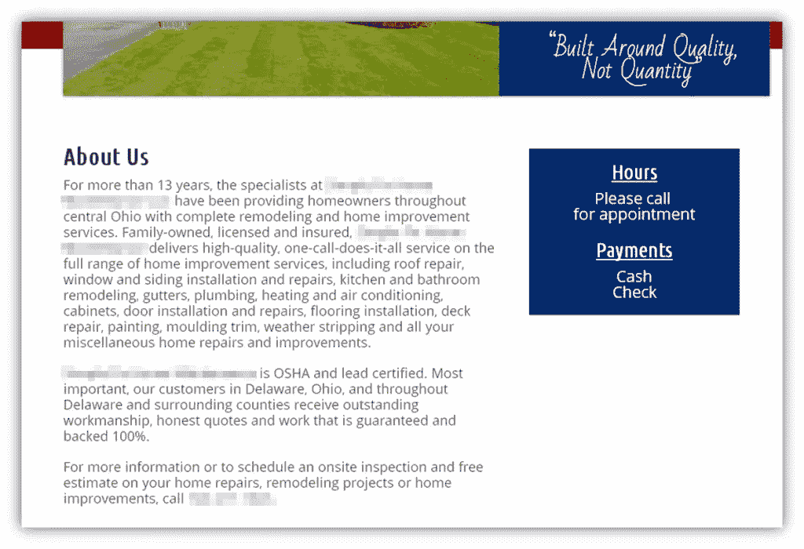
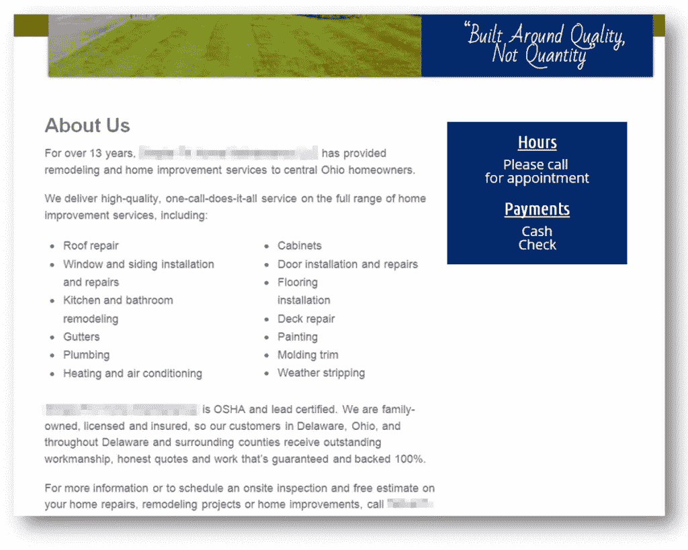

# 非作者的网络写作指南

> 原文：<https://www.sitepoint.com/non-writers-guide-writing-web/>

五个世纪前，古腾堡出版社让大众可以接触到书籍。15 年前，WordPress 和 Movable Type 等博客平台让任何拥有电脑的人都可以自助出版。

集客营销公司鼓励小企业主写博客，因为“这将使你的业务达到新的高度，并在今天的虚拟市场中取得成功。”这意味着水管工、屋顶工和办公室经理开始为他们的公司或组织的网站制作内容。

也许你就是其中之一。或者你是一个 WordPress 开发者，对你的客户发给你的拷贝感到畏缩。一个在键盘后面的业余爱好者经常和一个在照相机后面的业余爱好者一样可怕。但这并不意味着没有写作经验或培训的人不能成为一名优秀的网络作家。

## 先写，后编辑

写作时的编辑需要在你的创造性大脑和批判性大脑之间进行切换，所以你最终没有做好任何一项工作。

设置计时器可以防止这种情况。试试[番茄工作法](http://lifehacker.com/productivity-101-a-primer-to-the-pomodoro-technique-1598992730)。如果 25 分钟的写作强度太大，选择一个较短的增量。

## 标题和副标题

使用标题和副标题将你的内容分成易于管理的部分。这有助于网络读者浏览网页，找到他们想要的东西。

阅读标题的人是阅读正文的人的五倍，所以[让他们变得伟大](http://www.copyblogger.com/category/headlines/)很重要。一个写得好的标题能抓住你的读者的注意力，提醒他们接下来会发生什么。

### 将标题中的单词大写

不只是你说什么，而是你怎么说。标题中的所有主要单词都应该大写，除了:

*   [介词](https://www.englishclub.com/grammar/prepositions-list.htm) (in，of，to 等。)
*   冠词(the，a，an)
*   [连词](http://grammar.yourdictionary.com/parts-of-speech/conjunctions/conjunctions.html) (and，or，but 等。)

大写标题中的第一个和最后一个单词，即使它违反了上面的规则。标题资本化非常有助于解决网络写作中的这个棘手问题。

## 正文副本

### 帮助读者浏览

人们阅读网页和博客文章更像是读报纸而不是书。他们搜寻信息。让他们很容易找到他们想要的东西:

*   将 web 副本分成更短的段落
*   每段用一个想法
*   将段落限制在 3-5 个平均长度的句子内
*   避免复合句
*   为超过 2 或 3 个项目制作项目符号列表

这里有一个前后对比的例子。你更想读哪个？

### 使用交谈的语气

对话式的语气意味着和你的潜在客户交谈，而不是和他们交谈。记住，你是在对一个观众讲话。所以使用像“你”和“我们”这样的词

### 正面装入您的副本

把最重要的放在最前面，这种风格被称为“倒金字塔”风格。

#### 使用倒金字塔写作风格

传统上，当你写作时，你从一个“基础”开始，并以金字塔的风格逐渐建立一个结论。另一方面，记者使用倒金字塔风格。他们从结论开始，然后提供更多细节:

*   结论
*   支持信息
*   背景和技术细节

因此，如果我写一篇关于乘式割草机的评论，我可能会以“动力驱动的量子 15 马力发动机”开始，这是“市场上最快的割草机”，然后以“你可以用一半的时间修剪草坪”结束。

但是如果我在我的网站上卖割草机，我会这样设计我的副本:

*   用一半时间修剪你的草坪(结论)
*   市场上最快的割草机(支持信息)
*   动力驱动的量子 15 马力发动机(背景和技术细节)

从你的结论开始。这将有助于你更快地传达你的信息。

### 用主动语态写作

主动语态和被动语态的经典例子是用户在按下“发送”按钮后看到的默认联系形式回复:

> "你的信息已经发出，我们将很快回复."

那是被动语态。而“我们收到了你的信息，将很快回复你”是主动语态。这听起来更像你在真实对话中说的话，不是吗？

主动语态是当句子的主语做出动作时——“狗咬了那个男孩。”受试者(狗)正在执行动作(咬)。被动语态则相反:“这个男孩被狗咬了。”

在被动情况下，主语(男孩)被*作用于*。用主动语态写的句子更短、更中肯，这有助于加强你的文案。被动语态缺乏清晰和简洁。这就引出了我的下一个观点。

### 抓住要点

用较短的单词和短语替换较长的单词和短语，例如:“尽管事实上露西…”替换为“尽管露西。”和“露西有可能……”与“露西可能。”

下面是另一个前后对比的例子:

**在**之前

尽管事实上有很多在线资源可以帮助你学习写作，但你可能就是不会掌握其中的窍门。如果你觉得网络写作太难，雇佣一个专业的文案是很重要的。这将让你有机会将更多的网站访问者转化为客户。

之后

 **虽然有很多在线资源可以帮助你学习写作，但你可能就是不知道其中的窍门。如果你觉得网络写作太难，请一个专业的文案。结果你会将更多的网站访问者转化为顾客。

### 避免使用副词

像被动语态一样，过度使用副词会削弱你的文案。

虽然不可能(或者没有必要)完全消除它们，但是寻找机会用更强的动词替换弱的动词/副词组合。

*   “巨大的”而不是“非常大的”
*   “大喊大叫”而不是“大声说话”
*   “暴跳如雷”而不是“愤然离去”
*   “紧紧地抓住”而不是“紧紧地抓住”
*   “怒视”而不是“严厉地盯着”

### 避免使用你的读者无法理解的行话或技术术语

当您向非技术客户销售技术解决方案时，这是一个挑战。“我们提供搜索引擎优化服务”对你我来说可能非常有意义。但是你的典型客户知道这意味着什么吗？

你可以通过陈述最终结果来克服这一点，比如“我们帮助你在谷歌、雅虎和必应上被找到。”如果你必须使用一个技术术语，用一种解释它的意思的方式，例如，“我们的搜索引擎优化服务帮助你在谷歌、雅虎和必应上找到，因此你得到更多的线索和销售结果。”

### 设定编辑标准

因为我为我们的公司网站写内容，我必须决定我们是卖“网站”还是“网址”,以及你是应该“给我们发电子邮件”还是“给我们发电子邮件”来得到一个。

只要保持一致，使用哪种格式并不重要。

接下来的三点可能不属于编辑标准的范畴。然而，它们是我最讨厌的:

*   不要全用大写字母，因为这听起来像是你在大喊大叫
*   句号后用一个空格，而不是两个(这是电脑，不是打字机)
*   强调一个观点时，使用长破折号(—)而不是两个破折号(-)——就像这样！

**提示:**在 WordPress ( -)中使用三个破折号会产生 em 破折号(尽管它在编辑器中仍然是三个破折号)。

### 测试可读性

完成后，在[海明威编辑器](http://www.hemingwayapp.com/)中检查可读性:

目标是 10 年级或以下的阅读水平。根据它的建议，我可以从 21 年级拿到 10 年级的原版。

### 大声朗读你的稿子

大声朗读你写的东西是编辑你的文稿和测试其可读性的一种方式。你会注意到当一个句子不流畅的时候，因为当你大声读出来的时候你会畏缩。

咻！这看起来似乎是一个很高的要求。但是一旦你写了几篇文章，它就成了你的第二天性。

## 这并不总是关于你的

自从第一份销售文案问世以来，情况一直如此。如果你不知道[功能、好处和购买动机](http://www.johntabita.com/%E2%80%9Cit-works%E2%80%9D/)之间的区别，并且在读完这篇文章后你仍然没有完全的信心独自去做，你可能需要看看[雇佣专业文案的好处](http://www.haineslocalsearch.com/why-you-need-a-professional-to-write-your-website-copy/)。

## 蜘蛛、爬虫、机器人——天啊！

但是等等！人类不是你写作的唯一对象。搜索引擎发出自动程序在网上爬行，搜索要添加到数据库中的内容。他们的发现有助于确定你在搜索结果中的排名。

知道如何组织你的网页内容，让这些机器人吃掉它是我的同伴文章的主题，[非作家的搜索引擎写作指南](https://www.sitepoint.com/non-writers-guide-writing-search-engines)。

## 分享这篇文章**