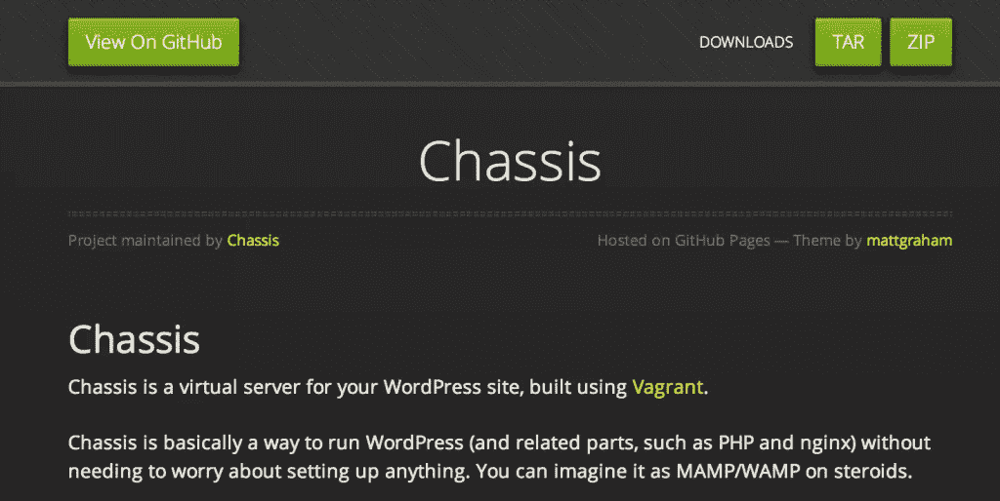
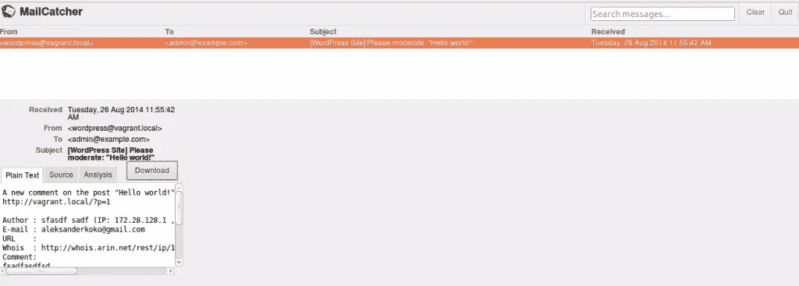

# 使用机箱进行 WordPress 开发

> 原文：<https://www.sitepoint.com/using-chassis-for-wordpress-development/>

当我写第一篇关于 WordPress 和流浪者的文章时，我介绍了 VVV。VVV 是一个开发 WordPress 主题和贡献核心的流浪配置。然而，一个共同的问题是，许多人被 VVV 淹没了。尤其是那些刚开始流浪的人，他们只是想得到一些简单的东西并快速运行。还有很多其他的流浪配置，WordPress 圈子里最好用也最受欢迎的一个就是[机箱](https://github.com/Chassis/Chassis)。

Chassis 是一个简单的流浪配置，在 WordPress 插件和主题开发者中很流行。它很容易开始并用于每个项目的开发。在这篇文章中，我将带你设置机箱。文件夹结构有点不同，所以我们也将深入讨论。机箱配置具有层次结构，因此了解其工作原理也很重要。我们将讨论的最后一个主题是通过添加包含更多功能的插件来扩展机箱。

## 为什么要用机箱？

有人选择使用 Chassis 进行 WordPress 开发有几个原因。首先，底盘重量轻。相比之下，VVV 相当重，因为它配备了各种各样的工具。VVV 的问题是它可能需要很长时间来安装，而且速度很慢。相比之下，安装机箱只需几分钟。

机箱重量非常轻，仅附带:

*   WordPress 4.0
*   PHP 5.4(包括 cURL 和 GD 扩展)
*   Nginx
*   关系型数据库

phpMyAdmin 在哪里？您可能想要安装的其他任何东西，比如 phpMyAdmin，都是以扩展的形式提供的。Memcache 也可用，Xdebug 即将推出。

安装很容易，机箱文档对此做了很好的介绍。你需要安装最新版本的流浪者和 VirtualBox。但是，机箱需要额外的工具来与网络配合工作。你可以选择 Bonjour 或 Avahi。如果你在 Mac 上，那么你已经预装了 Bonjour。如果你用的是 Windows，你可以通过 iTunes 安装 Bonjour。如果您使用 Linux，那么您必须通过执行以下命令来安装 Avahi:

[shell]
sudo apt-get install avahi-dnsconfd
[/shell]

## 安装底盘

您可以从 GitHub repo 获得机箱的副本，只需执行:

[shell]
git 克隆 http://github.com/Chassis/Chassis.git 机箱
cd 机箱
git 子模块更新–初始化
[/shell]

命令`git submodule update --init`确保你下载每个子模块。

## 安装增压器

Chassis 的一个很好的特性是 WordPress 和开发目录的分离。默认情况下，包含主题、插件和上传文件夹的文件夹是内容文件夹。第一次克隆存储库时，没有内容文件夹。WordPress 文件夹名为`wp`，但是没有内容文件夹。您可以开始自己创建文件夹并构建结构。底盘背后的团队在 GitHub 上有一个预定义的内容文件夹(名为“Supercharger”)。 [Supercharger](https://github.com/Chassis/Supercharger) 附带了一些插件，比如 WordPress SEO、WordPress Importer、限制登录尝试和重新生成缩略图插件。

[shell]
git 克隆 https://github.com/Chassis/Supercharger.git 内容
cd 内容
git 子模块更新–初始化
[/shell]

要启动并运行，您只需要`vagrant up`，所有东西都会安装好。默认情况下，机箱使用“precise64”框。第一次你`vagrant up`这个项目的时候，如果没有其他的流浪者配置使用过它，这个盒子就会被下载。为此，导航到项目的根目录，然后执行:

[贝壳]
流浪起来
[/贝壳]

等待安装完成。您现在已经有了一个可以使用的环境。一切都是预先配置的，不需要著名的 5 分钟配置。安装完成后，在您的浏览器中访问`http://vagrant.local/`,看看它是否工作。你应该看到一个现成的 WordPress 站点，跳过安装过程。

您可能已经注意到，安装后有两个新文件。`local-config-db.php`文件和`local-config-extensions.php`文件。不要编辑这些文件。它们是使用`config.yaml`配置生成的。如果你想编辑这些文件，你需要编辑`config.yaml`，然后使用`vagrant provision`进行设置。

## 文件夹结构和配置层次结构

机箱将 WordPress 文件夹与内容文件夹分开。默认情况下，机箱会禁用自动更新，因此您必须手动安装任何更新。将文件夹分开是一个好的决定。使用这个单独的内容文件夹并不意味着你不能使用`wp-content`文件夹，但是最好还是坚持使用`content`文件夹。

`config.yaml`有等级制度。在内容文件夹中，`config.local.yaml`的优先级高于`config.yaml`。默认情况下，这些配置文件不附带增压器。您可以从项目的根文件夹中复制现有文件。项目根文件夹中的`config.yaml`和`config.local.yaml`优先级最低。`config.local.yaml`在特定文件夹中始终具有最高优先级。

当你开始一个新的文件夹时，你在根文件夹中只有一个`config.yaml`。这是最低优先级。在该文件中，您可以配置 PHP 版本(默认为 5.4)、WordPress 目录(默认为/wp)、数据库配置和 WordPress 凭证。

让我们做一点实验。首先打开`vagrant.local/phpinfo.php`看看你用的是什么版本的 PHP。默认情况下，您从 5.4 开始。将`config.yaml`复制到内容文件夹中。编辑 PHP 版本，设置为 5.5。执行`vagrant provision`，设置后再次导航至`vagrant.local/phpinfo.php`。

从内容文件夹中复制`config.yaml`，并将刚刚创建的副本重命名为`config.local.yaml`。再次，再次编辑 PHP 版本为 5.4。执行`vagrant provision`并在你的浏览器中测试它。

在管理配置中尝试同样的事情。在`config.local.yaml`上将密码编辑为“the password”。再次执行`vagrant provision`并在仪表板上测试使用该密码登录。密码错了。为什么会这样呢？您不能通过设置更改密码或管理员凭据。然而，如果你再次点击`vagrant destroy`和`vagrant up`，你会看到管理员的密码现在是“the password”。

小心这种配置。尝试将本地配置与部署配置分开。

## 机箱插件

机箱支持扩展，我将涵盖几个流行的。

从名称和图标可以看出，这是一个捕捉发送给它的电子邮件并将其显示在网络界面上的工具。这个工具用于测试目的，当你不想把电子邮件发送到一个真正的电子邮件提供商，但你也需要看看它是否工作。使用机箱安装这个工具很容易，所以你不必担心配置任何东西。

[shell]
cd 扩展
git 克隆 https://github.com/Chassis/mailcatcher.git 邮件捕捉器
cd 邮件捕捉器
git 子模块更新–初始化
cd../..
流浪条款
[/shell]

将机箱上的邮件捕捉器存储库复制到`extensions`文件夹，然后复制到`vagrant provision`。现在去给帖子添加评论吧。导航到`http://vagrant.local:1080/`，你会看到邮件捕捉器已经“捕捉”到了邮件。

phpMyAdmin
我不认为这个工具需要任何介绍。这是处理数据库时最流行的工具之一。就像 MailCatcher 一样，这个扩展不需要您进行任何配置。安装类似于 MailCatcher。

[shell]
cd 扩展
git 克隆 https://github.com/Chassis/phpMyAdmin.git phpmyadmin
CD..
流浪条款
[/贝壳]

现在导航到`vagrant.local/phpmyadmin`，您会看到不需要登录。

当你用 WordPress 开发一个网站时，你并不确定网站会获得多少流量。高流量是一件好事，但是你有没有想过如何处理它？您的服务器可能会因为大量的请求而崩溃，或者在最好的情况下，您的站点会变得很慢。这就是缓存的用武之地。这是维基百科对 Memcached 的定义:

> Memcached 是一个通用的分布式内存缓存系统。它通常用于通过在 RAM 中缓存数据和对象来加速动态数据库驱动的网站，以减少必须读取外部数据源(如数据库或 API)的次数。

Memcache 扩展正确地安装了 Memcached，你可以阅读文档来了解如何使用这个扩展。

## 结论

使用流浪者和机箱是 WordPress 开发最容易使用和最快的环境之一。通过将 WordPress 的安装从工作文件夹中分离出来，它有一个很好的工作流程。它也很简单，但在扩展方面却很强大。

## 分享这篇文章