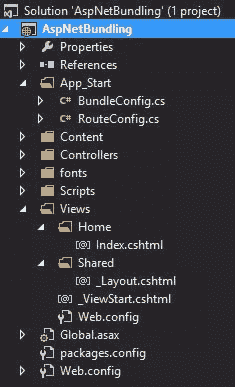
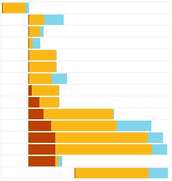
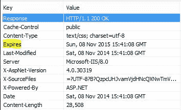

# ASP.NET 的捆绑销售

> 原文：<https://www.sitepoint.com/bundling-asp-net/>

ASP.NET 是一个技术栈，在提高生产力方面赢得了声誉。随着 ASP.NET 4.5 的发布，堆栈已经通过添加 web 资源的自动捆绑扩展了范围，使其工作起来更加容易和灵活。

在这篇文章中，我想了解一下 ASP.NET 的捆绑销售。我将探索在任何 ASP.NET 项目中设置捆绑的无缝性。

在 ASP.NET 4.5 中，框架获得了一个新的名称空间`System.Web.Optimization`。让我们看看这是如何工作的。

## 设置

对于本教程，我从一个空的 ASP.NET MVC 项目开始。这样，我就可以专注于如何设置自动捆绑。相同的基本步骤也适用于 WebForms。在本教程中，我将使用 Razor 和 C#。

点击新项目的提示后，在 NuGet 包管理器控制台中添加这些包:

```
PM> Install-Package Microsoft.AspNet.Mvc
PM> Install-Package jQuery
PM> Install-Package Bootstrap
PM> Install-Package Microsoft.AspNet.Optimization 
```

我想让你关注一下名为`Microsoft.AspNet.Optimization`的 NuGet 包。如果您正在处理一个现有的 ASP.NET 项目，这个 NuGet 包会让您的工作变得简单。安装好后，你所要做的就是安装其余的管道。

有了 web 优化框架，您就有了自动化管理 web 资源的工具。你可以在 MSDN 找到官方文件。

现在，在您的主解决方案中添加一个名为`App_Start`的文件夹，如果您还没有的话。我们需要通过添加这个静态类来设置绑定。

```
public class BundleConfig
{
    public static void RegisterBundles(BundleCollection bundles)
    {
    }
} 
```

路由是与任何现有项目一起设置的，所以我不会将它包括在本教程中。

为了让 ASP.NET 框架了解我们新配置的包，在`Global.asax`中这样做:

```
public class Global : HttpApplication
{
    protected void Application_Start(object sender, EventArgs e)
    {
        BundleConfig.RegisterBundles(BundleTable.Bundles);
    }
} 
```

ASP.NET 是一个事件驱动的框架。可以想象，IIS 服务器处于空闲状态，等待事件的发生。在这种情况下，它将是通过 HTTP 的客户端浏览器请求。当你的应用程序第一次启动时，ASP.NET 在`Global.asax`中调用`Application_Start`。在`Application_Start`内部，您可以进入并设置您希望在应用程序中使用的特定包。

最后，我的解决方案是这样建立的:



## 注意交通

是时候添加包了，看看它是如何在浏览器中运行的。将这个添加到上面指定的静态类 I 的`BundleConfig`:

```
public class BundleConfig
{
    public static void RegisterBundles(BundleCollection bundles)
    {
        bundles.Add(new StyleBundle("~/bundle/bootstrap-styles")
            .Include("~/Content/bootstrap.css")
            .Include("~/Content/bootstrap-theme.css")
            .Include("~/Content/Site.css"));
        bundles.Add(new StyleBundle("~/bundle/Home/Index-styles")
            .Include("~/Content/StyleSheet1.css")
            .Include("~/Content/StyleSheet2.css")
            .Include("~/Content/StyleSheet3.css"));

        bundles.Add(new ScriptBundle("~/bundle/bootstrap-scripts")
            .Include("~/Scripts/bootstrap.js")
            .Include("~/Scripts/jquery-{version}.js")
            .Include("~/Scripts/modernizr-{version}.js"));
        bundles.Add(new ScriptBundle("~/bundle/Home/Index-scripts")
            .Include("~/Scripts/JavaScript1.js")
            .Include("~/Scripts/JavaScript2.js")
            .Include("~/Scripts/JavaScript3.js"));
    }
} 
```

您的具体需求会有所不同。上面的方法接受一个`BundleCollection`作为参数。注意，这是来自`Global.asax`的`BundleTable.Bundles`。然后，我制作风格和脚本包来满足我的特定需求。

我使用`{version}`通配符告诉捆绑引擎获取我的解决方案中的任何版本的 jQuery。在发布配置中，jQuery `.min.js`被添加到包中，但不是在调试中。在使用 jQuery 时，这给了我开发环境的灵活性。我可以换出不同版本的 jQuery，我的捆绑设置不会在意。同样的通配符技术也适用于任何其他客户端库。

因为我可以创建自己的包，所以我可以为特定的屏幕定制我需要的资源。

我将`~/bundle/bootstrap-styles`和`~/bundle/bootstrap-scripts`包放在了`_Layout.cshtml`主页中。因为它包含了很多引导程序，所以我将在本教程中省略它。

下面是我的`Index.cshtml` Razor 页面的样子:

```
@{
    ViewBag.Title = "Index";
}

@Styles.Render("~/bundle/Home/Index-styles")
<h2>Hello World</h2>
<p>
    Be sure to check out glyphs like these:
    <span class="glyphicon glyphicon-plus"></span>.
</p>
@Scripts.Render("~/bundle/Home/Index-scripts") 
```

简单。一旦定义了包，我就可以把它们放在应用程序中任何我需要的地方。我遵循一个简单的惯例`{Controller}/{Action}`来定义包。你也可以这样做。

如果你发现你得到 Razor 页面错误是因为它找不到`Styles.Render`或者`Scripts.Render`。请确保将它包含在您的`Views`文件夹中的`Web.config`中。

```
<system.web.webPages.razor>
  ...
  <pages pageBaseType="System.Web.Mvc.WebViewPage">
    <namespaces>
      ...
      <add namespace="System.Web.Optimization"/>
    </namespaces>
  </pages>
  </system.web.webPages.razor>
</system.web.webPages.razor> 
```

这告诉 Razor 引擎在呈现动态 HTML 时包含`System.Web.Optimization`名称空间。您还可以包含特定项目所需的任何其他名称空间。这将使你不必完全限定每个剃刀扩展。

有了这些，我们来看看网络流量:



红色表示浏览器闲置。黄色表示浏览器发出请求所需的时间。蓝色表示从服务器获得响应所需的时间。在大多数现代浏览器中，每个域一次可以处理大约六个请求。如果你需要六个以上，浏览器会等待。最上面的请求是我必须从服务器获取的动态 HTML。

## 为什么这很重要？

打个比方，你可以把你的后端 C#编程语言想象成一艘宇宙飞船。当你旅行时，你获得了速度和时间扭曲的能力。只要您的后端在您的服务器上本地运行，您就可以假定它是高性能的。但是，当请求管道到达 HTTP 时，情况就完全不同了。

我想把 HTTP 网络协议想象成一辆骡车。无论你在后端做了多少优化，你都可以相信 HTTP 很慢。所以，就像骡车一样，在把它运过城镇之前，最好装上足够的食物。一次又一次地往返服务器肯定会降低性能。

HTTP 请求是昂贵的。您的主要目标是减少通过 HTTP 的往返次数。

## 使能够

要在框架中打开捆绑，您需要做的就是更改解决方案文件夹中的`Web.config`。

```
<compilation debug="false" targetFramework="4.5" /> 
```

您也可以用以下代码对其进行硬编码:

```
BundleTable.EnableOptimizations = true; 
```

当你用 C#对它进行硬编码时，它优先于`Web.config`。在一个典型的设置中，您可以使用一个`Web.config`转换来使它处于发布模式。没有必要尝试调试精简的 JavaScript 代码。

让我们来看看捆绑的流量:


太美了。动态 HTML 一加载，资源就开始加载。这里，我充分利用了浏览器的功能，因为我正好有六个资源。请注意，最后一个资源直到所有其他资源都被渲染后才开始。这是因为它是一种 web 字体，并且它源于 CSS 包。

## 贮藏

当绑定打开时，一个额外的好处是资源可以在浏览器中缓存大约一年。如果您的资源在此之前发生了变化，附加到末尾的查询字符串也会发生变化。实际上，这将终止浏览器不再需要的任何资源。这通常被称为缓存破坏。

例如，这是我们捆绑的资源的样子:

```
/bundle/bootstrap-styles?v=epi1k_G4Tsd0o4dXIOJcBg5gefY7ieCSx0AUDxqm78U1
/bundle/Home/Index-styles?v=uxFDb5XiuKadZOyd2DKyzUU-mh3OUTNuikUDUlL7e_Q1
/bundle/Home/Index-scripts?v=Giv511fvuZRlJKLjJDPqmIxOhmtht9zFlW7lvvTMf0Y1
/bundle/bootstrap-scripts?v=j4YIBwFVDdtvOMWp63GzkWLSoYrcw0ertU_njZLALnk1 
```

附加在末尾的查询字符串是每个包的特定内容的散列。当包中的内容改变时，作为查询字符串附加的散列也会改变。

您可以检查 HTTP 头。



HTTP 头被设置为一年后到期。

## 结论

ASP.NET 是一项很酷的技术，旨在让你的生活变得轻松。我最喜欢的是引擎如何为您呈现`<link>`和`<style>`标签。我一直觉得最困扰的是这些标签是如何到处出现的。使管理网络资源成为一场噩梦。

我希望您能看到将自动捆绑添加到您的项目中是多么无缝。对于演示基本技术的简单演示，请务必查看 [GitHub](https://github.com/beautifulcoder/AspNetBundling) 。

你是如何找到 ASP 的？NET 的捆绑特性？有什么提高性能的小技巧吗？

## 分享这篇文章