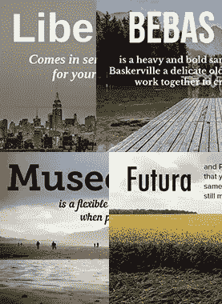
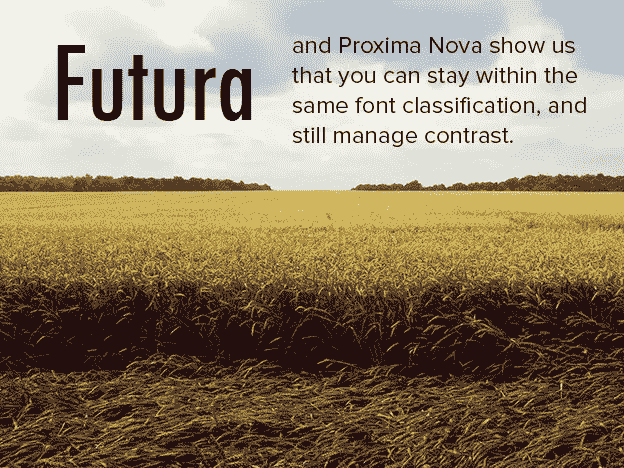
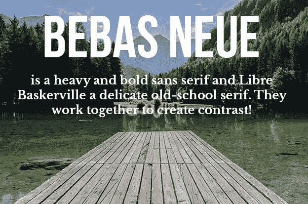
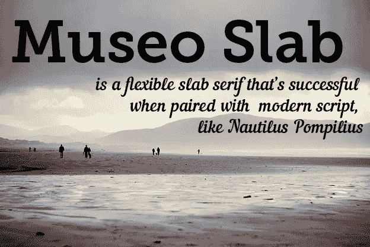
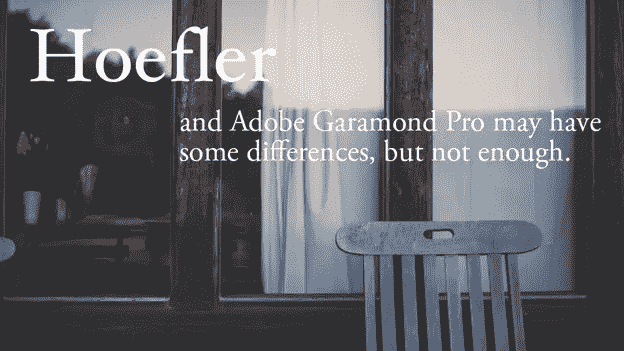

# 完美字体配对的 3 个原则

> 原文：<https://www.sitepoint.com/3-principles-for-perfect-typeface-pairing/>

令人惊叹的字体数量不断增长——每天都有新的字体出现。很容易分心，随意选择自己喜欢的字体在工作中使用。更难的是，如果你想在设计领域取得成功，你需要掌握有效搭配字体的艺术。

当您处理配对字体时，有三种类型的字体关系需要指导您完成配对过程:

*   **一致性:**你设计上的所有字体都是相似的，通常用来指在一页上使用多种字体中的一种字样。
*   对比:两种或两种以上不同但配合良好的字体。
*   冲突:两种字体太相似，无法工作。

设计者的主要经验是努力实现和谐或对比的字体，但避免冲突的字体。下面，我们将把这三个概念分解成一组容易遵循的规则，用来挑选要配对的字体。

### 一致

这是最简单的字体配对方式，因为你所需要的是一种不同风格的优秀字体。

*[解放](http://www.fontsquirrel.com/fonts/list/find_fonts?q%5Bterm%5D=liberation&q%5Bsearch_check%5D=Y)是一个得心应手的超家族(图片由马修·维贝通过 [Unsplash](https://unsplash.imgix.net/45/PlEgx5PSoiiJOmnE2izQ_NYC%20skyline%20empire-1.jpg?q=75&fm=jpg&auto=format&s=dab03948f63dc37a6cc405bf9d6a6d72) )*

从选择字体超家族开始。超家族是一种有多种变体的字体，属于不同的风格类别。有成千上万种类型的分类，但最常见的是它们被分成四类，在这四类之下还有无穷尽的子类:

*   **Serif:** [Garamond](http://garamond.org/) ， [Minion Pro](https://typekit.com/fonts/minion-pro) ， [Chaparral](http://www.fonts.com/font/adobe/chaparral)
    *   子类:旧风格，现代，平板等。
*   **无衬线字体:** [富兰克林哥特](http://www.fonts.com/font/linotype/franklin-gothic)**Helvetica[比邻星新星](https://typekit.com/fonts/proxima-nova)

    *   子类:怪诞，人文主义等。** 
***   **剧本:** [龙虾](https://typekit.com/fonts/lobster)，[年轻巴洛克](http://www.fonts.com/font/itc/young-baroque)，[西北风](http://www.fonts.com/font/linotype/mistral)*   **装饰:** [红木](http://www.fonts.com/font/adobe/rosewood)，[神话 STD](https://typekit.com/fonts/mythos-std) ，[样板](http://www.fonts.com/font/aerotype/boilerplate)**

 **一个常见的超家族包含有衬线和无衬线两种格式的字体。一个著名的例子是 Lucida 字体。它包括黑体(哥特式)、手写、无衬线、打字机和书法(脚本)版本，都属于同一家族。

因为这些字体被设计成适合同一系列，所以它们共享有助于它们很好地一起工作的关键特征，这使得这成为在设计中配对字体的最简单的方法。

使用 concordance 的关键是你应该尝试一下！它不仅仅是一个衬线和一个无衬线配对。尝试一个粗体和一个斜体，部分大写和部分小写，不同的大小。周围有数不清的超级家庭，其中一些很棒的包括[博物馆](http://www.fonts.com/search/all-fonts?searchtext=museo&SearchIn=all-fonts#product_top)、[水果商](http://www.fonts.com/search/all-fonts?searchtext=fruitiger&SearchIn=all-fonts#product_top)和[罗蒂斯](http://www.fonts.com/search/all-fonts?searchtext=rotis&SearchIn=all-fonts#product_164445)。

### 对比

这是一种更困难的配对字体的方法，但通常是一种更新颖、更成功的方法，可以使您的字体使用独特。关键是找到不同的类型，但仍然有足够的共同点，可以一起工作。即使你们的字体完全不同，如果它们有一两个相同的属性，就能决定配对的成败:

*   **X-height 和字形宽度:** X-height 是小写字母底部和顶部之间的高度，如“X”或“a”，字形宽度是字符的宽度。
*   **粗细:**有些字体线条很细，有些很粗——前者是轻的，后者是重的。
*   **字形:**看看十种不同字体的“o”。它们都有完全相同的尺寸吗？不——它们中的一些都是圆形的，许多更像椭圆形而不是圆形。有的又长又瘦，有的又矮又蹲。字体有几十种不同的形状，看看上升部分和下降部分(例如，在“d”或“p”中上下延伸的部分)，或者字母“n”的肩部
*   **轴的方向:**通过每个字母画一条假想的线，像轴穿过地心一样。不同的字体在它们的轴上有不同的角度，这对字体的外观有很大的影响。

记住——这些只是字体之间相互关联的一小部分方式。还有很多呢！关于排版术语的更多细节，请查看 Alex 的帖子[排版速成班:了解你的术语](http://99designs.com/designer-blog/2012/05/08/crash-course-in-typography-know-your-terms/)。

查看一些成功对比的例子:

仅仅因为衬线字体和无衬线字体可以很好地搭配，并不意味着它们不能单独使用。最完美的例子是 [Futura](http://www.linotype.com/472/futura-family.html) 和 [Proxima Nova](https://typekit.com/fonts/proxima-nova) ，他们都缺少衬线，但没有字符的重量或形状(图片由 Cornelia Büchse 通过 [Unsplash](https://unsplash.imgix.net/35/Ov8Hg5LlQriTimkB3PEl_kreativgrund_Weizenfeld.jpg?q=75&fm=jpg&auto=format&s=a402133bd45c5cb65037a5cbb82e7061) 提供)。

*[Bebas Neue](https://typekit.com/fonts/bebas-neue) 是粗体全大写无衬线，而 [Libre Baskerville](https://www.google.com/fonts/specimen/Libre+Baskerville) 是过渡衬线。虽然他们肯定没有共同的 x 高度、体重或角色形状，但他们确实有相似的轴方向。所以它们形成了对比，但这很有效(图片由 Ales Krivec 通过 [Unsplash](https://unsplash.imgix.net/44/HsQM7Jd2Qlysfyk9SgvX_logarska-valley-5.jpg?q=75&fm=jpg&auto=format&s=3dfa9a13b6fdf5b9b0bbb46eac4b6546) 拍摄)。*

他们都有很多独特的性格，但是尽管他们有[的博物馆平板](http://www.fonts.com/font/exljbris/museo-slab?QueryFontType=Web&src=GoogleWebFonts)和[的鹦鹉螺·庞皮利乌斯](http://nautilustype.com/)设法让彼此发挥作用，分享足够相似的重量以保持有趣的平衡(图片由 Ruxandra Mateiu 通过 [Unsplash](https://unsplash.imgix.net/43/ZICikSG3ThGy1i2JCnYP_4.jpg?q=75&fm=jpg&auto=format&s=ac1a36522c59761a3626b67116ade2a7) )

### 冲突的

虽然你确实希望你的文本有一些相似之处，但有一点你可能做得太过分了。没有足够的差异允许字体一起工作，造成了尴尬的冲突。

*Hoefler 和 Adobe Garamond 本身都是漂亮的文本，但有如此多的相似之处使得它们在字体搭配方面不兼容(图片由 Logan Adermatt 提供，via [Unsplash](https://unsplash.imgix.net/32/9FybtVFNSEOxogGzIvHJ_IMG_2226.jpg?q=75&fm=jpg&auto=format&s=313347b9e0086af21b8c71523cc5d621) )*

避免冲突的方法:

*   注意字体的类别:将两种衬线或字体放在一起玩很有趣，但这是一个很难涉足的领域。确保您选择的字体彼此之间足够不同，以避免冲突。
*   **维护层次:**注意，在我们所有的例子中，我们使用大小和粗细来帮助区分字体。层次是关键——所以确保你的字体选择反映了设计中文本不同部分的相对重要性。
*   使用颜色:在我们的例子中，我们没有使用彩色文本，但是很多时候你会把你的文本放在一个简单的彩色背景上，而不是图像上。因此，利用颜色来帮助区分不同的文本片段，创造层次。

## 额外提示

虽然没有一个规则来源列出了设计师应该做什么和不应该做什么来成为结对类型(因为规则本来就是要被打破的)，但有一些指导方针是设计师经常遵循的。

1.  通常建议在任何一个设计中不要使用超过三种字体，通常最好使用一到两种。当你为某个特定的目的选择一种字体时，就要全力以赴。你的标题、副标题和正文应该在整个项目中保持一致。
2.  注意上下文。配对并不总是以同样的方式适用于每一种风格的设计。网页设计从根本上不同于印刷设计，所以当你选择字体时，一定要记住上下文。另外，你作品的基调也要体现在文字上。因此，如果你有一个儿童生日派对的设计，确保文本看起来不像是公司简报。
3.  网上有大量资源可以帮助你找到合适的字体:
    *   [**谷歌字体**](https://www.google.com/fonts/specimen/Oswald#pairings) 显示你选择的每种字体的配对。
    *   [**Just My Type**](http://justmytype.co/) 是来自 [Typekit](http://typekit.com/) 和 [Hoefler & Co](http://typography.com/) 的类型配对集合。
    *   **[字体连接](http://www.typeconnection.com/)** 是一款教你如何配对字体的游戏。
    *   Typography.com 为您选择的每种字体提供建议配对。

*本文最初发表于 [99designs 设计师博客](http://99designs.com/designer-blog/)。经许可转载。*** 

## **分享这篇文章**