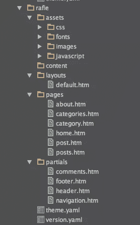
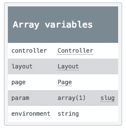
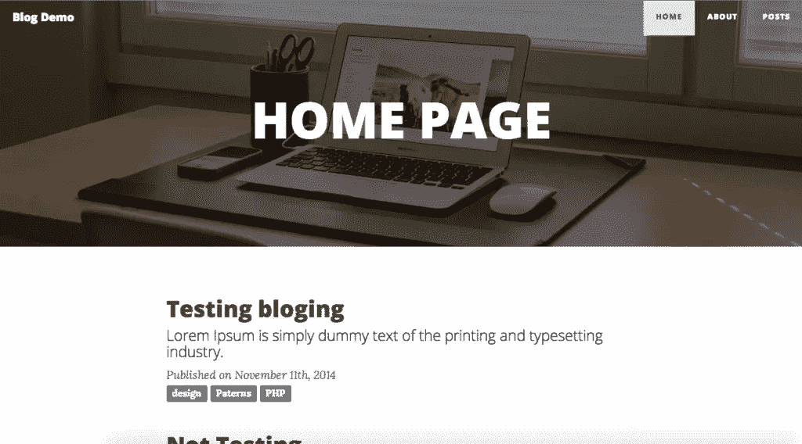
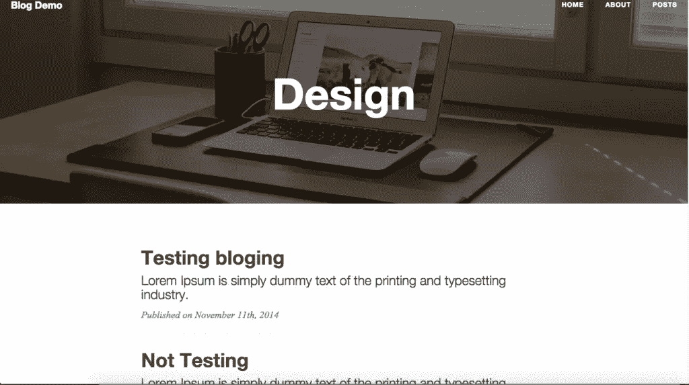

# 如何构建 OctoberCMS 主题

> 原文：<https://www.sitepoint.com/build-octobercms-theme/>

十月 CMS 是 CMS 天空中的新星。它建立在 Laravel 之上，承诺快乐的编码和回归基础的方法。点击这里阅读我们的介绍[，点击这里](https://www.sitepoint.com/introducing-octobercms-laravel-based-cms/)了解如何为它构建插件[。在这篇文章中，我们将看到如何建立一个主题。](https://www.sitepoint.com/building-octobercms-plugins-google-analytics/)


## 我们要建造什么

我们将建立一个博客主题。主题将取决于 [rainlab 博客插件](https://octobercms.com/plugin/rainlab-blog)，并将包含:

*   默认页面布局
*   关于页面
*   主页
*   帖子页面
*   类别页面
*   单篇文章页面

这些是博客网站的主要部分。在本文结束时，您将能够创建自己的页面，并用新功能扩展主题。

这篇文章中提到的全部源代码都可以在 [Github](https://github.com/sitepoint-examples/rafietheme) 上获得，所以如果你在另一个标签中打开 repo，并按照我们详细解释每个文件，你会做得最好。

## 构建主题

OctoberCMS 将主题存储在`themes`目录中，当访问后端主题接口时，它们会被自动加载。

为了加快这个过程，我将使用 startbootstrap.com 的一个免费主题。

### OctoberCMS 主题文件夹结构



截图显示了我们主题的最终结构。文件夹结构不太复杂——阅读[文档](https://octobercms.com/docs/cms/themes#introduction)了解更多信息。

### 安装必要的插件

因为我们将构建一个博客主题，我们将安装 [rainlab 博客插件](https://octobercms.com/plugin/rainlab-blog)，它提供了一些我们可以使用的组件。如果你不熟悉组件，一定要看看我之前写的关于[构建 OctoberCMS 插件](/build-octobercms-widget-plugin/)的文章。

### 搭建我们的主题

要开始构建我们的主题，我们只需要用我们唯一的名字创建一个文件夹。我会叫我的`rafietheme`。如果你访问`/backend/cms/themes`，你会看到新的主题已经被添加到列表中。

目前，主题没有描述或名称，十月只使用我们的文件夹名称。

我们的根主题目录中的`theme.yaml`文件将包含关于我们主题的信息。

```
// rafietheme/theme.yaml

name: RAFIETHEME
author: RAFIE Younes
authorUrl: http://younesrafie.com
description: Simple blogging theme
```

如果你访问主题管理界面，你会看到我们的主题有一个新的描述和作者信息。现在我们将添加一个占位符截图。OctoberCMS 默认会在`rafietheme/asseimg/theme-preview.png`中寻找截图。

文件讲述了你的主题的版本故事，因为这只是我们的第一个版本，我们可以添加:

```
1.0.1: First version
```

### 模板结构

十月模板页面分为三个部分。每个部分用`==`与其他部分分开。

#### 结构节

这部分是我们向 CMS 描述模板的地方。我们可以指定页面的 url、标题等。

```
url = "/posts"
title = "Latest Posts"
description = "Just another posts page"
layout = "default"
```

我们也可以使用初始化组件，并配置它们。更多信息请见[文档](https://octobercms.com/docs/cms/themes#configuration-section)。

#### PHP 部分

这个部分将被包装在一个缓存类中，所以如果你愿意，我们只允许使用函数或`use`关键字。

您会经常看到这里使用的`onStart`方法。这个方法是自动运行的，因为它是页面生命周期的一部分。检查可用函数的[列表，以及一些全局变量(`layout`、`page`、`component`)。](https://octobercms.com/docs/cms/layouts#layout-life-cycle)

#### 标记部分

十月在用的是 [Symfony 的 Twig](http://twig.sensiolabs.org/documentation) 模板引擎，继承了所有核心特性。从 PHP 部分传递的变量在视图中是可用的。`this`变量包含关于我们的`page`、`controller`、`layout`、`environment`和`params`的信息。



### 使用占位符

占位符是将内容注入页面的一种方式。例如，它们可以用作注入脚本的方法之一。

```
// defining the placeholder
...
	
	</body>
</html>
```

这里我们定义了一个占位符。在关闭 body 标签之前，我们给用户注入一些脚本的机会，就像这样:

```

	<script src="js/slider.min.js"></script>

```

占位符还有其他特性，比如注入默认内容，或者测试占位符是否存在。请务必查看[文档](https://octobercms.com/docs//cms/layouts#placeholders)以获取更多示例。

### 使用偏旁

分部对于分离我们的页面部分非常有用，`header`，`footer`等等。正如我们之前所说，它们存储在`partials`目录中，可以使用子目录进行嵌套。

```
|---- partials/
|-- header.htm
|-- footer.htm
|-- navigation.htm
|-- comments.htm
|-- ajax/
|- posts.htm
```

*   `header.htm`:包含文档类型和头定义，还有一些资产链接。
*   `footer.htm`:将包含一些版权文本和关闭文档，还有一些 JavaScript 资源。
*   将只包含我们的导航菜单。
*   `comments.htm`:因为我们只打算使用 [Disqus](https://disqus.com) ，所以让我们把它放在它自己的分部中。

```
// partials/header.htm

<!DOCTYPE html>
<html lang="en">
<head>
    <title>{{ this.page.title }}</title>
	
    <link href="{{ [
            'assets/css/bootstrap.min.css',
            'assets/css/clean-blog.min.css'
        ]|theme }}" rel="stylesheet">

</head>
<body>
```

在每个部分或页面中，我们可以访问包含`page`、`layout`、`controller`、`param`和`environment`变量的`this`变量，如[文档](https://octobercms.com/docs/cms/markup#default-variables)中所述。

当加载资产时，我们将一组链接传递给组合文件并生成缓存链接的`theme`过滤器。

标签允许插件开发者将他们的资产注入页面，同样的事情也适用于标签。

要将资产注入页面，有两种方法:

*   在页面的 PHP 代码部分使用`onStart`函数:

    ```
    function onStart(){
    	    $this->addCss('assets/css/main.css');
    	    $this->addJs('assets/js/app.js');
    	}
    ```

*   使用组件占位符:

    ```
    
    	    <script type="text/javascript" src="{{ ['assets/js/app.js']|theme }}"></script>
    	
    ```

```
// partials/footer.htm

<script src="{{ [
    '@jquery'
    'assets/javascript/bootstrap.min.js',
    'assets/javascript/clean-blog.min.js']|theme }}"></script>

</body>
</html>
```

你已经注意到我们添加了`@jquery`而不是文件路径！
这仅仅意味着我们想要使用后端可用的 jQuery 文件。这些符号被称为[别名](https://octobercms.com/docs/cms/markup#combiner-aliases)。

```
<ul class="nav navbar-nav navbar-right">
	<li class="active ">
	    <a href="{{ 'home'|page }}">Home</a>
	</li>
	<li class="active ">
	    <a href="{{ 'about'|page }}">About</a>
	</li>
	<li class="active ">
	    <a href="{{ 'posts'|page }}">Posts</a>
	</li>
</ul>
```

我们之前说过,`page`对象可以在任何页面或部分页面中使用。我们使用`page.id`来设置活动菜单项，对于链接的`href`属性，我们将页面 ID 传递给`page`过滤器，过滤器将生成一个完整的 URL。请注意，页面 id 是模板文件名。

### 使用布局

十月有一个布局文件夹，我们可以在那里注册我们的布局。我们将从一个用于页面的`default`布局开始。

```
description = "Default Layout"
==




```

在配置部分，我们可以为我们的布局指定一个描述。在 twig 标记部分中，我们包含了必要的部分。`page`标签将使用这种布局输出页面内容。

我们可以使用大部分的部分和页面特性，还包括 HTML 标记、资产等。

### 创建页面

OctoberCMS 将用户定义的页面存储在`pages`文件夹中。让我们首先从创建我们的 about 页面开始，我们将一路探索不同的可能性。

#### 关于页面

因为这是我们的第一页，我们将尽可能使它简单，第一部分是使用配置部分。

```
title = "About"
url = "/about"
layout = "default"
description = "Just another about page"
```

模板部分将在一个容器中只包含一些 Lorem ipsum HTML 内容。

```
<div class="container">
	Lorem ipsum.....
</div>
```

就是这样！你可以点击博客前端的`/about` URL 来访问新页面。


#### 主页



在我们的配置部分中，我们将页面映射到一个 URL，并使用特定的布局，以及标题和描述。

```
title = "HOME PAGE"
url = "/"
layout = "default"
description = "Blog Home Page"
```

在 PHP 部分，我们使用`onStart`方法来设置页面变量。该方法在所有组件初始化后执行。

```
<?php
use RainLab\Blog\Models\Post;

function onStart(){
    $this['posts'] = Post::isPublished()
					    ->orderBy('published_at', 'desc')
					    ->take(5)
					    ->with('categories')
					    ->get();
}
?>
```

rainlab 插件提供了一组模型，我们可以用它们来查询数据库。我们只从数据库中取出最近发表的五篇文章，并将其设置为一个全局变量。

```
<div class="col-lg-8 col-lg-offset-2 col-md-10 col-md-offset-1">
    
        <div class="post-preview">
            <a href="{{ 'post'|page({slug: post.slug}) }}">
                <h2 class="post-title">
                    {{ post.title }}
                </h2>
                <h3 class="post-subtitle">
                    {{ post.excerpt }}
                </h3>
            </a>
            <span class="post-meta">Published on {{ post.published_at|date("F jS, Y") }}</span> <br/>
            
                <a href="{{ 'category'|page({slug: category.slug }) }}">
                    <span class="label label-primary">{{ category.name }}</span>
                </a>
            
        </div>
        <hr>
        
        <h2>No posts found.</h2>
    

    <ul class="pager">
        <li class="next">
            <a href="{{ 'posts'|page }}">Older Posts &rarr;</a>
        </li>
    </ul>
</div>
```

到了视图部分，我们循环遍历帖子列表，我们也循环遍历附加类别列表，当用户点击一个帖子时，我们应该将他重定向到单个帖子页面。

`page`过滤器生成一个给定页面的 URL，但是您也可以传递一些要包含的 URL 参数。查看[文档](http://octobercms.com/docs/cms/markup#page-filter)了解更多信息。

#### 单篇文章页面

```
title = "Blog Post"
url = "/post/:slug"
layout = "default"
description = "Single post page"
```

与主页的唯一区别是 URL 部分。`slug`参数是数据库中的 slug。如果我们想更加明确，我们可以使用正则表达式来匹配我们的规则。

```
url = "/post/:slug|^[a-zA-Z0-9]$"
```

您可以查看[文档](https://octobercms.com/docs/cms/pages#url-syntax)以获得关于 URL 语法和正则表达式使用的更多信息。

```
<?php
use RainLab\Blog\Models\Post;

function onStart(){
    $slug = $this->param('slug');
    $this['post'] = Post::where('slug', '=', $slug)
                            ->isPublished()
                            ->with('categories')
                            ->first();
    if( !$this['post'] )
        return Redirect::to('/404');
}
?>
```

在我们的 PHP 部分中，我们使用`slug`参数查看数据库中的帖子。如果这个帖子不存在，我们就重定向到我们的 404 页面。

```
<header class="intro-header" style="
            
                background-image: url('{{ "/asseimg/post-sample-image.jpg"|theme }}')
            
                background-image: url('{{ post.featured_images.first().getPath() }}')
            ">
    <div class="container">
        <div class="row">
            <div class="col-lg-8 col-lg-offset-2 col-md-10 col-md-offset-1">
                <div class="post-heading">
                    <h1>{{ post.title }}</h1>
                    <span class="meta">Published on {{ post.published_at|date("F jS, Y") }}</span><br/>
                    
                    <a href="{{ 'category'|page({slug: category.slug }) }}">
                        <span class="label label-primary">{{ category.name }}</span>
                    </a>
                    
                </div>
            </div>
        </div>
    </div>
</header>

<article>
    <div class="container">
        <div class="row">
            <div class="col-lg-8 col-lg-offset-2 col-md-10 col-md-offset-1">
                {{ post.content|raw }}
            </div>
        </div>
        <div class="row">
            <hr/>
            <div class="col-lg-8 col-lg-offset-2 col-md-10 col-md-offset-1">
                
            </div>
        </div>
    </div>
</article>
```

我们测试博客是否有任何特色文章。如果是，我们获取第一个，否则我们显示一个默认的特色图片。之后，我们打印标题、日期、类别，并在输出之前对内容进行转义。

标签将加载我们的评论。目前，它只是输出`<h2>Comments</h2>`，但是如果你愿意，你可以使用 Disqus。

#### 类别文章页面



我们页面的配置部分基本相同。

```
title = "Category"
url = "/category/:slug"
layout = "default"
description = "Filter posts by category"
```

```
use RainLab\Blog\Models\Post;
use RainLab\Blog\Models\Category;

function onStart(){
    $slug = $this->param('slug');

    $this['category'] = Category::where('slug', '=', $slug)->first();

    if( $this['category'] ){
        $post = new Post;
        $query = $post->isPublished()
                    ->orderBy('published_at', 'desc')
                    ->with('categories');
        $this['posts'] = $post->scopeFilterCategories($query, [ $this['category']->id ])->get();
    }
}
```

在 PHP 部分，我们测试该类别是否存在。如果是，我们查询数据库寻找匹配的帖子。

我打算在数据透视表的`posts`和`categories`之间使用一个 join，但是 rainlab 博客插件提供了一个`RainLab\Blog\Models@scopeFilterCategories`方法，使用一个类别 id 数组过滤文章:它接受一个`Illuminate\Query\Builder`作为第一个参数和一个类别 id 数组。

HTML 部分和主页是一样的，我们只改变了标题来放类别名。

#### 帖子页面

文章页面将打印五篇最新的文章，在页面底部我们有一个`load more`按钮，它将使用 OctoberCMS 的 ajax 框架功能来加载更多的文章。

为了能够使用 ajax 框架，您需要包含``标签。这将从模块目录中输出一个到`framework.js`文件的链接。

该标签还支持一个``参数。这将添加一些样式，比如使用 ajax 时的加载指示器。

##### AJAX 框架

December 有一种很好的方式来处理通过 ajax 请求加载内容的一些最常见的用法。要在元素上启用 ajax 框架，只需添加 HTML5 `data-request="onMethodName"`属性。将要执行的方法必须以`on`开头，后跟您的方法名。

有两种方法可以定义 ajax 处理程序方法:

*   在 php 部分中:

    ```
    function onMethodName(){
    		//handle it here
    	}
    ```

*   在组件内部:

    您可以在组件类中定义您的处理程序。确保将组件包含在页面的配置部分中(参见下面的示例)。如果您想了解更多关于如何创建组件的知识，请务必查看我的[上一篇文章](https://www.sitepoint.com//building-octobercms-plugins-google-analytics)。

    ```
    title = "My page"
    	url = "/"

    	[componentName]
    	==
    ```

在发送请求之前，我们可以显示一条确认消息，或者在响应返回后进行重定向。你可以在这里查看支持的属性列表[。](https://octobercms.com/docs/cms/ajax#data-attributes)

```
<div class="col-md-2 col-md-offset-5">
            <a id="load_more"
               href="#"
               class="btn btn-primary"
               data-request="onLoadMorePosts"
               data-request-update="'ajax/posts': '@#posts'"
               data-request-data='"postsCount": 1'
               data-request-success="incrementPostsCounter($el);">
                Load more
            </a>
        </div>
```

*   `data-request`:绑定我们在 PHP 部分中定义的`onLoadMorePosts`处理程序。
*   `data-request-update`:我们在这里指定将在服务器上加载的部分，以及目标元素的 ID 或类。如果您已经注意到 ID 前面的`@`符号，这仅仅意味着我们想要追加到元素中，而不是替换它的内容。
*   我们可以向请求中添加更多的参数，在本例中，我们发送一个 posts count 变量。
*   `data-request-success`:每次请求成功后要执行的 JS 代码，在这种情况下，`incrementPostsCounter`函数会更新我们的`data-request-data`属性。

```
function onLoadMorePosts(){
	$postsCount = (int) post('postsCount');

	$this['posts'] = Post::isPublished()
	    ->orderBy('published_at', 'desc')
	    ->skip( $postsCount * 5 )
	    ->take(5)
	    ->with('categories')
	    ->get();
}
```

`post`方法从页面中检索`postsCount`，然后我们跳过指定的计数并选择接下来的五篇文章。

页面被自动调用，文章列表仍然可以循环使用。

```
// partials/ajax/posts.htm

    <div class="post-preview">
        <a href="{{ 'post'|page({slug: post.slug}) }}">
            <h2 class="post-title">
                {{ post.title }}
            </h2>
            <h3 class="post-subtitle">
                {{ post.excerpt }}
            </h3>
        </a>
        <span class="post-meta">Published on {{ post.published_at|date("F jS, Y") }}</span> <br/>
        
            <a href="{{ 'category'|page({slug: category.slug }) }}">
                <span class="label label-primary">{{ category.name }}</span>
            </a>
        
    </div>
    <hr>

```

实际上，这就是加载更多帖子所需要做的——动画和插入是由框架自动处理的。

如果您在 ajax 加载时遇到缓存问题，请尝试从命令行使用`php artisan cache:clear`来清除缓存并确保 JS 刷新。

## 结论

在本文中，我们看到了如何为十月 CMS 创建一个基本主题。我们没有涵盖每一个特性，但这应该有助于您考虑一下，甚至帮助您探索一些新的可能性。你可以在 [Github](https://github.com/sitepoint-examples/rafietheme) 上看看最终的结果，如果你有任何问题或意见，请在评论中告诉我！

## 分享这篇文章