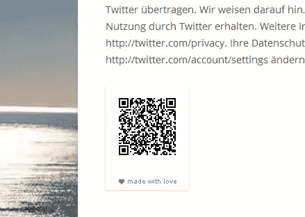
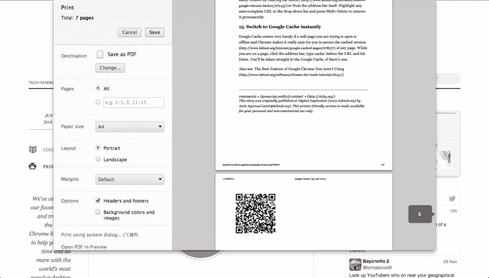
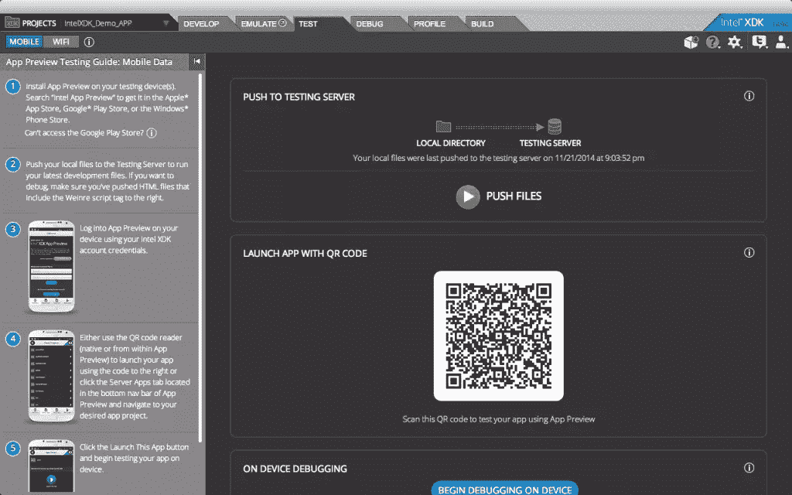

# 如何给 WordPress 帖子添加二维码

> 原文：<https://www.sitepoint.com/add-qr-codes-wordpress-posts/>

QR 码(或“快速响应码”)是当今使用的最流行的条形码类型之一，能够编码多达 4296 个字符。与其他类型的条形码相比，QR 码由于其快速的可读性和更大的存储容量而变得非常受欢迎。

典型的二维码应用包括产品跟踪、物品识别、时间跟踪、文档管理、一般营销、URL 等等。它还用于跟踪物理项目，如邮件和包裹。条形码现在通常用于门票，通过扫描门票可以观看比赛。



QR 码在网站上被广泛使用，它们通常代表网站的 URL。当有人想在他们的手机上阅读你的网页内容时，他们可以扫描二维码，并在浏览器中打开网址，而不是手动键入一个长网址。

有几种类型的二维码，模型 1，微，IQR，SQRC 和 LogoQ。模型 1 是最常见的 QR 码类型，也是我们将在示例中使用的类型。

在本教程中，我将向你展示如何创建一个插件，在每篇 WordPress 帖子的末尾添加一个二维码，代表完整的 URL。

## 创建插件目录和插件文件

在我的例子中，我将插件命名为“真棒二维码”，你可以给它起任何你想要的名字。您首先需要创建一个带有插件名称的目录，然后创建一个带有相同插件名称的 PHP 文件。

```
--awesome-qr-code
	-awesome-qr-code.php
```

将此代码放入 awesome-qr-code.php 文件:

```
<?php
/*
Plugin Name: Awesome QR Code
Plugin URI: https://www.sitepoint.com/
Description: Adds QR Code to WordPress Posts
Version: 1.0
Author: Narayan Prusty
Author URI: http://twitter.com/narayanprusty
*/
```

## 包括二维码生成器库

在你的插件目录中下载并解压[二维码生成器](http://www.phpclasses.org/package/6399-PHP-Generate-QR-Code-images-using-Google-Chart-API.html)。然后，您的目录中将会有一个名为`qrcode.php`的文件。

现在我们需要包含该文件:

```
include("qrcode.php");
```

## 过滤帖子内容

接下来，我们需要在每篇 WordPress 帖子的末尾添加一个二维码图片。为此，我们需要过滤文章内容，并在内容末尾添加 HTML。

我们可以使用“the_content”过滤器来实现这一点。`the_content`过滤器用于在从数据库中检索到文章内容之后、将其打印到屏幕上之前过滤文章内容。请注意，过滤功能必须在完成处理后返回内容**，否则网站访问者将看到一个空白页面，其他也在过滤内容的插件可能会产生错误。**

```
function qr_code($content)
{
	$url = get_permalink();

	$qr = new qrcode();
	$qr->text($url);

	$html = "<p><b>QR Code:</b></p><p>get_link()."' border='0'/></p>";
	$content .= $html;

	return $content;
}

add_filter("the_content", "qr_code");
```

让我们分解一下上面的代码:

1.  `qr_code`是一个过滤函数，它在输出之前获取文章内容并进行过滤。
2.  `get_permalink`函数用于获取当前帖子的完整 URL。
3.  我们使用 QR 代码库来生成代表永久链接的 QR 代码图像。
4.  我们把它加到了帖子内容的末尾。

如您所见，如果您想自己做这件事，这相当简单。然而，如果你正在创建一个插件或主题，你很可能只编写代码来生成一个二维码。如果你想将二维码整合到现有的网站上，那么安装一个现成的二维码插件会容易得多。

## 流行的二维码插件

一些流行的二维码插件有[二维码生成器](https://wordpress.org/plugins/qrcode-wprhe/)和 [JM 简单二维码插件](https://wordpress.org/plugins/jm-simple-qr-code-widget/)。


如果您想在帖子内容中添加二维码，二维码生成器非常有用。而 JM 简单的二维码窗口小部件是有用的，如果你想显示一个二维码窗口小部件。

## 测试您的二维码

要在手机上扫描和测试您的 QR 码，您需要安装一个可以扫描和解码条形码的条形码扫描仪应用程序。流行的条形码扫描仪应用有安卓系统的[条形码扫描仪](https://play.google.com/store/apps/details?id=com.google.zxing.client.android&feature=search_result)和 iOS 系统的 [RedLaser](https://itunes.apple.com/en/app/redlaser-barcode-scanner-shopping/id474902001?mt=8) 。

## 使用 QR 码的应用

二维码到处都在使用，这里有一个使用二维码的网站的简短列表，可以帮助产生一些想法:

*   数码灵感(labnol.org)打印网页时会在末尾打印二维码。



*   英特尔 XDK 开发环境使用条形码来安装应用。条形码代表英特尔应用预览云上应用的 URL。



*   谷歌地球允许你使用二维码访问他们的移动网站。


*   像 Delivr、GoQR 和 Kaywa 这样使用二维码的网站还有很多。

## 结论

在你的 WordPress 文章中添加二维码可以帮助你的用户在旅途中阅读你的内容。它很容易以插件的形式实现，或者您可以使用上面的代码轻松地将此功能添加到您自己的项目中。请在下面分享你的经历和你遇到的实现。

## 分享这篇文章