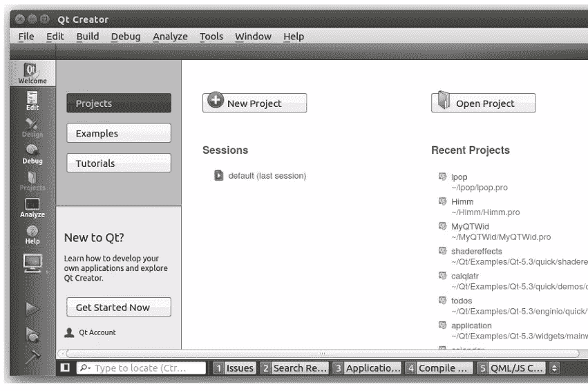
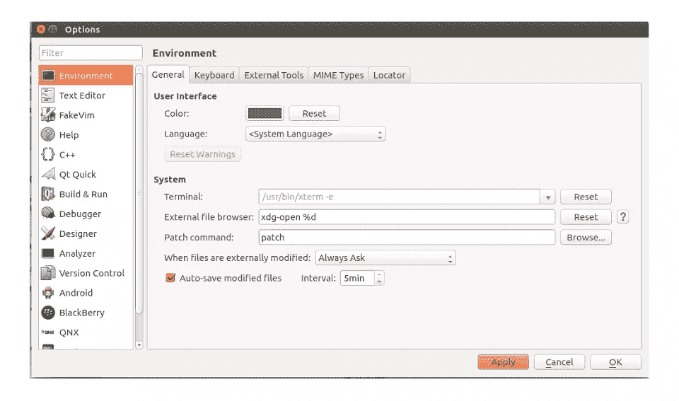
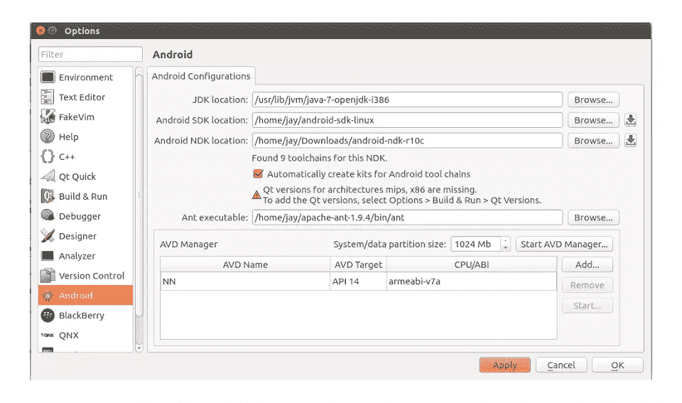
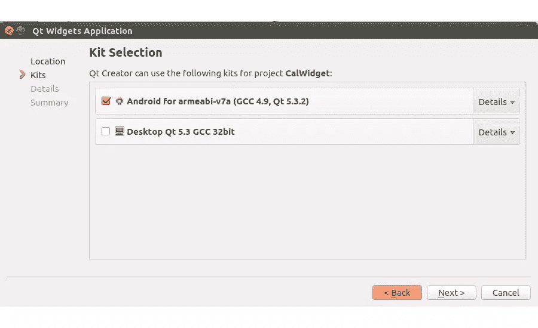
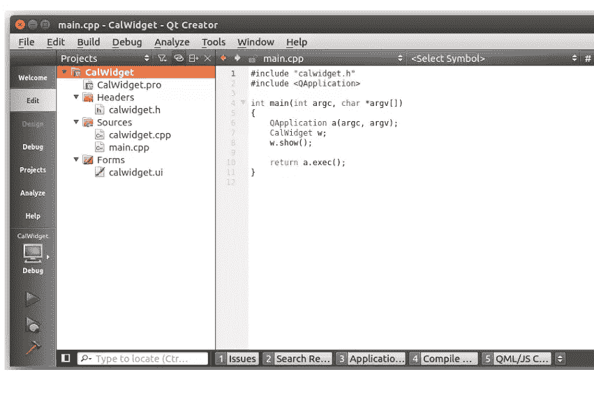
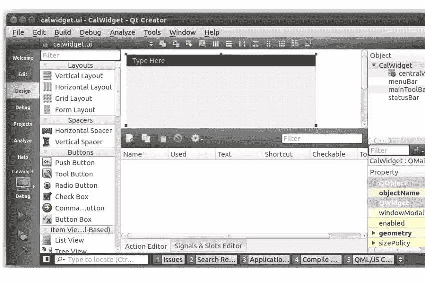
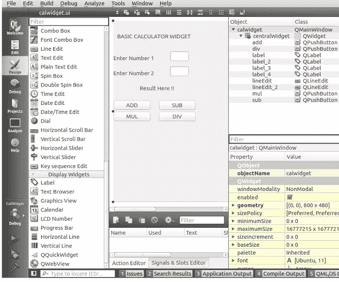

# 用 Qt 开发跨平台应用程序

> 原文：<https://www.sitepoint.com/developing-cross-platform-applications-qt/>

Qt 是一个跨平台的应用开发框架，有着悠久的历史，现在由 Qt 项目维护。它使开发人员能够为桌面、嵌入式和移动操作系统创建应用程序和用户界面。它提供了一个 GUI(图形用户界面)来简化开发，并允许创建混合应用程序。应用程序可以用 C++或 T2 QML T3 语言开发，这是一种类似 JavaScript 的语言。

在本教程中，我们将从 Qt 框架开始，并创建一个初学者应用程序。

本教程的源代码可以在 [GitHub](https://github.com/sitepoint-examples/QtSmapleApp) 获得。

## 设置 Qt

要开始使用 Qt，从[下载页面](http://qt-project.org/downloads)下载并运行适用于您的操作系统的 Qt 安装程序。你可以在[官方文件](http://qt-project.org/doc/qt-4.8/installation.html)中找到更多关于在各种平台上安装 Qt 的细节。

安装完成后，打开应用程序，它应该是这样的:



## 为 Android 开发配置 Qt

要开始使用 Qt 开发 Android 应用程序或小部件，我们需要先配置一些东西。打开*工具- >选项* ( *应用菜单- >偏好设置*在 Mac 上)菜单，你应该会看到下面的屏幕。



从左侧菜单中选择 *Android* ，配置所需路径到 *JDK 位置*、 *Android SDK 位置*、 *Android NDK 位置* ( [您可能需要下载此](https://developer.android.com/tools/sdk/ndk/index.html))和 *Ant 可执行文件*。



## 我们将创造什么

在本教程中，我们将为 Android 创建一个简单的计算器。它将支持加减乘除。

## 入门指南

从 Qt Creator 中，打开 *File - > New File 或 Project* 菜单项。在打开的窗口中，选择一个*应用*项目，然后选择 *Qt Widgets 应用*，如下图所示:


点击*选择…* 继续，在下一个屏幕上，将您的小工具命名为`CalWidget`，然后点击*下一个*。在下一个屏幕上，选择 *Android* 套件并继续(*在某些操作系统上，“下一步”按钮可能是“继续”*)。



接下来，您将看到课程信息详细信息屏幕。将*类名*重命名为`CalWidget`。点击*下一个*，配置目前不需要的版本控制。点击*下一步*，然后*完成*创建项目结构。项目结构现在应该是这样的:



我们应该在项目中看到的一些文件有`calwidget.h`、`calwidget.cpp`、`main.cpp`和`calwidget.ui`。所有这些文件已经有一些锅炉板代码。首先，我们将创建我们的 UI，然后返回到这些文件来添加我们需要的功能。

## 创建用户界面

Qt Creator 提供了一个界面，我们可以将控件拖放到屏幕上并创建我们的 UI。双击`calwidget.ui`文件(在*表格*文件夹内)，它将打开一个带有控件的屏幕。它应该是这样的:



从左侧的控件列表中，尝试将控件拖放到微件屏幕上。我们需要一个输入文本控件，标签控件和按钮控件来创建我们的用户界面。因此，将几个`Push Button`、`Label`和`Line Edit`控件拖放到小部件屏幕上，创建一个如下所示的屏幕:



要运行小部件，请按下 *Ctrl/Cmd+R* ，您应该能够看到小部件在模拟器中运行。

如果你在构建时得到关于缺少按钮功能的错误，Qt 似乎会保留上一次构建时的旧对象名，如果你已经重命名它们的话。打开 Headers - > calwidget.h 并删除它们的引用。

## 实现功能

接下来，我们将尝试从输入文本框中读取数据，并根据单击的操作显示结果。

要将点击事件附加到按钮上，右击按钮并选择*转到插槽*，从列出的信号中选择*点击的*信号。当你这样做时，在`calwidget.cpp`中产生如下的点击事件函数:

```
void CalWidget::on_btnAdd_clicked()
{
    // Code for Addition logic
}
```

当点击操作按钮时，我们需要从输入文本框中读取文本值。为了访问 UI 中的元素，我们将使用上面声明的`ui`变量。因此，通过 id 访问任何 ui 元素的代码如下:

```
ui->(*elementId*)->text()
```

点击添加按钮，读取输入文本框中的值，对其求和，并在`lblResult`标签中显示结果。下面是我的添加按钮点击代码:

```
void CalWidget::on_btnAdd_clicked()
{
    int input1,input2,result;

    // reading from input boxes
    input1 = ui->txtNum1->text().toInt();
    input2 = ui->txtNum2->text().toInt();

    // summing it up
    result = input1+input2;

    // Create a QString using the result
    QString qString = QString::number(result);

    // Assign result qString to lblResult label
    ui->lblResult->setText(qString);

}
```

保存您的代码并按下 *Ctrl/Cmd+R* 来运行代码。在文本框中输入值，点击`Add`，你应该可以看到输出。

以下是所有四个点击事件的代码:

```
// Add operation click event
void CalWidget::on_btnAdd_clicked()
{
    int input1,input2,result;
     // reading from input boxes
    input1 = ui->txtNum1->text().toInt();
    input2 = ui->txtNum2->text().toInt();
    result = input1+input2;

    // Assign result to lblResult label
    QString qString = QString::number(result);
    ui->lblResult->setText(qString);

}

// Sub operation click event
void CalWidget::on_btnSub_clicked()
{
    int input1,input2,result;
     // reading from input boxes
    input1 = ui->txtNum1->text().toInt();
    input2 = ui->txtNum2->text().toInt();
    result = input1-input2;

    // Assign result to lblResult label
    QString qString = QString::number(result);
    ui->lblResult->setText(qString);
}

// Mul operation click event
void CalWidget::on_btnMul_clicked()
{
    int input1,input2,result;
     // reading from input boxes
    input1 = ui->txtNum1->text().toInt();
    input2 = ui->txtNum2->text().toInt();
    result = input1*input2;

    // Assign result to lblResult label
    QString qString = QString::number(result);
    ui->lblResult->setText(qString);
}

// Div operation click event
void CalWidget::on_btnDiv_clicked()
{
    int input1,input2,result;
     // reading from input boxes
    input1 = ui->txtNum1->text().toInt();
    input2 = ui->txtNum2->text().toInt();
    result = input1/input2;

    // Assign result to lblResult label
    QString qString = QString::number(result);
    ui->lblResult->setText(qString);
}
```

尝试运行应用程序，并检查所有已实现操作的输出。

接下来，我们将在代码中添加验证来检查空值和非数值。一种检查有效性的方法是使用 [QString](http://qt-project.org/doc/qt-4.8/qstring.html) 。它提供了一些内置的库，使得验证更加容易。我们将使用`QString`变量，而不是将输入文本值读入整数变量。QString 有一个名为`isEmpty`的内置函数，我们可以用它来检查空值。为了验证非数值和空值，我们将使用`toInt()`和`toFloat()`函数。在尝试转换非数字字符串时，这两个函数都返回`0`。

下面是包含验证的修改后的代码:

```
void CalWidget::on_btnAdd_clicked()
{
    QString input1,input2;
    int result;
    QString qString = NULL;

    // Read from input text 
    input1 = ui->txtNum1->text();
    input2 = ui->txtNum2->text();

    int isNumber1 = input1.toInt();
    int isNumber2 = input2.toInt();

    // Check if numeric
    if(isNumber1 && isNumber2){
        result = input1.toInt()+input2.toInt();
        qString = QString::number(result);
        ui->lblResult->setText(qString);
    }
    else{
        qString = QString::fromStdString("Enter Valid Numbers");
        ui->lblResult->setText(qString);
    }

}

void CalWidget::on_btnSub_clicked()
{
    QString input1,input2;
    int result;
    QString qString = NULL;

    // Read from input text 
    input1 = ui->txtNum1->text();
    input2 = ui->txtNum2->text();

    int isNumber1 = input1.toInt();
    int isNumber2 = input2.toInt();

    // Check if numeric
    if(isNumber1 && isNumber2){
        result = input1.toInt()-input2.toInt();
        qString = QString::number(result);
        ui->lblResult->setText(qString);
    }
    else{
        qString = QString::fromStdString("Enter Valid Numbers");
        ui->lblResult->setText(qString);
    }
}

void CalWidget::on_btnMul_clicked()
{
    QString input1,input2;
    int result;
    QString qString = NULL;

    // Read from input text 
    input1 = ui->txtNum1->text();
    input2 = ui->txtNum2->text();

    int isNumber1 = input1.toInt();
    int isNumber2 = input2.toInt();

     // Check if numeric
    if(isNumber1 && isNumber2){
        result = input1.toInt()*input2.toInt();
        qString = QString::number(result);
        ui->lblResult->setText(qString);
    }
    else{
        qString = QString::fromStdString("Enter Valid Numbers");
        ui->lblResult->setText(qString);
    }
}

void CalWidget::on_btnDiv_clicked()
{
    QString input1,input2;
    float result;
    QString qString = NULL;

    // Read from input text 
    input1 = ui->txtNum1->text();
    input2 = ui->txtNum2->text();

    float isNumber1 = input1.toFloat();
    float isNumber2 = input2.toFloat();

    // Check if numeric
    if(isNumber1 && isNumber2){
        result = input1.toFloat() / input2.toFloat();
        qString = QString::number(result);
        ui->lblResult->setText(qString);
    }
    else{
        qString = QString::fromStdString("Enter Valid Numbers");
        ui->lblResult->setText(qString);
    }
}
```

## 结论

在本教程中，我们看了如何通过为 android 平台创建一个简单的应用程序来开始使用 Qt。我们只使用了 Qt 的一些基本特性，关于 Qt 及其特性的深入信息，请看一下它们的[官方文档](http://qt-project.org/doc/)。

你会用 Qt 吗？你觉得它比其他跨平台开发方案有什么优势吗？

## 分享这篇文章