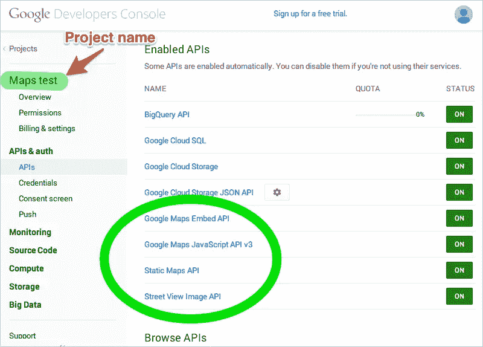
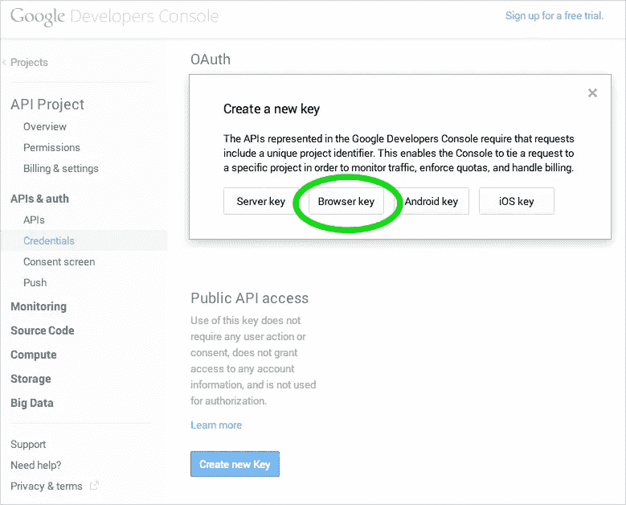
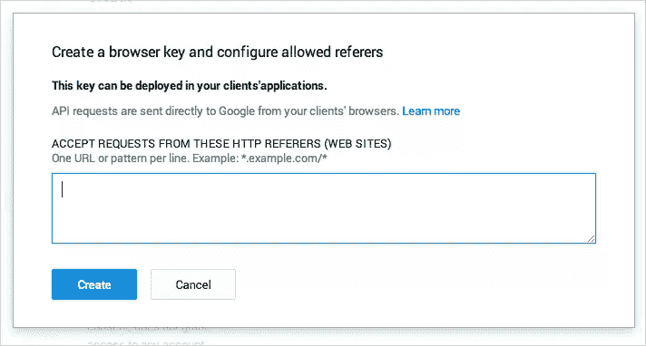
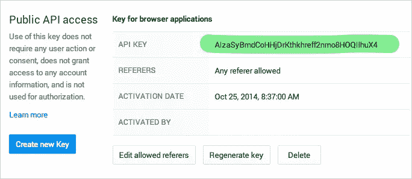

# 谷歌地图食谱入门

> 原文：<https://www.sitepoint.com/getting-started-google-maps-recipes/>

有很多方法可以将谷歌地图添加到网页上。谷歌提供了多种地图类型，它们的使用基本上取决于你的需求。

不考虑某些特定用途(例如用于[地点](https://developers.google.com/places/)或[地球](https://developers.google.com/earth/documentation)的 API)，最常用的地图类型有:

*   静态地图和街景图像
*   嵌入式地图
*   JavaScript 地图

此外，还有许多用于改进地图的 web 服务以及针对移动设备的特定 API。在本文中，我们将只讨论网页的基本 API。如果你有兴趣深入了解谷歌地图，看看谷歌地图应用编程接口主页。

## 获取 API 密钥

正如谷歌地图开发者网站上所解释的:

> 所有 Maps API 应用程序都应该使用 API 键加载 Maps API。使用 API 密钥可以让您监控应用程序的地图 API 使用情况，并确保 Google 可以在必要时就您的应用程序与您联系。如果您的应用程序的 Maps API 使用超过使用限制，您必须使用 API 密钥加载 Maps API，以便购买额外的配额”。

你必须申请一个免费的 **API 密匙**(参见[谷歌地图教程:获取 API 密匙](https://developers.google.com/maps/documentation/javascript/tutorial#api_key))。它允许您每天加载地图指定的次数(每个 API 都有特定的限制)。如果你需要更多的流量，你必须购买额外的配额(见[谷歌地图使用限制](https://developers.google.com/maps/documentation/javascript/usage#usage_limits))。

地图的 API 密匙需求是一个有点令人困惑的问题。当 Google 发布 v3 APIs 时，不需要密钥。现在，谷歌已经改变了它的政策，但是为了向后兼容，你可以在没有密钥的情况下加载 API(不是所有的 API)。

要请求 API 密钥，首先进入[谷歌开发者控制台](https://console.developers.google.com/)页面(你必须拥有一个谷歌账户)，创建一个新项目并激活你需要的 API(你会发现一些 API 已经处于活动状态):



> 请注意，有时谷歌地图文档会将你重定向到[以前的开发者控制台](https://code.google.com/apis/console/):尽管有*旧的谷歌*界面。它和新的一样。

本文中展示的菜谱将需要**地图嵌入**、**地图 JavaScript** 、**静态地图**和**街景图像**API。

我们现在必须生成一个新的公钥，如果需要的话，将其限制在特定的域中。

点击左侧菜单中的**凭证**，然后在*公共 API 访问*部分选择**创建新密钥**。将出现一个对话框，您可以在其中选择**浏览器键**选项。



现在，您可以设置一个或多个 http referrers，以便只为它们启用新密钥，或者(如本例所示)，只需单击 **Create** 按钮。



您的新 API 密钥现在将显示在您的控制台中。您可以随时删除或重新生成它，以及编辑允许的推荐人列表。



请注意，该键只允许使用您在项目中启用的 API。如果你需要更多的 API，你必须编辑你的项目或者创建一个新的。

避免对所有网站使用相同的密钥。创建一个新的 API 项目，每个项目都有特定的键。

## 静态地图

*静态地图*是向网页添加地图的最简单方式。它们不需要 JavaScript 或动态加载。地图是从一个 URL 请求创建的，该请求返回一个地图图像，您可以用一个`img`标签在您的网页上显示该图像。

尽管可以设置许多选项来自定义地图，但显示地图主要有三个参数:

*   您的 API 密钥
*   地图中心
*   图像大小

这是一个以意大利罗马马泰广场为中心的路线图视图的基本例子:

```

```

参见 [CodePen](http://codepen.io) 上的笔 [Google Maps:静态示例](http://codepen.io/SitePoint/pen/LEEZgL/)by SitePoint([@ SitePoint](http://codepen.io/SitePoint))。