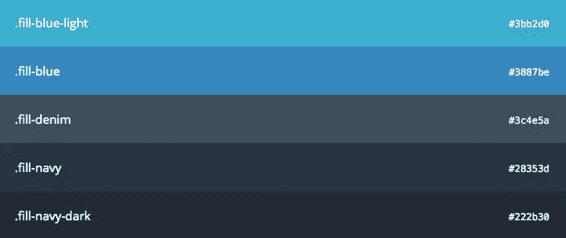

# 使用助手类来干燥和缩放 CSS

> 原文：<https://www.sitepoint.com/using-helper-classes-dry-scale-css/>

您正在启动一个新的 web 项目，并在寻找一种新的 CSS 方法来帮助您扩展代码。越来越多的编写模块化 CSS 的技术可用，包括[smcss](https://smacss.com/)、 [BEM](http://bem.info/) 以及许多其他类似的方法，所有这些都基于面向对象 CSS (OCSS)。正如您所看到的，有很多编写和组织 CSS 的技术。

除了所有这些方法之外，还有一些东西可以帮助我们编写<abbr title="Don't Repeat Yourself">干巴巴的</abbr>，更少重复的代码:助手类(也称为实用程序类)。

这个概念前段时间在 Thierry Koblentz 关于 Smashing Magazine 的文章[中讨论过，但是我想在这里用我自己的话来解释这个方法。](http://www.smashingmagazine.com/2013/10/21/challenging-css-best-practices-atomic-approach/)

## 什么是助手类？

助手类可以通过创建一组可以在 HTML 元素上反复使用的抽象类来帮助消除重复。每个助手类负责做一项工作，并且做好。这样做将使您的代码对于将来添加的许多功能更具可重用性和可伸缩性。所以无论何时你想要创建一个新的组件，你只需要将一些类组合在一起来构建它。

> “像对待乐高积木一样对待代码。将代码分解成尽可能小的块。”—[@ CSS wizardy](https://twitter.com/csswizardry)(经由[@ stubbornella](https://twitter.com/stubbornella))[# btconf](https://twitter.com/hashtag/btconf?src=hash)
> 
> —粉碎杂志(@ smashingmag)[2013 年 5 月 27 日](https://twitter.com/smashingmag/status/339024926197559296)

让我们看一个简单的例子，看看实用程序类是什么样子的，以及我们如何使用它们。请看下面的代码片段:

```
.left        { float: left; }
.right       { float: right; }

.text-left   { text-align: left; }
.text-right  { text-align: right; }
.text-center { text-align: center; }
```

在这里，我们创建了一组 CSS 规则，可以在以后构建新组件时使用。例如，如果你想让一些内容靠左对齐，你可以使用`text-left`类。同样，您可以使用`left`或`right`类将元素浮动到需要的方向。

让我们看看另一个需要放在左边的盒子的例子，它的内部内容居中。

我们通常会这样做:

```
<div class="box">
</div>
```

使用此 CSS:

```
.box {
    float: left;
    text-align: center;
}
```

相反，我们可以使用可重用和单一责任的助手类来实现同样的事情:

```
<div class="left text-center">
</div>
```

请注意我是如何移除了`box`类，并添加了我们的预定义类`left`和`text-center`。

如果您想改变浮动和对齐方向，而不是在不可重用的`.box`类上这样做，您可以使用其他辅助类:

```
<div class="right text-right">
</div>
```

网格系统是使用助手类的一个很好的例子。下面是基金会网格的一个例子:

```
<div class="row">
    <div class="small-2 large-4 columns"></div>
    <div class="small-4 large-4 columns"></div>
    <div class="small-6 large-4 columns"></div>
</div>
```

Foundation 提供了许多类，可以使用这些类并将其组合在一起，为不同的屏幕尺寸创建不同宽度的网格系统。这种灵活性有助于开发人员更快地创建新的定制布局，而无需为网格本身编辑任何 CSS。例如:

*   `.small-2`和`.large-4`类将根据屏幕大小设置元素的宽度。
*   `.row`类设置容纳列的容器的宽度。
*   `.columns`类设置填充和浮动。

现在您已经理解了什么是助手类，让我们来看看我们可以添加到我们的项目中的一些可重用类，在下面以不同的类别呈现。还要注意，该示例将使用一些 Sass 变量，但这些自然不是必需的。

## 边距和填充

边距和填充可能是 CSS 中最常用的属性。添加一些能够处理这种情况的抽象类会使我们的代码变得枯燥。

我们首先为设计的基本空间单位定义一个变量(使用 Sass)。让我们从`1em`开始，在此基础上，我们可以为不同的空间大小创建类。

```
$base-space-unit: 1em;

// Top margin
.margin-top-none    { margin-top: 0; }
.margin-top-quarter { margin-top: $base-space-unit / 4; }
.margin-top-half    { margin-top: $base-space-unit / 2; }
.margin-top-one     { margin-top: $base-space-unit; }
.margin-top-two     { margin-top: $base-space-unit * 2; }

// Top padding
.padding-top-none    { padding-top: 0; }
.padding-top-quarter { padding-top: $base-space-unit / 4; }
.padding-top-half    { padding-top: $base-space-unit / 2; }
.padding-top-one     { padding-top: $base-space-unit; }
.padding-top-two     { padding-top: $base-space-unit * 2; }
```

我们也可以选择短类名，如下面来自[bascsss](http://www.basscss.com/docs/utility/#white-space)的示例代码所示

```
.m0  { margin:        0 }
.mt0 { margin-top:    0 }
.mr0 { margin-right:  0 }
.mb0 { margin-bottom: 0 }
.ml0 { margin-left:   0 }
```

选择适合你和你的团队的方式。长名字显然会使你的 HTML 元素变得更大，但是与短名字相比，它们更易读，所以你可能需要查看你的 CSS 来弄清楚事情是如何工作的。

## 宽度和高度

假设你想在网站的不同地方设置一个全高的区域。我们传统的做法是这样的:

```
<div class="contact-section">
    <!-- Content here... -->
</div>
```

我们的 CSS:

```
.contact-section { height: 100%; }
```

对于其他部分，我们将重复代码:

```
<div class="services-section">
    <!-- Content here... -->
</div>
```

和 CSS:

```
.services-section { height: 100%; }
```

但是我们可以用一个名为`full-height`的类来简化这一切:

```
<div class="full-height">
    <!-- Content here... -->
</div>
```

下面是一些类似的例子，包括上面使用的`full-height`类:

```
.fit         { max-width: 100%; }
.half-width  { width: 50% }
.full-width  { width: 100%; }
.full-height { height: 100%; }
```

## 位置和 Z 索引

与位置相关的属性可以与其他属性(如`z-index`)结合起来创建一个复杂的布局。我们可以创建一组类来设置任何元素相对于视口或祖先元素(右、左、左上等)的确切位置:

```
.fixed    { position: fixed; }
.relative { position: relative; }
.absolute { position: absolute; }
.static   { position: static; }

.zindex-1 { z-index: 1; }
.zindex-2 { z-index: 2; }
.zindex-3 { z-index: 3; }

.pin-top-right {
    top: 0;
    right: 0;
}

.pin-bottom-right {
    bottom: 0;
    right: 0;
}
```

“pin”辅助类的灵感来自于 [Mapbox 的 CSS](https://www.mapbox.com/base/latest/base.css) 。

让我们扩展全高示例，使其包含一个位于右下角的元素。

```
<div class="full-height relative">
    <div class="absolute pin-bottom-right padding-one">
        Text to bottom right
    </div>
</div>
```

[演示](http://jsbin.com/matito/1/)

通过组合多个类，我们可以用更少的代码获得所需的结果。如果你想把内部元素放在右上角，你可以用`pin-top-right`代替`pin-bottom-right`。你可能已经注意到，在上面的代码中，我还添加了另一个助手类:`padding-one`类确保元素不会与容器或视口的边缘齐平。

## 浮动元素

可以使用`left`或`right`类向左或向右浮动元素。众所周知的 [clearfix 类](https://www.sitepoint.com/clearing-floats-overview-different-clearfix-methods/)可以在父元素上使用来清除浮动，如下所示使用 [Sass 的父选择器](http://sass-lang.com/documentation/file.SASS_REFERENCE.html#parent-selector):

```
.left  { float: left; }
.right { float: right; }

.clearfix {
 &:before,
 &:after {
 content: "";
 display: table;
    }

 &:after { clear: both; }
}
```

[演示](http://jsbin.com/cenuvo/1/)

## 对齐元素

我们可以使用基于 align 的辅助类使文本和其他内容向任意方向对齐:

```
.text-left    { text-align: left; }
.text-right   { text-align: right; }
.text-center  { text-align: center; }
.text-just    { text-align: justify; }

.align-top    { vertical-align: top; }
.align-bottom { vertical-align: bottom; }
.align-middle { vertical-align: middle; }
```

## 可见性类别

视屏幕大小、设备方向、触摸屏或其他因素而定，可见性类别控制元素的可见性。这些在响应式设计中可以派上用场。

我们可以在媒体查询中包含以下类:

```
.hide-on-small { display: none; }
.show-in-large { display: block; }
```

在我们的 HTML 中:

```
<div class="hide-on-small show-in-large">
    <!-- content here... -->
</div>
```

上述元素将在小屏幕上隐藏，但在大屏幕上可见。

我们还可以使用这些类来控制触摸设备上的元素:

```
.touch .show-for-touch { display: none; }
.touch .hide-for-touch { display: inherit; }
```

在上面的例子中，`.touch`类来自于由 [Modernizr](http://modernizr.com/) 添加到`<html>`元素的类。

可见性类的一个很好的例子是[Foundation 中的](http://foundation.zurb.com/docs/components/visibility.html)和 [Bootstrap 的 responsive-utilities](http://getbootstrap.com/css/#responsive-utilities) 。

## 排印

在排版中，你可以为字体粗细和文本操作创建类，比如省略号文本。

```
.bold     { font-weight: bold; }
.regular  { font-weight: normal; }
.italic   { font-style: italic; }

.ell {
    white-space: nowrap;
    overflow: hidden;
    text-overflow: ellipsis;
}

.break-word { word-wrap: break-word; }
.no-wrap    { white-space: nowrap; }
```

## 颜色；色彩；色调

每个应用程序都有不同的指南和品牌规则，我们可以在类中定义它们，这些类实质上是我们界面的皮肤。这将包括文本颜色，背景，等等。

让我们看看如何将它翻译成代码。首先让我们用 Sass 定义我们的变量:

```
$white     :   #fff;
$gray      :   #2c3e50;
$dark-gray :   #95a5a6;
$dark      :   #2c3e50;

$notice    :   #3498db;
$success   :   #1abc9c;
$alert     :   #e74c3c;
```

然后，我们根据变量定义我们的助手类:

```
// Colors
.white            { color: $white; }
.gray             { color: $gray; }
.dark-gray        { color: $dark-gray; }

.notice           { color: $notice; }
.success          { color: $success; }
.alert            { color: $alert; }

// Backgrounds
.white-bg         { background-color: $white; }
.gray-bg          { background-color: $gray; }
.dark-gray-bg     { background-color: $darkgray; }

.notice-bg        { background-color: $notice; }
.success-bg       { background-color: $success; }
.alert-bg         { background-color: $alert; }
```

在 [Mapbox](https://www.mapbox.com/base/styling/color/) 和 [Google Web Starter Kit](https://github.com/google/web-starter-kit/blob/master/app/styles/components/_helper.scss#L20) 项目中可以找到两个使用颜色和背景助手类的好例子。



另一个用例是[通知组件](http://jsbin.com/tigeqo/1/)。让我们看看如何用后台助手类来设计这个样式。

```
<div class="white p1 mb1 notice-bg">Info</div>
<div class="white p1 mb1 success-bg">Success</div>
<div class="white p1 mb1 alert-bg">Alert</div>
```


## 列表

有多少次你想从`ul`元素中去掉项目符号和填充？一个名为`list-bare`、[的类可以帮你做到这一点。](https://github.com/inuitcss/objects.list-bare)

```
.list-bare {
    padding: 0;
    list-style: none;
}
```

## 边界

助手类可用于为元素添加边框，无论是所有边还是一边。因此，您的 CSS/Sass 可能如下所示:

```
$border-color: #f2f2f2;

.border-all    { border: 1px solid $border-color; }
.border-top    { border-top: 1px solid $border-color; }
.border-bottom { border-bottom: 1px solid $border-color; }
.border-right  { border-right: 1px solid $border-color; }
.border-left   { border-left: 1px solid $border-color; }
```

## 显示值

下面的助手类让我们能够为 CSS 的`display`属性使用不同的值:

```
.inline       { display: inline; }
.block        { display: block; }
.inline-block { display: inline-block; }
.hide         { display: none; }
.flex         { display: flex; }
```

## 结论

遵循这一抽象原则可能是一种与您在创作 CSS 时所习惯的方法大不相同的方法。但是根据我的经验，[和其他人的经验，](http://www.smashingmagazine.com/2013/10/21/challenging-css-best-practices-atomic-approach/)我可以说这是一个非常好的方法，可以在你的下一个项目中考虑。

你可以在我创建的名为 [css-helpers](https://github.com/ahmadajmi/css-helpers) 的新库中查看这篇文章中的所有 helper 类。

## 相关图书馆链接

您可以学习和探索以下项目的结构:

*   [map box style guide](https://www.mapbox.com/base/)–[base . CSS](https://www.mapbox.com/base/latest/base.css)
*   [bascsss](http://www.basscss.com/)
*   [基础实用程序类](http://foundation.zurb.com/docs/utility-classes.html)
*   [引导助手类](http://getbootstrap.com/css/#helper-classes)
*   [Uikit 实用程序类](http://getuikit.com/docs/utility.html)

## 进一步阅读

*   [挑战 CSS 最佳实践](http://www.smashingmagazine.com/2013/10/21/challenging-css-best-practices-atomic-approach/)
*   [ACSS:重新思考 CSS 最佳实践](http://www.slideshare.net/renatoiwa/acss)
*   [媒体的 CSS](https://medium.com/@fat/mediums-css-is-actually-pretty-fucking-good-b8e2a6c78b06)

## 分享这篇文章