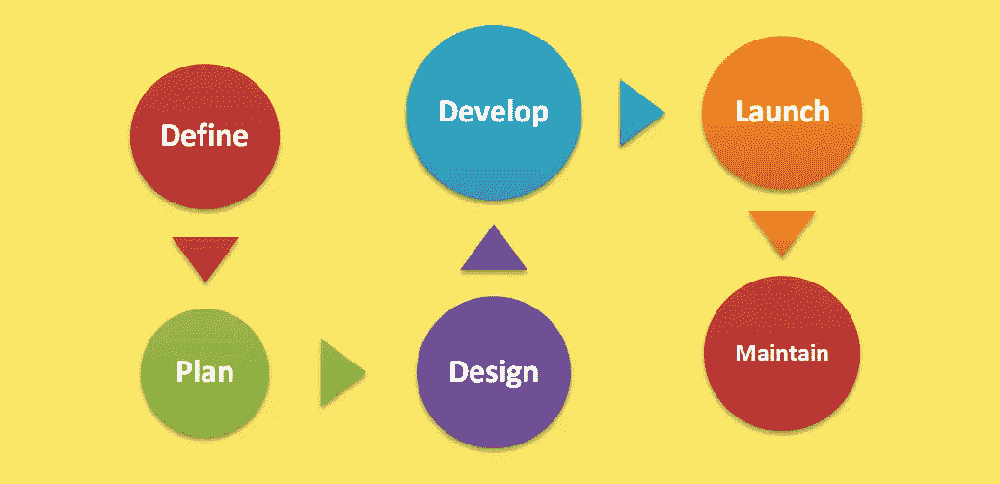

# 创建一个网站的客户指南

> 原文：<https://www.sitepoint.com/clients-guide-actually-takes-create-website/>

Web 开发人员:给这篇文章的潜在或当前客户发电子邮件来帮助澄清你的过程，并在评论中提出改进建议！

当你想为你的企业创建一个网站时，选择合适的设计和开发团队来为你做这件事是很重要的。在网络世界中，网站是你与客户的主要界面。就像任何其他商业资产一样，你的网站需要在金钱和时间上产生良好的投资回报。

这就是为什么作为一个客户，努力理解创建一个好的网站到底需要什么是很重要的。了解这一过程将有助于你更好地评估投资回报，选择合适的自由职业者或公司来创建你的网站，并使你能够更好地与他们合作。所以让我们开始，带你经历一个网站项目的各个阶段。

## 1.项目定义

这是第一步，客户和代理商讨论需要什么。虽然一些已建立的企业可能对自己想要什么有明确的想法，但许多客户，尤其是新的或小企业，在这个阶段对自己想要什么没有明确的定义。

以下是您在此阶段应该完成的工作:

*   **业务和网站目标:**向广告公司解释你的业务、价值观和愿景。清楚地定义你的网站的目标受众，以及你的网站想要达到的目标。仅仅发布一个外观复杂的网站是不够的。如果网站不能吸引你的核心受众，不能直接或间接地帮助你创收，那它就毫无意义。以下是[如何为你的网站](http://www.intechnic.com/blog/how-to-set-smart-business-goals-for-a-business-website/)设定一些智能目标。

*   **功能和规格:**在这一阶段，您将讨论需求的技术方面——您是否需要针对特定浏览器或设备类型进行优化的网站？你想要一个静态网站，还是想要一个博客、播客或视频系列与之配套？你打算在你的网站上创建一个活跃的社区，还是通过其他社交媒体渠道？你打算在你的网站上销售产品或服务吗？你需要集成商务吗？这里有一个[列表，列出了一些你可能想用来吸引读者的粘性特性](http://www.forbes.com/sites/jaysondemers/2014/07/29/20-sticky-features-your-website-needs-to-convert-visitors/)。一家好的旅行社会带你了解各种可能性，并为你找到最合适的。

*   **内容来源:**如果您已经有品牌宣传材料，您应该与代理商分享。否则，您可能需要委托代理公司制作您的徽标和其他配套宣传材料，作为套餐的一部分。确定你将向代理商提供什么样的内容、公司信息、图片和视频，以及他们必须制作什么样的内容。

*   **范围定义:**一些代理机构只提供设计或线框，一些代理机构只创建静态网站，一些代理机构将为您整合论坛或电子商务，一些代理机构甚至会运营您的博客和社交媒体渠道。获得完整的包装通常会更好，但如果没有，请清楚地说明您希望代理商交付的交付内容。还需要花时间来确定你希望在启动网站后如何进行移交，以及你是否需要该机构进行长期维护。这是最重要的阶段，因为它[为剩下的过程](http://www.ittoolkit.com/how-to-it/projects/project-definition.html)定下了基调。在这个阶段确保清晰的沟通和涵盖所有细节对双方都有好处。它还有助于机构更好地估计所需的工作量和预算。

找一个努力了解你的业务并能帮助你将愿景转化为网络世界的机构。一旦你雇佣了一家代理公司，相信他们，给他们创造性的许可去施展他们的魔法。

## 2.研究和规划

根据我们上面列出的项目定义，代理商现在可以进入规划阶段。这通常涉及相当多的研究和头脑风暴会议，以概述网站的想法和概念。有时，我们可能会要求客户提供额外的细节，或者就某些想法征求反馈。

在此阶段，我们制定了以下计划:

*   **用户描述:**通常情况下，客户会向我们简要介绍他们的目标受众。然后我们进行研究，[得出这些观众的在线资料](http://www.convinceandconvert.com/social-media-strategy/how-to-create-customer-profiles-to-reach-your-target-audience/)——他们在网上表现出什么样的行为，什么样的设计、颜色、模板和内容可能会吸引他们。

*   **架构:**这是内容结构以及用户如何访问它的基本定义。它包括一些细节，比如网站应该有哪些页面，它们应该如何分层，以及读者应该如何浏览它们。

*   页面布局:在这里，我们列出了最适合每种页面类型的布局。这是基于我们希望用户体验的流程类型。它包括有什么样的菜单，是否有侧边栏，各种类型内容的定位——文本、媒体、表单等等。这里有一个快速概述[创建一个好的页面布局的步骤](http://www.creativebloq.com/web-design/steps-perfect-website-layout-812625)

*   **实体模型/线框:**一旦基本结构和布局计划好了，我们就把它映射到实体模型或[线框](http://en.wikipedia.org/wiki/Website_wireframe)。这给了客户一个如何在网站上构建东西的感觉，也有助于向开发者清楚地传达设计师的愿景。

*   基础设施:基础设施决策包括获取域名、获得服务器托管、选择使用哪个 CMS、使用什么编程语言和工具。

## 3.设计

一旦基本规划完成，设计师就可以使用这些数据来开发网站的外观和感觉。设计不全是抽象艺术，它更像是一门科学——视觉元素如何影响观者和引发的情感。

该流程的设计部分包括以下步骤:

*   **配色:**配色为用户的体验定下基调。充满活力的色彩，多铬色调非常适合年轻活跃的观众。明快的颜色和微妙的色调更适合金融、法律和其他这类脑力劳动。

*   视觉元素:网站上的视觉元素包括按钮、菜单、框、字体等等。这些都需要巧妙地传达品牌信息。锐利的边缘，厚重的字体传达出某种形式上的严肃。圆形的盒子和按钮、古怪的仿旧盒子和时髦的字体可能会吸引年轻人群。

*   **媒体:**包括网站上的图片、视频和音频内容。使用什么样的图像，如何呈现它们，它们是否应该滑入或淡出，或者有一个边框，这些都是这里要做的一些决定。
    当然，设计的所有元素都必须与标志和品牌视觉识别的其他方面相配合。否则会给最终客户造成不和谐。下面是 HubSpot 的一些数据，强调了[为什么你的网站需要媒体](http://blog.hubspot.com/blog/tabid/6307/bid/33423/19-Reasons-You-Should-Include-Visual-Content-in-Your-Marketing-Data.aspx)

## 4.发展中的

这是我们走到幕后，做所有的魔术(又名编码)，把你的需求和设计师的愿景变成现实。这通常是在一个内部服务器上完成的，而不是一个活动的主机——世界上的其他人还不能访问你的网站。

*   **Framework/CMS:** 根据需求，我们选择是否使用框架、预建模板、标准内容管理系统(如 WordPress)，或者只是手工编写网站代码。

*   **网络标准&编程语言:**基于框架和所需功能的种类，我们将最适合这些特性的工具和编程语言放在一起，组成了一个工具包。编码时，我们需要[注意遵守 HTML、CSS 和 JavaScript 的网络标准](http://www.htmlbasictutor.ca/clean-compliant-html-code.htm)。

*   **数据库:**网页、模板、布局、图像和代码都存储在一个数据库中。这可以是需要适当配置和管理的 SQL 或其他数据库。

*   特性:一旦我们准备好了框架和数据库，我们就可以开始编码特性了。不同的开发人员有他们自己的一套编码指南。大型开发团队遵循敏捷或其他方法来确保适当的协调，并使用各种开发和调试工具。

*   安全性:安全性是网站的一个重要方面。重要的是，不仅要保证网站及其内容的安全，还要确保任何用户数据的安全，如访问者输入到您网站的电子邮件地址、密码或信用卡信息。

*   性能:虽然添加丰富的功能或高分辨率图像有其自身的优点，但它会大大降低网页的速度。[页面加载时间是留住客户的最关键因素之一](https://blog.kissmetrics.com/loading-time/)。我们分析性能，并尽最大努力进行优化。

所有这些通常都在内部服务器上完成。一个好的代理机构会让你参与到这个过程中。他们会向你展示开发出来的特性，并让你知道任何延迟、瓶颈或变化。

## 5.发射

*   测试版测试:这是测试的最后阶段，我们会全面检查功能、性能和安全性。我们通常让客户参与进来，以确认它符合他们的要求和他们想要的用户体验。

*   **转移交付成果:**一旦网站的功能得到验证，我们将代码，数据库和其他资产转移到客户的域名和主机。我们添加必要的代码来启用客户可能想要使用的各种 web 分析服务(如 Google Analytics)。此时，我们将控制权移交给客户端，包括托管、控制面板和其他管理(除非我们有维护条款)。

*   **培训&文档:**根据客户的需求和项目的复杂程度，我们还可以就如何管理网站维护的基本方面提供文档和培训。

## 6.维护

一些客户(和机构！)可能会认为网站上线后就没什么了。但实际上，像任何其他资产一样，网站需要定期维护。除非你有足够的技术知识自己做，通常最好是请代理提供支持来维护你的网站。

这可能包括:

*   **支持和故障排除:**这是一个相当广泛的领域，可以包括用户在您的网站上遇到的任何类型的问题，或者主机、安全和其他方面的问题。

*   **定期更新:**根据您的首次购买，您可能需要定期更新您的域名、主机和其他许可证。还建议你不时更新网站上的内容，比如公司或产品信息或其他变化，也许一年一次。

*   **博客/直播内容:**如果你真的想吸引你的客户并让他们回到你的网站，建议定期发布博客或其他新内容，如播客或视频。看看拥有博客的[好处](http://blog.hubspot.com/marketing/the-benefits-of-business-blogging-ht)

*   **优化:**为了让你的网站在网上“可见”，你必须采用一些搜索引擎优化技术和其他方法来增加流量。一旦你的网站已经运行了一段时间，你就可以使用网络分析数据来优化你的网站，以实现转化率或其他目标。

唷！这只是概述。每个步骤都有许多层次和细节。每一个都是至关重要的，以确保您的网站为您的业务带来预期的结果-从定义网站的功能和目标，幕后的研究和规划，以确定正确的架构和网站的视觉影响；实际编码的细节，并确保所有的工作都很好地配合。不要吝啬这些。你和你的开发公司可能需要时间来处理细节，但是为了得到你想要的结果，最好提前做好工作。

你的网站设计遇到过困难吗？关于这个过程，你还有什么其他问题吗？

## 分享这篇文章