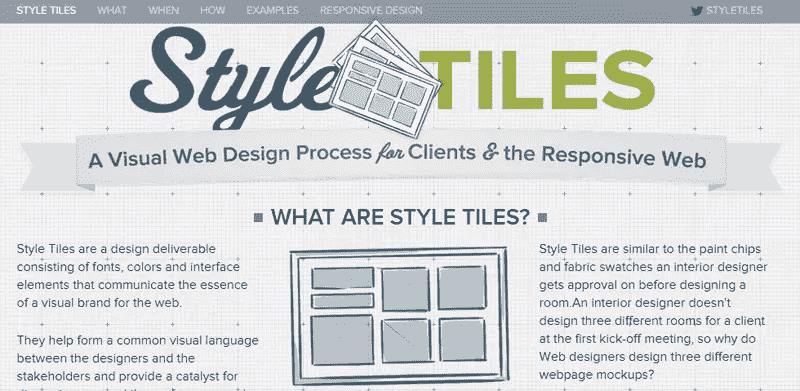
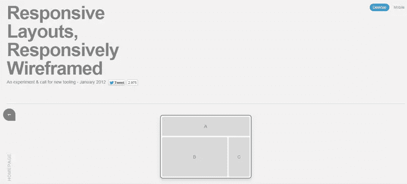
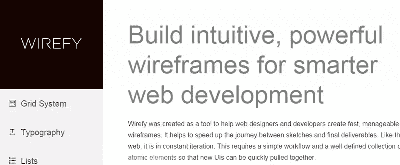
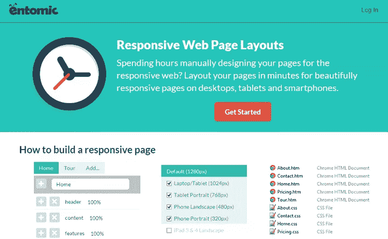
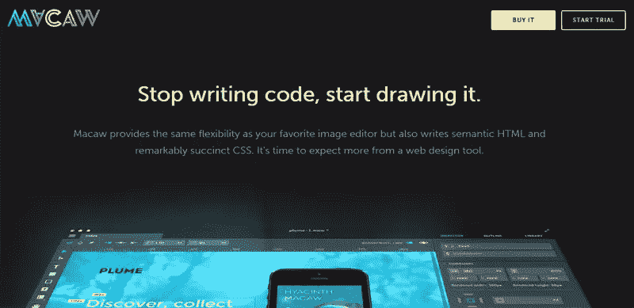
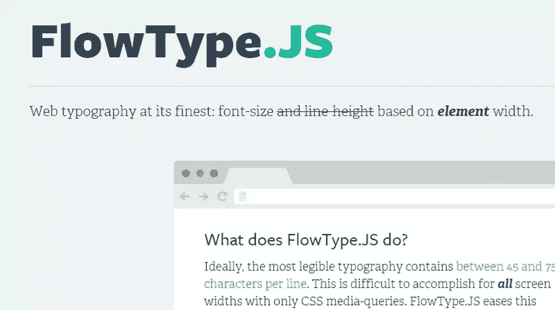

# 12 个基本的响应设计工具

> 原文：<https://www.sitepoint.com/12-essential-responsive-design-tools/>

将客户需求转化为成熟的、实时的网站绝非易事。在最好的情况下，它需要客户、设计师和开发人员之间的多轮讨论，导致设计和网站本身的多次迭代。再加上整个响应式概念——让你的设计适应各种移动设备——这就有点难处理了。

幸运的是，设计师和开发人员是创新、关心和分享的群体。我们喜欢减轻彼此的痛苦。随着对响应式网站需求的增长，帮助响应式网站设计和开发变得更加简单的工具也在平行增长。我已经整理了一些可用的工具，并整理了这个列表，以帮助完成响应式设计和开发过程的各个阶段。请注意，这绝不是一个详尽的列表，所以如果您有其他工具可以分享，请务必发表评论。

## 实体模型、原型和线框工具

让我们从基础开始。设计通常从草图、线框或实体模型开始。这里的关键要素是让布局适合各种移动设备。这里有一些工具可以帮助你。

### 1.界面草图

我很守旧，仍然喜欢用纸和墨水来画基本的草图。我喜欢 InterfaceSketch 为设计师们提供了一堆简单(免费)的 PDF 模板，用来匹配各种移动设备的屏幕。你可以打印出这些 pdf 文件，用最好的设计工具——一只旧铅笔，用它们来勾画出最初的设计。虽然这是最基本的，但这是一个很好的方式来想象你想要的事情是怎样的。

### 2.风格

没有人喜欢为客户创建多个模型和线框。StyleTiles 让网页设计师能够从室内设计中借鉴设计理念，从而减轻了部分痛苦。样式瓷砖类似于室内设计师使用的织物和油漆瓷砖样本。您可以使用 StyleTile 样本来帮助为客户定义可视化语言，并轻松地指导他们进行迭代，而不是创建完整的模型。这对于响应式设计来说是完美的，因为没有固定的尺寸或布局，而是关于视觉吸引力。一旦客户确定了这一点，设计师就更容易进行线框图或真实模型的制作。

### 3.[响应线框](http://www.thismanslife.co.uk/projects/lab/responsivewireframes/#desktop)

现在我们已经有了第一份草图和视觉语言，是时候进入线框了。传统上，线框是网站最终外观的静态表现。但是响应式网站呢？您不希望为多种屏幕尺寸创建单独的线框。詹姆斯·米勒有一个变通办法。他采用了最典型的布局，并为它们创造了反应灵敏的线框。这让你免去了从头创建它们的麻烦，并且让你很容易地看到你的布局中的哪些区域将吸引用户在不同设备上的注意力。

### 4\. [Wirefy](http://getwirefy.com/)

对于那些想要创建自己的线框的人来说， [Wirefy](http://getwirefy.com/) 是一个很好的选择。它有一个非常简单的工作流程，包含大量可以轻松移动的原子组件。它使设计师能够用流畅的设计构建功能性的线框，有助于保持对实际内容的关注。

## 生成响应性 HTML 和 CSS

在实体模型和线框之后，是时候开始写代码了。写出带有多个断点和媒体查询的 CSS 并不是编码中最令人愉快的部分。下面的工具将繁重的工作从 it 中解脱出来，并帮助生成响应性代码。虽然纯粹主义者可能不喜欢它们，但依我拙见，它们是一个很好的开始方式，可以避免重复发明轮子。

### 5.[纯 CSS](http://purecss.io/)

PureCSS 是专门为移动设备设计的一小组 CSS 模块。它拥有非常小的内存(总共 4.4KB，minified 和 gzipped)，如果你只使用模块的一个子集，这个内存会进一步减少。您可以使用网格和菜单模块创建响应式布局。对于其他典型的 CSS 元素，如按钮、表格和表单，也有单独的模块。

### 6.[响应式网络 CSS](https://www.entomic.com/responsivecss)

[响应式网络 CSS](https://www.entomic.com/responsivecss) 采取了一种稍微不同的方法。它允许您通过为页面的每个部分添加`div`元素来创建布局，然后根据您希望它在不同设备上的显示方式来设置每个`div`的大小。一旦你有了所有的元素和大小，你就可以为你的站点下载一个框架 HTML+CSS 了。

### 7.金刚鹦鹉

Macaw 真正让设计师在没有任何帮助的情况下创建网站。定位为网页设计工具，而不是网页开发工具，口号是“停止写代码，开始画吧。”Macaw 是一个你需要下载并安装的原生应用，而不是一个浏览器内工具。Macaw 为用户提供了图像编辑器的灵活性，能够拖放元素，创建布局，设置排版，定义全局样式等——所有这些都是通过他们的实时、流畅的布局引擎 Stream 实现的。称为 Alchemy 的设计到代码引擎将这些设计转换成语义正确的 HTML 和简洁的 CSS。对任何人来说都是高要求！利用免费试用，给它一个旋转。

## 字体、图像和视频

一旦我们有了基本的代码，我们将需要得到更好的细节——字体，图像，视频等。jQuery 插件可以帮助完成大部分繁重的工作。让我们来看看。

### 8.[流型](http://simplefocus.com/flowtype/)

尽管文本通常是响应式设计中最容易被忽视的部分，但是[你需要注意它](https://www.sitepoint.com/thought-responsive-text-just-fad/)。 [FlowType](http://simplefocus.com/flowtype/) 是一个简洁的 jQuery 插件，它根据特定元素的宽度来改变字体大小，以实现最佳的字符数，即每行 45-75 个字符。不用再猜测 4 英寸屏幕和 6 英寸屏幕需要多大的字体了。还有其他选项来设置字体和元素大小的阈值和比率。

### 9.[自适应图像](http://adaptive-images.com/)

在更小、带宽更低的设备上，在你的网站上加载以桌面为中心的图像会增加你的页面加载时间，消耗用户的带宽。[自适应图像](http://adaptive-images.com/)结合了流畅图像的原则，因此您不必在标记中硬编码更改。它检查访问者的屏幕大小，并相应地创建和交付嵌入在您的网页中的图像的缩放版本。

### 10.[fitvids . js](http://fitvidsjs.com/)的缩写

在图像之后，是时候让视频变得有反应了。除非你真的了解响应式编码，否则你可能想直接跳到 [FitVids.js](http://fitvidsjs.com/) 。这是一个轻量级的 jQuery 插件，可以调整嵌入视频的大小以匹配屏幕大小，同时保持正确的纵横比。

## 响应式设计测试工具

上面列出的工具是为了帮助你设计和开发你的响应网站。但是当然，你不能在没有测试的情况下发布你的网站。如果你像我们其他人一样，你真的没有 10 种不同的设备布局可供测试。不用担心如何在多种设备上测试，您可以使用这些简洁的模拟器。

当然，这些类型的测试工具永远不会与实际的设备测试相同，但是如果实际的设备测试不适合您，它们可以作为替代。

### 11. [DesignModo 的响应测试](http://designmodo.com/responsive-test/)

DesignModo 可能有[一个反应最好的测试人员](http://designmodo.com/responsive-test/)。只需输入站点 URL 和您想要测试它的维度，或者选择您想要测试它的特定设备。该工具支持广泛的智能手机、平板电脑和台式机，包括 MAC 电脑。如果你需要帮助决定断点，你可以拖动窗口分隔符来查看不同宽度的布局是如何变化的。

### 12.布拉德·弗罗斯特的鱼

Brad Frost 的工具是另一个你可以考虑的好工具。它可以让你在像素或 em 中设置窗口宽度，或者你可以拖动窗口大小调整条。还有一些大小预设，包括所谓的“干草”模式，它会自动启动小尺寸的工具，然后慢慢增加，让您可以准确地看到“断点”出现的位置。

还有其他响应式设计测试工具，如马特·克斯利的[响应式测试](http://www.studiopress.com/responsive/)和负责人[的](http://www.responsinator.com/)。主要区别在于它们提供的预设设备或尺寸选项的范围。只是和他们玩一玩，看看哪个最适合你。

## 还有其他推荐吗？

我希望这个工具列表能让你的响应式设计过程变得简单一点。正如我前面所说的，还有其他工具(以及一大堆响应网格和框架)可供您使用。您需要进行一些试验，找出最适合您需求的方法。你试过上面的工具吗？请在下面的评论中与我们分享你的经历。或者您最喜欢的工具不在此列表中？我们很想知道，请在下面留言。

## 分享这篇文章