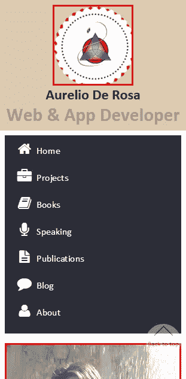

# 使用 Saveba.js 节省慢速连接的带宽

> 原文：<https://www.sitepoint.com/saving-bandwidth-slow-connections-saveba-js/>

性能、可访问性和安全性是过去几个月讨论最多的话题，至少在我看来是这样。我对它们非常感兴趣，我试图通过阅读这些领域的大师们揭示的新技术和最佳实践来了解每个主题。如果你是一个前端开发人员，你也应该这样做，因为这些是目前最热门的话题。

在本文中，我将通过讨论我开发的名为 Saveba.js 的 JavaScript 库来关注性能。它试图通过避免基于用户连接下载一些资源来提高网站的性能，从而改善用户体验。我还将解释我为什么开发它，详细说明开发人员当前使用的方法有什么问题。

## 问题是

当人们谈论性能时，讨论最终总是包括移动。诚然，网站应该针对任何设备和连接进行优化，但家庭和办公室连接通常比移动连接更快。今天优化网站的一些最常见的技术是合并和缩小 CSS 和 JavaScript 文件，异步加载 JavaScript 文件，提供现代字体格式(WOFF 和 WOFF2)，优化关键渲染路径等。

另一个要考虑的重要概念是图像的优化。根据 [HTTPArchive](http://httparchive.org) , [的最新报告，平均来说，图片占一个页面总重量的 60%以上](http://httparchive.org/interesting.php#bytesperpage)。为了解决这个问题，许多开发人员使用 Grunt 或 Gulp 之类的工具，或者像 [TinyPNG](https://tinypng.com/) 或 [JPEGMini](http://www.jpegmini.com/) 之类的服务来减轻他们的重量。另一个实践是使用新的`srcset`属性和新的`picture`元素来提供针对视口大小优化的图像版本。但这还不够。

回到八月份，[我写了一篇关于网络信息 API](http://code.tutsplus.com/tutorials/html5-network-information-api--cms-21598) 的文章，在文章中我表达了我对这种方法的局限性的担忧。我特别写道:

> 虽然这种方法可以很好地提供大小和分辨率合适的图像，但并不是在所有情况下都理想，视频内容就是一个例子。在这些情况下，我们真正需要的是关于设备网络连接的更多信息。

我想表达的是，如果用户的连接速度非常非常慢，他/她可能不会关心一些修饰图片或资源，而是希望专注于真正重要的东西。请考虑以下图片，它们代表了在三星 Galaxy S3 上看到的我的网站的当前版本:



在这个截图中，我用红色边框标记了两个图像:一个标志和一个我的图像。现在，问题是:“一个 2G 网络用户会关心这些图片吗，即使它们已经过大量优化？”不出意料，答案是“没有！”因此，即使我可以为小型设备优化这些图像，我真正需要的是完全避免为具有给定连接类型或一组连接(如 GPRS、EDGE 和 UMTS)的用户下载这些图像。另一方面，我确实想为使用快速连接的小型设备访问我的网站的用户显示这些图像。我解决这个问题的尝试以创建 Saveba.js 而告终。

## Saveba.js 简介

[Saveba.js](https://github.com/AurelioDeRosa/Saveba.js) 是一个 JavaScript 库，它依靠[网络信息 API](http://w3c.github.io/netinfo/) ，试图通过删除不必要的资源(目前仅图片)为慢速连接的用户节省带宽。我说的“移除”是指 Saveba.js 用 1×1 px 的透明 GIF 替换图像，这样用户在浏览网站时就不会有破损的图像。关于什么被认为是不必要的，如果用户的连接很慢，该库认为任何非缓存的图像都是不必要的。任何不在浏览器缓存中的非内容图像(具有空`alt`属性的图像)对于普通连接来说都是不必要的。如果用户有快速连接，库不会执行任何操作。

有关如何对连接进行分类的更多信息，请参考库的[自述文件。请注意，由于 Saveba.js 还处于非常早期的阶段，我强烈建议您不要在生产中使用它。但是，您可能需要密切关注它。](https://github.com/AurelioDeRosa/Saveba.js/blob/master/README.md)

## Saveba.js 要点

在这一节中，我将重点介绍一些代码，向您展示我是如何创建这个库的。首先，我设置了一些默认值，这将有助于对正在使用的连接进行分类，并避免对开发人员希望忽略的任何资源进行任何更改:

```
// Default values.
   // Later exposed as saveba.defaults
   var defaults = {

   // A NodeList or an Array of elements the library must ignore
   ignoredElements: [],

   // A Number specifying the maximum speed in MB/s after which
   // a connection isn't considered slow anymore
   slowMax: 0.5,

   // A Number specifying the minimum speed in MB/s after which
   // a connection is considered fast
   fastMin: 2
};
```

第二步是检测正在使用的浏览器是否支持网络信息 API。如果 API 没有实现，我将终止代码的执行:

```
var connection = window.navigator.connection    ||
                 window.navigator.mozConnection ||
                 null;

// API not supported. Can't optimize the website
if (!connection) {
   return false;
}
```

第三步是根据当前配置和支持的 API 版本对正在使用的连接进行分类:

```
// Test whether the API supported is compliant with the old specifications
var oldApi = 'metered' in connection;
var slowConnection = (oldApi && (connection.metered || connection.bandwidth < defaults.slowMax)) ||
   (!oldApi && (connection.type === 'bluetooth' || connection.type === 'cellular'));
var averageConnection = oldApi &&
   !connection.metered &&
   connection.bandwidth >= defaults.slowMax &&
   connection.bandwidth < defaults.fastMin;
```

接下来，我检索库可以优化的资源(目前只有图像),并过滤浏览器缓存中或开发人员希望忽略的资源:

```
var elements;
if (slowConnection) {
   // Select all images (non-content images and content images)
   elements = document.querySelectorAll('img');
} else if (averageConnection) {
   // Select non-content images only
   elements = document.querySelectorAll('img[alt=""]');
}
elements = [].slice.call(elements);

if (!(defaults.ignoredElements instanceof Array)) {
   defaults.ignoredElements = [].slice.apply(defaults.ignoredElements);
}

// Filter the resources specified in the ignoredElements property and
// those that are in the browser's cache.
// More info: http://stackoverflow.com/questions/7844982/using-image-complete-to-find-if-image-is-cached-on-chrome
elements = elements.filter(function(element) {
   return defaults.ignoredElements.indexOf(element) === -1 ? !element.complete : false;
});
```

最后，我通过在一个名为`data-saveba`的属性中保存对原始资源的引用，用占位符替换剩余的资源:

```
// Replace the targeted resources with a 1x1 px, transparent GIF
for(var i = 0; i < elements.length; i++) {
   elements[i].dataset.saveba = elements[i].src;
   elements[i].src = transparentGif;
}
```

## 如何在你的网站中使用它

要使用 [Saveba.js](https://github.com/AurelioDeRosa/Saveba.js) ，请下载“src”文件夹中的 JavaScript 文件，并将其包含在您的网页中。

```
<script src="path/to/saveba.js"></script>
```

库会自动完成它的工作，所以你不需要调用任何方法。Saveba.js 还公开了一个名为`saveba`的全局对象，可以作为`window`对象的一个属性，以防您想通过`destroy()`方法配置它或撤销它的更改。

在下一节中，我们将简要讨论如何使用`destroy()`方法，而对于配置，您可以参考[官方文档](https://github.com/AurelioDeRosa/Saveba.js/blob/master/README.md)(我不想重复内容)。

### `destroy()`

如果您想删除由 Saveba.js 执行的更改，您可以调用`saveba`对象的`destroy()`方法。例如，让我们假设已经执行了更改的页面有一个 ID 为`show-images-button`的按钮。您可以将事件侦听器添加到 click 事件，该事件将恢复所有资源，如下所示:

```
<script>
document.getElementById('show-images-button').addEventListener('click', function(event) {
   saveba.destroy();
});
</script>
```

## 支持的浏览器

Saveba.js 完全依赖于[网络信息 API](http://w3c.github.io/netinfo/) 的存在，因此它可以在支持该 API 的相同浏览器中工作，这些浏览器是:

*   火狐 30+。在 Firefox 31 之前，浏览器支持最早版本的 API。在 Firefox 31 中，桌面上的 API [已经被禁用](https://developer.mozilla.org/en-US/Firefox/Releases/31/Site_Compatibility)
*   Chrome 38+，但它只适用于 Android 版 Chrome、iOS 版 Chrome 和 ChromeOS
*   歌剧 25+
*   Android 2.2+浏览器

## 演示

要查看 Saveba.js 的运行情况，您可以查看一下[现场演示](http://aurelio.audero.it/demo/saveba.js/)。

## 结论

在本文中，我描述了当前优化网站实践的一些局限性，这促使我创建了 Saveba.js。后者是一个 JavaScript 库，它依赖于网络信息 API，试图通过删除不必要的资源来为慢速连接的用户节省带宽。介绍完之后，我解释了这个库是如何工作的，以及如何在你的网站中使用它，尽管目前你真的不应该在产品中使用它。

我想再次强调，这是一个实验性很强的库，所用的解决方案并不可靠。不管你喜欢它还是不喜欢它，我真的很想知道你的意见，所以我邀请你来评论。

## 分享这篇文章