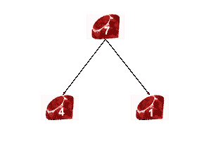
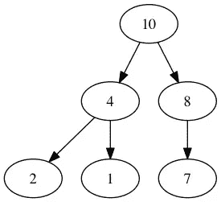
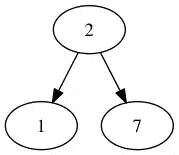
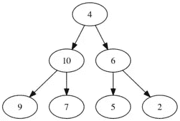

# Ruby 中的堆数据结构

> 原文：<https://www.sitepoint.com/heap-data-structure-ruby/>



数据结构和算法的研究在 Ruby 社区中并没有很大的追随者，因为我们经常会问“这有什么意义？”实际上，我们很少需要实现堆栈和队列这样的经典结构。但是，通过学习它们，我们可以提高对代码进行推理的能力。更重要的是，数据结构学习起来非常有趣！

在本文中，我们将介绍“堆”数据结构以及一些相关的算法。我假设您对渐近符号和 Ruby 有基本的了解。

## 动机

我们都有太多的电子邮件。在一个示例中，我们已经成功地为收件箱中的每封电子邮件分配了一个优先级或一个键值(即一个数字)，我们希望能够做到以下几点:

1.  获取具有最大密钥的电子邮件
2.  删除并获取具有最大密钥的电子邮件

这将不得不处理大量的电子邮件，所以我们希望这些操作相当快，渐近地说。我们应该使用什么样的数据结构来实现这些目标？结果是，通过使用堆，我们在\(O(1)\)时间内执行操作#1，在\(O(\log_2{n})\)时间内执行操作#2。

## 概念

更具体地说，我们将处理一个“最大堆”。从现在开始，我们将互换使用术语“最大堆”和“堆”。最大堆可以被视为部分完整的二进制文件，如下所示:



它的特殊之处在于，对于任何节点，该节点的子节点的键都小于或等于该节点的键。注意，在上图中，每个节点的键都写在节点中。通常，堆实际上是以数组的形式存储的。所以我们上面的例子应该是这样的:

```
[10, 4, 8, 2, 1, 7]
```

我们通过从上到下从左到右遍历二叉树表示来创建数组，并将节点键附加到数组中。重要的是要知道不是所有的数组都是堆。例如，举个例子:

```
[2, 1, 7]
```

我们可以把它想象成:



因为\(7 > 2\)它不是堆。基本上，堆是一个具有特殊条件的数组，当可视化为树时，最大堆属性成立。换句话说，每个节点的子节点的键值都小于节点本身的键值。

## 构造堆

我们遇到的第一个问题是，我们的电子邮件列表可能有一个任意排序的优先级阵列，可能不会形成一个堆。我们如何得到这个数组，并对它进行排序，使它形成一个堆？

这似乎是一个很复杂的问题，很难一下子解决，所以让我们先处理一个小版本的问题。假设我们得到了一个数组，它离变成一个堆只有一步之遥。因此，我们有一些节点`v`,因此它的左右子树都是堆，但是以`v`为根的子树不是堆:



我们可以递归地解决这个问题。首先，把 4 和 10 调换一下。然后，我们再次遇到几乎相同的问题，只是在树中的不同位置，因为\(9 > 4\)和\(7 > 4\ ),所以我们可以使用相同的方法解决它。我们一直这样做，直到“下沉”到树的底部，变成一片叶子。我们的方法是这样工作的:

```
fix_one_error(array, index):
1\. If array[index] is a leaf node or is greater than both its children, return.
2\. larger_index = the index of the larger child of the node at array[index] 
3\. Swap array[i] and array[larger_index]
4\. fix_one_error(array, larger_index)
```

好的，让我们用 Ruby 实现这些想法。首先，我们需要几个方法来给出数组表示中给定节点的子节点的索引:

```
class Heap
  attr_accessor :heap_size, :array_rep
  def left_child(index)
    2*index + 1
  end

  def right_child(index)
    2*index + 2
  end

  def left_child_key(index)
    @array_rep[left_child(index)]
  end

  def right_child_key(index)
    @array_rep[right_child(index)]
  end
end
```

其次，我们需要某种方法来判断给定的元素是否是叶节点:

```
class Heap
...
  def leaf_node?(index)
    return index >= @heap_size/2
  end
...
end
```

最后，我们需要能够判断一个节点是否已经满足最大堆属性(在这种情况下，我们不需要一直修复错误):

```
class Heap
...
  def satisfied?(index)
    @array_rep[index] >= left_child_key(index) and 
      @array_rep[index] >= right_child_key(index)
  end
...
end
```

这四个方法如何工作的细节并不十分重要，但是画出一些标记了数组索引的堆可以使它们的内部机制非常清楚。现在，我们可以完整地写出我们的算法:

```
class Heap
...
  def fix_one_error(index)
    return if leaf_node?(index) || satisfied?(index)

    left_child_key = @array_rep[left_child(index)]
    right_child_key = @array_rep[right_child(index)]

    larger_child = if left_child_key > right_child_key then left_child(index)
      else right_child(index) end

    @array_rep[index], @array_rep[larger_child] = @array_rep[larger_child], 
      @array_rep[index]

    fix_one_error(larger_child)
  end
...
end
```

请注意，我们非常严格地遵循了伪代码/描述。重复交换，直到该节点满足最大堆属性，或者它沿着树向下浮动成为叶节点。

## “修复一个错误”的复杂性

乍一看，我们可能认为我们的`fix_one_error`算法是\(O(n)\，但是在实际求解递归时，我们发现它是\(O(\log_2{n})\)。直观的推理非常清楚:调用`fix_one_error`产生的每个交换需要\(O(1)\)时间，当我们有\(n\)个元素时，我们的树有\(\log_2{n}\)个层次，所以我们的时间复杂度是\(O(\log_2{n})\)。

## 完成建筑工程

但是，我们还没有完全解决将任意数组转换成最大堆的问题。到目前为止，我们只解决了只有一个错误的情况。正好，我们可以反复使用“一个错误案例”来解决整个问题！

首先，注意叶节点本身自动满足 max heap 属性，因为它们没有任何子节点。现在，考虑比叶子高一级的节点，即只有叶子节点作为孩子。这些节点最多只能满足最大堆属性的一个交换。这意味着我们可以使用我们的`fix_one_error`函数来确保比叶子高一级的所有节点形成堆(或者，满足最大堆属性)。现在，当我们向上移动另一层时，我们知道下面的所有东西都满足属性，所以我们可以再次使用`fix_one_error`！本质上，从叶子节点开始，我们可以重复应用`fix_one_error`来将任何数组转换成堆。

## 堆构造的复杂性

当被问及构造一个堆的时间复杂度时，我们可以很容易地回答。对于\(n\)个节点，在每个节点上运行`fix_one_error`，每个节点的复杂度为\(O(log_2{n})\。所以我们的堆构造算法应该是\(O(n\log_2{n})\，对吧？

虽然这是正确的，但事实证明我们可以做得更好(即找到一个更紧的界限)！我们对于`fix_one_error`的复杂度与它在整个树中的起始层次有关:它越高，花费的时间就越多。其实这种关系是线性的。换句话说，`fix_one_error`可以被表征为\(O(h)\)，其中\(h\)是从调用`fix_one_error`的叶节点开始的高度。但是，随着我们在树中向上移动，节点越来越少。如果你在分析复杂度的时候花时间去总结结果，你可以证明我们的算法可以在(O(n)时间内运行。

## 履行

说得够多了，让我们看看创建堆的完整实现:

```
class Heap
...
  def create_max_heap
    (0..@heap_size/2-1).to_a.reverse.each do |index|  
      fix_one_error(index)
    end
  end
...
end
```

哇，这太简洁了！基本上，我们从叶节点开始，然后逐渐沿着树向上移动，边走边修正错误。

## 堆上的操作

让我们回到电子邮件的问题上来。假设我们构造了一个堆，并想从中获取最大优先级的元素。简单！只需返回第一个元素:

```
class Heap
...
  def get_max
    array_rep[0]
  end
...
end
```

提取和返回这个元素的过程稍微复杂一点，但是真正显示了堆的优点。我们取出堆中的最后一个元素，并将其与第一个元素(即最大元素)交换。因此，除了新的第一个元素之外的所有内容仍然满足 max heap 属性。现在，在根节点上使用`fix_one_error`使数组再次成为堆！但是，在这之前，减少堆的大小，一劳永逸地去掉最后一个元素(它曾经是堆的最大元素)。让我们用 Ruby 来看看:

```
class Heap
...
  def get_and_remove_max
    array_rep[@heap_size-1], array_rep[0] = array_rep[0], array_rep[@heap_size-1]
    @heap_size -= 1
    fix_one_error(0)
  end
...
end
```

## 包装它

我希望您喜欢这次 Ruby 实现的堆(以及隐含的优先级队列)之旅。请在下面的评论中回答任何问题！

## 分享这篇文章