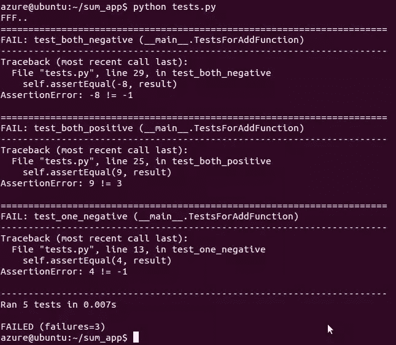
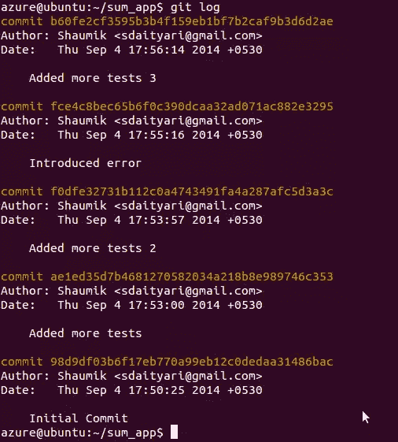
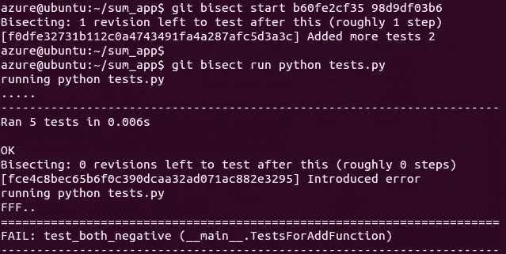

# 使用单元测试在 Git 中自动调试

> 原文：<https://www.sitepoint.com/automate-debugging-git-unit-tests/>

前阵子我发表了一篇关于[使用两个命令`blame`和`bisect`在 Git](https://www.sitepoint.com/debugging-git-blame-bisect/) 中调试一个代码库的文章。Git `blame`涉及检查文件每行的作者，而`bisect`涉及遍历提交(使用[二分搜索法](http://en.wikipedia.org/wiki/Binary_search_algorithm))来找到引入 bug 的作者。在这篇文章中，我们将看到如何自动化`bisect`的过程。

为了提醒您，git `bisect`包括几个步骤，总结如下:

*   用`git bisect start`启动等分向导
*   分别选择“好的”和“坏的”提交，或者不存在和存在 bug 的已知提交
*   将待测试的提交指定为“好”或“坏”,直到 Git 找出引入 bug 的提交
*   用`git bisect reset`退出向导

为了了解整个过程，你可以看看这个[截屏](http://randyfay.com/node/55)，它详细展示了调试过程是如何工作的。

自然，第三步很耗时——Git 会一个接一个地向您展示提交，您必须在检查该提交中是否存在 bug 之后，将它们标记为“好”或“坏”。

当我们编写脚本来自动化调试过程时，我们基本上将运行第三步。我们开始吧！

## 准备环境

在这篇文章中，我将用 Python 编写一个小模块，其中包含一个将两个数相加的函数。这是一个非常简单的任务，我这样做只是为了演示。代码是不言自明的，所以我就不赘述了。

```
#add_two_numbers.py
def add_two_numbers(a, b):
    '''
        Function to add two numbers
    '''
    addition = a + b
    return addition
```

为了自动化 Git 二等分的过程，您需要为您的代码编写测试。在 Python 中，我们将使用`unittest`模块来编写测试用例。下面是一个基本测试的样子。

```
#tests.py
import unittest
from add_two_numbers import add_two_numbers

class TestsForAddFunction(unittest.TestCase):

    def test_zeros(self):
        result = add_two_numbers(0, 0)
        self.assertEqual(0, result)

if __name__ == '__main__':
    unittest.main()
```

我们可以编写更多这样的测试，但这只是为了演示如何继续下去。事实上，你应该写更多的测试用例，因为你的程序和应用将会比这复杂得多。

要运行单元测试，执行包含测试用例的`tests.py`文件。

```
python tests.py
```

如果测试通过，您应该得到以下输出。


现在让我们在函数中引入一个错误并提交代码。

```
def add_two_numbers(a, b):
    '''
        Function to add two numbers
    '''
    addition = a + 0
    return addition
```

为了验证测试是否失败，让我们再次运行它们。



让我们再添加几个提交，以便引入错误的提交不是最后一个。



## 开始平分过程

对于 git 二分向导，我们将选择最近一次提交为坏提交(`b60fe2cf35`)，第一次提交为好提交(`98d9df03b6`)。

```
git bisect start b60fe2cf35 98d9df03b6
```

此时，Git 向我们指出一个提交，并询问我们这是一个好的还是坏的提交。这时我们告诉 Git 为我们运行测试。它的命令如下。

```
git bisect run [command to run tests]
```

在我们的例子中，结果将是如下。

```
git bisect run python tests.py
```

当我们向 Git 提供运行测试的命令，而不是要求我们，Git 为每个修订运行这些测试，并决定提交应该被分配好还是坏。



一旦 Git 完成了对每个提交的测试，它就会像变魔术一样找出是哪个提交引入了错误！


一旦找到提交，不要忘记用`git bisect reset`重置向导。

代替您的单元测试，您也可以创建一个带有自定义退出代码的自定义 shell 脚本。一般来说，退出代码`0`被认为是成功的，其他的都是失败的。

## 最后的想法

随着代码库规模的增加，为您编写的每一小段代码编写单元测试变得很有必要。编写测试可能看起来很耗时，但是正如您在本例中所看到的，从长远来看，它们有助于您进行调试并节省您的时间。

你的团队如何调试代码中的错误？请在下面的评论中告诉我们。

## 分享这篇文章