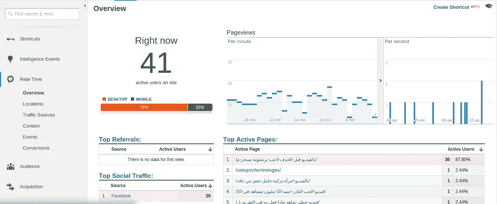
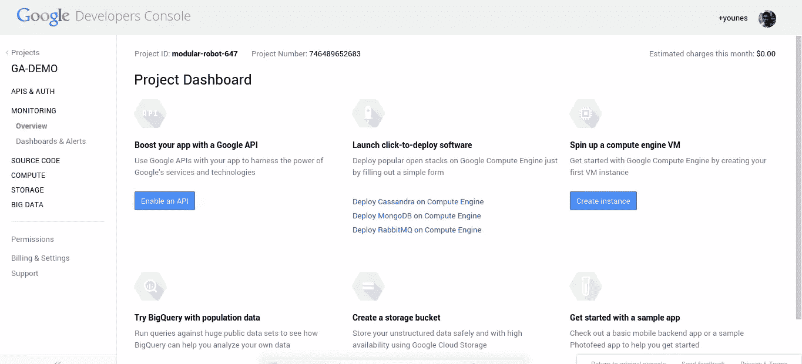
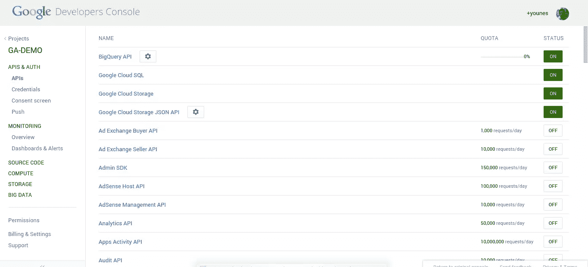
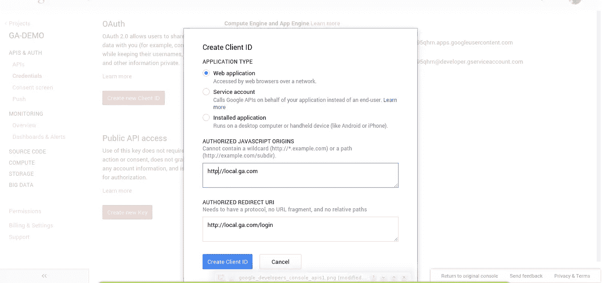
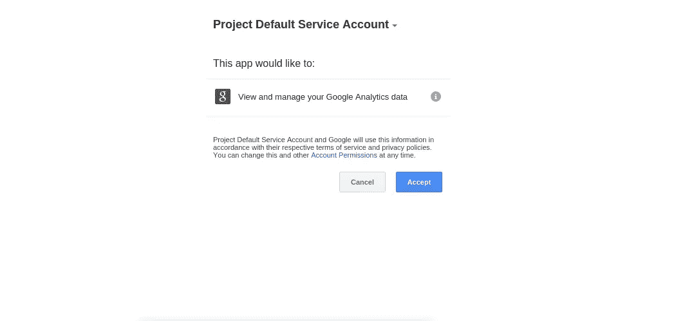

# 在 PHP 中使用 Google 分析 API:登录

> 原文：<https://www.sitepoint.com/using-google-analytics-api-php-logging/>

在这个系列中，我们将看到如何使用 Google Analytics API 通过 PHP 与 Google Analytics 数据进行交互。我们将在[家园改进版](https://www.sitepoint.com/quick-tip-get-homestead-vagrant-vm-running/)上使用 [Laravel](http://laravel.com/docs/installation) ，但是你可以在任何开发环境上使用任何框架——Laravel+HI 只是最快和推荐的起点。

## 要求

为了能够跟进，你需要有一个谷歌分析账户，可以从[谷歌分析页面](http://www.google.com/analytics/)获得。

你还需要熟悉谷歌分析仪表板的基本用法。


## 我们要建造什么？

在本文中，我们将构建一个看起来像 [Google Analytics Explorer](http://ga-dev-tools.appspot.com/explorer/) 的应用程序，但为了简短起见，我们将限制功能并讨论如何扩展我们的演示。

## 谷歌分析 API

### 概观

Google Analytics API 分为多个 API。我们根据自己的需求使用每种 API:

*   [管理 API](https://developers.google.com/analytics/devguides/config/mgmt/v3/) :
    提供对谷歌分析配置数据的访问，如账户、属性、视图、目标等

*   [元数据 API](https://developers.google.com/analytics/devguides/reporting/metadata/v3/) :
    提供对列(维度、指标)列表的访问，这样我们就不需要在我们的应用中硬编码它们。

*   [核心报告 API](https://developers.google.com/analytics/devguides/reporting/core/v3/) :
    提供对仪表板数据的访问，大部分任务都可以通过该 API 完成。

*   [实时报告 API](https://developers.google.com/analytics/devguides/reporting/realtime/v3/) :
    让你可以访问实时数据，就像你的谷歌分析仪表板上的那个。在撰写本文时，这个 API 还处于测试阶段。



*   这个 API 允许你使用 javascript 在你的网站上创建和嵌入仪表盘。

*   [MCF 报告 API](https://developers.google.com/analytics/devguides/reporting/embed/v1/) :
    多通道漏斗报告 API 使您能够为经过验证的用户请求多通道漏斗数据，这意味着您可以从多个来源查询数据，并将其用于您自己的统计。

在本文中，我们将重点关注管理 API、元数据 API 和核心报告 API。首先，让我们从一些基本的用法开始。

### 基本用法

要开始使用 API，我们需要在 [Google 开发者控制台](https://console.developers.google.com/)上创建一个新项目。


你的项目仪表盘应该是这样的:


现在我们有一个项目可以使用任何提供的谷歌服务。因为我们打算使用谷歌分析 API，我们需要激活它。

当你想使用 Google API 时，你需要提供两件东西:

1)您的 API 凭证。2)你的开发者密钥。

进入菜单，`API & AUTH`，选择“API”并启用`Analytics API`


在`API & AUTH`菜单下，选择`Credentials`链接，然后选择`Create new client ID`。

为我们的应用程序选择`Web Application`，然后输入您的网站 URL 和您的登录重定向页面 URL。因为我们将在我们的演示中使用`Laravel`，你可以在开发阶段使用`localhost:8000`，并且不要忘记在你的 URL 中将`https`改为`http`。



在页面的底部，你有`Public API access`。我们需要创建一个新的访问密钥。

1)为我们的演示选择浏览器键选项。在 http referrers 框中，您可以将该值留空以接受来自任何地方的请求，或者指定您的域名地址。

现在我们已经准备好开始使用 API 了。

### 限额和配额

当使用 Google Analytics API 时，我们受限于每天、每秒等的请求数量。您可以阅读完整的[文档](https://developers.google.com/analytics/devguides/reporting/core/v3/limits-quotas)页面了解更多信息。

### 项目配置

我假设你已经知道如何在[家园改良](https://www.sitepoint.com/quick-tip-get-homestead-vagrant-vm-running/)上建立一个新的 [Laravel 项目](http://laravel.com/docs/installation)。

我们需要在我们的`composer.json`中要求`"google/api-client": "dev-master"`，并更新依赖关系。

在我的`app/config/`中，我将创建一个名为`analytics.php`的文件，我可以在其中放置我的配置。

```
return [
    'app_name'          => 'Your app name', //Can be anything
    'client_id'         => 'Your ID',//can be found on the credentials page
    'client_secret'     => 'Your secret ID',//on the credentials page
    'api_key'           => 'Your key'//can be found at the bottom of your credentials page
];
```

为了保持事物的分离，我将在我的`app`目录中创建一个名为`src`的文件夹，并创建一个名为`GA_Service.php`的文件，在那里我可以放置所有的请求逻辑。

```
// app/src/GA_Service.php

class GA_Service{
    //...
}
```

试图在我们的代码中访问这个类会导致一个`Class not found`异常，所以我们可以利用 composer 自动加载特性。

在`composer.json`文件中，转到 autoload classmap 部分，并将我们的路径添加到列表中。

```
// composer.json

...
"autoload":{
    "classmap": [
        ...
        ,
		"app/src"
    ]
}
```

保存更改后，不要忘记运行`composer dump-autoload`。

默认情况下，Laravel 在`app/controllers`目录中包含一个名为`HomeController.php`的文件。我们将使用它作为我们的主要应用控制器。

回到`GA_Service`类；为了与 Google APIs 通信，我们使用了一个名为`Google_Client`的类。在我们的构造函数中，我们将创建一个新的实例，并开始填充必要的参数。

```
public function __construct( Google_Client $client ){
	$this->client = $client;
	$this->init();
}

private function init(){
		$this->client->setClientId(Config::get('analytics.client_id') );
		$this->client->setClientSecret(Config::get('analytics.client_secret'));
		$this->client->setDeveloperKey(Config::get('analytics.api_key'));
		$this->client->setRedirectUri('http://localhost:8000/login');
		$this->client->setScopes(array('https://www.googleapis.com/auth/analytics'));
}
```

我们没有在构造函数中实例化该类，而是将它作为参数传递，并让 Laravel 的 IoC 为我们解析它。要了解更多细节，请务必查看这篇文章。

init 方法的前三行是不言自明的；`Config::get`方法从`analytics.php`文件中获取配置。

重定向 URI 方法是在 Google 验证后使用的重定向 URL，它应该与之前在 Google 控制台仪表板上注册的 URL 相匹配。

`setScope`方法是我们指定应用程序所需的访问级别的地方:

*   [https://www.googleapis.com/auth/analytics](https://www.googleapis.com/auth/analytics)
    查看和管理谷歌分析数据

*   [https://www.googleapis.com/auth/analytics.manage.users](https://www.googleapis.com/auth/analytics.manage.users)
    查看和管理分析账户的用户权限。

*   [https://www.googleapis.com/auth/analytics.readonly](https://www.googleapis.com/auth/analytics.readonly)
    只读访问分析 API。

设置好 google 客户端后，我们将设置登录流程:

```
// app/src/GA_Service.php
public function isLoggedIn(){
	if (isset($_SESSION['token'])) {
	  $this->client->setAccessToken($_SESSION['token']);
	  return true;
	}

	return $this->client->getAccessToken();
}//authenticate

public function login( $code ){ 	$this->client->authenticate($code);
 	$token = $this->client->getAccessToken();
  	$_SESSION['token'] = $token;

	return token;
}//login

public function getLoginUrl(){
	$authUrl = $this->client->createAuthUrl();
	return $authUrl;
}//getLoginUrl
```

*   `isLoggedIn`:如果用户有要使用的访问令牌，则返回 true。
*   `getLoginUrl`:如果用户没有登录，我们得到一个认证 URL。
*   `login`:我们已经在 Google API 仪表板上设置了一个重定向 URL，我们收到了一个`$_GET['code']`参数，我们可以用它来获取请求的令牌。

让我们利用现有的资源。在我们的控制器内部:

```
// app/controllers/HomeController.php

class HomeController extends BaseController {
	private $ga;

	public function __construct( GA_Service $ga ){
		$this->ga = $ga;
	}

	public function index()
	{
		if( $this->ga->isLoggedIn() ){
			return 'Show home page';
		}
		else{
            $url = $this->ga->getLoginUrl();
			return View::make('login', [ 'url' => $url ]);

		}

	}//index
}//class

// app/routes.php

Route::get('/', 'HomeController@index');
Route::get('/login', 'HomeController@login');
```

我们将`GA_Service`注入我们的控制器，当用户点击我们的索引路径时，我们检查他是否登录。如果没有，我们生成认证 URL。



接受请求权限后，您将被重定向到带有`code`参数的登录页面。

```
// app/controllers/HomeController.php
public function login(){
	if( Input::has('code') ){
		$code = Input::get('code');
		$this->ga->login($code);

		return "Go to the home <a href='/'>page</a>";
	}
	else{
		return "Invalide request parameters";
	}//else
}//login
```

在我们的登录函数中，我们测试`code`是否存在。如果是这样，我们将它传递给我们的`GA_Service::login`函数，这样我们就可以对用户进行身份验证并获得一个令牌。

### 包扎

在这一部分，我们讨论了谷歌分析 API 的基本用法。此时，我们有了一个可以用来查询 API 列表的令牌，在下一部分中，我们将继续使用 Google Analytics API 来构建我们的演示应用程序。

## 分享这篇文章