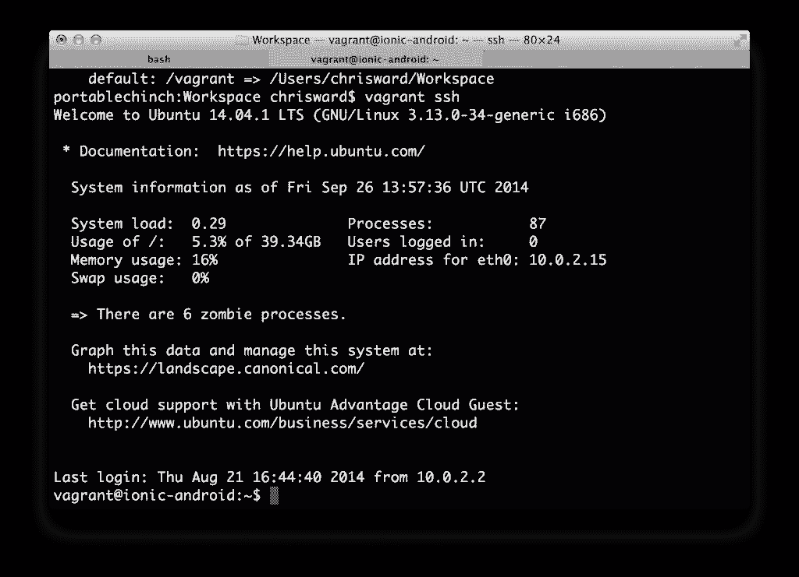

# Ionic Box，一个混合移动应用的流浪配置

> 原文：<https://www.sitepoint.com/ionic-box-vagrant-configuration-hybrid-mobile-apps/>

[vagger](http://www.vagrantup.com/)是一个创建和管理虚拟环境的工具，帮助许多开发人员不必关心*“在我的机器上工作……”*的问题。

vagger 创建了可重复使用的开发系统，可以一次又一次地使用，帮助您保持系统的整洁，避免过多的安装。

如果你感兴趣的话，SitePoint 有大量的文章和教程可能会派上用场。

我将讨论一个使用 [Ionic 框架](http://ionicframework.com/)开发移动混合应用的浮动配置。

## 为手机 app 流浪？！

当我发现的时候我很惊讶！我见过主要在 web 开发中使用的流浪者。用的是 [Laravel](http://laravel.com/docs/homestead) 、 [Phalcon](https://www.sitepoint.com/quick-tip-install-zephir-phalcon-2-vagrant/) 等框架，甚至还有 [WordPress](https://www.sitepoint.com/wordpress-meets-vagrant-vvv/) 等 CMS，但不用于移动开发。

即便如此，爱奥尼亚人还是设法创造出了这种适合我们使用的流浪配置。

对于 iOS 开发者来说，Ionic Box 现在不会为你做太多事情，因为出于各种法律原因，Ionic Box 不能用于 iOS 开发。但是，对于 Android 开发来说很棒。

## 使用离子盒进行设置

要得到离子盒，你必须安装[流浪者](https://www.vagrantup.com/downloads.html)和 [VirtualBox](https://www.virtualbox.org/) 。

在确保您拥有这些之后，执行

```
vagrant init drifty/ionic-android
vagrant up
vagrant ssh 
```

这将下载流浪配置文件，启动虚拟机，并连接到它。第一次运行时，它会下载安装了这些应用程序的 Ubuntu 14.04 (Trusty Tahr):

*   节点. js
*   饭桶
*   Java SDK 7 更新 65 (OpenJDK7)
*   阿帕奇[蚂蚁](http://ant.apache.org/)
*   Android SDK
*   科尔多瓦
*   离子框架
*   [期待](http://www.nist.gov/el/msid/expect.cfm)

这个过程需要一些时间，所以要有耐心。



既然 Ionic Box 已经启动并运行，您就可以开始使用 Ionic Framework 为 Android 编写移动混合应用程序了。

## 安装后

我不打算创建新的应用程序。相反，我将使用 Ionic 提供的一个模板，tabs 模板。

执行

```
ionic start TabsDemo tabs
cd TabsDemo
ionic platform add android 
```

第一个命令从 tabs 模板创建一个名为 *TabsDemo* 的项目，然后添加必要的文件和配置，使其成为一个 Android 应用程序。

要运行该应用程序，请使用

```
ionic run android 
```

它应该为 Android 构建应用程序，然后将其安装在设备中。

> 如果您的 Android 手机有任何问题，比如流浪虚拟机无法识别它，或者任何其他权限问题，尝试通过执行以下命令重新启动 *adb* 服务器

```
sudo /home/vagrant/android-sdk-linux/platform-tools/adb start-server
sudo /home/vagrant/android-sdk-linux/platform-tools/adb kill-server 
```

你可以在流浪者和你的本地机器上找到源文件。在 travel 上，您必须将它们放在`/home/vagrant/`中，而在本地机器上，您可以在您放置 travel 配置文件的同一个目录中找到它们，*，即* `Vagrantfile`。

你可以使用任何你想要的 IDE 来编写你的应用程序，但是我推荐 WebStorm(如果你愿意支付它的价格的话)。

由于 Ionic 使用 Cordova 将应用程序移植到移动平台，因此您可以通过使用 [ngCordova](http://ngcordova.com/) 轻松使用 Cordova 插件。让我们看一个关于[条形码扫描器](https://github.com/wildabeast/BarcodeScanner)插件的例子。

您可以通过执行以下命令来添加插件

```
cordova plugin add https://github.com/wildabeast/BarcodeScanner.git 
```

然后可以在您的代码中使用它，如下所示:

```
module.controller('BarcodeScannerCtrl', function($scope, $cordovaBarcodeScanner) {

  $scope.scanBarcode = function() {
    $cordovaBarcodeScanner.scan().then(function(imageData) {
      // Success! Barcode data is here

    }, function(err) {
      // An error occured.
      // Show a message to the user

    });
  }; 
```

## 结论

流浪者有时可能很难理解，但值得追求，因为它可能非常有用。如果你厌倦了为你的每一个项目配置你的机器，那么 vanguard 就是你合适的工具。如果你在配置你的机器时遇到了问题，那么使用一个预先包装好的 travel box 是解决你的问题的最好方法。

有了这个介绍，你不必安装所有的 Android 开发工具。告别 Android SDK，向 Ionic Box 问好。

## 分享这篇文章