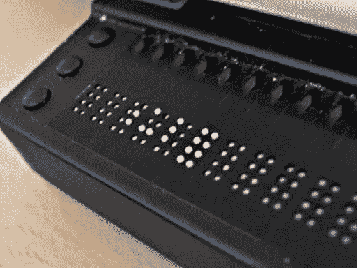
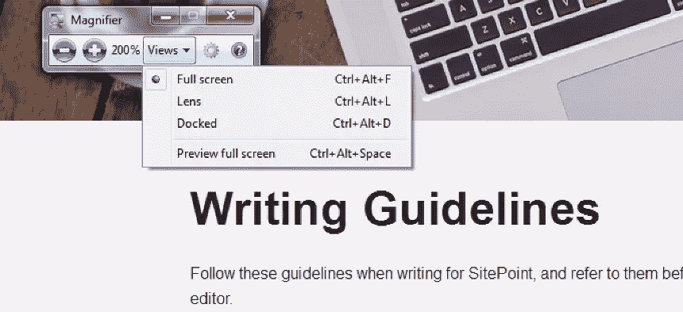
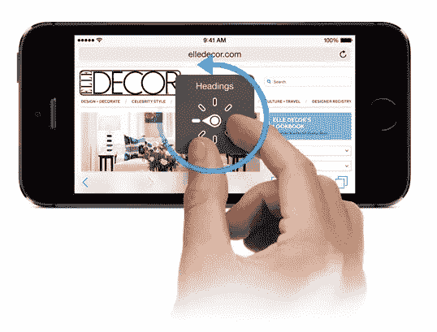
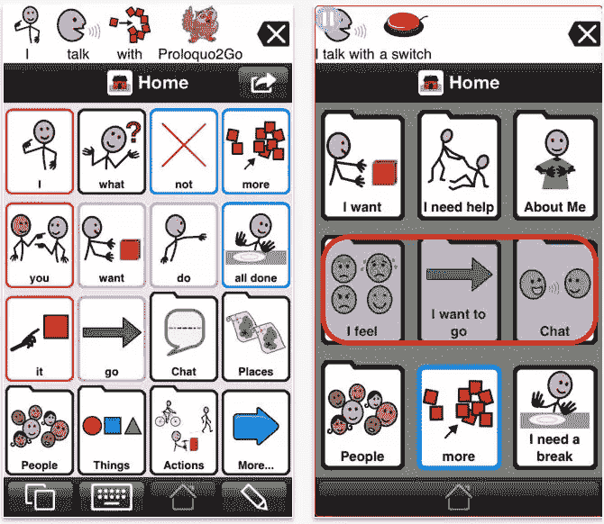
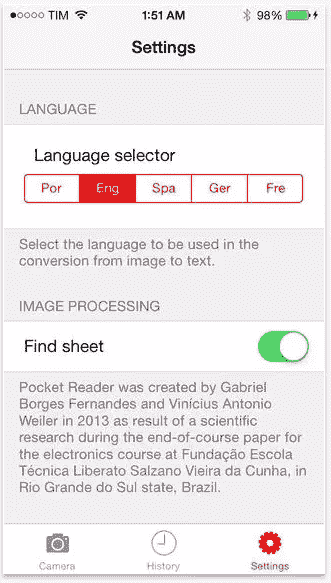
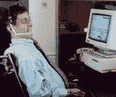
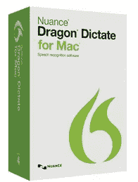
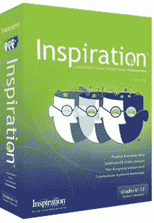

# 辅助技术:这意味着屏幕阅读器，对吗？

> 原文：<https://www.sitepoint.com/assistive-technology-that-means-screen-readers-right/>

如果你是一名网页开发者/设计师，你可能会在工作中遇到缩写“AT”或[辅助技术](http://en.wikipedia.org/wiki/Assistive_technology "wikipedia: Assistive technology ")。人们很容易把“AT”看作是屏幕阅读器的另一个名字，但事实并非如此。

事实上，*辅助技术*包括了传统屏幕阅读器之外的一系列产品和软件。所以，今天我想我们可以扩展一下“at”这个词的一般概念，并强调一下这一类别中一些不太常被提及的例子。

#### 但是首先让我们确切地定义我们所说的“辅助技术”是什么意思。

辅助技术是指一种产品、设备或软件，可以帮助用户完成用其他方式难以完成的功能性任务。由于越来越多的人面临视力问题、听力损失、认知障碍和其他挑战，因此对这项技术的需求越来越大。我在一篇关于[可访问性](https://www.sitepoint.com/how-many-users-need-accessible-websites/)的文章中列出了一些统计数据。

### 可刷新盲文显示器

这项辅助技术是路易·布莱叶在近 200 年前开发的一种用于显示[盲文字符](http://en.wikipedia.org/wiki/Braille "Wikipedia: Braille ")的电磁装置。

**用途:**对于视力有障碍的用户来说，通过在平面上的孔中凸起的圆形针来阅读文本非常有用。

### 屏幕放大镜

微软 Windows 自带一个内置的屏幕放大镜应用程序。这个应用程序实际上从 Windows 98 开始就是 Windows 的一部分，尽管肯定有许多第三方产品执行类似的任务。下图显示了在 sitepoint.com 上运行的屏幕放大镜

**用途:**对于视力受损的用户非常有用，让他们可以轻松增加任何网页或应用程序的可视细节。

### iOS VoiceOver(触摸访问)

苹果在他们的 iOS 辅助功能上投入了很多。VoiceOver 是一个围绕触摸和手势的使用而构建的界面。这当然是各种各样的屏幕阅读器，尽管其中一个是以触摸为中心的。

VoiceOver 包括一个新颖的“转子”功能，允许用户通过页面“拨入”不同的导航路径——例如，通过标题、链接或图像。它包括 30 种语言的内置语音。VoiceOver 可以输出到蓝牙无线盲文显示器。

**用法:**用户可以通过使用宽泛的手势来导航应用程序。它包括一套广泛的功能，如文本输入，盲文显示器，国际语音等。

### Proloquo2Go

Proloquo2Go 网站将其产品描述为:

> “为那些不说话的人发声。”

Proloquo2Go 是一款通讯应用，通过点击按钮、单词预测以及动词和名词的屈折变化，为那些不能说话的人提供发声能力。随着语音驱动界面在我们生活中变得越来越普遍，这变得越来越重要。

### 切换键

我们都曾在某个阶段不小心在打字时忘了按下大写锁定键。虽然对我们大多数人来说这是一个烦恼，但对弱视用户来说这是一个更大的问题，他们可能比其他用户长得多的时间都没有发现这个问题。在区分大小写的输入字段中，这显然是一个大问题。

ToggleKeys 是 Microsoft 为视力或认知障碍的用户设计的辅助功能。当 *Caps-lock* 、 *Num-lock* 和 *Scroll-lock* 键被按下时，电脑会发出声音提示。

| 钥匙 | 声音 |
| 在 | 高音 |
| 离开 | 低沉的声音 |

### 袖珍阅读器——为视障人士提供的印刷文本

该应用程序将印刷文本转换成数字格式，然后用画外音朗读。它与 iPhone、iPad 和 iPod touch 兼容。

Pocket Reader 还可以将其输出转换成英语、法语、德语、葡萄牙语和西班牙语，这对任何旅行者都一样有用。

**用途:**本产品专为视障用户开发，通过将印刷文本转换为数字文本来帮助他们，然后像画外音一样大声朗读这些文本。

### Plus 校长

[principal Plus](http://atto.buffalo.edu/registered/ATBasics/AdaptingComputers/Special/headpointing.php "Headmaster Plus")是头部指向控制系统，适用于那些双手灵活性降低但头部控制良好的人。这是一种允许通过头部运动甚至眼睛运动来完全控制计算机的鼠标技术。

principal Plus 允许用户:

*   观察并跟着指针走
*   以小增量控制头部的运动，以及
*   了解基本的计算机导航。

### 阅读机器

阅读机器使用带有光学字符识别(OCR)软件的照相机或扫描仪。他们将印刷材料转换成更容易理解的电子格式，然后大声地读给用户听。

### 语音识别软件

[Dragon Dictate](http://www.dyslexic.com/dragon-dictate-4-for-mac/ "Dragon Dictate") 是一款用于 Mac OS 的语音识别软件，可以让你通过语音来听写、编辑、转录和控制电脑。

可以执行的任务包括:

*   点击一个链接
*   打开电子邮件
*   撰写和回复电子邮件
*   混合和匹配来自不同录制源的转录

**用途:**它提供具有可定制功能的精确语音识别，这对于认知困难的用户以及手动灵活性有限的用户来说是有益的。作为一个附加功能，该应用程序可以转录音频文件。

### 读写器软件

Ghotit Real Writer Pro 是一款为患有阅读障碍和书写困难的用户开发的读写软件。

其特点包括:

*   语法检查器
*   语音拼写检查器
*   单词预测
*   校对员
*   提供英国、美国、澳大利亚、加拿大、南非和新西兰的字典。

**用法:** Ghotit 帮助患有阅读障碍和书写困难的儿童，纠正与这种疾病相关的拼写和读写问题。

### 思维导图软件

这一次可能会让人大吃一惊。

灵感 9 是一款思维导图软件，它提供了一个思考的平台，包括视觉导图、概述、写作和演示。

空白思维导图是通过从不同科目的模板中进行选择而创建的，例如数学或科学。思考和规划过程开始了，鼓励用户将不同的想法和主题以没有特定的顺序或结构组合在一起，然后软件帮助他们将不同的线索组织成更有凝聚力的作品。

这个思维导图可以通过点击按钮转换成一个更传统的轮廓。

虽然几乎每个人都可以从思维导图中受益，但人们发现思维导图对阅读障碍者尤其有用。

 

## 你知道一些其他的吗？

如果你在屏幕阅读器之外使用了任何其他辅助技术，并且你认为值得一提，请在评论区提出来。

## 分享这篇文章