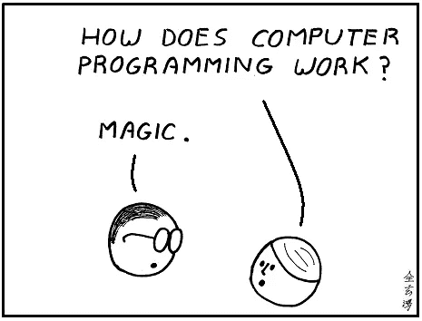
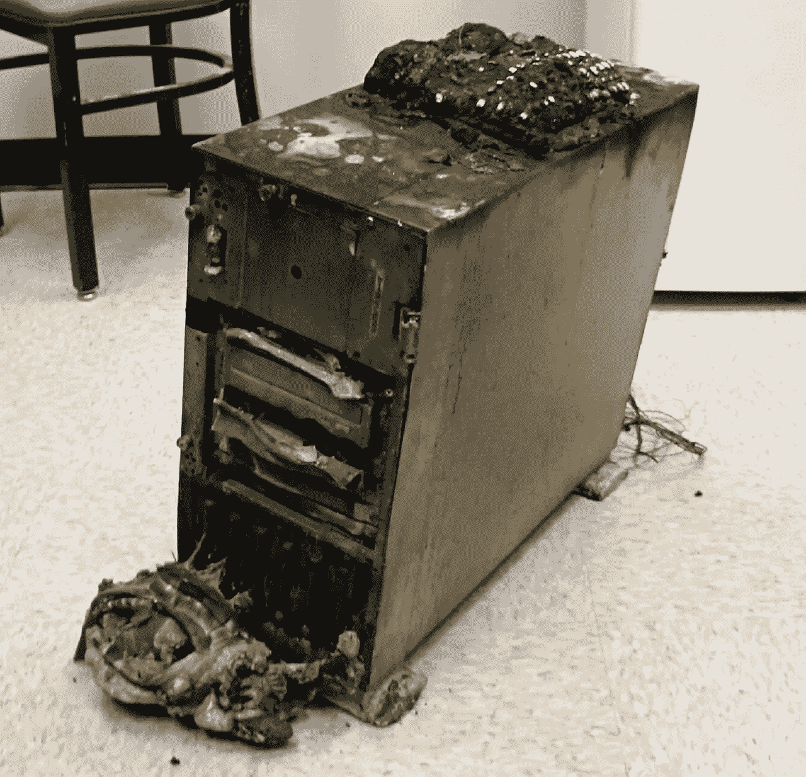

# Web 开发中的 18 个关键疏忽

> 原文：<https://www.sitepoint.com/18-critical-oversights-web-development/>


在过去的几年里，我有机会参与了一些有趣的项目，这些项目本质上很复杂，并且在不断地开发、升级、重构和添加新功能。

本文将涵盖大多数 PHP 开发人员在处理大中型项目时犯的最大编码疏忽。疏忽，例如没有区分开发环境或没有实现缓存和备份。

下面的例子是用 PHP 编写的，但是每个问题背后的思想是通用的。

这些问题的根源主要在于开发者的知识和经验，尤其是 it 的缺乏。我不想攻击任何人，我不认为自己是无所不知的完美开发者，所以请原谅我。

根据我的经验，我们可以将这些问题分为三大类:设计层面、应用层面和数据库层面的疏忽。我们将分别分解每一个。

## 应用层疏忽

### 关闭错误报告进行开发


我唯一能问的问题是:为什么？开发应用程序时，为什么不打开错误报告？

PHP 有许多级别的错误报告，所有这些都应该在开发阶段打开。

如果你认为错误永远不会发生，那么你是在为理想的场景编码，而这种场景只发生在理想的世界里。

错误报告和显示这些错误也是不同的。`error_reporting()`设置错误级别(如通知、警告、致命错误),而`display_errors`控制是否输出这些错误。

错误报告应始终处于开发中的最高设置:`error_reporting(E_ALL);`和`ini_set('display_errors', true);`

*注意:E_ALL 是 PHP 5.4+以来最高的，因为 E_STRICT 错误在 PHP 5.4 中成为 E_ALL 的一部分。如果你使用比 5.4 更老的 PHP 版本，使用`error_reporting(E_ALL | E_STRICT);`来包含严格的错误警告。*

### 抑制错误

**使用 *@* 操作符来抑制错误甚至比根本不打开它还要糟糕**，因为你在有意识地清扫地毯下的污垢。你知道错误正在发生，你只想隐藏它，关闭任务，早点回家。你没有意识到的是，在一个不稳固的基础上建立一些东西会在以后产生更大的后果。

你可以在这里阅读关于这个[的深入解释。](https://www.sitepoint.com/why-suppressing-notices-is-wrong/)

### 代码中任何地方都没有日志记录

开发一个项目必须从一开始就牢记日志。你不能在最后才开始伐木。

大多数开发人员确实以这样或那样的方式使用日志记录，但是几乎没有人花时间来实际验证这些日志中的错误。如果没人看日志，日志还有什么意义？

PSR 的建议确实存在，确切地说是 [PSR-3](https://github.com/php-fig/fig-standards/blob/master/accepted/PSR-3-logger-interface.md) ，这篇[的优秀文章](https://www.sitepoint.com/logging-with-psr-3-to-improve-reusability/)解释了如何实现 PSR-3 测井。

### 没有实现缓存

可以在应用程序的多个级别上以多种不同的方式进行缓存，例如在服务器级别、应用程序级别、数据库级别等。

缓存也应该从一开始就实现。您可以在开发过程中禁用它，但是要确保一旦它进入生产环境，一切都可以正常工作。

在服务器级别上，你可以使用 [Varnish](https://www.varnish-cache.org/) ，这是一个反向 HTTP 代理，它将文件存储在内存中，应该安装在 web 服务器的前面。

为了加速 PHP，您可以安装/启用一个操作码缓存，它可以优化编译成 PHP 脚本的字节码。对于 PHP 5.5 和更高版本，已经在内核中编译了一个操作码缓存，称为 [OpCache](http://php.net/manual/en/book.opcache.php) 。

你可以在本文中深入了解:[SitePoint PHP——understanding op cache](https://www.sitepoint.com/understanding-opcache/)。

在 PHP 5.5 之前，您可以使用 [APC](http://pecl.php.net/package/APC) ，它也有用户缓存功能。

在应用程序级别，您可以使用从 APC 提取的用户缓存 [APCu](https://github.com/krakjoe/apcu) 、[另一个与 APCu 功能相似的缓存](https://github.com/laruence/yac)，或者分布式缓存系统 [Memcached](http://memcached.org/) ，它有可靠的 [PHP 支持](http://php.net/manual/en/intro.memcached.php)。Memcached 也可以用来缓存数据库查询。

在应用程序中实现缓存有几种技术。一个好的做法是缓存那些不经常改变，但被重复查询的数据。

**大量缓存数据库查询，因为数据库永远是每个 PHP 应用的最大瓶颈。**

### 忽视最佳实践和设计模式

你见过多少次有人实现自己的密码加密算法？可悲的是，这种情况今天仍在发生，因为缺乏知识，或者更危险的是，因为“我更了解它”的态度。

我不想给你带来坏消息，但是 99%的时候你都不知道。

这些最佳实践和设计模式是由比你我聪明得多的软件工程师思考和创造出来的，开发人员唯一的工作就是为工作选择正确的模式。

关于这个主题有很多书和资源。我将提到两个:

1.  企业应用架构的模式
2.  Matt Zandstra 的 PHP 对象、模式和实践

### 不使用自动化测试

应该为 web 应用程序的每个特性添加测试，但是测试毫无用处，就像日志一样，如果没有人查看它们并实际运行测试代码来查看是否有问题。

手动运行测试是一个令人厌倦的过程。幸运的是，“有一个~~应用~~工具可以解决这个问题”。事实上，有很多工具可以帮助你自动化测试，整个实践被称为[持续集成](http://en.wikipedia.org/wiki/Continuous_integration)。

在 PHP 社区中广泛使用的一个工具叫做 [Jenkins](http://jenkins-ci.org/) ，它是一个 CI 服务器，可以做的不仅仅是测试应用程序。塞巴斯蒂安·博格曼为 Jenkins 创建了一个[优秀的模板，专门用于 PHP 项目。](http://jenkins-php.org/)

如果你觉得这太难了，那么至少使用 [PHPUnit](http://phpunit.de/) 、 [Behat](http://behat.org/) 或 [PHPSpec](http://phpspec.net/) 为你的应用程序编写单元测试。一开始可能看起来工作量很大，但是从长远来看，测试对项目是有帮助的，这已经被无数次证明了。

### 没有审查/审计代码


在团队中工作可能具有挑战性，尤其是如果每个团队成员都习惯于不同的编程风格，并且没有良好的规范，项目可能会很快偏离正轨。

如果你在一个团队中，没有检查彼此的代码，你真的应该这样做。就像单元测试一样，它帮助项目保持干净和一致。

评审和审计的区别在于你检查代码的时间。评审通常发生在任何代码合并到代码库之前，而审计发生在代码合并之后。

评审是一件更好的事情，因为你有机会谈论代码，在它与其他团队成员的代码融合之前提出改进或修正的建议。

审查的缺点是它阻碍了开发，因为在每次合并之前(在所有测试都是绿色的之后)至少有两个开发人员需要讨论代码，这就是审计发挥作用的地方。

审计发生在合并之后，它是非阻塞的，但是它的功能要弱得多，因为它错过了在早期捕捉 bug 的机会。

审计仍然比根本不检查代码要好。

为了帮助这个过程尽可能顺利，你可以使用名为 [Phabricator](http://phabricator.org/) 的工具，它是由脸书的优秀工程师专门为此目的而开发的。它支持这两种代码检查策略。

### 为理想场景编码

你有没有发现或者听说过这样的情况，一些无关紧要的样板代码被合并进去，然后一切都乱套了？我确实做了。

大多数时候，这种情况发生是因为开发人员懒惰，为理想的场景编写代码，在理想场景中，数据库失败、PHP 致命错误和服务器黑客攻击是不存在的。

编写代码时应该考虑到完全相反的场景，开发人员应该为他们能想到的最糟糕的场景编写代码，即使这样，代码也不会覆盖一些模糊的角落情况，即用户键入一个`$`符号，并立即拥有完全的管理员访问权限。

假设你的服务器不会被黑客攻击，或者你的代码不会在某个时候崩溃，你的数据库会一直运行，这是错误的。生产代码应该涵盖这些场景，并相应地记录错误。

在 PHP 中，在没有意识到的情况下犯错误是如此容易。这主要是因为过去做出的糟糕的语言设计决策没有得到及时纠正。

PHP 希望让开发人员更容易不去考虑安全性、编码和极限情况，事实上开发人员应该非常清楚这一点，并且总是练习防御性编程。

### 没有正确使用 OOP 原则

大多数刚接触 PHP 的 PHP 开发人员并没有在他们的代码中使用面向对象编程，因为这个概念一开始有点难以理解。OOP 最初是在 20 世纪 60 年代使用的，多年来一直在不断完善，网上有大量关于它的信息。

此外，OOP 不仅仅是组织在类中的程序代码。

对象、属性、方法、继承、封装等概念。都是 OOP 不可分割的一部分。

正确使用这些原则的开发人员了解 OO 设计模式、[坚实的原则](http://en.wikipedia.org/wiki/SOLID_%28object-oriented_design%29)(单一责任、开放-封闭、Liskov 替换、接口分离和依赖倒置)以及如何编写干净的代码，一般来说，代码是灵活的，没有硬编码的依赖，易于扩展和构建。

Alejandro Gervasio 从头到尾介绍了这些原则。

学习 OOP 并开始编写不依赖于硬依赖的干净代码永远都不晚(看看你，PHP 框架)。

### “即时”编码

当大多数开发人员被吼道*“快点，客户需要这个功能尽快启动并运行。”*，就是*把*一些代码黑在一起，直接推送到直播服务器。这被称为即时编码或[牛仔编码](http://en.wikipedia.org/wiki/Cowboy_coding)。

和其他行业一样，在软件开发中，为了项目的成功，应该实现工作流和合理的过程。

PHP 和动态语言通常鼓励对代码库进行快速修改，可以立即看到修改的结果，但是这些修改应该限制在生产环境中。

只有关键的错误应该被提交并直接推送到生产服务器。至于其他的，应该实现一个工作流，比如 Github 的 fork and pull request，或者 Gitflow。更多关于使用 Git 的工作流程可以在这里找到:[https://www.atlassian.com/git/workflows](https://www.atlassian.com/git/workflows)。

那些认为这些流程没有必要的经理和客户应该接受教育，让他们改变看法。我从未遇到过一个客户，他不能为一个小特性等待几个小时或一天来完成必要的步骤，以便进行现场部署。

还有一点要注意，不要把[连续交付](http://en.wikipedia.org/wiki/Continuous_delivery)和牛仔编码、混乱管理混为一谈。连续交付就是实现和优化开发工作流，这样代码就可以尽可能快地部署到生产环境中。

## 数据库级别的疏忽



### 不区分读/写查询

为了支持一个长期运行的复杂项目，每个开发人员都需要考虑伸缩性。一个 web 应用程序 99%的时候不需要伸缩，因为它达不到那样的流量。

如果您确定 web 应用程序将被许多人使用，例如公司内部数百名员工使用的企业应用程序，您可以采取必要的步骤来使项目更容易扩展。

那么，为什么要分开读/写查询呢？

数据库总是每个应用程序的第一个瓶颈。它将是第一个在巨大流量下失败的。为了将流量分流到多个数据库服务器，开发人员使用主-从或主-主复制。主-从是更受欢迎的一种方式，即每个 SELECT 语句都需要被路由到从数据库服务器，而其他语句则被路由到主数据库服务器，以便平衡流量。

如果您的应用程序不知道读写查询之间的区别，它就不知道要连接到哪个数据库服务器。

如果您知道最终您将需要设置一个主-从复制方案，请记住这一点。

### 只为一个数据库连接编码

这与上面的疏忽密切相关，但有时开发人员可能有其他原因连接到多个数据库。例如，如果您将用户日志、活动流、分析或其他数据保存在您知道经常发生读/写操作的地方，那么最好将这些流量转移到不同的数据库服务器。

确保您使用的数据库库允许您连接到多个数据库服务器，并且很容易在它们之间切换。一个好的解决方案是实现 [PDO](http://php.net/manual/en/book.pdo.php) 并使用[光环。SQL](https://packagist.org/packages/aura/sql) 扩展了 PDO。

### 不测试利用的查询

这个疏忽与上面的“为理想场景编码”的疏忽有关。一样的东西，不同的平台。

如果您不测试您的数据库(和您的应用程序)的漏洞，一些黑客会，他可能会成功。

数据库容易受到各种攻击，最常见的是 SQL 注入攻击。

使用这个[备忘单](http://ha.ckers.org/sqlinjection/)并通过应用程序的数据库访问库运行查询。将这些语句写在前端的字段中，如注册页面上的用户名和密码字段。

如果没有一个查询通过，你可以买瓶啤酒庆祝一下。

### 不向表中添加索引

索引就像表的目录，它可以提高性能，应该添加到每个表中，添加到执行查询的列中(例如，WHERE 子句后的列)。

数据库索引背后有一套完整的理论，包括何时创建、在哪些列上创建以及覆盖哪些内容。一个完整的独立文章系列[是关于那个](https://www.sitepoint.com/optimize-mysql-indexes-slow-queries-configuration/)写的。

### 不使用事务

数据完整性对于 web 应用程序非常重要。如果数据处理不当，整个网站都可能崩溃。

您将事务用于一起处理的相关数据，或者一起持久化或者一起删除。

例如，您保存关于用户的数据，比如:电子邮件、表 1 中的用户名和密码，以及名字、姓氏、性别和年龄等个人资料数据。在表 2 中。

现在，如果用户想要删除他的帐户，这应该是一个关于使用事务运行 SQL 查询的操作。如果不使用事务，就有失去数据完整性的风险，因为对数据的操作是分开运行的。

如果从*表 1* 中删除数据成功，但在*表 2* 中删除数据失败，用户的个人资料数据将保留在数据库中，更糟糕的是，它不会连接到任何东西，它将被孤立。

通过使用事务，这种情况不会发生，因为只有当事务中所有单独的操作(例如从表 1 和表 2 中删除数据)都成功时，整个操作才会成功，否则数据库将回滚到以前的状态。

### 不保护敏感数据


明文存储密码，或者在 2014 年滚动自己的加密算法都是不可接受的。PHP 社区已经足够成熟，现在应该知道得更多了。

尽管如此，可能仍有数千个数据库存储着未加密的敏感数据，随时可能被黑客窃取。

PHP 5.5 已经为此添加了强大的哈希函数，简单地称之为[密码哈希](https://secure.php.net/password)。使用起来非常简单——您可以使用以下方法从纯文本密码创建一个哈希:

```
$hash = password_hash( $password, PASSWORD_BCRYPT ); 
```

注意:没有必要加盐这个密码，因为它已经为你处理好了。

将`$hash`存储在数据库中，然后使用以下方法验证哈希:

```
if ( password_verify( $password, $hash ) ) { ... } 
```

*注意:如果你没有 PHP 5.5(现在你应该有了)，你可以使用 [password_compat](https://github.com/ircmaxell/password_compat) 库，它实现了完全相同的方法。*

处理财务数据要复杂得多，因为您需要在服务器、应用程序和数据库级别符合 PCI 规范。这里已经有一篇关于这个主题的更深入的文章:[SitePoint PHP-PCI Compliance 和 PHP 开发人员](https://www.sitepoint.com/pci-compliance-and-the-php-developer/)。

## 应用设计疏忽

### 不区分开发环境

我看到很多开发者甚至小团队给自己设置了很差的开发环境。

例如，开发一个新功能或修复一个 bug，然后直接在 live 网站上 FTP 文件。这在很多层面上都是错误的。

团队可以创建无限数量的工作流，但 web 开发的经典工作流是使用至少三种环境:开发、试运行和生产。

对于每个程序员来说，开发环境可以是本地的，登台和生产通常是远程的，并且在它们之间共享一些部分。开发是为了编码，准备是为了测试，最后生产是为了消费。

当这些环境没有以相同的方式设置时，就会出现疏忽。例如，每个开发人员运行不同版本的 PHP，或者阶段配置不同于生产。

猜猜会发生什么？你说得对。一切都将在开发甚至是发布阶段工作，当你把它推到生产服务器时，一切都乱套了，导致漫长的夜晚和大量的咖啡因。

难怪开发圈里最常见的一句话是:*“这对我有用。”*

那么解决办法是什么呢？确保在每种环境下，一切都以相同的方式设置。操作系统应该是相同的，PHP，数据库，web 服务器，所有环境都应该有相同的版本。

自从创建了[流浪者](http://www.vagrantup.com/)、[码头工人](https://www.docker.com/)和[虚拟盒子](https://www.virtualbox.org/)以来，现在很容易在每一个上创建具有完全相同配置的相同环境。如果你以前没有使用过这些工具，你应该停止你正在做的事情，立即开始使用它们。

### 没有后援



一切都很顺利，网站上线了，按时上线了，一切都正常运行，用户消费了漂亮的数据。提名，提名，提名…直到你在凌晨 3 点收到一封电子邮件。

在开发 web 应用程序时，备份，就像日志记录、缓存、安全性和防御性编程一样，应该是不可或缺的一部分，但大多数开发人员(或系统管理员)忘记了这样做。

备份也应该是自动的，或者如果不可能，至少每周手动备份一次。有备份总比没有备份好。

将您的代码库存储在版本控制中，并使用分布式版本控制系统，如 [Git](http://git-scm.com/) 或 [Mercurial](http://hginit.com/) 。这种设置使得代码库变得非常多余，因为从事该项目的每个开发人员都有一个版本的代码库。同样，将代码库存储在 [Github](https://github.com/) 或 [Bitbucket](https://bitbucket.org/) 上，他们有备份。

备份数据库更重要，因为它是用户创建的内容。**始终将实际数据和备份存储在不同的地方。**

不备份数据可能会毁了企业，事实也的确如此——参见著名的案例 [Ma.gnolia](http://gnolia.com/) ，它是过去较好的社会化书签网站之一。《连线》杂志有一个关于整个灾难的[封面故事](http://www.wired.com/2009/01/magnolia-suffer/)。

### 没有监控


“一切都很神奇，没有人开心。”–路易斯·C·K

你不开心，因为你不知道发生了什么。为您的应用实现智能监控框架非常重要。监控回答了以下问题:

1.  有人访问了主应用服务器吗？
2.  服务器负载是否很重？
3.  我们需要扩展到另一个数据库服务器吗？
4.  应用程序失败在哪里？
5.  是离线还是只对我不起作用？

在任何给定的时刻知道这些问题的答案是很重要的，通过实时监控，你会知道的。为了实现这一点，像 Nagios T1 或 T2 New Relic T3 这样的工具应该成为你的应用基础设施的一部分。

* * *

## 结论

利用这些知识成为更好的程序员。记住这些疏忽，尽量不要再犯。应用程序和数据库级别的疏忽是最需要记住的。

备份是非常重要的，总是练习防御性编程，做好最坏的准备，这就是 web 开发的工作方式。编程很难，但如果做得好，会很有趣。

## 清单

下面你会发现本文中所有疏漏的清单。看看你现在能划掉多少，并且总是试着把它们都划掉。

1.  错误报告和显示错误在开发中是否打开，在生产中是否关闭？
2.  不要隐藏代码中的错误。
3.  实现一个日志框架。
4.  使用缓存策略。
5.  记住并使用编程设计模式和最佳实践。
6.  在代码中使用测试，并尝试在每次代码库发生变化时自动运行这些测试。
7.  审查或至少审计团队成员的代码。
8.  练习防御性编程。
9.  正确学习和使用 OOP 原则。
10.  拥有开发和部署代码的可靠工作流和流程。
11.  区分读/写数据库查询。
12.  使用可以连接到多个数据库的可靠的数据库库。
13.  测试 SQL 查询是否有漏洞。
14.  学习和使用数据库表上的索引
15.  使用数据库事务。
16.  保护数据库中的敏感数据。
17.  使用不同的编码环境:开发、试运行、生产。
18.  实施备份和监控策略。

## 分享这篇文章