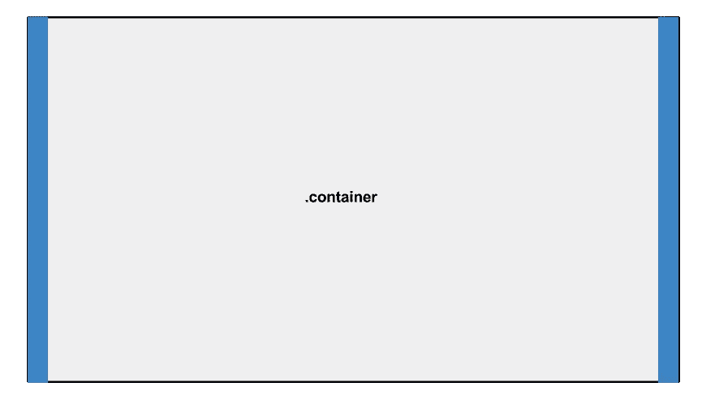
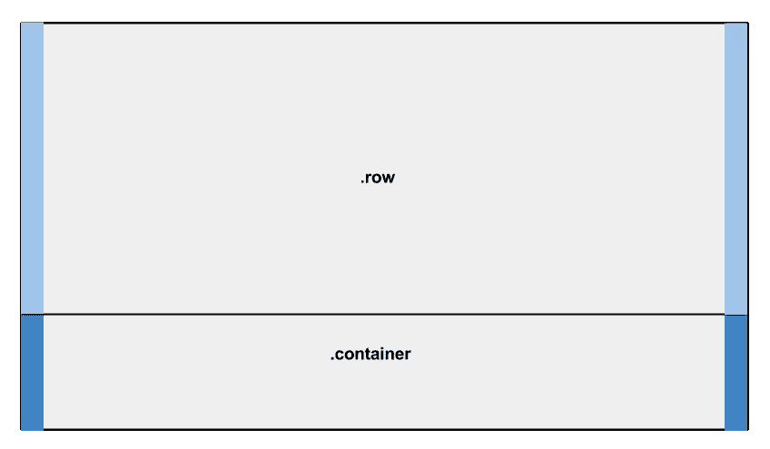
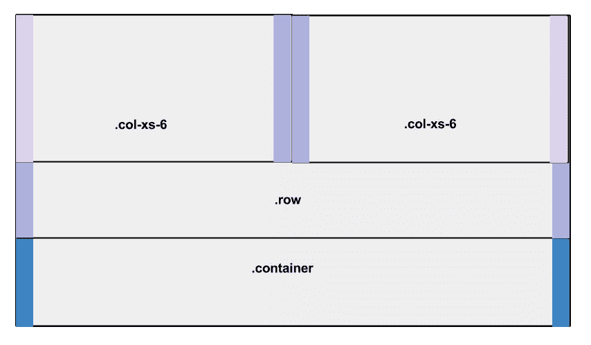

# Bootstrap 的 CSS 中的响应式网页设计技巧

> 原文：<https://www.sitepoint.com/responsive-web-design-tips-bootstrap-css/>

随着第 3 版的发布，Bootstrap 首先进入了移动领域，建立在它已经响应迅速的基础上。

Bootstrap 在 CSS 中包含了哪些东西来帮助解决这个问题？让我们检查一些事情，并获得一些可能对我们自己的定制项目有所帮助的见解。

## 定义正确的媒体查询

Bootstrap 有[明确定义的断点](http://getbootstrap.com/css/#grid-media-queries)用于不同类型的设备，通过使用 CSS 媒体查询来指定。以下是用于不同类型设备的断点类别:

1.  **额外的小型设备**(例如手机)是默认设备，在 Bootstrap 中创建了“移动优先”的概念。这包括宽度小于 768 像素的设备。
2.  **【小型设备】**(如平板电脑)以`@media (min-width: 768px) and (max-width: 991px) { ... }`为目标。
3.  **中型设备**(如台式机)的屏幕尺寸小于 1200 像素，大于 991 像素，使用`@media (min-width: 992px) and (max-width: 1199px) { ... }`。
4.  **较大的设备**(例如宽屏显示器)大于 1200px，使用`@media (min-width: 1200px) { ... }`作为目标。

*注意:我们今天使用的移动设备有两种不同的屏幕方向:**纵向**和**横向**。所以以上大部分只适用于风景。例如，如果您使用的是三星 Galaxy Note III 手机，横向视图属于“小型设备”类别，而纵向视图属于“超小型设备”类别。*

这种分类在响应式框架中很常见，更好地理解它肯定会让你受益匪浅。

## 去神秘化的网格系统

如果您熟悉 Bootstrap 的网格系统，您可能知道正确设置网格需要特定的 HTML 结构。让我们来揭开它的神秘面纱。

让我们先来看看 Bootstrap 的两列设置的 HTML:

```
<div class="container">
  <div class="row">

    <div class="col-xs-6">
      <p>Column 1</p>
    </div>

    <div class="col-xs-6">
      <p>Column 2</p>
    </div>

  </div>
</div>
```

如上所示，Bootstrap 的网格系统从一个容器元素开始。容器定义了网格系统应该使用多少空间。它们可以有两种类型:`.container`对于不同类型的设备有不同的宽度，而`.container-fluid`扩展以适合设备的宽度。

在媒体查询的帮助下，Bootstrap 根据设备的大小为`.container`提供不同的宽度:

*   超小型设备(< 768px): `width: auto`(或无宽度)
*   小型设备(≥768px): `width: 750px`
*   中型设备(≥992px): `width: 970px`
*   更大的设备(≥1200px): `width: 1170px`

下面是更多应用于`.container`类的 CSS 声明。

```
.container {
  padding-right: 15px;
  padding-left: 15px;
  margin-right: auto;
  margin-left: auto;
}
```



如上图所示，`.container`使用每边 15px 的填充防止元素内的内容接触浏览器边缘。它还确保容器使用左右边距的`auto`居中。

行是 Bootstrap 网格系统中的另一个重要元素。在创建列之前，可以使用类`.row`定义一行。下面是 Bootstrap 为`.row`类编写的 CSS 代码片段:

```
.row {
  margin-right: -15px;
  margin-left: -15px;
}
```

如上所示，我们的行具有-15px 的负左右边距，以允许该行接触其容器元素的边缘。这作为一个包装器来保存列，最多可以有 12 列。



您可能已经注意到，行上的边距似乎抵消了应用于容器的 15px 的填充。如果我们分析这些列，我们可以看到为什么需要这样做。

下面是 Bootstrap 的 CSS 中用于`.col-xs-6`类的一个片段。

```
.col-xs-6 {
  padding-right: 15px;
  padding-left: 15px;
}
```

如图所示，对列应用了 15px 的左右填充，结果如下图所示:



由于行的边距为负值，所以列会接触到行的边缘和容器的边缘。但是填充使得这些列中的内容保持距离容器边缘 15px。

容器有多种用途，不仅仅是用于网格系统，所以 15px 的填充有助于避免内容接触到浏览器的边缘(当使用`.container-fluid`时)。行具有负边距，因此它们不会被容器的填充所推动。

如果您正在考虑设计自己的框架，您可能会考虑使用这种填充/边距技术。

## 定义适当的列宽

Bootstrap 使用百分比(%)作为定义列宽的单位，有助于提高响应速度。如上所述，有 4 种不同类别的基于设备的断点。对于不同大小的列，每个类别都有自己的集合类。

1.  **超小型装置**使用`.col-xs-*`。
2.  **小型设备**使用`.col-sm-*`。
3.  **中型设备**使用`.col-md-*`。
4.  **大型设备**使用`.col-lg-*`。

星号(*)被一个数字代替。例如，`.col-xs-6`创建一个 6 倍于`.col-xs-1`的列；`.col-sm-4`创建一个四倍于`.col-sm-1`大小的列，以此类推。

默认情况下，所有列都没有宽度设置，默认为`width: auto`。但是，在媒体查询中，Bootstrap 为每个列类提供宽度值。

下面是 Bootstrap 的 CSS 中的一个片段，为了简洁起见，用星号代替了列的大小(xs、sm、md 等):

```
.col-*-12 {
  width: 100%;
}

.col-*-11 {
  width: 91.66666667%;
}

.col-*-10 {
  width: 83.33333333%;
}

.col-*-9 {
  width: 75%;
}

.col-*-8 {
  width: 66.66666667%;
}

.col-*-7 {
  width: 58.33333333%;
}

.col-*-6 {
  width: 50%;
}

.col-*-5 {
  width: 41.66666667%;
}

.col-*-4 {
  width: 33.33333333%;
}

.col-*-3 {
  width: 25%;
}

.col-*-2 {
  width: 16.66666667%;
}

.col-*-1 {
  width: 8.33333333%;
}
```

我们来分析一下上面的代码。在大型设备中，类别`.col-lg-6`的宽度为 50%,但在中型、小型和超小型设备中查看时，将使用默认的`width: auto`。这确保了在较小的设备中将列转换为堆叠布局(而不是并排)。

## 响应式表格

用于显示表格数据的表在 Bootstrap 中也有响应。

为了使用 Bootstrap 的表格样式，我们使用了类`.table`，它有以下 CSS:

```
.table {
  width: 100%;
  max-width: 100%;
  margin-bottom: 20px;
}
```

Bootstrap 通过应用 100%的宽度来强制表格适应父元素的宽度。但是这有一个问题。多栏表格在较小的设备上会受到挤压，可能不可读。

Bootstrap 有另一个类来补救这个问题:`.table-responsive`。这是 CSS:

```
.table-responsive {
  width: 100%;
  overflow-x: auto;
  overflow-y: hidden;
  -webkit-overflow-scrolling: touch;
  -ms-overflow-style: -ms-autohiding-scrollbar;
  border: 1px solid #ddd;
}
```

这些样式使得表格在较小的设备上可以在水平轴上滚动。

## 响应图像

对于较小的设备来说，处理较大的图像可能是个问题。Bootstrap 使用一个类`.img-responsive`来使任何图像响应:

```
.img-responsive {
  display: block;
  max-width: 100%;
  height: auto;
}
```

`max-width: 100%`和`height: auto`的组合将确保图像在较小的设备中按比例缩小，同时在较大的设备上保持在父元素的约束内。

## 结论

这些 RWD 技巧只是我从 Bootstrap 3 中获得的一些东西。如果你注意到他们的源代码中还有什么没有在这里提到的，请在评论中分享。

*让你的 CSS 技能更上一层楼，我们的书 [CSS Master，第二版](https://www.sitepoint.com/premium/books/css-master-2nd-edition/?utm_source=blog)，作者 Tiffany b . Brown——涵盖 CSS 动画、过渡、变换等等。*

## 分享这篇文章