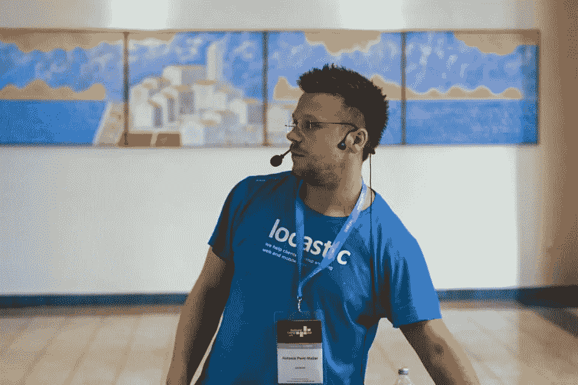
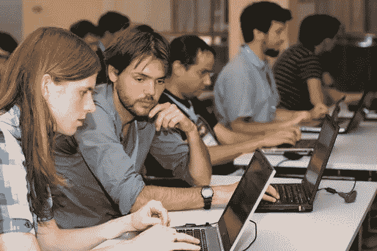
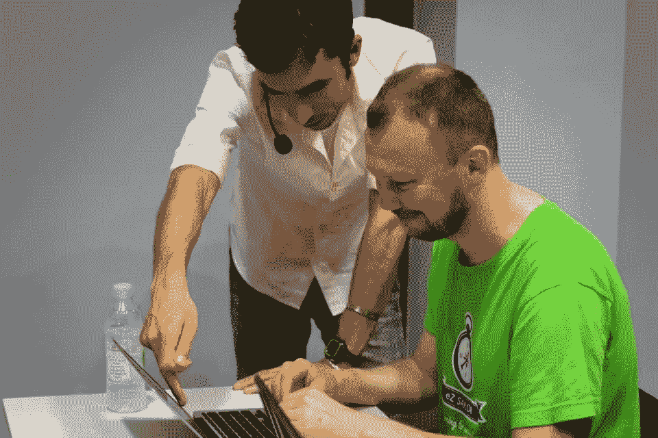
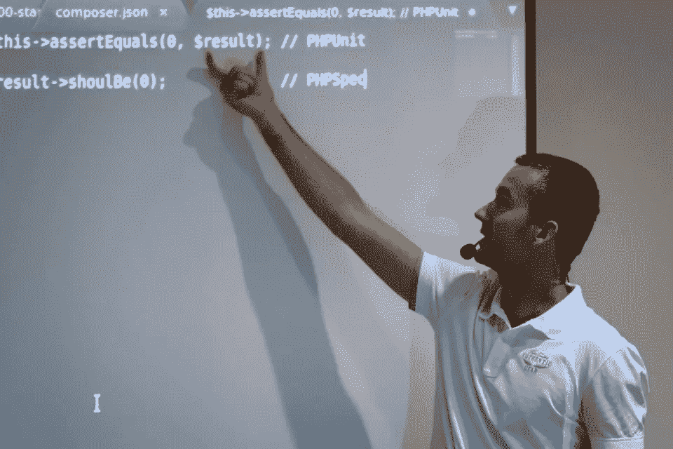
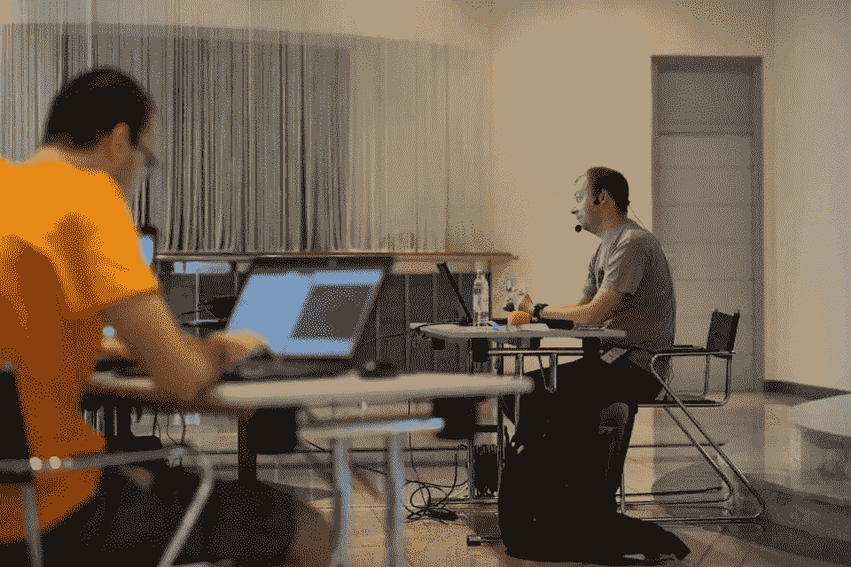

# PHPSummerCamp 评论

> 原文：<https://www.sitepoint.com/phpsummercamp-review/>

2014 年的 [PHPSummerCamp 结束了。为期三天的实践研讨会，来自各自领域的专家为我们提供了新的见解、观点和技巧。虽然我希望我能参加所有的研讨会，但这根本不是一个选项。因此，我将谈论我确实参加的那些。](https://www.sitepoint.com/announcing-php-summer-camp/)

## 装置

在会议之前，我们收到了一台 Virtualbox 设备。对于门外汉来说，设备是一个预先配置好的虚拟盒子，在使用 vagger 时有点像一个基本盒子，里面装有预先安装好的预先配置好的软件。理论上，只要启动它就可以让你拥有和其他人一样的环境。实际上，这很少发生——第一次研讨会的大部分时间都被配置问题和文件夹共享问题占用了。

虽然令人失望的是，流浪者没有被用来为每个人建立一个统一的开发环境，但该设备实际上工作得非常好。在我的 Windows 机器上，设置 samba 共享和维护 symlink 一致性不到几分钟的时间，虽然我只能想象他们在设置它时经历的地狱，但我完全欣赏它为我们观众创造的易用性。做得好，无论是演讲者还是组织者！

## 第一天

### Symfony 基础

第一天，我参加了由[瑞安·韦弗](https://twitter.com/weaverryan)举办的 [Symfony](http://symfony.com) 基础工作坊。作为一名来自 [KNP 实验室](http://knplabs.com/)的绝对优秀的资深演讲者，Ryan 用他的热情、能量和积极的强化征服了整个房间，他不断地向所有听众抛出足够大胆的问题。

这个研讨会以一种非常友好的方式介绍了 Symfony，它比我实际上认为的要简单得多，包括所有的捆绑包、内核、app vs app_dev 混乱和半打配置文件。

看到一个新的推荐实践出现，建议将模板移动到应用程序文件夹的资源中，而不是将它们放在一个包中，这有点令人困惑，但是当处理主应用程序的包时，甚至怀疑拥有一个包是否是一个好的实践。一个必主，不管 app 最后怎么配置。我和 Ryan 详细讨论了这个捆绑包的破坏，他对此有一些有趣的说法——我们将在以后的帖子中深入讨论这个问题。这里有一件事让我很恼火，那就是必须修改两个核心文件来安装一个包——一个告诉主路由文件从包中读取包的路由，另一个在 AppKernel 文件中激活包。有时，你甚至需要调整额外的配置文件。这看起来像是对太多的文件进行了太多的编辑，只是为了让一个包工作。鉴于 Symfony 控制台命令(参见第 3 天)是自动注册的，采用类似的方法通过读取自己的文件自动加载路由和自动激活包(从而保持所有内容都被封装)对我来说是有意义的——尽管我可能用过于简单的眼光看待问题，这需要更多的讨论。

让我充满希望的是看到 Symfony 远离高度具体和有点神秘的语法。例如，在 Twig 模板中，``现在可以写成``，因此不再需要`::`。这对整个社区都有好处，减少了周围的混乱。Ryan 说 Symfony 也试图从其他地方删除这些神秘的东西(例如，在 DI 中的服务参数上使用@符号有些混乱，可以使用更好的语法——@不是人们与[良好实践](https://www.sitepoint.com/why-suppressing-notices-is-wrong/)联系在一起的东西),这只会有助于新用户的采用。

总而言之，这个演讲是整个夏令营的一个极好的开端，比你在网上能找到的简单的“基础”教程要多得多。

### 用 Symfony 2 构建 REST API

安东尼奥·佩里克的这个演讲相当乏味。一个[应用](https://github.com/locastic/psc-symfony-angularjs)被展示出来，尽管它与[这个](https://github.com/gimler/symfony-rest-edition)到底有什么不同还不清楚，而且没有预期或承诺的那么多代码。

潜在的理念很有趣，代码似乎很有吸引力，尽管对于像 REST 应用程序这样简单的东西来说有点太复杂了，但这并没有得到很好的解释，整个事情感觉很匆忙，而且提供的虚拟设备中包含的错误回购进一步复杂化了。当然，最初的时间框架看起来相当短，所以考虑到做了多少，它做得很好。

我从演讲中得到的总体印象是，使用 Symfony 加上 4-5 个包就可以很容易地构建 REST 应用程序，但是这些包对于这样的东西来说似乎太大太复杂了。

### 使用 CMF 和 RoutingAutoBundle 创建基本 CMS

丹尼尔·里奇，他令人印象深刻地骑了数百英里到达会议现场，[威廉-简·兹德维尔德](https://twitter.com/willemjanz)展示了用 Symfony 的 CMF 和 RoutingAutoBundle 创建的基本 CMS。

研讨会包括跟随他们完成一系列从基础项目到完全运行的项目的步骤，尽管考虑到他们被允许的时间范围很短，这感觉有点仓促。幸运的是，他们做了充分的准备，将回购分支到这些步骤中，因此没有跟上的人可以通过检查另一个分支轻松赶上。

作为一个 Symfony 的非用户，我从这次研讨会中得到的总体印象是，对于 CMS 这样简单的东西来说，它过于复杂，尤其是基本的东西(所以没有详细的用户角色，没有 CDN，没有降价…)。我们下载了许多包，编辑了许多文件，最终得到了一个简单的表单，将博客标题 shape 中的内容保存到数据库中。对于这么多的代码和手工劳动，人们可以使用像 WordPress 这样糟糕的东西，最终减少臃肿——从长远来看，我们似乎为太少的可升级性和可维护性写了太多的代码。该应用程序最令人印象深刻的部分是 RoutingAutoBundle，顾名思义，它会自动确定 CMS 内容的路径，并据此产生输出，除非当它返回到默认的 Symfony 路由器时没有找到足够的输出。

虽然这种路由技术远非科幻小说(甚至 WordPress 也使用它)，但有趣的是，它以捆绑的形式存在，可以很容易地添加到 Symfony 的默认路由队列中。然而，我对这个研讨会的一个不满是，它看起来就像是直接阅读 CMF 的教程一样。它还广泛使用了 [PHPCR](http://phpcr.github.io/) ，在我看来，这些术语解释得不够，还有像 CMF、JCR、内容商店和其他我认为应该是前提理论的元术语。

## 第二天

### 行为基础

Ryan Weaver 主持的另一个研讨会——介绍与 [Behat](http://behat.org) 一起进行的功能测试的神奇世界。我们通过一个实际的例子，建立了一个像样的项目。第一个例子与其他例子完全分离，向我们介绍了特性的术语，并一步一步地进行测试，直到通过测试。接下来，我们用 Mink 在一个 web 应用程序上实现了 BDD，这让我们看到了浏览器自动化的美妙之处。不用说，Behat 立即成为我的武器库中的一个工具——我以前也意识到了，但从未如此具体。

Ryan 一如既往，精力充沛、积极向上，包括可读性强、简单实用的幻灯片，所有这些都包含在我们通过虚拟机设备获得的项目中，因此我们可以随意倒带、赶上进度、完成额外的学分任务等等。还展示了一些魔法，比如在测试失败时对 web 应用进行截屏(见[此处](https://gist.github.com/michalochman/3175175))或者在测试存在之前等待 JS 弹出窗口呈现。最后，作为一个真正的“从零开始与贝哈特”项目，我们被介绍给[西里乌斯](https://github.com/Sylius/Sylius)。如果您对完全基于行为测试构建的应用程序感兴趣，请查看一下。包括的功能是惊人的。

### PHPSpec 基础知识

瑞安之后，[萨莎](https://twitter.com/umpirsky)上台。同样来自 KNP，SAA 的第一次演讲比一个新手的预期要好，他很好地覆盖了 [PHPSpec](http://www.phpspec.net/) 。他的研讨会向观众介绍了使用 PHPSpec 进行自动模仿和代码生成的神秘世界 PHPSpec 是一种规范测试工具，可以作为 PHPUnit 的替代或补充。最佳设置似乎是 Behat 和 PHPSpec 的组合，PHPUnit 是可选的。

他的幻灯片不太独立(也就是说，如果没有指导，你就无法浏览它们)，最后我们没有时间了，这很不幸，但是总的来说，这个研讨会以一种非常平易近人的方式介绍了一个非常深奥的概念，并使许多观众接受了使用 PHPSpec 进行测试的简易性。如果你感兴趣，这里也有一份相当不错的[备忘单](https://github.com/yvoyer/phpspec-cheat-sheet)。

## 第三天

### 带 PHP 的 MongoDB

由 Xdebug 的开发者、[MongoDB](http://www.mongodb.org/)PHP 驱动程序的维护者、【世界卫生组织】的同道博士范主持的这个研讨会深入探讨了在 PHP 中使用 MongoDB、链接查询、处理过滤结果的常见问题等等的复杂性。我们构建了样本脚本，伪造了进口程序，并根据作者的评级和偏好对啤酒类型进行了排序和分组(吴镇男在他的克罗地亚之旅结束时已经尝试了多达 999 种啤酒！–我个人至少对几起事件负责。

最初，我们的高级部分时间不够了，但后来我们继续，观众人数稍微少了一点。在第二部分中，我们深入探讨了管道和聚合，甚至尝试设置复制(这真的很简单！)但最终失败了，因为我们每个人都被托管在一个虚拟机上。我们学习了仲裁器、初选、复制过程、将所有数据库条目历史转换为集合的操作日志，即使原始查询是计算，等等。

并不是每天你都会遇到一个如此负责改变 PHP 现状的人，他被认为是理所当然的，所以我希望吴镇男能注意到其他一些即将发生的事情。

### Symfony Extra

最后，我们有了一个额外的 Symfony 游乐场，也是由 Ryan 举办的。这部分集中在控制台上——我们摆弄了进度条、控制台循环、颜色、通过 Composer 的捆绑安装等等。虽然不是很先进，但研讨会很有趣，让我想起了我古老的自动飞行项目。玩 PHP 命令行界面总是很有趣，Autofight *即将复兴。请继续关注，一些新鲜的东西可能很快就会出现在 PHP 频道上:)*

## 结论

PHPSummerCamp 是新知识的宝库。即使不考虑演讲者令人惊叹的热情好客(尽管他们有各种权利让我在现场看《T2 》,也不考虑 Netgen 为这次活动计划的精彩休闲活动(从美味的鱼餐到乘船游览，星际大战极客辩论和墨西哥酒吧莱佛士)，整个会议是我参加过的最好的会议之一，如果不是最好的话。

我遇到了一些有趣的人，与一些负责 eZ Publish 的人谈论了他们的路线图，并在之后保持联系，在一定程度上帮助解决开发人员体验问题，并希望让一些人对查看我们的频道感兴趣——我们都在努力提高 PHP 的影响力，通过互相帮助，我们可以做一些令人惊讶的事情。

在技术方面，这种实现是超乎寻常的——不仅每个房间都有一台专业摄像机用于每次演讲，有一名专门的摄影师跟随演讲者，并将麦克风输入直接输入到录音中，还有专业摄影师受雇随时捕捉每个房间的精髓。声音是惊人的，扬声器的麦克风没有产生任何噼啪声和噪音——一切都非常清晰。会场棒极了，房间是高科技的，而且——这是你在会议中不常见到的——无线网络绝对棒。有一次，一整个房间的 30 多人不得不在 Symfony 项目上执行 Composer Install 命令，虽然我可以看到 Ryan 默默地祈祷它会工作，但不需要神的干预——我们都成功地安装了所有东西。一点都没打嗝。

明年，我是第一个排队买早鸟票的人，你应该就站在我身后——你不会后悔的。看看[的一些照片](https://www.facebook.com/eZSummerCamp)就知道了。与此同时，让我看看我是否能得到一些演讲录音和幻灯片，并与你们分享。我会相应地更新这个帖子！

*注:以上所有照片均来自 eZSummerCamp 的脸书页面，版权归他们所有*

## 分享这篇文章