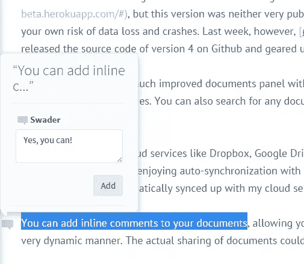
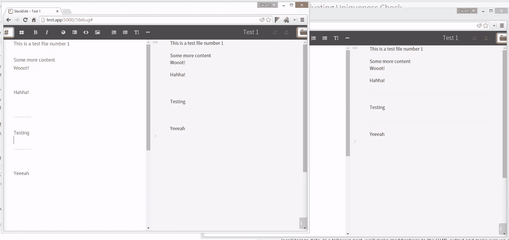

# StackEdit 4.0:多实例和本地托管

> 原文：<https://www.sitepoint.com/stackedit-4-0-multiple-instances-local-hosting/>

有很多很多的降价编辑。事实上，有这么多，我被迫[咆哮他们的现状](http://www.bitfalls.com/2014/05/the-state-of-markdown-editors-may-2014.html)不久前，[回顾了该领域的强大竞争对手](https://www.sitepoint.com/first-look-beegit-collaborative-online-markdown-editor/)希望找到圣杯 MD 应用程序，但无济于事。

## StackEdit 4.0

一直以来，StackEdit 都处于基于浏览器的 MD 编辑器世界的顶端，但是它总是缺少某些东西。文档管理不够理想，混乱的侧菜单和缺乏适当的快速搜索选项，拼写检查器不是本地的，这导致了不必要的性能影响，尤其是在较大的文档上。统计计数器不像现在这样容易接近，扩展编辑器的选项也更加有限。版本 4 中的许多发布选项也不见了。这些缺点大部分都在 [beta 版](https://stackedit-beta.herokuapp.com/#)中解决了，但是这个版本既没有公开发布，也没有声明是稳定的——你使用它要自担数据丢失和崩溃的风险。我个人几个月来一直在可靠地使用它，但我理解大众的犹豫。然而，上周， [@benweet](https://twitter.com/benweet) 终于在 Github 上发布了第 4 版的源代码，并准备发布公开版本。

新功能包括一个大大改进的文档面板和适当的文件夹管理，因此您可以随时掌握您的文件。您还可以搜索堆栈中的任何文档(当您有数百个文档时，这非常重要)。

与 Dropbox、Google Drive、Github 和其他云服务的同步已经得到了很大的改善，我个人已经享受了一段时间与 Google Drive 的自动同步。当我打字时，我的文档会自动与我的云服务同步，所以不用担心数据丢失。

现在，您还可以将内联注释添加到您的文档中，允许您与他人共享它们，并以非常动态的方式进行协作。文档的实际共享仍然需要一些工作，但是一次只能做一件事。



## 在本地运行

在 SitePoint，我们经常使用 StackEdit。然而，除了能够一次运行多个实例之外，一个常见的抱怨就是代码块。我们目前在后台使用一个需要`[ code ]`标签的代码高亮器。虽然这最终会改变，但事实仍然是，从 StackEdit 直接导出到 HTML 会产生正确分类的`<code><pre>`块，这与我们使用的荧光笔不一致。定制代码块导出的解决方案应该很容易编写，但是到目前为止，StackEdit 的源代码仍然不可用，而且它提供的扩展也不够可定制。

为了解决这个问题，让我们从将 StackEdit 安装到 Homestead 改进实例开始。

为了让 StackEdit 在本地运行，首先部署一个常规的 [Homestead 改进的](https://www.sitepoint.com/quick-tip-get-homestead-vagrant-vm-running/)实例。不需要做任何特别的修改，只需像启动一个 PHP 项目一样运行它——与 link 告诉你的一样。然后，通过 SSH 进入虚拟机，并遵循以下步骤:

```
cd ~/Code
git clone https://github.com/benweet/stackedit
cd stackedit
npm install --no-bin-link
bower install (export PORT=5000  && node server.js)
```

这些或多或少就是这里所展示的[的指令，只是端口有所改变，并在`npm install`中添加了一个标志。](https://github.com/benweet/stackedit/blob/master/doc/developer-guide.md#developer-guide)

旗告诉 NPM 避免符号链接。正如我们在之前[所了解到的，流浪者和符号链接在 Windows 主机上相处不好，所以为了完全跨平台，我们在这里使用了这个标志。](https://www.sitepoint.com/13-steps-get-ez-publish-5-x-homestead/)

**Windows 主机注意:**如果`npm install`向您抛出一大堆错误，那通常是由于 Windows 文件路径长度的限制。Windows [不支持超过 260 个字符的文件名](http://stackoverflow.com/questions/21648068/error-installing-bower-via-npm-on-vagrant-under-windows)，NPM 就是这样，嵌套的 node_modules 在到达任何地方之前可以有几层子文件夹。从一个更“根”的位置启动虚拟机通常可以解决这个问题——在我的例子中，将虚拟机文件夹移动到`D:`并从那里运行`vagrant up`就解决了问题。

然后，要访问本地运行的 StackEdit 实例，只需在主机的浏览器中访问`http://homestead.app:5000`。

## 运行 StackEdit 的多个实例

在我最初关于 MarkDown 编辑器的状态的文章中，我指出 StackEdit 的单实例限制是一个很大的缺点。事实上，这是一个大问题——当你编辑大量的文章时，其中一些是一个系列的一部分，你往往不得不经常来回跳转。

当 web 应用程序使用本地存储时，每个会话的本地存储容器都是域绑定的。这意味着，如果您在主浏览器中打开一个，在匿名窗口中打开一个，在另一个浏览器中打开另一个，以此类推，您实际上可以使用 StackEdit 的几个实例，甚至是其原始的在线形式。这是因为每个域-会话组合都是唯一的，并且使用自己的本地存储。但是在一个浏览器标签可以使用超过 4GB 内存的时代(我指的是你，Tweetdeck 和 Google+)，打开新的浏览器和窗口不是一个理想的方法。

为了在本地运行 StackEdit 实例时避开这个问题，我们可以很容易地在主机的`hosts`文件中定义几个条目。

```
127.0.0.1 test.app 127.0.0.1 test2.app 127.0.0.1 test3.app
```

打开`http://test.app:5000`、`http://test2.app:5000`和`http://test3.app:5000`将打开同一个正在运行的 StackEdit 应用程序的三个不同实例，每个实例都有自己的本地存储缓存。

你们中那些更细心的人现在可能想知道:“但是这不意味着我们也可以在 StackEdit 的 live 版本的`hosts`文件中定义域名别名吗？”的确如此。如果我们 ping `stackedit.io`来找出它的 IP 地址(在编写本文时是`54.236.87.105`),并将以下内容放入`hosts`文件:

```
54.236.87.105 stack1.app 54.236.87.105 stack2.app 54.236.87.105 stack3.app
```

我们可以通过在主机浏览器中访问`stack1.app/`、`stack2.app/`和`stack3.app/`来打开实时托管堆栈，就像我们刚刚在本地打开的堆栈一样。不过有一个警告——由于 StackEdit 是一个 Heroku 应用程序，应用程序的 IP 地址[可能会定期变化](http://stackoverflow.com/questions/15512360/get-a-finite-list-of-ip-addresses-for-my-heroku-app),维护一个最新的`hosts`文件会很乏味。因此，我们的流浪者托管的方法显然更好——IP 被保证留在`127.0.0.1`。

## 共享数据

当然，这种方法的缺点是有三个独立的本地存储数据库——这将使您的 StackEdit 选项卡解耦，并阻止您在这些“不同”的实例之间共享您正在编辑的文件。

这将导致每个 StackEdit 实例真正与其他实例分离，并且无法从其他实例访问数据。当然，您可以将一个域中的内容复制粘贴到另一个域中，并为每个域维护不同的文档数据库，但是这太麻烦了。这里有两种方法可以解决这个问题。

### 1.共享本地存储数据

这种方法既适用于在线版本，也适用于本地托管的版本。就像我们之前说过的，本地存储数据对于每个原点是唯一的(原点是一个域+会话的组合)。域 X 不能访问域 Y 的本地存储，这是有充分理由的——如果它们不相关，它们就不应该共享数据。

这就是这个帖子派上用场的地方。现在快四岁了，但是[出品了一个很有意思的项目](https://github.com/juanrmn/localStorage-tools)。简而言之，您可以使用这个库跨域共享本地存储，但是您需要手动将每个域列入白名单。换句话说，要使用它，您需要像上面那样为 StackEdit 实例定义几个 hosts 条目(无论是在线的还是本地的)，将它们列入白名单，然后实现一些简单的本地存储共享代码。实现的细节超出了本文的范围，而且，一旦你看到了第二种方法，就会觉得有些不必要。

### 2.停用唯一性检查

真正阻止 StackEdit 同时运行两个或更多实例的唯一方法是应用程序内置的唯一性检查。更准确的说，是在`public/res/core.js`中第 316 行对`checkWindowUnique()`的调用。注释这一行。

然后，用`test.app:5000/?debug`启动几个标签，看看是否有效。为了让 StackEdit 服务于未缩小的文件，参数`?debug`是必需的，这样我们就不必在测试我们的更改之前运行`grunt`进行缩小。如果你对这些改变感到满意，只需运行`stackedit`文件夹中的`grunt`。除非您做一些额外的调整来使代码 JSHint 有效，否则您需要使用`--force`标志运行 grunt，就像这样；

```
grunt --force
```

这告诉它忽略 JSHint 问题(在上面的特殊情况下，它会告诉你函数`checkWindowUnique`已经定义，但从未使用过)。一个简单的非强制解决方法是注释掉该函数以及调用它的代码行。

现在，您可以在浏览器中运行 StackEdit 的多个实例，所有文档都将在它们之间共享。我使用这种方法已经有一段时间了，还没有遇到导致这个阻塞首先被实现的竞争情况。



如果我们有 StackEdit Tab1 (ST1)和 StackEdit Tab2 (ST2)以及文件 X 和文件 Y，请记住以下规则:

1.  如果文件 X 在 ST1 和 ST2 中都打开，则应用从最后使用的 ST 的改变。在 ST1 中编辑文件 X，然后刷新 ST2，将显示 ST1 中文件 X 的内容，反之亦然。
2.  如果文件 X 在 ST1 和 ST2 中都打开，并且您将 ST2 切换到文件 Y，进行一些更改，然后刷新 ST1，ST1 也将切换到文件 Y。这是因为 StackEdit 使用 localStorage 来跟踪您的位置并打开文件，并将它们同步，所以当您重新打开应用程序时，您会回到您离开的地方

我建议不要将这种多实例黑客技术用于除了只读取一个文档而写入另一个文档之外的任何事情。超过这个数就会很快变得混乱。

## 结论

StackEdit 是一个强大的 MD 编辑器，但即使是最好的也需要升级。在本文中，我们讨论了如何托管我们自己的 StackEdit 本地实例，以及同时部署共享本地存储数据的多个实例。在后续的帖子中，我们将对 HTML 输出进行修改，并确保我们可以根据自己的喜好调整代码块。你有什么自己的诀窍可以分享吗？让我们知道！

## 分享这篇文章