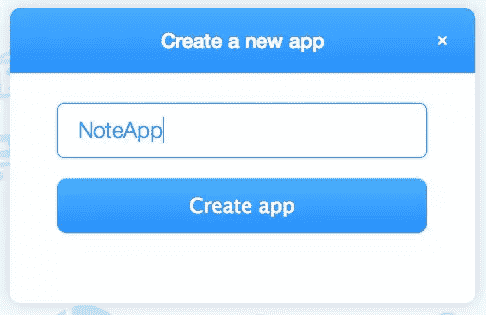
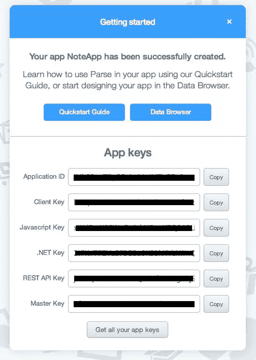
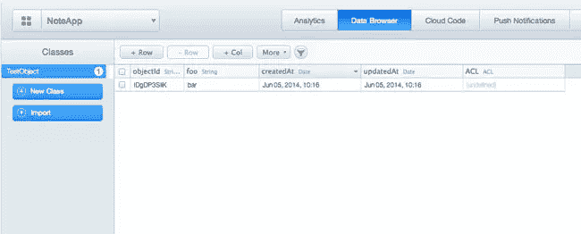
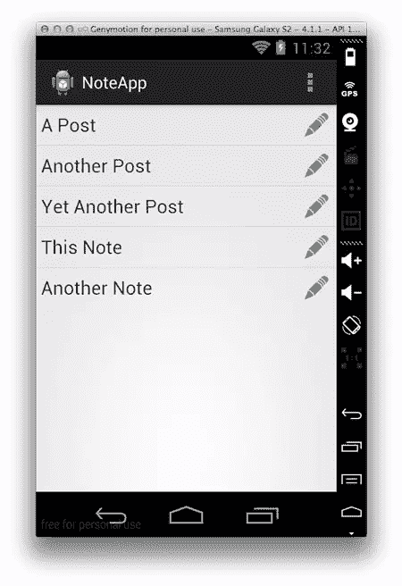
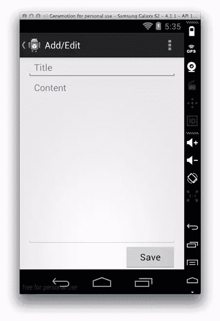
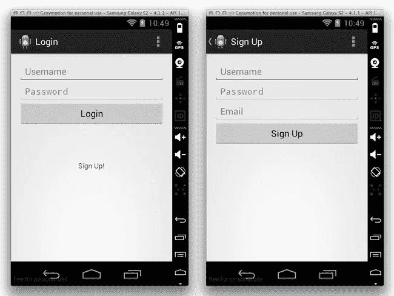
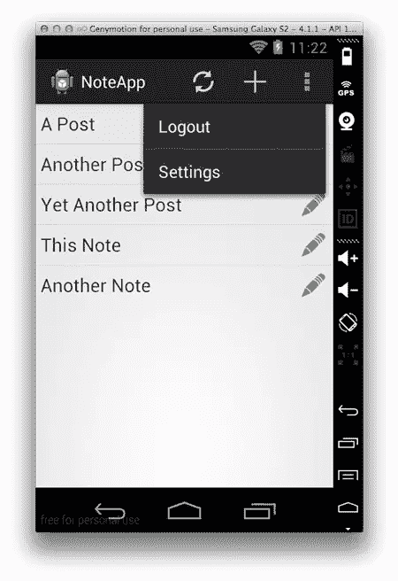

# 使用 Parse 为您的 Android 应用程序创建云后端

> 原文：<https://www.sitepoint.com/creating-cloud-backend-android-app-using-parse/>

我们[之前](https://www.sitepoint.com/creating-cloud-backend-ios-app-using-parse/)发表了一篇关于使用 [Parse](https://www.parse.com/) 为 iOS 应用程序提供后端的文章，并认为我们应该为那些想知道如何将 Parse SDK 集成到他们的应用程序中的 Android 开发者写一篇。

如果你看了前面的文章，可以跳过介绍。我们希望这些文章是独立的教程，所以你不需要阅读上一篇文章就能理解这篇文章。

## 介绍

随着移动设备使用的增加，应用程序提供诸如备份存储、数据同步、数据共享等功能是很常见的。构建只在安装设备上运行和保存数据的独立应用程序有时是不可行的。通常需要一个后端来保存和操作应用程序的数据，以提供它想要的服务。

建立这一点需要时间、不同的技能和其他资源(例如服务器、推送通知服务等)。幸运的是，有几个平台提供现成的可定制后端，您可以将其与您的应用程序集成。这些被称为“后端即服务”，简称为 BaaS。

## 使用 BaaS 的利弊

### 赞成的意见

*   节省时间和资源。
*   在一个包中提供不同的服务。大多数可用的 BaaS 供应商不仅为您的数据提供后端云存储，还提供推送通知、分析、社交网络集成等服务。
*   迎合缩放。BaaS 平台是为扩展而构建的，作为一名开发人员，如果您想获得大量用户，您不需要做任何额外的工作。不过，这会让你花费更多，因为你可能会上调定价计划。
*   容易做出改变。您可以轻松地更改应用程序的功能，而无需对其后端进行大量重写。使用平台的仪表板可以很容易地更改数据库模型。这对任何遵循迭代“精益启动”方法的人来说都很方便，这种方法根据使用数据来发布和改进应用程序。

### 骗局

*   使用 BaaS 可能会很昂贵。虽然这些服务中的大多数为每月一定数量的请求提供免费套餐，但如果你的应用程序要起飞并获得许多用户，成本可能会很高。
*   您可能会遇到供应商锁定，很难切换到另一个平台。但是这已经不再是一个问题，因为大多数服务都是为了更容易的迁移而构建的。您可能不得不放弃一些服务，因为并非所有的 BaaS 平台都提供相同的服务。
*   在使用 BaaS 之前，您应该考虑的一个巨大缺点是您的应用程序对第三方服务的依赖。提供商可能会对其服务进行更改，对此您要么必须容忍，要么寻找另一种解决方案。还有一种服务被关闭的可能性，这将是一个巨大的不便，因为你将被迫把你的数据转移到另一个提供商或你自己的后端。这方面的一个例子是最近 StackMob 的关闭，这迫使开发人员迁移他们的数据。

## 输入解析

在本教程中，我们将看看如何使用[解析](https://parse.com/)来为 Android 应用程序提供后端。在构建将使用它进行用户注册、认证和存储用户数据的应用程序之前，我们将简要地看一下它提供了什么。

Parse 是比较流行的后端即服务平台之一。该服务在一个包中提供三种产品:解析核心、解析推送和解析分析。

Parse Core 通常处理数据保存和社交媒体集成。

解析推送用于发送推送通知。它使开发人员能够定制、调度和发送推送通知给所有注册用户或一组选定的用户。

Parse Analytics 使您能够跟踪应用程序的数据。您可以跟踪使用数据，如安装，活跃用户，用户保留，推送通知打开率等。

## 构建应用程序

你可以在这里找到我们正在构建的应用程序的代码[。如果你对代码或依赖有任何问题，这里有一些](https://github.com/sitepoint-examples/Android-Parse)[额外的指导方针](https://github.com/sitepoint-examples/Android-Parse/blob/master/instructions_on_running_the_application..md)。

我们将创建一个简单的笔记应用程序，使用户能够将笔记保存和检索到云中，从而跨设备维护相同的数据。我们还将了解如何使用 Parse Local Datastore 功能使应用程序离线工作，这是 Parse Android SDK 中的一项新功能。

首先，如果你还没有账户，你应该先在[parse.com](https://parse.com/)上创建一个账户。登录后，访问[仪表板](https://www.parse.com/apps)，在那里你应该可以创建一个新的应用程序，还可以看到你创建的所有应用程序的列表。

创建一个名为 *NoteApp* 的应用。



创建应用程序后，您将看到一个包含应用程序 id 和密钥的窗口。这些将在稍后的 Android 应用程序中使用。



在这里下载解析 SDK [。将其内容提取到项目的`libs`文件夹中。](https://www.parse.com/downloads/android/Parse/latest)

创建新的 Android 项目。我将我的命名为 *NoteApp* ，并将最低要求的 SDK 设置为 API 版本 11。在*创建活动*窗口，选择*空白活动*。

接下来，我们将创建一个自定义的`Application`类。`Application`类是应用程序启动时首先加载的。默认情况下，Android 使用通用的`Application`类，但是我们将创建自己的类来做一些初始设置。

创建一个名为`NoteAppApplication`的新类，并将`android.app.Application`设置为它的超类。

在`AndroidManifest.xml`文件中，用您刚刚创建的类名设置`application`属性的名称。

```
<application
    android:name="com.echessa.noteapp.NoteAppApplication"
    android:allowBackup="true"
    android:icon="@drawable/ic_launcher"
    android:label="@string/app_name"
    android:theme="@style/AppTheme" >
```

将解压后的下载文件中的`Parse-x.x.x.jar`文件复制到`libs`文件夹中。如果你使用的是 Android Studio，记得在`build.gradle`文件中添加依赖关系。

在您的清单文件中，在`application`标记之前添加以下权限。

```
<uses-permission android:name="android.permission.INTERNET" />
<uses-permission android:name="android.permission.ACCESS_NETWORK_STATE" />
```

在`Application`类中，用下面的代码添加一个`onCreate()`方法。

```
@Override
public void onCreate() {
    super.onCreate();

    Parse.initialize(this, APPLICATION_ID, CLIENT_KEY);

    ParseObject testObject = new ParseObject("TestObject");
    testObject.put("foo", "bar");
    testObject.saveInBackground();
}
```

将上面的占位符替换为您的应用程序 id 和客户端密钥，这些可以在解析仪表板中找到。我们在 Parse 初始化后放置的代码只是为了测试。一旦我们确定该应用程序已保存数据进行解析，我们将删除它。

用`Ctrl+Shift+O`组织文件中需要的导入。(您可以设置 Eclipse 和 Android Studio 来自动完成这项工作，以节省您的输入。只有当存在冲突库时，您才需要自己设置导入)。在文章中，除非有潜在的冲突，否则我不会陈述所需的导入。

运行应用程序并在浏览器中导航至解析仪表盘。选择您的应用程序，然后单击数据浏览器选项卡。您应该会看到上面创建的对象的表格数据。



在仪表板上，您可以找到添加/删除行和列、设置权限、导出类甚至删除整个类的控件。丢弃`TestObject`类，因为我们的应用程序不需要它。点击*更多*按钮并选择*掉落等级*即可掉落。还要删除应用程序启动时创建`TestObject`的代码。

您不仅可以像我们上面所做的那样以编程方式创建对象，还可以使用仪表板来这样做。我们将创建一个`Post`类和一些将加载到我们的应用程序中的测试帖子。

点击*新建班级*按钮，将班级命名为*岗位*。将类型保留为*自定义*。添加两个字符串列:`title`和`content`。添加几行数据，只需填写标题和内容字段。

除了`title`和`content`列，还会生成其他列——objectId、createdAt、updatedAt 和 ACL。ACL 代表访问控制列表。这些用于指定用户和/或角色对特定对象的访问控制。

回到我们的应用程序，我们将在列表视图中加载数据。列表视图将显示文章的标题，当点击时，所选文章的内容将显示在另一个活动中。为了简单起见，我们将使用相同的视图来查看和编辑文本。

请注意，我们将创建一个简单的应用程序，其设计不太适合[多屏幕](http://developer.android.com/training/multiscreen/index.html)。为了设计多个屏幕，使用片段来实现一个适当的主-细节流。

删除上面的`onCreate()`方法中创建`ParseObject`的代码并保存它。

打开`activity_main.xml`文件，删除 Hello World `TextView`。将列表视图放在活动上。将其 id 属性更改为`@android:id/list`。这是必需的，因为我们将使用带有自定义视图布局的`ListActivity`。移除布局上设置的填充，并将列表视图的宽度和高度分别设置为`match_parent`和`wrap_content`。设置如下所示。

```
<RelativeLayout xmlns:android="http://schemas.android.com/apk/res/android"
    xmlns:tools="http://schemas.android.com/tools"
    android:layout_width="match_parent"
    android:layout_height="match_parent"
    tools:context=".MainActivity" >

    <ListView
        android:id="@android:id/list"
        android:layout_width="match_parent"
        android:layout_height="wrap_content"
        android:layout_alignParentLeft="true"
        android:layout_alignParentTop="true" >
    </ListView>

</RelativeLayout>
```

编辑`MainActivity`类，使其扩展`ListActivity`。这是一个通过绑定到数据源来显示项目列表的活动。它有一个默认布局，在屏幕中央有一个全屏列表，但是我们将使用一个自定义布局，这就是为什么我们在上面的活动中的 ListView 元素上设置了`android:id="@android:id/list"`。

我们将在列表视图中设置列表项的样式，以显示文章的标题和图标。在名为`list_item_layout.xml`的`res/layout`文件夹中创建一个布局文件。在其中放置一个文本视图，设置如下

```
<?xml version="1.0" encoding="utf-8"?>
<TextView xmlns:android="http://schemas.android.com/apk/res/android"
    android:layout_width="fill_parent"
    android:layout_height="wrap_content"
    android:gravity="center_vertical"
    android:padding="5dp"
    android:singleLine="true"
    android:textSize="20sp"
    android:ellipsize="end"
    android:drawableRight="@drawable/ic_action_edit">
</TextView>
```

`ic_action_edit`图标来自安卓开发者网站上的[动作栏图标包](https://developer.android.com/design/downloads/index.html)。我用的是全息光版。你也可以使用[这个工具](http://romannurik.github.io/AndroidAssetStudio/index.html)来生成图标。

创建一个类来保存我们的文章数据。命名为`Note.java`。这只是一个简单的应用程序，带有注释`id`、`content`和`title`字段以及它们的 getters 和 setters。

```
package com.echessa.noteapp;

public class Note {

    private String id;
    private String title;
    private String content;

    Note(String noteId, String noteTitle, String noteContent) {
        id = noteId;
        title = noteTitle;
        content = noteContent;

    }

    public String getId() {
        return id;
    }
    public void setId(String id) {
        this.id = id;
    }
    public String getTitle() {
        return title;
    }
    public void setTitle(String title) {
        this.title = title;
    }
    public String getContent() {
        return content;
    }
    public void setContent(String content) {
        this.content = content;
    }

}
```

在`MainActivity.java`中，声明一个保存注释列表的类变量。

```
private List<Note> posts;
```

然后在同一个文件中编辑`onCreate()`方法，如下所示。

```
@Override
protected void onCreate(Bundle savedInstanceState) {
    super.onCreate(savedInstanceState);
    setContentView(R.layout.activity_main);

    posts = new ArrayList<Note>();
    ArrayAdapter<Note> adapter = new ArrayAdapter<Note>(this, R.layout.list_item_layout, posts);
    setListAdapter(adapter);

    refreshPostList();
}
```

在这里，我们创建一个适配器来管理数据模型，并使其适应列表视图中的各个行。我们在这里用`ArrayAdapter`来表示。这将对象的`toString()`方法映射到行布局中的 TextView。为了支持其他视图或者拥有对象的`toString()`输出之外的数据，您必须创建一个自定义适配器。我们将使用给定的适配器并覆盖我们对象的`toString()`方法，以便它给出笔记的标题。

在`Note.java`中添加以下方法。

```
@Override
public String toString() {
    return this.getTitle();
}
```

接下来在类中添加`refreshPostList()`方法。当调用这个函数时，它将从 Parse 中获取数据，并将其分配给`posts`列表。

```
private void refreshPostList() {

    ParseQuery<ParseObject> query = ParseQuery.getQuery("Post");

    query.findInBackground(new FindCallback<ParseObject>() {

        @Override
        public void done(List<ParseObject> postList, ParseException e) {
            if (e == null) {
                // If there are results, update the list of posts
                // and notify the adapter
                posts.clear();
                for (ParseObject post : postList) {
                    Note note = new Note(post.getObjectId(), post.getString("title"), post.getString("content"));
                    posts.add(note);
                }
                ((ArrayAdapter<Note>) getListAdapter()).notifyDataSetChanged();
            } else {
                Log.d(getClass().getSimpleName(), "Error: " + e.getMessage());
            }
        }
    });
}
```

运行应用程序，列表视图将填充您之前在 Parse 中添加的注释。



数据加载时会有短暂的停顿。我们将通过包含一个装载微调器来给用户一个指示。

在`onCreate()`方法中的`super.onCreate(savedInstanceState);`语句后添加以下内容。

```
requestWindowFeature(Window.FEATURE_INDETERMINATE_PROGRESS);
```

在`refreshPostList()`中，在调用`findInBackground()`之前添加以下内容

```
setProgressBarIndeterminateVisibility(true);
```

这将显示一个进度微调控件。数据加载后，我们需要隐藏它。将以下语句作为`done`方法中的第一条语句。

```
setProgressBarIndeterminateVisibility(false);
```

接下来，我们将添加两个动作栏动作来刷新列表并添加新注释。在`res/menu/main.xml`中添加以下内容。

```
<item
    android:id="@+id/action_refresh"
    android:icon="@drawable/ic_action_refresh"
    android:showAsAction="always|withText"
    android:title="@string/action_refresh">
</item>

<item
    android:id="@+id/action_new"
    android:showAsAction="always|withText"
    android:title="@string/action_new"
    android:icon="@drawable/ic_action_new"/>
```

然后在`res/values/strings.xml`文件中添加以下值。

```
<string name="action_new">New Note</string>
<string name="action_refresh">Refresh</string>
```

我使用了前面提到的 holo-dark 主题文件夹中的图标。


接下来，我们将创建一个新的活动来添加和编辑注释。您可以使用单独的活动来查看和编辑笔记，但是为了简单起见，我们将使用一个视图来查看。

右键点击你的项目，选择*新建- >其他*，弹出新建文件向导。从安卓下拉菜单中，选择*安卓活动*。在下一页，选择*空白活动*。将活动命名为 *EditNoteActivity* ，并将标题更改为*添加/编辑*。点击*完成*将文件添加到您的项目中。这将为活动添加代码和布局文件，并使用活动所需的数据修改`strings.xml`和`AndroidManifest.xml`文件。

在`MainActivity.java`中添加以下代码来处理动作栏项目点击。

```
@Override
public boolean onOptionsItemSelected(MenuItem item) {
    // Handle action bar item clicks here. The action bar will
    // automatically handle clicks on the Home/Up button, so long
    // as you specify a parent activity in AndroidManifest.xml.
    int id = item.getItemId();

    switch (id) {

    case R.id.action_refresh: {
        refreshPostList();
        break;
    }

    case R.id.action_new: {
        Intent intent = new Intent(this, EditNoteActivity.class);
        startActivity(intent);
        break;
    }
    case R.id.action_settings: {
        // Do something when user selects Settings from Action Bar overlay
        break;
    }
    }

    return super.onOptionsItemSelected(item);
}
```

运行应用程序，您应该能够刷新您的帖子列表，并使用操作栏操作导航到新的活动。

如下所示编辑`res/layout/activity_edit_note.xml`文件。我们将布局从`RelativeLayout`改为`LinearLayout`，并添加两个`EditText`字段和一个按钮。

```
<?xml version="1.0" encoding="utf-8"?>
<LinearLayout xmlns:android="http://schemas.android.com/apk/res/android"
    android:layout_width="match_parent"
    android:layout_height="match_parent"
    android:paddingLeft="16dp"
    android:paddingRight="16dp"
    android:orientation="vertical" >

    <EditText
        android:id="@+id/noteTitle"
        android:layout_width="match_parent"
        android:layout_height="wrap_content"
        android:ems="10"
        android:hint="@string/note_title_hint" />

    <EditText
        android:id="@+id/noteContent"
        android:layout_width="match_parent"
        android:layout_height="0dp"
        android:layout_weight="1"
        android:gravity="top"
        android:hint="@string/note_content_hint"
        android:ems="10" />

    <Button
        android:id="@+id/saveNote"
        android:layout_width="100dp"
        android:layout_height="wrap_content"
        android:layout_gravity="right"
        android:text="@string/save_button" />
</LinearLayout>
```

在`strings.xml`文件中添加以下内容。

```
<string name="note_title_hint">Title</string>
<string name="note_content_hint">Content</string>
<string name="save_button">Save</string>
```

当我们运行应用程序并导航到添加/编辑视图时，我们必须使用后退按钮返回到我们的列表视图。我们将在动作栏中添加一个[向上插入符号](http://developer.android.com/training/implementing-navigation/ancestral.html)，这样我们就可以返回到父视图。在清单文件中，修改`EditNoteActivity`活动标记，如下所示。

```
<activity
    android:name=".EditNoteActivity"
    android:label="@string/title_activity_edit_note" >
    <meta-data
        android:name="android.support.PARENT_ACTIVITY"
        android:value="com.echessa.noteapp.MainActivity" />
</activity>
```

在调用`super.onCreate(savedInstanceState);`之后，在`EditNoteActivity.java`文件的`onCreate()`方法中添加以下内容。

```
getActionBar().setDisplayHomeAsUpEnabled(true);
```

在运行应用程序时，您应该会在应用程序图标旁边看到一个朝左的插入符号，当按下它时，会在层次结构中向上导航。




在`MainActivity.java`中，我们将允许用户选择一个列表项，并在添加/编辑视图中查看其详细信息。将下面的方法添加到文件中。

```
@Override
protected void onListItemClick(ListView l, View v, int position, long id) {

    Note note = posts.get(position);
    Intent intent = new Intent(this, EditNoteActivity.class);
    intent.putExtra("noteId", note.getId());
    intent.putExtra("noteTitle", note.getTitle());
    intent.putExtra("noteContent", note.getContent());
    startActivity(intent);

}
```

当触摸一个列表视图项目时，我们检索用户选择的注释，并将其数据附加到一个 intent 对象。我们将在`EditNoteActivity`类中检索这些数据。这是在活动之间传递数据的方法之一。

在`EditNoteActivity.java`文件中，添加以下字段。

```
private Note note;
private EditText titleEditText;
private EditText contentEditText;
private String postTitle;
private String postContent;
private Button saveNoteButton;
```

如图所示修改`onCreate()`方法。

```
@Override
protected void onCreate(Bundle savedInstanceState) {
    super.onCreate(savedInstanceState);
    getActionBar().setDisplayHomeAsUpEnabled(true);
    setContentView(R.layout.activity_edit_note);

    Intent intent = this.getIntent();

    titleEditText = (EditText) findViewById(R.id.noteTitle);
    contentEditText = (EditText) findViewById(R.id.noteContent);

    if (intent.getExtras() != null) {
        note = new Note(intent.getStringExtra("noteId"), intent.getStringExtra("noteTitle"), intent.getStringExtra("noteContent"));

        titleEditText.setText(note.getTitle());
        contentEditText.setText(note.getContent());
    }

    saveNoteButton = (Button)findViewById(R.id.saveNote);
    saveNoteButton.setOnClickListener(new View.OnClickListener() {
        @Override
        public void onClick(View v) {
            saveNote();
        }
    });

}
```

这将检查是否有任何数据与意图一起传入，如果有，则加载文本字段。

添加`saveNote()`方法。

```
private void saveNote() {

        postTitle = titleEditText.getText().toString();
        postContent = contentEditText.getText().toString();

        postTitle = postTitle.trim();
        postContent = postContent.trim();

        // If user doesn't enter a title or content, do nothing
        // If user enters title, but no content, save
        // If user enters content with no title, give warning
        // If user enters both title and content, save

        if (!postTitle.isEmpty()) {

            // Check if post is being created or edited

            if (note == null) {
                // create new post

                ParseObject post = new ParseObject("Post");
                post.put("title", postTitle);
                post.put("content", postContent);
                post.saveInBackground(new SaveCallback() {
                    public void done(ParseException e) {
                        if (e == null) {
                            // Saved successfully.
                            Toast.makeText(getApplicationContext(), "Saved", Toast.LENGTH_SHORT).show();
                        } else {
                            // The save failed.
                            Toast.makeText(getApplicationContext(), "Failed to Save", Toast.LENGTH_SHORT).show();
                            Log.d(getClass().getSimpleName(), "User update error: " + e);
                        }
                    }
                });

            }
            else {
                // update post

                ParseQuery<ParseObject> query = ParseQuery.getQuery("Post");

                // Retrieve the object by id
                query.getInBackground(note.getId(), new GetCallback<ParseObject>() {
                  public void done(ParseObject post, ParseException e) {
                    if (e == null) {
                      // Now let's update it with some new data.
                        post.put("title", postTitle);
                        post.put("content", postContent);
                        post.saveInBackground(new SaveCallback() {
                            public void done(ParseException e) {
                                if (e == null) {
                                    // Saved successfully.
                                    Toast.makeText(getApplicationContext(), "Saved", Toast.LENGTH_SHORT).show();
                                } else {
                                    // The save failed.
                                    Toast.makeText(getApplicationContext(), "Failed to Save", Toast.LENGTH_SHORT).show();
                                    Log.d(getClass().getSimpleName(), "User update error: " + e);
                                }
                            }
                        });
                    }
                  }
                });
            }
        }
        else if (postTitle.isEmpty() &amp;&amp; !postContent.isEmpty()) {
            AlertDialog.Builder builder = new AlertDialog.Builder(EditNoteActivity.this);
            builder.setMessage(R.string.edit_error_message)
                .setTitle(R.string.edit_error_title)
                .setPositiveButton(android.R.string.ok, null);
            AlertDialog dialog = builder.create();
            dialog.show();
        }
    }
```

上面的代码检查用户是创建一个新的注释还是编辑一个现有的注释，并分别创建一个`ParseObject`或检索一个。数据是用`saveInBackground()`方法保存的，这种方法异步保存数据，所以在保存完成之前，你的应用程序不会被阻止。如果网络速度较慢，您可以导航回笔记列表视图，数据仍会被保存。

将以下内容添加到`strings.xml`文件中。

```
<string name="edit_error_title">Error!</string>
<string name="edit_error_message">You cannot save a note without a title</string>
```

正如我们的列表视图一样，我们将显示一个加载指示器。在`onCreate()`方法中的`super.onCreate(savedInstanceState)`调用之后添加以下内容。

```
requestWindowFeature(Window.FEATURE_INDETERMINATE_PROGRESS);
```

然后在调用 create-new 和 update-post 块的`post.saveInBackground()`调用之前放置以下代码。

```
setProgressBarIndeterminateVisibility(true);
```

保存后，用以下内容隐藏加载指示器。将其作为第一条语句放在`done`方法中。

```
setProgressBarIndeterminateVisibility(false);
```

您可以运行并测试该应用程序，查看到目前为止我们添加的所有内容。您将会注意到，在保存一个便笺之后，当用户再次按下 Save 按钮时，将会创建另一个便笺。我们将通过在保存笔记时创建一个`Note`对象来防止这种情况，这样当再次按下保存按钮时，`note`将不会是`null`。

在创建新注释的块中，在成功保存注释后添加以下内容。

```
note = new Note(post.getObjectId(), postTitle, postContent);
```

向`post`对象添加一个`final`修饰符，以便可以在内部类中访问它。

```
final ParseObject post = new ParseObject("Post");
```

下面是`if`块的结果代码。

```
if (note == null) {
    // create new post

    final ParseObject post = new ParseObject("Post");
    post.put("title", postTitle);
    post.put("content", postContent);
    setProgressBarIndeterminateVisibility(true);
    post.saveInBackground(new SaveCallback() {
        public void done(ParseException e) {
        setProgressBarIndeterminateVisibility(false);
        if (e == null) {
            // Saved successfully.
            note = new Note(post.getObjectId(), postTitle, postContent);
            Toast.makeText(getApplicationContext(), "Saved", Toast.LENGTH_SHORT).show();
        } else {
            // The save failed.
            Toast.makeText(getApplicationContext(), "Failed to Save", Toast.LENGTH_SHORT).show();
            Log.d(getClass().getSimpleName(), "User update error: " + e);
          }
        }
    });

}
```

现在，当相同的笔记再次保存时，将不会创建重复的帖子。

该应用程序正在保存和检索帖子，但任何人都可以使用它，并看到后端保存的所有笔记。我们将应用程序的使用限制为登录用户，也使用户只能访问他们的笔记。

我们将首先创建一个登录活动。像前面一样创建一个空白活动。将其命名为 *LoginActivity* ，并将其标题设置为 Login。

如图所示修改`res/layout/activity_login.xml`文件。

```
<RelativeLayout xmlns:android="http://schemas.android.com/apk/res/android"
    xmlns:tools="http://schemas.android.com/tools"
    android:layout_width="match_parent"
    android:layout_height="match_parent"
    android:paddingBottom="@dimen/activity_vertical_margin"
    android:paddingLeft="@dimen/activity_horizontal_margin"
    android:paddingRight="@dimen/activity_horizontal_margin"
    android:paddingTop="@dimen/activity_vertical_margin"
    tools:context=".LoginActivity" >

    <EditText
        android:id="@+id/usernameField"
        android:layout_width="match_parent"
        android:layout_height="wrap_content"
        android:layout_alignParentLeft="true"
        android:layout_alignParentTop="true"
        android:ems="10"
        android:hint="@string/username_hint" >

        <requestFocus />
    </EditText>

    <EditText
        android:id="@+id/passwordField"
        android:layout_width="match_parent"
        android:layout_height="wrap_content"
        android:layout_alignLeft="@+id/usernameField"
        android:layout_below="@+id/usernameField"
        android:ems="10"
        android:hint="@string/password_hint"
        android:inputType="textPassword" />

    <Button
        android:id="@+id/loginButton"
        android:layout_width="match_parent"
        android:layout_height="wrap_content"
        android:layout_alignLeft="@+id/passwordField"
        android:layout_below="@+id/passwordField"
        android:text="@string/login_button_label" />

    <TextView
        android:id="@+id/signUpText"
        android:layout_width="wrap_content"
        android:layout_height="wrap_content"
        android:layout_below="@+id/loginButton"
        android:layout_centerHorizontal="true"
        android:layout_marginTop="69dp"
        android:text="@string/sign_up_text" />

</RelativeLayout>
```

将以下内容添加到`strings.xml`文件中。一些属性将在以后使用。

```
<string name="username_hint">Username</string>
<string name="password_hint">Password</string>
<string name="email_hint">Email</string>
<string name="sign_up_button_label">Sign Up</string>
<string name="signup_error_message">Please make sure you enter a username, password, and email address!</string>
<string name="signup_error_title">Error!</string>
<string name="login_error_message">Please make sure you enter a username and password!</string>
<string name="login_error_title">Error!</string>
<string name="login_button_label">Login</string>
<string name="sign_up_text">Sign Up!</string>
<string name="logout_label">Logout</string>
```

创建另一个空白活动，并将其命名为*注册活动*。给它一个*的称号报名*。

如图所示修改`res/layout/activity_sign_up.xml`文件。

```
<RelativeLayout xmlns:android="http://schemas.android.com/apk/res/android"
    xmlns:tools="http://schemas.android.com/tools"
    android:layout_width="match_parent"
    android:layout_height="match_parent"
    android:paddingBottom="@dimen/activity_vertical_margin"
    android:paddingLeft="@dimen/activity_horizontal_margin"
    android:paddingRight="@dimen/activity_horizontal_margin"
    android:paddingTop="@dimen/activity_vertical_margin"
    tools:context=".SignUpActivity" >

    <EditText
        android:id="@+id/usernameField"
        android:layout_width="match_parent"
        android:layout_height="wrap_content"
        android:layout_alignParentLeft="true"
        android:layout_alignParentTop="true"
        android:ems="10"
        android:hint="@string/username_hint" >

        <requestFocus />
    </EditText>

    <EditText
        android:id="@+id/passwordField"
        android:layout_width="match_parent"
        android:layout_height="wrap_content"
        android:layout_alignLeft="@+id/usernameField"
        android:layout_below="@+id/usernameField"
        android:ems="10"
        android:inputType="textPassword"
        android:hint="@string/password_hint" />

    <EditText
        android:id="@+id/emailField"
        android:layout_width="match_parent"
        android:layout_height="wrap_content"
        android:layout_alignLeft="@+id/passwordField"
        android:layout_below="@+id/passwordField"
        android:ems="10"
        android:inputType="textEmailAddress"
        android:hint="@string/email_hint" />

    <Button
        android:id="@+id/signupButton"
        android:layout_width="match_parent"
        android:layout_height="wrap_content"
        android:layout_alignLeft="@+id/emailField"
        android:layout_below="@+id/emailField"
        android:text="@string/sign_up_button_label" />

</RelativeLayout>
```

下面是生成的登录和注册视图。



当应用程序启动时，我们将检查用户是否登录，如果没有，应用程序将重定向到登录视图。

由于创建用户帐户是应用程序中的一个常见需求，Parse 提供了`ParseUser`类，该类自动处理用户帐户管理所需的大部分功能。`ParseUser`具有用于典型用户分配和管理的属性，即用户名、密码和电子邮件。

在`MainActivity`类中，在对`setContentView(R.layout.activity_main)`的调用之后，为在`onCreate()`方法中登录的用户添加一个检查。

```
ParseUser currentUser = ParseUser.getCurrentUser();
if (currentUser == null) {
    loadLoginView();
}
```

将`loadLoginView()`方法添加到文件中。

```
private void loadLoginView() {
    Intent intent = new Intent(this, LoginActivity.class);
    startActivity(intent);
}
```

运行应用程序，您将被定向到登录视图。但是，当您使用后退按钮时，您将被定向到主活动。这是因为在历史堆栈中，`MainActivity`在`LoginActivity`之前。因此，按下“后退”按钮，应用程序会导航到上一个活动。我们需要清除堆栈历史并将`LoginActivity`设置为历史堆栈的开始。如图所示修改`loadLoginView()`。

```
private void loadLoginView() {
    Intent intent = new Intent(this, LoginActivity.class);
    intent.addFlags(Intent.FLAG_ACTIVITY_NEW_TASK);
    intent.addFlags(Intent.FLAG_ACTIVITY_CLEAR_TASK);
    startActivity(intent);
}
```

现在，当你按下返回按钮，应用程序将退出。

如图所示修改`LoginActivity`类。

```
public class LoginActivity extends ActionBarActivity {

    protected EditText usernameEditText;
    protected EditText passwordEditText;
    protected Button loginButton;

    protected TextView signUpTextView;

    @Override
    protected void onCreate(Bundle savedInstanceState) {
        super.onCreate(savedInstanceState);
        requestWindowFeature(Window.FEATURE_INDETERMINATE_PROGRESS);
        setContentView(R.layout.activity_login);

        signUpTextView = (TextView)findViewById(R.id.signUpText);
        usernameEditText = (EditText)findViewById(R.id.usernameField);
        passwordEditText = (EditText)findViewById(R.id.passwordField);
        loginButton = (Button)findViewById(R.id.loginButton);

        signUpTextView.setOnClickListener(new View.OnClickListener() {
            @Override
            public void onClick(View v) {
                Intent intent = new Intent(LoginActivity.this, SignUpActivity.class);
                startActivity(intent);
            }
        });

        loginButton.setOnClickListener(new View.OnClickListener() {
            @Override
            public void onClick(View v) {
                String username = usernameEditText.getText().toString();
                String password = passwordEditText.getText().toString();

                username = username.trim();
                password = password.trim();

                if (username.isEmpty() || password.isEmpty()) {
                    AlertDialog.Builder builder = new AlertDialog.Builder(LoginActivity.this);
                    builder.setMessage(R.string.login_error_message)
                        .setTitle(R.string.login_error_title)
                        .setPositiveButton(android.R.string.ok, null);
                    AlertDialog dialog = builder.create();
                    dialog.show();
                }
                else {
                    setProgressBarIndeterminateVisibility(true);

                    ParseUser.logInInBackground(username, password, new LogInCallback() {
                        @Override
                        public void done(ParseUser user, ParseException e) {
                            setProgressBarIndeterminateVisibility(false);

                            if (e == null) {
                                // Success!
                                Intent intent = new Intent(LoginActivity.this, MainActivity.class);
                                intent.addFlags(Intent.FLAG_ACTIVITY_NEW_TASK);
                                intent.addFlags(Intent.FLAG_ACTIVITY_CLEAR_TASK);
                                startActivity(intent);
                            }
                            else {
                                // Fail
                                AlertDialog.Builder builder = new AlertDialog.Builder(LoginActivity.this);
                                builder.setMessage(e.getMessage())
                                    .setTitle(R.string.login_error_title)
                                    .setPositiveButton(android.R.string.ok, null);
                                AlertDialog dialog = builder.create();
                                dialog.show();
                            }
                        }
                    });
                }
            }
        });
    }

    @Override
    public boolean onCreateOptionsMenu(Menu menu) {
        // Inflate the menu; this adds items to the action bar if it is present.
        getMenuInflater().inflate(R.menu.login, menu);
        return true;
    }

    @Override
    public boolean onOptionsItemSelected(MenuItem item) {
        // Handle action bar item clicks here. The action bar will
        // automatically handle clicks on the Home/Up button, so long
        // as you specify a parent activity in AndroidManifest.xml.
        int id = item.getItemId();
        if (id == R.id.action_settings) {
            return true;
        }
        return super.onOptionsItemSelected(item);
    }
}
```

在上面的代码中，如果用户触摸了 Sign Up `TextView`，我们会将用户引导到 Sign Up 视图。当他们尝试登录时，我们首先检查字段，以确保在尝试使用 Parse 登录之前已经输入了数据。如果登录失败，他们会收到通知。如果成功，他们将被定向到带有注释的列表视图。请注意，我们在调用`MainActivity`之前清除并设置了历史堆栈。这将确保用户不能通过按 back 按钮导航回登录视图。

如图所示修改`SignUpActivity`类。

```
public class SignUpActivity extends ActionBarActivity {

    protected EditText usernameEditText;
    protected EditText passwordEditText;
    protected EditText emailEditText;
    protected Button signUpButton;

    @Override
    protected void onCreate(Bundle savedInstanceState) {
        super.onCreate(savedInstanceState);
        requestWindowFeature(Window.FEATURE_INDETERMINATE_PROGRESS);
        getActionBar().setDisplayHomeAsUpEnabled(true);
        setContentView(R.layout.activity_sign_up);

        usernameEditText = (EditText)findViewById(R.id.usernameField);
        passwordEditText = (EditText)findViewById(R.id.passwordField);
        emailEditText = (EditText)findViewById(R.id.emailField);
        signUpButton = (Button)findViewById(R.id.signupButton);

        signUpButton.setOnClickListener(new View.OnClickListener() {
            @Override
            public void onClick(View v) {
                String username = usernameEditText.getText().toString();
                String password = passwordEditText.getText().toString();
                String email = emailEditText.getText().toString();

                username = username.trim();
                password = password.trim();
                email = email.trim();

                if (username.isEmpty() || password.isEmpty() || email.isEmpty()) {
                    AlertDialog.Builder builder = new AlertDialog.Builder(SignUpActivity.this);
                    builder.setMessage(R.string.signup_error_message)
                        .setTitle(R.string.signup_error_title)
                        .setPositiveButton(android.R.string.ok, null);
                    AlertDialog dialog = builder.create();
                    dialog.show();
                }
                else {
                    setProgressBarIndeterminateVisibility(true);

                    ParseUser newUser = new ParseUser();
                    newUser.setUsername(username);
                    newUser.setPassword(password);
                    newUser.setEmail(email);
                    newUser.signUpInBackground(new SignUpCallback() {
                        @Override
                        public void done(ParseException e) {
                            setProgressBarIndeterminateVisibility(false);

                            if (e == null) {
                                // Success!
                                Intent intent = new Intent(SignUpActivity.this, MainActivity.class);
                                intent.addFlags(Intent.FLAG_ACTIVITY_NEW_TASK);
                                intent.addFlags(Intent.FLAG_ACTIVITY_CLEAR_TASK);
                                startActivity(intent);
                            }
                            else {
                                AlertDialog.Builder builder = new AlertDialog.Builder(SignUpActivity.this);
                                builder.setMessage(e.getMessage())
                                    .setTitle(R.string.signup_error_title)
                                    .setPositiveButton(android.R.string.ok, null);
                                AlertDialog dialog = builder.create();
                                dialog.show();
                            }
                        }
                    });
                }
            }
        });
    }

    @Override
    public boolean onCreateOptionsMenu(Menu menu) {
        // Inflate the menu; this adds items to the action bar if it is present.
        getMenuInflater().inflate(R.menu.sign_up, menu);
        return true;
    }

    @Override
    public boolean onOptionsItemSelected(MenuItem item) {
        // Handle action bar item clicks here. The action bar will
        // automatically handle clicks on the Home/Up button, so long
        // as you specify a parent activity in AndroidManifest.xml.
        int id = item.getItemId();
        if (id == R.id.action_settings) {
            return true;
        }
        return super.onOptionsItemSelected(item);
    }
}
```

在清单文件中，将`SignUpActivity`的父 activity 设置为`LoginActivity`，这样我们就可以从注册视图导航到登录视图。

```
<activity
    android:name=".SignUpActivity"
    android:label="@string/title_activity_sign_up" >
    <meta-data
        android:name="android.support.PARENT_ACTIVITY"
        android:value="com.echessa.noteapp.LoginActivity" />
</activity>
```

现在，您可以创建一个帐户，并访问解析后端的注释。用户会话会被缓存，因此您无需在每次使用应用时登录。我们需要在笔记和用户之间创建一个关系，这样用户只加载他们的笔记。在此之前，让我们添加一个注销功能。

在`res/menu/main.xml`中添加一个动作栏项目。

```
<item
    android:id="@+id/action_logout"
    android:title="@string/logout_label">
</item>
```

在`MainActivity.java`中，将以下案例添加到`onOptionsItemSelected(MenuItem item)`方法中的 switch 语句。

```
case R.id.action_logout:
    ParseUser.logOut();
    loadLoginView();
    break;
```

您现在可以使用操作栏操作注销。如果在动作栏上看不到它，那么可以在动作栏覆盖菜单中访问它。



将以下内容添加到`saveNote()`方法中的`EditNoteActivity`。将它添加到创建新注释的`if`块中，在这个语句`post.put("content", postContent);`之后。

```
post.put("author", ParseUser.getCurrentUser());
```

添加新便笺时，当前登录的用户将被保存为其作者。在第一次运行时，author 列将在保存数据之前在 Parse 中自动创建，因此在使用它之前，您不需要使用仪表板来创建它。

在`MainActivity`中，在此语句`ParseQuery query = ParseQuery.getQuery("Post");`之后的`refreshPostList()`方法中添加以下内容。

```
query.whereEqualTo("author", ParseUser.getCurrentUser());
```

在运行应用程序时，您应该能够创建注释，并且只能查看您创建的注释。

## 笔记

我们已经了解了如何将 Parse SDK 集成到 Android 应用程序中。我们已经看到了如何将数据保存和检索到后端，以及如何管理用户帐户。我将在此提及您可以包括的其他功能。

### 删除对象

你应该包括一个让用户删除笔记的方法。如何做到这一点取决于你自己。Android 中常见的删除设计模式包括在列表项目上滑动以删除，长按项目以显示删除的确认对话框，您还可以在添加/编辑详细信息视图中包含删除按钮。

要删除注释，请使用以下命令

```
post.deleteInBackground();
```

### 密码重置

当您希望用户有密码来使用您的应用程序时，您应该包括一个让他们在忘记密码的情况下重置密码的方法。Parse 已经有了这个功能，所以当用户请求重置密码时，您只需要调用下面的代码。

```
ParseUser.requestPasswordResetInBackground(userEmail, new RequestPasswordResetCallback() {
    public void done(ParseException e) {
        if (e == null) {
            // An email was successfully sent with reset instructions.
        } else {
            // Something went wrong. Look at the ParseException to see what's up.
        }
    }
});
```

### 办公室使用

我们创建的应用程序需要互联网连接才能按需工作。它需要互联网连接来检索和保存笔记。

Parse 现在提供了 [Parse Local Datastore](http://blog.parse.com/2014/04/30/take-your-app-offline-with-parse-local-datastore/) ，它使您能够在本地保存数据，并使用常用的`ParseQuery`查询数据。要做到这一点，可以将数据固定到本地数据存储，然后取消固定数据以将其删除。

当应用程序离线时，它仍然可以检索和保存数据，当互联网连接再次建立时，它会将云中的数据与本地数据存储同步。有关如何操作的信息[请查看导轨](http://blog.parse.com/2014/04/30/take-your-app-offline-with-parse-local-datastore/)，

## 结论

我们已经了解了如何使用 Parse 作为应用程序的 BaaS 系统。使用这种现成的后端服务有许多优点，但它也有一些缺陷，在决定是从头构建还是使用 BaaS 解决方案时，应该根据这些优点来衡量这些缺陷。即使你计划构建自己的后端，从 BaaS 开始也是值得的，这样可以缩短应用上市的时间，还可以在市场上测试应用，并根据使用数据快速验证功能。

除了 Parse，还有其他几个解决方案/服务，比如 [Apigee](http://apigee.com/about/) 、 [Backendless](https://backendless.com/) 、 [Kii](http://en.kii.com/) 、[build . io](https://www.built.io/)、 [Firebase](https://www.firebase.com/) 等等。这些以不同的价格提供不同的服务，值得看看和比较不同的产品来决定什么最适合你的需要。

## 分享这篇文章