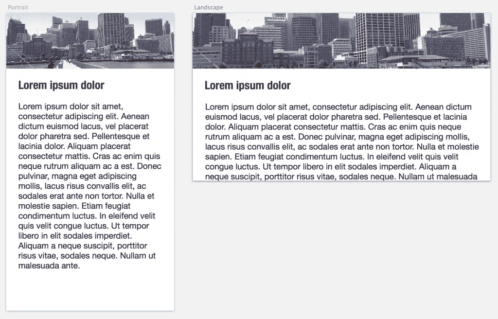
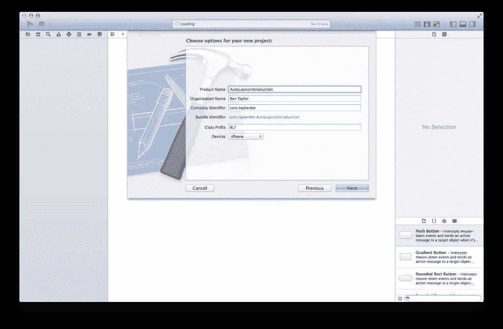
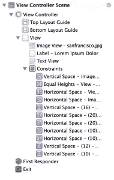
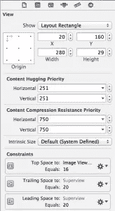

# 使用 Autolayout 管理 iOS 应用程序布局

> 原文：<https://www.sitepoint.com/manage-ios-app-layouts-autolayout/>

本教程假设您以前使用过 Xcode，并且熟悉 Interface Builder，但不熟悉 Xcode 中的自动布局工具。

在 2012 年 WWDC 大会上，苹果推出了一个新的界面布局系统。自动布局是一个非常强大的布局引擎，非常适合应用程序。虽然一开始理解起来有点奇怪，但是一旦掌握了它，就可以用更少(或者没有)的代码布局逻辑实现更加流畅的布局。

自 2012 年以来，自动布局功能一次又一次，有相当大的工具改进。这表明自动布局(以及现在的大小分类)是苹果支持多分辨率的解决方案。

## 这个概念

在自动布局中，不是设置视图的位置和大小，而是在视图之间创建*约束*。这些用于计算每个视图的位置和尺寸。例如，您可以考虑使用以下方式定位元素:

`myView`位于`(x: 20, y: 40)`位置，尺寸为`(w: 400, h: 100)`

在自动布局中，可以这样说:

`myView`的`leading edge`与其`superview`的偏移量匹配 20 磅

`myView`的`top space`与其`superview`的偏移量匹配 40 磅

`myView`的`width`等于`400`

`myView`的`height`等于`100`

这听起来很罗嗦，但是这种思考方式允许更多的可能性。例如，我们可以将第一行改为:

`myView`的`leading edge`匹配`myOtherView`的`trailing edge`

将两个视图放在一起。同样，我们可以将第三行改为:

`myView`的`width`匹配`myOtherView`的`width`

使它们大小相同。

如果没有自动布局，你可以通过在一个布局方法中操作帧值来做一些等效的事情，但是我相信你可以通过这个例子看到自动布局是多么有表现力。

## 在实践中

让我们通过在 Xcode 中创建一个文章阅读应用程序的屏幕来尝试一下自动布局。让我们先看看我们想要达到的目标，然后一步一步地看我们如何才能达到目标。

你可以在这里找到项目的 github。

想象我们正在创建一个阅读文章的应用程序，类似于[媒体应用程序](https://medium.com/m/app)。我们的设计师给了我们一个他们想要的文章页面外观的(相当粗略的)设计。

现在我们有了一个设计，让我们复制它，打开 Xcode 并创建一个新项目。

一旦我们有了一个项目，打开故事板(`Main.storyboard`)并拖出我们需要的视图组件。即一个`UIImageView`、一个`UILabel`和一个`UITextView`。放置它们以创建一个合适的人像布局，如下所示。

<video class="wp-video-shortcode" id="video-87105-1" width="801" height="448" preload="metadata" controls=""><source type="video/mp4" src="https://uploads.sitepoint.com/wp-content/uploads/2014/08/1407163889dragging-views-clip.mp4?_=1">[https://uploads.sitepoint.com/wp-content/uploads/2014/08/1407163889dragging-views-clip.mp4](https://uploads.sitepoint.com/wp-content/uploads/2014/08/1407163889dragging-views-clip.mp4)</video>

您可能想在顶部`UIImageView`放置一个虚拟图像，并对其进行裁剪。我选择了查看模式`Aspect Fill`和`Clip Subviews`。

<video class="wp-video-shortcode" id="video-87105-2" width="801" height="448" preload="metadata" controls=""><source type="video/mp4" src="https://uploads.sitepoint.com/wp-content/uploads/2014/08/1407164033set-image-clip.mp4?_=2">[https://uploads.sitepoint.com/wp-content/uploads/2014/08/1407164033set-image-clip.mp4](https://uploads.sitepoint.com/wp-content/uploads/2014/08/1407164033set-image-clip.mp4)</video>

让我们看看当我们垂直调整高度时会发生什么，你可以通过屏幕底部标有*应用 3.5 英寸外形尺寸*的按钮来实现，它看起来像。您会注意到，文本视图的大小并没有改变，而是被剪掉了。

如果这就是当我们垂直调整大小时会发生的情况，你认为当我们旋转屏幕时会发生什么？找出答案的最好方法是尝试。

<video class="wp-video-shortcode" id="video-87105-3" width="801" height="448" preload="metadata" controls=""><source type="video/mp4" src="https://uploads.sitepoint.com/wp-content/uploads/2014/08/1407164113rotate-no-autolayout-clip.mp4?_=3">[https://uploads.sitepoint.com/wp-content/uploads/2014/08/1407164113rotate-no-autolayout-clip.mp4](https://uploads.sitepoint.com/wp-content/uploads/2014/08/1407164113rotate-no-autolayout-clip.mp4)</video>

很明显，这不是我们想要的效果。当我们旋转或调整大小时，我们希望所有的东西都拉伸和移动，仅仅定位不会有这种效果。

相反，让我们看看**自动布局**。

在故事板中创建约束的最简单的方法是点击“锁定”按钮。看起来是这样的。一旦你点击它，你会看到一个对话框弹出创建约束(选择图像，然后点击它)。顶部是视图的四条边和它们最近的邻居，对于图像来说是容器的边和底部的标签。我们希望这个图像贴在容器的边缘，所以我们将点击这些来选择它们。然后我们希望它保持在相同的高度，所以我们也要点击那个。

<video class="wp-video-shortcode" id="video-87105-4" width="801" height="448" preload="metadata" controls=""><source type="video/mp4" src="https://uploads.sitepoint.com/wp-content/uploads/2014/08/1407164268add-image-constraints-clip.mp4?_=4">[https://uploads.sitepoint.com/wp-content/uploads/2014/08/1407164268add-image-constraints-clip.mp4](https://uploads.sitepoint.com/wp-content/uploads/2014/08/1407164268add-image-constraints-clip.mp4)</video>

我们已经添加了第一个约束！现在，如果我们运行应用程序，我们将能够看到我们的图像随着我们旋转设备而拉伸。

<video class="wp-video-shortcode" id="video-87105-5" width="801" height="448" preload="metadata" controls=""><source type="video/mp4" src="https://uploads.sitepoint.com/wp-content/uploads/2014/08/1407164320rotate-image-stretching-clip.mp4?_=5">[https://uploads.sitepoint.com/wp-content/uploads/2014/08/1407164320rotate-image-stretching-clip.mp4](https://uploads.sitepoint.com/wp-content/uploads/2014/08/1407164320rotate-image-stretching-clip.mp4)</video>

从故事板添加约束的方法不止一种。也可以右键单击并从一个视图拖动到另一个视图。这对于创建视图之间的特定关系非常有用。对于标题标签，我们希望在图像视图和标签之间创建一个`vertical spacing`关系。这意味着图像视图的底部将匹配标签的顶部(加上一些偏移)。

<video class="wp-video-shortcode" id="video-87105-6" width="801" height="448" preload="metadata" controls=""><source type="video/mp4" src="https://uploads.sitepoint.com/wp-content/uploads/2014/08/1407164350vertical-spacing-clip.mp4?_=6">[https://uploads.sitepoint.com/wp-content/uploads/2014/08/1407164350vertical-spacing-clip.mp4](https://uploads.sitepoint.com/wp-content/uploads/2014/08/1407164350vertical-spacing-clip.mp4)</video>

一旦你设置了这个，你会注意到一个红色的虚线框出现在屏幕上。这意味着在你视觉上放置视图的位置和自动布局认为它应该在的位置之间存在不一致。现在我们只有一个约束，所以 Auto Layout 不知道在哪里放置视图，我们需要添加更多的约束来使它工作。我们还需要两个约束，一个用于前缘(左侧)，一个用于后缘(右侧)，我们希望它们与容器对齐。所以再次右键单击并从视图中拖动，但是这次选择容器(它周围的视图)。

<video class="wp-video-shortcode" id="video-87105-7" width="801" height="448" preload="metadata" controls=""><source type="video/mp4" src="https://uploads.sitepoint.com/wp-content/uploads/2014/08/1407164380container-spacing-label-clip.mp4?_=7">[https://uploads.sitepoint.com/wp-content/uploads/2014/08/1407164380container-spacing-label-clip.mp4](https://uploads.sitepoint.com/wp-content/uploads/2014/08/1407164380container-spacing-label-clip.mp4)</video>

到目前为止，我们已经根据视图的位置创建了约束，但是如果我们把它们放错了呢？如果你喜欢我，你可能会在标签的两边放上不等边的标签。尝试拖动标签的宽度，你会注意到我们得到了另一个红色框和一些黄色指示器。黄色的显示约束和屏幕上显示的视觉点之间的差异。要编辑约束，我们可以直接点击它。单击任何黄色的并编辑它们，使值与我们想要的相匹配。

<video class="wp-video-shortcode" id="video-87105-8" width="801" height="484" preload="metadata" controls=""><source type="video/mp4" src="https://uploads.sitepoint.com/wp-content/uploads/2014/08/1407164480editing-constraints-clip.mp4?_=8">[https://uploads.sitepoint.com/wp-content/uploads/2014/08/1407164480editing-constraints-clip.mp4](https://uploads.sitepoint.com/wp-content/uploads/2014/08/1407164480editing-constraints-clip.mp4)</video>

您也可以通过在左侧视图层次中找到约束来编辑它们(用打开)

或者从右边的尺寸检查器。

最后，到文本视图。让我们做我们最初做的，打开`Add New Constraints`对话框并选择所有四条边。不过，这一次我们将编辑这四个框中的值。我们希望他们都是`10`。

<video class="wp-video-shortcode" id="video-87105-9" width="801" height="448" preload="metadata" controls=""><source type="video/mp4" src="https://uploads.sitepoint.com/wp-content/uploads/2014/08/1407164624adding-text-view-constraints-clip.mp4?_=9">[https://uploads.sitepoint.com/wp-content/uploads/2014/08/1407164624adding-text-view-constraints-clip.mp4](https://uploads.sitepoint.com/wp-content/uploads/2014/08/1407164624adding-text-view-constraints-clip.mp4)</video>

现在，如果我们单击，我们会看到同样的红色虚线框和黄色突出显示。这一次，我们不再试图手动修复它，而是让 Xcode 为我们修复它。点击`Resolve Auto Layout Issues`按钮。然后点击`Update Frames`更新视觉外观以匹配自动布局。

<video class="wp-video-shortcode" id="video-87105-10" width="801" height="448" preload="metadata" controls=""><source type="video/mp4" src="https://uploads.sitepoint.com/wp-content/uploads/2014/08/1407164695update-frames-clip.mp4?_=10">[https://uploads.sitepoint.com/wp-content/uploads/2014/08/1407164695update-frames-clip.mp4](https://uploads.sitepoint.com/wp-content/uploads/2014/08/1407164695update-frames-clip.mp4)</video>

运行应用程序，看看周围的一切都在辉煌！

<video class="wp-video-shortcode" id="video-87105-11" width="801" height="448" preload="metadata" controls=""><source type="video/mp4" src="https://uploads.sitepoint.com/wp-content/uploads/2014/08/1407164722run-final-clip.mp4?_=11">[https://uploads.sitepoint.com/wp-content/uploads/2014/08/1407164722run-final-clip.mp4](https://uploads.sitepoint.com/wp-content/uploads/2014/08/1407164722run-final-clip.mp4)</video>

## 延伸目标

如果你想扩展你新发现的自动布局知识，试着让图像的高度与`superview`的高度成比例。这意味着它将占据屏幕的 1/4，当屏幕很宽时，它会变得更小，但当屏幕很高时，它会变大。提示:一个自动布局约束可以有一个`multiplier`和一个`constant`。

## 额外细节

还有许多方法可以从代码中创建和引用约束。例如，约束可以像视图一样与插座配对。您可以通过创建大量的`NSLayoutConstraint`对象或使用`NSLayoutConstraint`可视字符串格式在代码中创建约束。还有用于创建约束的 [CocoaPods](https://www.sitepoint.com/cocoapods-good/) ，我最喜欢的是[砖石](https://github.com/Masonry/Masonry)。

## 进一步阅读

[苹果汽车布局指南](https://developer.apple.com/library/ios/documentation/UserExperience/Conceptual/AutolayoutPG/Introduction/Introduction.html)

[高级自动布局工具箱](http://www.objc.io/issue-3/advanced-auto-layout-toolbox.html)

## 分享这篇文章