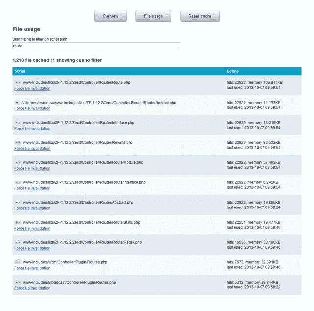

# 了解 OpCache

> 原文：<https://www.sitepoint.com/understanding-opcache/>

PHP 5.5 版本内置了一个缓存引擎——[op cache](http://php.net/manual/en/book.opcache.php)——它将预编译的脚本字节码存储在内存中。如果你熟悉 APC 或 Xcache，你就会知道这样的引擎是如何工作的。当每个 PHP 脚本在运行时被编译时，一部分执行时间被用于将人类可读的代码转换成机器可以理解的代码。像 OpCache、APC 或 Xcache 这样的字节码缓存引擎只做一次——在特定 PHP 文件的第一次执行期间。然后，预编译的脚本被存储在内存中，这应该会提高 PHP 应用程序的性能。

在网上你会很容易地找到很多教程，涵盖了所有的 OpCache 安装和配置步骤(在 5.5 上默认启用，但在旧版本上可以作为扩展安装)。阅读下面的文章，找到一些典型问题的答案，这些问题涉及使用这种特定缓存引擎的不同实际方面。

### 1.OpCache 到底值不值得安装？我能期待什么样的速度提升？

当然，要看情况。如果您的服务器能够处理传入的流量并保持较低的响应时间，您可能不会觉得有必要提高性能。但是在一个流量很大的大网站上，每一个小小的优化步骤都很重要。与没有字节码缓存引擎相比，实现 OpCache 可以让您每秒处理更多的请求，并更快地返回响应。由于 OpCache 非常容易安装和配置，所以您不会花太多时间来设置一切。

如果你正在寻找一些 OpCache 性能测试，你当然应该阅读关于实现这个缓存引擎的文章。在他们的测试中，OpCache 的安装将网站的平均响应时间减少了 14%。web 应用程序不同操作的响应时间减少了 6%到 74%不等。正如文章中所解释的，不同的代码部分或多或少会从实现字节码缓存引擎中受益。我鼓励您详细阅读这篇文章，并检查哪里可以获得最高的性能提升。

如果你正在寻找一些关于 OpCache 性能的其他资源，请查看[fideloper.com](http://fideloper.com/install-zend-opcache)和[massivescale.com](http://massivescale.blogspot.com/2013/06/php-55-zend-optimiser-opcache-vs-xcache.html)上的例子。两个测试都报告安装 OpCache 后响应时间减少了大约 50%。

### 2.我已经使用 APC 缓存。我应该迁移到 OpCache 吗？

我觉得你应该。有几个优点可以使 OpCache 成为比 APC 更好的解决方案。

首先，APC 缓存不能与最新的 PHP 版本一起工作。完全不支持 PHP 5.5。也不建议在 PHP 5.4 上安装它，因为据报道，这样的配置会导致执行错误，从而破坏整个应用程序。只需查看一下关于 PHP 加速器的[维基百科文章](http://en.wikipedia.org/wiki/List_of_PHP_accelerators)或者[这个堆栈溢出线程](http://stackoverflow.com/questions/9611676/is-apc-compatible-with-php-5-4-or-php-5-5)就能得到一些细节。

然而，OpCache 是与 PHP 5.5 捆绑在一起的，所以它肯定能与这个 PHP 版本一起工作。正如在[文档](http://www.php.net/manual/en/intro.opcache.php)中所写的，它也可以安装在旧的 PHP 版本上——从 5.2 到 5.4。一般来说，OpCache 比其他字节码缓存引擎更紧密地绑定到 PHP 本身——这可能会导致更频繁的更新和更少的错误(详情请阅读此处的)。

从 APC 迁移到 OpCache 时需要记住的唯一重要的事情是，后者不能作为数据缓存引擎。如果您已经实现了 APC，您可能正在使用它的 [apc_add()](http://php.net/manual/en/function.apc-add.php) 和 [apc_fetch()](http://www.php.net/manual/en/function.apc-fetch.php) 函数，这些函数充当数据缓存服务的接口。OpCache 只是一个字节码缓存引擎，所以它不会提供类似的功能。如果您计划从 APC 切换到 OpCache，请记住考虑这个限制。请记住，如果你想保留 APC 用户区的功能，还有 [APCu](http://pecl.php.net/package/APCu) 项目(非常感谢 Oscar Merina 在评论中指出这一点)。

### 3.如何检查 OpCache 是否真的在缓存我的文件？

如果您已经安装并配置了 OpCache，您可能会发现控制哪些 PHP 文件实际上被缓存是很重要的。整个缓存引擎在后台工作，对访问者或 web 开发人员是透明的。为了检查其状态，您可以使用提供此类信息的两个函数之一:[op cache _ get _ configuration()](http://www.php.net/manual/en/function.opcache-get-configuration.php)和 [opcache_get_status()](http://www.php.net/manual/en/function.opcache-get-status.php) 。幸运的是，有几个准备好的脚本可以获取所有的 OpCache 配置和状态数据，并以友好的方式显示出来。您不需要自己编写任何代码，只需从以下工具中选择一个:拉斯马斯·勒德尔夫的
–[op cache 控制面板](https://gist.github.com/ck-on/4959032/?ocp.php)、
–[op cache-status](https://github.com/rlerdorf/opcache-status)、彼得·霍迪克的
–[op cache GUI](https://github.com/PeeHaa/OpCacheGUI)、安德鲁·柯林顿的
–[op cache-GUI](https://github.com/amnuts/opcache-gui)。

在我的项目中，我使用 opcache-gui 脚本，它拥有我需要的所有功能。要检查缓存引擎是否正常工作，只需在 opcache-gui 页面的“Overview”选项卡上查看百分比即可。如果内存使用和命中率值大于零，这意味着 OpCache 正在缓存 PHP 代码，缓存的文件正在用于处理请求。要查看正在缓存的特定 PHP 文件的列表，只需导航到“文件使用”选项卡。查看文件列表，确保项目中的文件已被缓存。

### 4.我应该设置什么特定于框架的配置吗？

基本上，OpCache 引擎对于代码编写人员来说应该是透明的。这意味着你可以在你的应用程序中放入任何你想要的代码(它与你正在使用的 PHP 版本兼容), OpCache 应该可以正确处理它。但是，只有以正确的方式设置 OpCache 配置，它才会起作用。一个错误的缓存引擎配置可以破坏你的整个网站。

首先，可能在每个典型的项目中，你必须确保 [opcache.use_cwd](http://www.php.net/manual/en/opcache.configuration.php#ini.opcache.use-cwd) 选项被设置为`true`。启用此设置意味着 OpCache 引擎将查看完整的文件路径，以区分具有相同名称的文件。将其设置为`false`会导致具有相同基本名称的文件之间发生冲突。

在使用**注释**的工具和框架中，还有一个重要的设置。如果使用 Doctrine、Zend Framework 2 或者 PHP Unit，记得将 [opcache.load_comments](http://www.php.net/manual/en/opcache.configuration.php#ini.opcache.load-comments) 和 [opcache.save_comments](http://www.php.net/manual/en/opcache.configuration.php#ini.opcache.save-comments) 设置为`true`。因此，文件中的文档注释也将包含在 OpCache 生成的预编译代码中。此设置将允许您不受干扰地使用注释。

如果您的项目是基于一个特定的框架或 web 应用程序，那么查看文档以获得任何关于 OpCache 配置的指南总是一个好主意。比如这里有一个 Moodle [的配置示例](http://docs.moodle.org/26/en/OPcache)。

### 5.我把我的应用程序配置保存在一个 PHP 文件中。我可以防止它被缓存吗？

如果您的项目包含比其他项目更改更频繁的文件，您可以将它们从缓存中排除。在处理包含网站配置指令的 PHP 文件时，这可能特别方便。如果您不让它们被缓存，那么您可以确保放入这样一个文件中的每个更改都会立即在您的应用程序中可见。

OpCache 允许您指定一个黑名单文件，其中包含所有不会被缓存引擎处理的路径。在设置了[op cache . black list _ filename](http://www.php.net/manual/en/opcache.configuration.php#ini.opcache.blacklist-filename)指令后，只需将适当的文件列表放在您指定的路径中。[文档页面](http://www.php.net/manual/en/opcache.configuration.php#ini.opcache.blacklist-filename)包含了一些关于如何从缓存中排除特定文件的例子。

### 6.如何在一台启用了 OpCache 的服务器上同时运行开发和生产环境？

如果您的服务器运行多个应用程序，您可能只愿意在其中的一些应用程序中使用 OpCache。开发和测试站点就是这种环境的例子，在这种环境中，启用字节码缓存并不可取，而且可能弊大于利。

幸运的是，可以在一个项目中启用 OpCache，而在另一个项目中禁用它，所有这些都在一台服务器上完成。为此，首先您需要在全局级别启用 OpCache，方法是在您的`php.ini`文件中将 [opcache.enable](http://www.php.net/manual/en/opcache.configuration.php#ini.opcache.enable) 指令设置为`true`。然后，如果您不想在您的项目中使用字节码缓存，只需通过使用 [ini_set()函数](http://www.php.net/manual/en/function.ini-set.php)将相同的指令设置为`false`来禁用它。所以首先你需要全局启用缓存，然后你可以在一些项目中“本地”禁用它。您不能反过来做——不允许使用 [ini_set()](http://www.php.net/manual/en/function.ini-set.php) 启用缓存。

> 在项目的顶层文件中设置`opcache.enable`为`false`将会禁用缓存，而在其他地方保持缓存。

### 摘要

我希望这组常见问题和答案能给你一些关于如何在 PHP 应用程序中使用 OpCache 的实用信息。如果你有关于这个主题的其他问题或评论，请在下面随意发表。也可以通过 [Google Plus](https://plus.google.com/112138584619019192671?rel=author) 联系我。

## 分享这篇文章