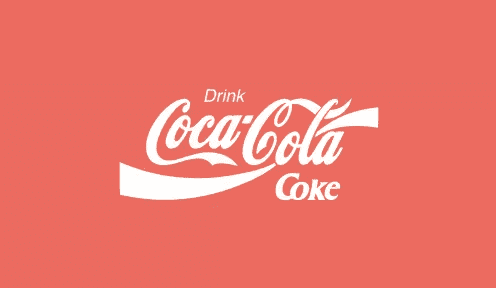

# 本周我们关注的是:更容易阅读、神经网络和谷歌指出不良网站

> 原文：<https://www.sitepoint.com/radar-week-3/>

## 发展更好的体验

如今，随着人们使用各种各样的设备来浏览网页，人们正在采取措施来试图保持人们的体验质量。谷歌现在正在调出在你的设备上不能很好工作的页面，上面有这样的信息:“使用 Flash。可能无法在您的设备上运行。有消息称[中国有超过 5 亿人通过他们的移动设备访问网络](http://thenextweb.com/asia/2014/07/21/in-china-more-people-now-access-the-internet-from-a-mobile-device-than-a-pc/)，这是改进我们技术的更大动力。

可口可乐的标志被迅速浏览了一遍

如果你是一名开发网站的自由职业者，你可能会考虑从响应性设计转向适应性设计，或者使用 T2 A/B 测试来提高你的点击率。响应式设计有一个有益的地方，正如这些著名公司的[响应式标识所很好地展示的那样，但是正如你在这个](http://responsivelogos.co.uk/)[媒体提问马里奥](http://codepen.io/ashleynolan/full/rpjHg/)中所看到的，你可以做得太过了。最后，这里有 [5 种永远不会失去自由职业的方法](https://www.sitepoint.com/5-steps-endless-supply-freelance-jobs/)。

## 改进您的设计

[“创造不受干扰的阅读体验](http://azumbrunnen.me/blog/creating-distraction-free-reading-experiences/)是一本关于如何改进你的设计的很有启发性的读物，如果你还想看更多的话，[这里有一份针对设计师的综合阅读清单](http://blog.invisionapp.com/reading-list-for-designers/)。当你想尝试一些设计时， [Kite 是一个简单而灵活的布局助手](http://hiloki.github.io/kitecss/)，它可以帮助你水平或垂直布局你的设计，嵌套组和调整内容，或者填充整个区域的部分。请注意，当涉及到布局时，原生 CSS 也被证明是非常有能力的，正如这篇关于取代原生应用程序的 [10 个 CSS 一行程序的文章中熟练展示的那样。](http://alistapart.com/blog/post/ten-css-one-liners-to-replace-native-apps/)

Patrick Catanzariti [对你的 CSS 越来越感兴趣，他打破常规，探索 CSS 形状规范](https://www.sitepoint.com/css-shapes-breaking-rectangular-design/),允许你使用其他形状，如圆形或五边形来代替方框，或者在弯曲的设计周围环绕文本。和任何新的规范一样，要得到大多数浏览器的支持还需要一段时间，但是这是 CSS 的一个很好的开端。

## JavaScript 中发生了什么？

在阅读 jQuery 的源代码时，我们发现了许多令人惊讶的东西，其中探索了可以应用于其他地方的良好细节和技术。

本周我们遇到的其他有趣的事情有:

*   ScrollMe 是一个很好的 jQuery 库，用于为网页提供滚动效果，当页面向下滚动时，你可以改变页面元素的许多方面，比如缩放、旋转、平移和不透明度。
*   VanillaMasker 是一个轻量级的库，可以将表单字段的值强制转换成您喜欢的任何格式，比如逗号分隔的美元和美分、电话号码、日期以及您可能希望使用的其他自定义模式。
*   [Brain](http://harthur.github.io/brain/) 是一个神经网络在 JavaScript 中的实现，你可以用它来训练任何可以想象的任务，例如，识别颜色对比。

## 处理太多信息？

最后，随着网络行业的发展，有时会变得太多，所以这里有一些关于作为一名网络开发人员如何不被淹没的建议。与处理太多信息有关，雅各布·古比做了一件不可思议的事情，在一个名为 [RSS Zero](http://sixrevisions.com/productivity/rss-zero/) 的有争议的项目中删除了他所有的 RSS 源。

感谢收听，下周我们将为您带来更多内容。

## 分享这篇文章