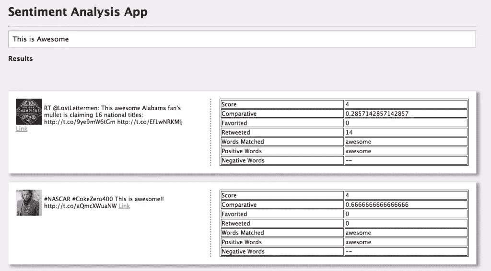
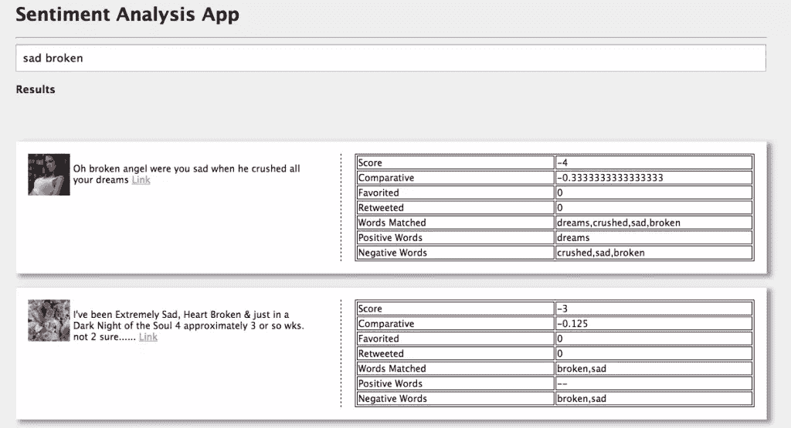
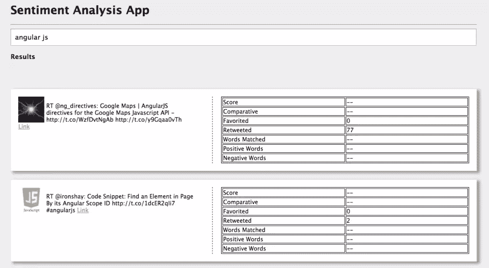
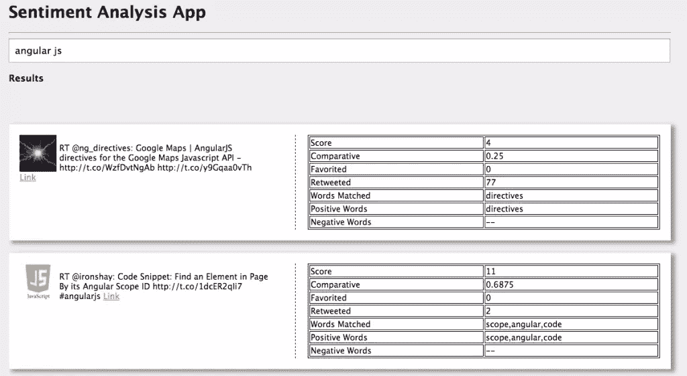

# 使用 Node.js 创建情感分析应用程序

> 原文：<https://www.sitepoint.com/creating-sentiment-analysis-application-using-node-js/>

情感分析有助于你理解人们对某个话题的看法。我们将要构建的情感分析应用程序将接受一个关键字，并从 Twitter 获取匹配的推文。然后，它将通过 AFINN 支持的情绪分析节点模块运行每条推文。该模块将对 tweet 文本进行评分，并最终显示相关的统计数据。

在我们开始之前，您可以在这里看一下演示[。你可以从](http://sentimentanalysisapp.herokuapp.com/)[这里](https://github.com/jsprodotcom/sentimentAnalysisApp)下载完整的源代码。

## 技术栈

这款应用建立在 [Nodejs](http://nodejs.org/) 之上。我们将使用 [Express](http://expressjs.com/) 作为我们的服务器端框架，使用 [jQuery](http://jquery.com) 在客户端进行 DOM 操作。为了让事情变得简单，我们将使用一个名为 [slush-express](https://github.com/arvindr21/slush-express) (由我编写)的 [Slush](http://slushjs.github.io/#/) 生成器来为我们搭建一个新的 express 应用程序。我们将使用一个名为 [diskDB](https://github.com/arvindr21/diskDB) (也是我写的)的轻量级磁盘数据库来存储结果。

我们将使用 [Twitter 模块](https://www.npmjs.org/package/twitter)与 Twitter 和[情感模块](https://www.npmjs.org/package/sentiment)进行交互，以执行分析。

那么，我们开始吧。

## 设置应用程序

创建一个名为`sentimentAnalysisApp`的新文件夹，在这里打开一个新的终端/提示符。首先，我们将使用以下命令安装 Gulp、Slush 和 Express 生成器。

```
npm i -g gulp slush slush-express
```

安装上述模块后，我们将使用以下命令搭建一个新的 Express 应用程序:

```
slush express
```

Slush 会要求你选择一个视图引擎和一个样式表引擎。如下图回答。

```
[?] Select a View Engine: HTML
[?] Select a Stylesheet Engine: CSS
```

搭建应用程序和安装依赖项需要花费 slush 几分钟时间。生成的脚手架文件夹结构将如下所示:

```
sentimentAnalysisApp
├── Gulpfile.js
├── app.js
├── bin
│   └── www
├── bower.json
├── package.json
├── public
│   └── stylesheets
│       └── style.css
├── routes
│   ├── index.js
│   └── users.js
└── views
    ├── error.html
    └── index.html
```

下面是对不同文件和文件夹的快速解释。

*   *bin/www*–服务器初始化和`port`在这里配置。
*   *app . js*–在这里配置服务器配置、路由和视图引擎。
*   *gulpfile . js*——我们项目的任务执行人。
*   */public*–由分派给 UI 的静态文件组成。
*   */routes*–由 app routes 组成。
*   */views*–由应用程序视图组成。

您可以通过执行命令`gulp`来运行应用程序。这将在端口 3000 上启动 Express 服务器。导航到`http://localhost:3000`，您可以看到示例主页。

## 服务器端开发

首先，我们将使用以下命令安装应用程序级依赖项:

```
npm i twitter sentiment --save
```

接下来，在项目的根目录下创建一个名为`logic`的新文件夹。创建两个名为`twitterSearch.js`和`sentimentAnalysis.js`的文件。这些文件分别由从 Twitter 获取 tweets 和执行分析的逻辑组成。创建另一个名为`db`的文件夹，用于存储数据。

接下来，在你喜欢的编辑器中打开`routes/index.js`。我们将增加一条新路线，`POST /search`。用户输入的搜索文本将被提交到该端点。更新`routes/index.js`如下图所示。

```
'use strict';
var express = require('express');
var router = express.Router();
var twitterSearch = require('../logic/twitterSearch');

/* GET home page. */
router.get('/', function(req, res) {
  res.render('index');
});

router.post('/search', function(req, res) {
  twitterSearch(req.body.search, function (data) {
    res.json(data);
  });
});

module.exports = router;
```

`twitterSearch()`函数预计将接受搜索词，并从 Twitter 获取匹配的推文。然后，这些推文将被输入到情绪分析模块，结果将作为回调返回。简单吧？

接下来，打开`logic/twitterSearch.js`并添加以下代码。

```
//includes
var util = require('util'),
    twitter = require('twitter'),
    sentimentAnalysis = require('./sentimentAnalysis'),
    db = require('diskdb');

db = db.connect('db', ['sentiments']);
//config
var config = {
  consumer_key: 'xxxxxxxxxxxxxxxxxxxxxxxxxxx',
  consumer_secret: 'xxxxxxxxxxxxxxxxxxxxxxxxxxx',
  access_token_key: 'xxxxxxxxxxxxxxxxxxxxxxxxxxx-xxxxxxxxxxxxxxxxxxxxxxxxxxx',
  access_token_secret: 'xxxxxxxxxxxxxxxxxxxxxxxxxxx'
};

module.exports = function(text, callback) {
  var twitterClient = new twitter(config);
  var response = [], dbData = []; // to store the tweets and sentiment

  twitterClient.search(text, function(data) {
    for (var i = 0; i < data.statuses.length; i++) {
      var resp = {};

      resp.tweet = data.statuses[i];
      resp.sentiment = sentimentAnalysis(data.statuses[i].text);
      dbData.push({
        tweet: resp.tweet.text,
        score: resp.sentiment.score
      });
      response.push(resp);
    };
    db.sentiments.save(dbData);
    callback(response);
  });
}
```

为了获取推文，我们需要首先向 Twitter 注册一个新的应用程序。然后，我们将生成所需的密钥和令牌，以便在发出请求时使用。

导航到 [Twitter 应用](https://apps.twitter.com/)，点击*创建新应用*。填写下一页的表格。一旦应用程序被创建，我们将生成所需的令牌。点击 *API 键*标签，向下滚动到页面底部。在那里点击*创建我的访问令牌*。完成后，您将看到一条消息，提示您刷新页面，请继续操作。现在，您可以看到一个 *API 密钥*、 *API 秘密*、*访问令牌*和*访问令牌秘密*，并像这样填充`config`对象:

```
var config = {
  consumer_key: 'API key',
  consumer_secret: 'API secret',
  access_token_key: 'Access token',
  access_token_secret: 'Access token secret'
};
```

如果你面临问题，请参考[本讨论](https://dev.twitter.com/discussions/631)。

接下来，打开`logic/sentimentAnalysis.js`并添加以下代码。

```
var sentiment = require('sentiment');

module.exports = function(text) {
  return sentiment(text);
};
```

逻辑很简单。我们接收 tweet 文本并返回`sentiment`对象。这就结束了我们的服务器。现在，让我们构建客户端。

## 客户端开发

首先在`public`文件夹中创建一个名为`scripts`的新文件夹。在`scripts`中，创建一个名为`app.js`的新文件，并在您喜欢的编辑器中打开它。`app.js`负责通过 Ajax 向`/search`端点提交表单，并在页面上显示结果。

我们将使用约翰·瑞西格的 [JavaScript 微模板库](http://ejohn.org/blog/javascript-micro-templating/)来从服务器数据中构建标记(如果可以的话*一个小规模的 MV **)。我已经修改了模板库，所以我们可以使用`{{ }}`而不是`<% %>`语法。这样我们可以使用`ejs`作为服务器端模板来呈现 HTML 扩展页面。完成的`app.js`如下图所示。

```
$(document).ready(function() {
  // handle the form submit
  $('#searchText').on('keypress', function(e) {
    if (e.which == 13 || e.keyCode == 13) {
      if ($(this).val().trim().length > 0) {
        // initiate an Ajax call to send the data
        fireAJAX($(this).val().trim());
      }
    }
  });

  function fireAJAX(text) {
    $.ajax({
      type: 'POST',
      url: '/search',
      data: {
        search: text
      },
      beforeSend: function(xhr) {
        $('.tweet-results').html('');
        $('.results').show();
        enableState();
      },
      success: parseData,
      error: oops
    });
  }

  function parseData(data) {
    disableState();
    var html = '';
    for (var i = 0; i < data.length; i++) {
      var s = data[i].sentiment,
          t = data[i].tweet;

      var _o = {
        imgSrc: t.user.profile_image_url,
        tweetLink: 'http://twitter.com/' + t.user.screen_name + '/status/' + t.id_str,
        tweet: t.text,
        score: s.score ? s.score : '--',
        comparative: s.comparative ? s.comparative : '--',
        favorited: t.favorite_count ? t.favorite_count : 0,
        retweet: t.retweet_count ? t.retweet_count : 0,
        wordsMatched: s.words && s.words.length ? s.words : '--',
        positiveWords: s.positive && s.positive.length ? s.positive : '--',
        negativeWords: s.negative && s.negative.length ? s.negative : '--'
      };

      html += tmpl('tweet_tmpl', _o);
    };
    $('.tweet-results').html(html);
  }

  function oops(data) {
    $('.error').show();
    disableState();
  }

  function disableState() {
    $('.loading').hide();
    $('#searchText').prop('disabled', false);
  }

  function enableState() {
    $('.loading').show();
    $('#searchText').prop('disabled', true);
  }
});

// Simple JavaScript Templating
// John Resig - http://ejohn.org/ - MIT Licensed
(function() {
  var cache = {};

  this.tmpl = function tmpl(str, data) {
    // Figure out if we're getting a template, or if we need to
    // load the template - and be sure to cache the result.
    var fn = !/\W/.test(str) ?
      cache[str] = cache[str] ||
      tmpl(document.getElementById(str).innerHTML) :

    // Generate a reusable function that will serve as a template
    // generator (and which will be cached).
    new Function("obj",
      "var p=[],print=function(){p.push.apply(p,arguments);};" +

      // Introduce the data as local variables using with(){}
      "with(obj){p.push('" +

      // Convert the template into pure JavaScript
      str
      .replace(/[\r\t\n]/g, " ")
      .split("{{").join("\t") // modified
      .replace(/((^|\}\})[^\t]*)'/g, "$1\r") // modified
      .replace(/\t=(.*?)}}/g, "',$1,'") // modified
      .split("\t").join("');") 
      .split("}}").join("p.push('") // modified
      .split("\r").join("\\'") + "');}return p.join('');");

    // Provide some basic currying to the user
    return data ? fn(data) : fn;
  };
})();
```

接下来，打开`views/index.html`并添加以下代码。

```
<!DOCTYPE html>
<html>

<head>
  <title>Sentiment Analysis App</title>
  <link rel='stylesheet' href='/stylesheets/style.css' />
</head>

<body>
  <h1>Sentiment Analysis App</h1>
  <hr/>
  <input type="text" id="searchText" placeholder="Enter the text you would like to see the analysis for and hit return">
  <div class="results">
    <h3>Results</h3>
    <lable class="loading">Loading.. Please wait</lable>
    <br/>
    <lable class="error">Oops.. Something went wrong</lable>
    <br/>
  </div>
  <section class="tweet-results">
  </section>

  <script src="//code.jquery.com/jquery-1.11.0.min.js"></script>
  <script type="text/javascript" src="scripts/app.js"></script>
  <script type="text/html" id="tweet_tmpl">
    <article>
      <div class="left">
        
        <p>{{=tweet}}
        <a href="{{=tweetLink}}" target="_blank">Link</a></p>
      </div>
      <div class="right">
        <table>
          <tr>
            <td>Score</td>
            <td>{{=score}}</td>
          </tr>
          <tr>
            <td>Comparative</td>
            <td>{{=comparative}}</td>
          </tr>
          <tr>
            <td>Favorited</td>
            <td>{{=favorited}}</td>
          </tr>
          <tr>
            <td>Retweeted</td>
            <td>{{=retweet}}</td>
          </tr>
          <tr>
            <td>Words Matched</td>
            <td>{{=wordsMatched}}</td>
          </tr>
          <tr>
            <td>Positive Words</td>
            <td>{{=positiveWords}}</td>
          </tr>
          <tr>
            <td>Negative Words</td>
            <td>{{=negativeWords}}</td>
          </tr>
        </table>
      </div>
    </article>
  </script>
</body>
</html>
```

这里我们指的是 jQuery 和`app.js`。我们还创建了一个模板(`tweet_tmpl`)，用于显示结果。最后，打开`stylesheets/style.css`，添加下面的类。

```
body {
  padding: 50px;
  font: 14px"Lucida Grande", Helvetica, Arial, sans-serif;
  background: #eee;
}
a {
  color: #00B7FF;
}
input {
  width: 98%;
  padding: 9px;
  font-size: 17px;
}
.results {
  display: none;
}
.error {
  color: red;
  display: none;
}
.tweet-results {
  width: 100%;
  overflow: hidden;
  padding-right: 18px;
}
.left {
  float: left;
  width: 39%;
}
.right {
  float: right;
  width: 55%;
  border-left: 1px dashed;
  padding-left: 21px;
}
article {
  background: #fff;
  display: block;
  padding: 18px;
  border: 1px solid #eee;
  margin-top: 21px;
  margin-bottom: 21px;
  overflow: hidden;
  box-shadow: 6px 4px 9px 1px rgba(119, 119, 119, 0.75);
  -moz-box-shadow: 6px 4px 9px 1px rgba(119, 119, 119, 0.75);
  -webkit-box-shadow: 6px 4px 9px 1px rgba(119, 119, 119, 0.75);
}
article img {
  width: 64px;
  float: left;
  margin:0 5px 0 0;
}
.right table {
  width: 100%;
}
.right table, .right table td {
  border: 1px solid;
}
.right table td {
  width: 50%;
}
```

就这样，我们完成了我们的发展。让我们运行应用程序并测试它。回到终端，运行`gulp`命令启动服务器。导航到`http://localhost:3000/`，您应该会看到搜索栏。输入“这太棒了”,然后按回车键，您应该会看到类似这样的内容:



这里，`Score`是 tweet 中与 AFINN 源匹配的每个单词的得分总和。`Comparative`等于`score/total words`。`Words Matched`显示在处理过程中有多少来自 tweet 的单词与 AFINN 单词匹配。`Positive Words`是匹配的肯定词，`Negative Words`是匹配的否定词。这些数据应该给你足够的信息来做决定和理解情绪。

清除搜索栏，输入`sad broken`并点击回车键。您的结果应该如下所示:



简单易行对吗？现在你可以搜索几个词，看看结果如何。

## 训练您的数据

你现在一定注意到了，并不是所有的 tweets 都返回结果。这是因为，如果 tweet 中没有一个单词与 AFINN 中的单词匹配，那么分数将为 0。例如:



如果你想解决这个问题，你可以训练情感模块。在名为`training.js`的`logic`文件夹中创建一个新文件，并添加以下代码。

```
module.exports = {
  directives: 4,
  angular: 5,
  code: 3,
  scope: 3
};
```

在这里，我们正在训练该模块使用上面提到的单词的分数。接下来，这样更新`logic/sentimentAnalysis.js`:

```
var sentiment = require('sentiment');
var trainedData = require('./training.js');
module.exports = function(text) {
  return sentiment(text, trainedData);
}
```

训练后，结果将如下所示:



这是一个非常强大的技术，所以请确保您为关键字分配了正确的值，否则您可能会看到没有意义的结果。更多信息请参考 [AFINN](http://www2.imm.dtu.dk/pubdb/views/publication_details.php?id=6010) 。

## 创建 RESTful 服务

你可以建立一个实时仪表板，显示推文和结果。您可以运行一个异步作业，它会不时地调用 Twitter API，获取数据，并使用 diskDB 保存数据。然后，您可以将这个文件作为 RESTful 端点公开。将以下代码添加到`routes/index.js`。

```
router.get('/data', function(req, res) {
  res.json(require('diskdb')
    .connect('db', ['sentiments'])
    .sentiments.find());
});
```

现在，当您访问`http://localhost:3000/data`时，您可以看到迄今为止保存的完整数据。这里有一个活生生的例子。

## 整合社交媒体

类似于 Twitter，你可以整合[脸书](https://www.npmjs.org/package/facebook-node-sdk)、[谷歌+](https://github.com/google/google-api-nodejs-client/) ，以及其他社交媒体数据。你需要做的就是把你想分析的文本传给`logic/sentimentAnalysis.js`，你就可以看到它的分数了。

## 结论

我希望你对如何使用这个应用程序进行情感分析有了一个基本的想法。感谢阅读！请评论。

## 分享这篇文章