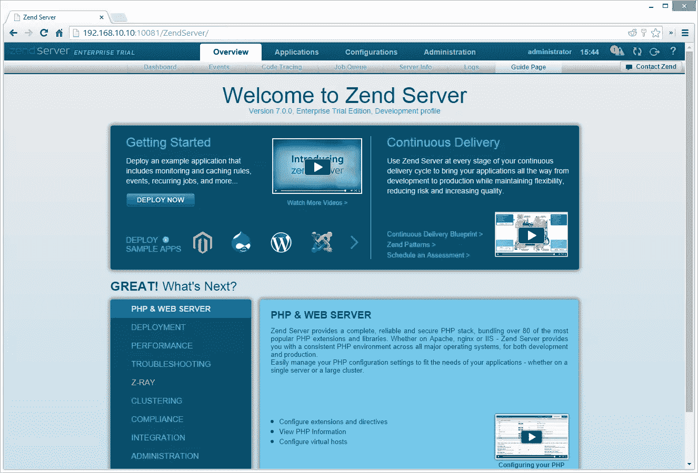
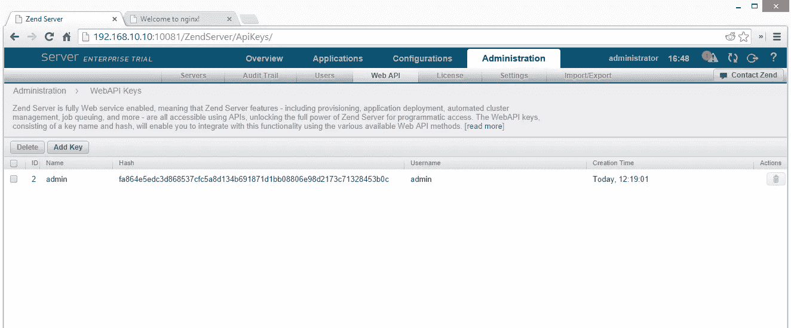
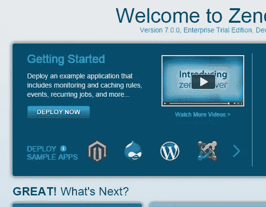
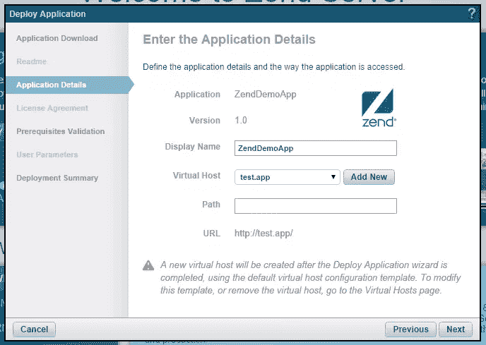
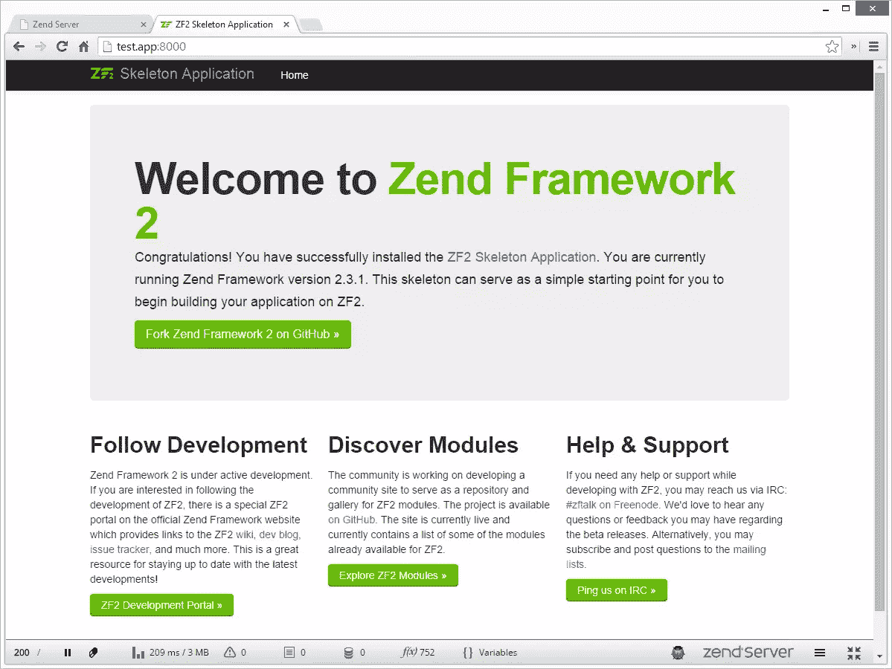
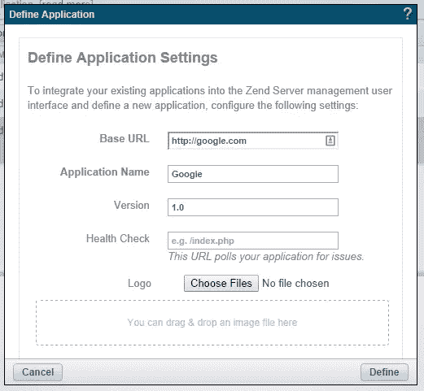
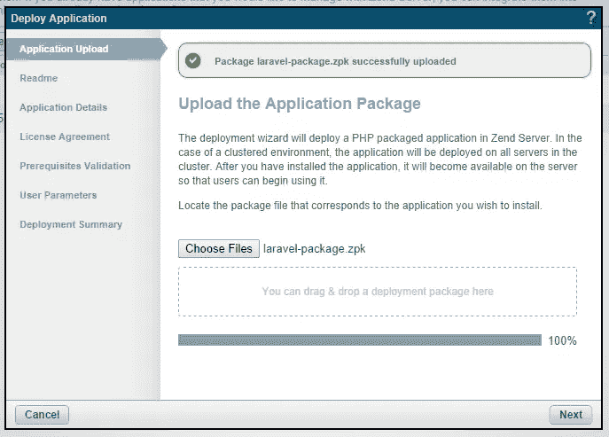
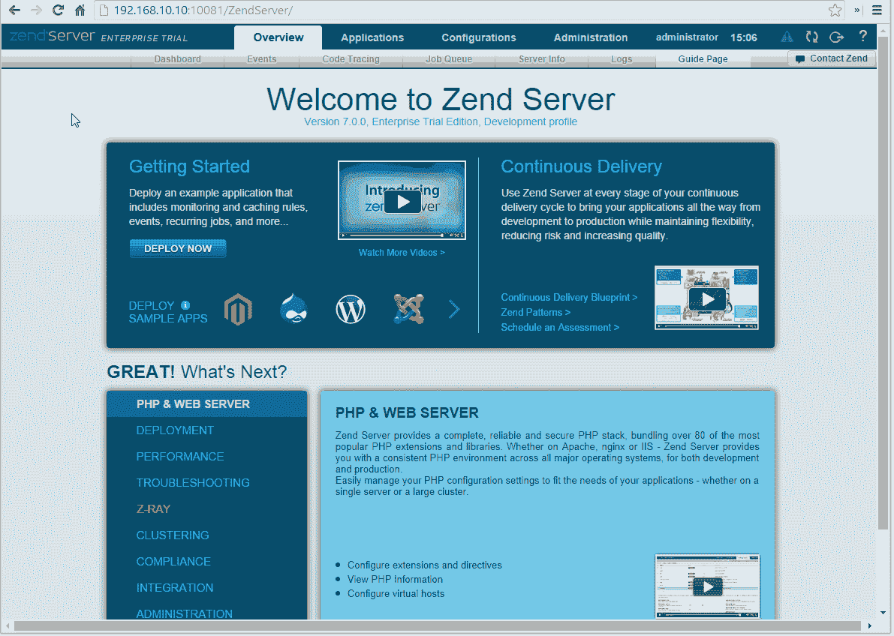
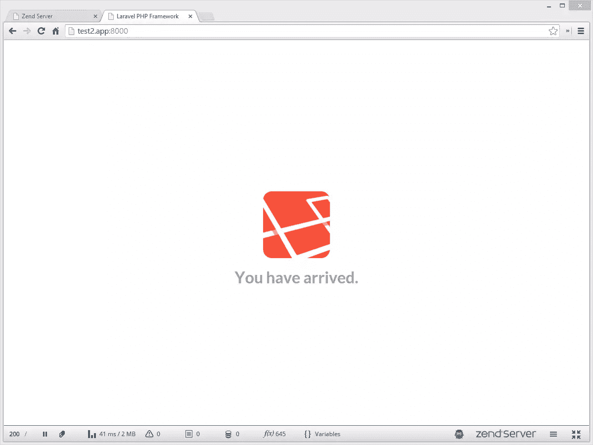

# 了解 Zend Server 7

> 原文：<https://www.sitepoint.com/getting-know-zend-server-7/>

Zend Technologies 是资助开发 [Zend 引擎](http://en.wikipedia.org/wiki/Zend_Engine)(PHP 基于的引擎)，以及 [Zend 框架](http://framework.zend.com/)和其他一些项目如 [Apigility](https://apigility.org/) 的公司。他们还构建高专业水准的专有软件，为大公司的高强度 PHP 工作而设计——像 [Zend Studio](http://www.zend.com/en/products/studio) 和 [Zend Server](http://www.zend.com/en/products/server) 这样的软件——尽管这两个软件也是单人开发的优秀工具。在本帖中，我们将看看后者。

## 什么是 Zend 服务器？

Zend Server 本质上是一个本地运行的 web 应用程序，它可以帮助您运行、部署、调试和生产准备您编写的其他应用程序。然而，它不仅仅是一个开发人员助手——您可以将它安装在您的生产服务器上，让它负责托管、集群、文件分发等等。

它自动安装 Zend Framework(出于某种原因，同时安装版本 1 和 2)和 Symfony 2，并支持对其他库和项目的基于 GUI 的管理，以便于使用。所有的操作系统和平台都被支持，你可以选择把它和 Apache 或者 Nginx 一起安装。你可以在 PHP 版本 5.4 或 5.5 中让它拉进来，一旦你运行安装脚本，它就会自己完成剩下的工作。

ZS 的最新版本，第 7 版，有几个许可和版本，所以如果你想知道它们的区别，可以读一读。

如果您以前从未遇到过 Zend Server，那么它的概念可能有点太抽象，现在很难理解，所以让我们来浏览一下。

## 安装 Zend 服务器

安装是通过他们的安装程序完成的，安装程序因平台而异。要将其安装到 Ubuntu 14.04 的盒子中，请参见我们的[快速提示](https://www.sitepoint.com/quick-tip-install-zend-server-7-ubuntu-14-04-vagrant-box/)。如果您想跟随我们浏览这些功能，请现在就做。应该不会超过 10 分钟。

如果您使用的是 Linux 操作系统，并且没有遵循我们的快速提示，请记住按照这里的[所述修改日志文件权限。这对于 Zend Server 拥有日志访问权限以及能够生成虚拟主机是必要的。](http://files.zend.com/help/Zend-Server/zend-server.htm#log_file_permissions.htm)

## 特征

现在让我们更深入地看看 ZS，研究它的特征。

### 图像使用者界面



前端速度极快，令人惊讶。尽管会发生页面全重加载，但屏幕加载速度如此之快，以至于你认为这是 ajax 也情有可原。快速动态菜单装饰在控制面板的顶部，虽然它可以在设计部门使用升级，但它清楚地传达了可用的选项。我可以举出几十个例子，在这些例子中，我希望我不必仅仅因为等待我的缓慢加载时间而登录到一家公司的后端。有一个如此流畅的界面真的让人想使用它。

正如你在上图中看到的，迎接我们的第一个屏幕是概览屏幕的指南页面，有一些有用的指南和视频。下半部分会给你提示下一步要微调什么，关于 PHP 配置和其他，当需要重启服务器时(比如启用一些 PHP 扩展后)，应用程序会用一个模态弹出窗口通知你。在你浏览“下一步是什么”选项后，你会注意到它们经常重复出现，并且都可以通过主菜单进入。例如，您可以通过`PHP & WEB SERVER`访问虚拟主机管理，也可以通过`Applications -> Virtual Hosts`访问。

看看顶部的菜单，看看所有其他选项——当然有太多的选项让我们在一篇文章中一目了然。

### 图书馆管理

一个不能不提的特点是图书馆管理。这个接口可以在`Applications -> Libraries`到达，它允许你向 Zend 服务器环境添加新的库，在补丁发布时更新它们，并且——也许最好的是——让它们在服务器上对所有应用程序都可用。它们会自动添加到包含路径中，您可以在项目中使用它们。


您可能认为这会降低您的应用程序的速度，因为还需要查看另一个巨大的包含路径，但是您错了。为了在您的项目中实际使用一个已部署的库，您需要插入一个 API 调用，如这里描述的。注意上图中的“库路径”值——将它包含在项目中会自动启用它。

显然，这将您的应用程序大量绑定到 Zend Server 上——这是另一个讨论的主题，因为它有其优点和缺点。

### z 射线

> Z-Ray 监控向 Web 服务器发出的请求，并在浏览器的网页组件上显示相关的实时详细信息。这些信息包括:请求执行时间、事件、日志条目、数据库查询、函数等等。使用 Z-Ray，开发人员可以真正了解他们的 PHP 代码，允许他们检查、调试和优化他们的页面，从而实现快速稳定的应用程序。

Zend 的实时调试器实现，Z-Ray 可以在您的请求发生时挂钩，并提供关于内部正在发生的事情的实时最新见解。您将能够轻松识别应用程序中最慢的部分，甚至在 PHP 记录错误之前就能看到错误，并且您将能够以前所未有的方式微调您的应用程序。

要阅读更多关于 Z-Ray 的内容，请点击此处或等待我们的评论。

### Web API

令人印象深刻的是 Zend Server 完全支持 web API。这意味着你可以用你认为合适的任何语言或风格为它编写新的界面——甚至是移动应用程序——并从任何地方管理你的 Zend Server 部署的应用程序。



在应用程序和应用程序管理的后端接口中，这是一个不常见的特性，所以我很惊喜地遇到了它。

### 自定义 PHP 扩展

但是，如果我想使用定制的 PHP 扩展怎么办？我们要怎么做呢？这可能吗？也许我想用 Phalcon 构建我的应用程序，但仍然继续用 Zend Server 管理它们，融合两个世界的精华。

好消息是——这是可能的。然而，这有点超出了这篇文章的范围，所以看看我们为此写的[快速提示](https://www.sitepoint.com/quick-tip-4-steps-install-custom-php-extensions-zend-server-7)。

### 部署应用程序

让我们看看使用 Zend Server 7 开始部署应用程序有多容易。

#### 准备好的应用程序

ZS 知道如何安装几个准备好的应用程序。例如，要了解如何安装 PhpMyAdmin，请阅读我们的[快速提示](https://www.sitepoint.com/quick-tip-install-zend-server-7-ubuntu-14-04-vagrant-box/)的可选步骤 5——安装并运行它大约需要一分钟。

#### 演示应用程序

Zend Server 还提供了 Zend Framework 2 应用程序的安装。要安装它，我们单击通用的“立即部署”按钮并按照步骤操作。



对于主机名，我选择了`test.app`，这是我不久前为所有 VM 实验目的定义的主机。我鼓励你在你的主机的 hosts 文件中添加一些试验性的主机名，这样你就可以在玩流浪者和定义短命应用程序的时候过着没有主机的生活。



部署之后，您应该能够通过 host:8000 访问 ZF2 演示应用程序，或者在我的例子中，就像这样:



#### 空白应用程序

但是，如果我们想要一个空白的应用程序呢？我们总是需要使用模板吗？没有。有两种类型的应用程序可以自定义添加到 ZS 管理界面。我们接下来将介绍它们，但是首先，在 GUI 中转到`Applications -> Apps`——您需要从下面的截图中看到这两个选项。


##### 添加已安装的应用程序(定义)

定义应用程序将让你指向 ZS 现有的和工作的 PHP 应用程序。应用程序可以，但不是必须在这个服务器上，也可以添加远程应用程序。然而，重要的是要注意，定义一个应用程序并没有将应用程序置于 ZS 的摆布之下，因此 ZS 不能管理它(部署、读取日志、重新安装、调试等等)。它只是作为另一个应用程序的“仍然有效”的检查器(注意健康检查 URL——该 URL 被 pinged 并报告遇到的任何问题)。

再加上谷歌吧。




不过，这并不好玩。让我们来看看部署。如果你想了解更多关于定义的知识，请看这里。

##### 部署新应用程序(部署)

部署应用程序是一项非常复杂、激动人心和有用的工作。首先，我们需要一个服务器上的示例应用程序。还是用 Laravel 的骷髅 app 吧。

要使用 ZS7 附带的命令行 PHP，我们需要将它添加到我们的路径中。在虚拟机的终端中，执行以下操作:

```
echo "PATH=\"/usr/local/zend/bin:\$PATH"\" >>  ~/.profile
source ~/.profile 
php --version
```

如果您获得了 PHP 的良好版本输出，并且没有“command not found”错误，那么您就万事俱备了。现在让我们在全球范围内安装 Composer 并启动 Laravel 项目。

```
cd ~/Code
curl -sS https://getcomposer.org/installer | php
sudo mv composer.phar /usr/local/bin/composer
composer create-project laravel/laravel test2.app --prefer-dist
```

您可以通过执行`php public/index.php`快速检查它是否正确渲染。

为了能够在 Zend 服务器上部署这个应用程序，我们需要将它转换成一个[可部署包](http://files.zend.com/help/Zend-Server/content/preparing_the_package_using_the_deployment_tool.htm)。

```
cd ~/Code zdpack create laravel-package
```

zdpack 是打包程序，它通过 create 命令在 laravel-package 文件夹中为我们创建必要的包子文件夹。我们现在需要做的是将 Laravel 应用程序代码移动到 data 子文件夹中:

```
mv test2.app/* laravel-package/data/
```

然后，建议我们编辑`deployment.xml`文件。它包含项目名称和描述、数据库连接凭证和其他元数据等数据。我们唯一需要修改的是`docroot`节点——将其设置为`data/public`,而不是`data`。点击查看可用节点[的完整列表。](http://files.zend.com/help/Zend-Server/content/the_xml_descriptor_file.htm)

用`zdpack validate deployment.xml`验证修改后的 XML 文件，如果一切顺利，用

```
cd ~/Code zdpack pack laravel-package
```

这将创建一个`laravel-package.zpk`文件，您可以通过 Zend Server GUI 中的“Deploy”弹出菜单上传该文件:



如果您按照向导进行操作，应用程序应该能够成功部署，但是通过浏览器运行它仍然无法工作。怎么回事？

##### 排除故障

让我们利用这个机会来调试这个问题。进入仪表盘，选择“laravel-package”或其他你命名的应用程序，你应该会看到它包含 100%的错误。看起来它试图做一些文件操作，但失败了。



显然，我们正在处理一些文件权限错误。事实上，如果我们查看堆栈跟踪，我们可以准确地看到应用程序正在尝试创建哪个文件:


为了缓解这种情况，我们需要执行一些权限修复。在 ZS 的“虚拟主机”部分，您可以很容易地找到每个应用程序在文件系统中的位置。有了这些知识，我们可以执行命令:

```
sudo chmod 777  -R /usr/local/zend/var/apps/http/test2.app/80/0.1_7/app/storage
```

注意，从安全角度来说，完全权限(777)可能不是最佳方式，所以只在开发中使用 777。在生产中，您将确保 Zend 运行 PHP 的用户是`app/storage`文件夹的所有者。现在重新加载我们的 Laravel 测试应用程序的 URL，注意它非常有效:



## 结论

Zend Server 7 是一个功能丰富的套件，用于管理、部署、分发和调试 PHP 应用程序。在某种程度上，它将你的应用程序绑定到自身，所以一旦你去了 ZS，你就不会再回去了——类似于 HHVM。然而，这些额外的功能是否值得，取决于你自己。你更喜欢部署和调试的便利性，还是更愿意让你的应用程序 100%即时可移植？

不管怎样，ZS 对于任何负责几个项目的管理员来说都是天赐之物，在接下来的几个月里，我肯定会更多地测试它的特性。你会加入我吗？介意试一试并报告我们遗漏的潜在问题和/或重要功能吗？期待大家的评论！

## 分享这篇文章