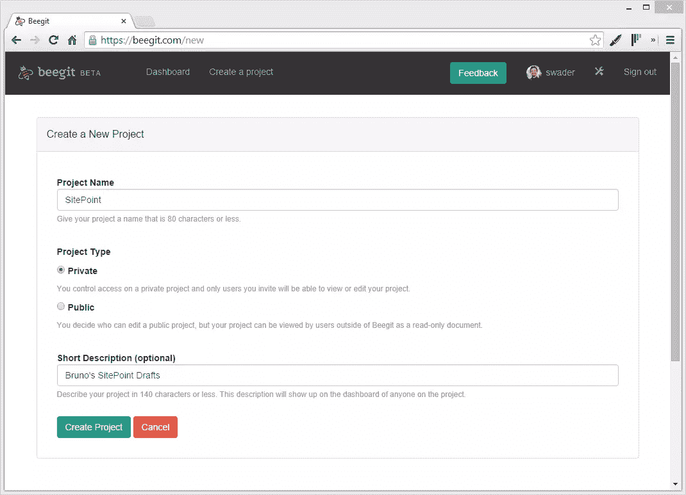
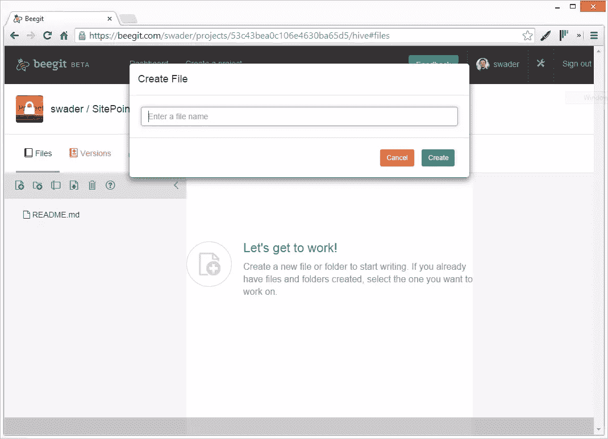
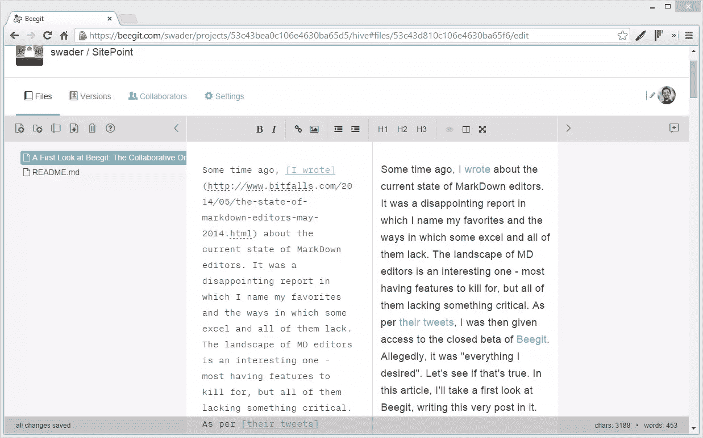
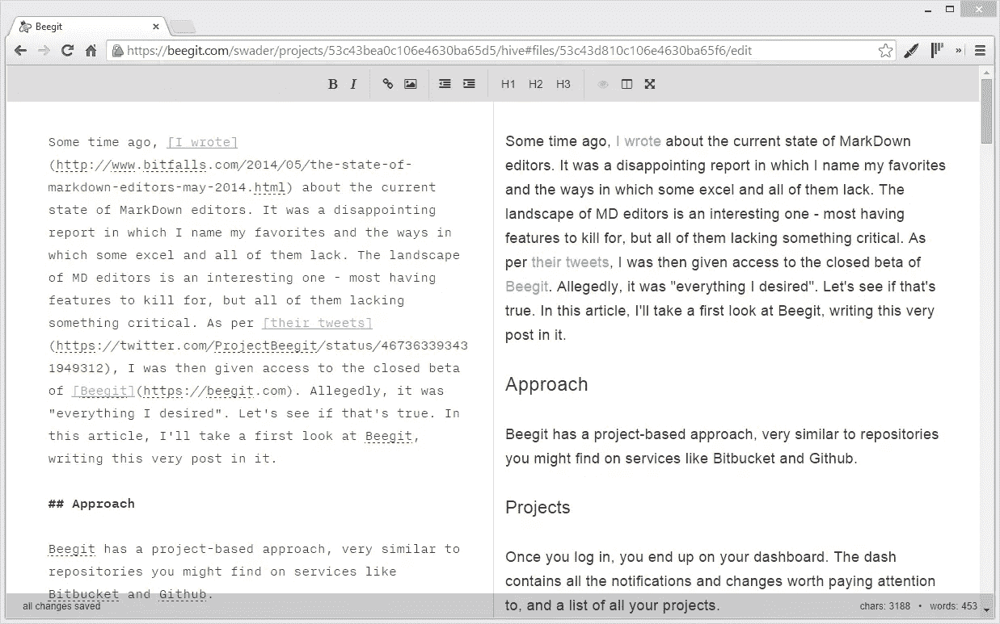
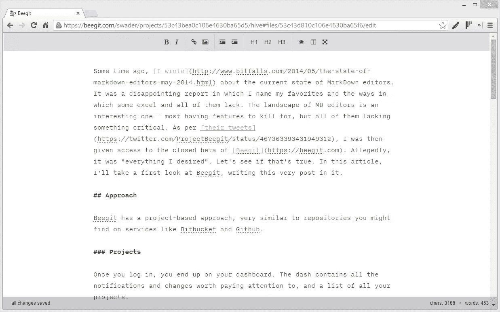
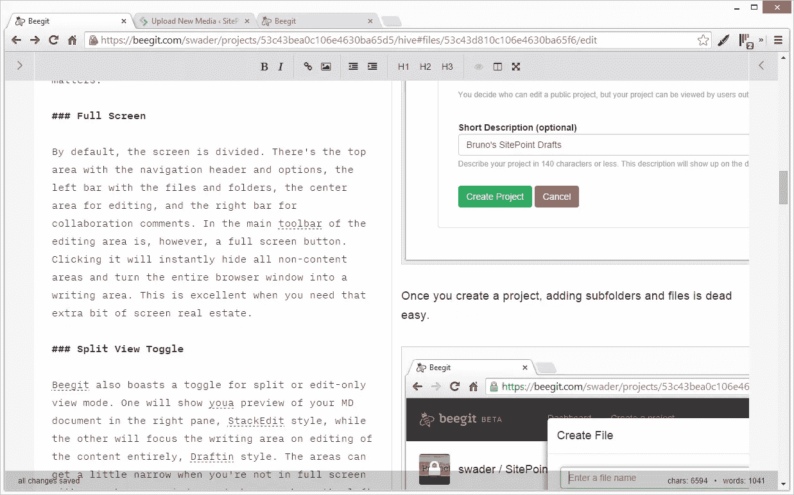
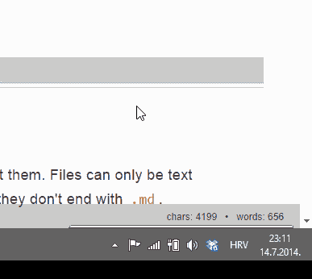

# Beegit 初探:协作式在线降价编辑器

> 原文：<https://www.sitepoint.com/first-look-beegit-collaborative-online-markdown-editor/>

前段时间，[我写了](http://www.bitfalls.com/2014/05/the-state-of-markdown-editors-may-2014.html)关于 MarkDown 编辑器的现状。这是一份令人失望的报告，我在报告中列举了我最喜欢的人，以及一些人出色而所有人都不出色的地方。MD 编辑的前景很有意思——大多数都有令人着迷的功能，但是他们都缺少一些关键的东西。

一段时间后， [StackEdit](https://stackedit.io/) 修复了他们的性能问题，重新回到了我的列表的顶端，但是仍然缺少一些东西。根据[他们的推文](https://twitter.com/ProjectBeegit/status/467363393431949312)，我被允许进入 [Beegit](https://beegit.com) 的封闭测试版。据称，这是“我想要的一切”。让我们看看这是不是真的。在本文中，我将首先看看 Beegit，在其中写这篇文章(太元了！).请注意，我将把大多数功能与当前的卫冕冠军 StackEdit 进行比较——特别是他们的[测试版](https://stackedit-beta.herokuapp.com/)。

## 方法

与 StackEdit 基于文件的方法相反，Beegit 有一种基于项目的方法，非常类似于您可能在 Bitbucket 和 Github 等服务上找到的存储库。

### 项目

登录后，您会出现在您的仪表板上。dash 包含所有值得注意的通知和更改，以及所有项目的列表。

项目就像 Github 仓库。你可以有公共的或私人的，它们都包含文件夹和其他文件。您可以与其他人共享它们，给它们添加描述，给它们重新命名，更改它们的封面图像，等等。此外，您可以随意将它们从私有切换到公共。

### 文件

文件是专门降价的文件，即使它们不以`.md`结尾。要编辑它们，你点击文件名和内容，以及一个工具栏，出现在屏幕的中心区域。创建它们非常简单:

不过，这也是我第一次遇到一些问题的地方。

1.  长文件名的文件会被裁剪，而不是换行。
2.  有时，工具栏和内容无法加载。这需要刷新页面。

这两个问题都可以在下面的 GIF 中看到。

## 用户界面

现在让我们看看 UI 是如何堆叠的。总而言之，与 StackEdit 相比，UI 同样不错，如果不是更好的话。

### 工具栏

工具栏提供了一组熟悉的按钮——粗体、斜体、缩进、突出、标题、图像、链接和一些与格式无关的按钮:预览、分屏切换和全屏。

### 全屏幕

默认情况下，Beegit 编辑器屏幕的顶部区域包含导航和选项，左侧区域包含项目结构，右侧区域包含协作注释，还有文本编辑器的主区域。全屏按钮可以移除除主要区域之外的所有区域，从而提供不受干扰的书写体验。在分屏模式下书写时(见下图)，体验更加流畅。

### 分屏切换

分屏切换将编辑器视图从单屏编辑模式( [Draftin](https://draftin.com/) -style)切换到两栏编辑+预览模式，堆栈编辑风格。

### 状态

当刷新屏幕或打开其他文件时，用户界面通常会记住元素和框架的位置。然而，当我进入另一个屏幕，比如 settings，并返回时，默认设置被重新加载——例如，我明确关闭的右窗格被再次打开。这是一个小烦恼，但仍然是一个烦恼。

## 特征

现在来说一下内部。

### 图像嵌入

在这个编辑器中，图像嵌入是一个棘手的问题。虽然它确实工作得很好，但还没有达到它应该或可能达到的水平。首先，你不能上传图片——没有将编辑器绑定到 CDN 端点的选项。工具栏快捷方式唯一做的事情实际上是打开一个弹出窗口，让您输入 alt 文本和图像的 URL，这实际上只是编写 MD 语法的快捷方式。编写一个插件将上传文件转发到 Google Drive 或 Dropbox 是相当简单的，并且应该完成。

此外，过了一段时间，一旦你添加了一些图像，编辑器文本和预览文本就不同步了，因为 Beegit 试图让它们保持同步。相反，他们应该采用 StackEdit 的方法，即只测量编辑器端的滚动百分比，然后将其应用于预览窗格的百分比——这意味着图像滚动得更快，但文本保持同步。在比吉特，我们得到这个:

### 自动保存

正如预期的那样，autosave 是自动的，而且运行良好——至少看起来是这样。然而，由于 Beegit 方面的启动过载错误，这实际上是我第二次写这篇文章，通过从内存中复制它。发生的情况是，编辑器一直报告自动保存成功，而实际上我的更改从未到达服务器。在许多成功的刷新之一后，我最终得到了一个空文件，丢失了一个 1000 字的草稿。

他们说这种事不会再发生了，但事实是，编辑在一件不该失败的事情上失败了——数据安全。一个简单的 ping 命令检查一个端点是否 ping 成功，这看起来像是一个升级，可以防止这样的问题，或者至少是一些本地存储备份，尽管这可能会干扰我们的下一点。

### 多个实例

Beegit 允许您使用其编辑器的多个实例。这对我很重要，因为我经常编辑一篇长文章的不同部分，或者在整理或编辑新文章时需要参考旧的草稿。虽然不能在新标签页中按住 ctrl 键并点击一个文件名来打开它，但是你可以从头开始在另一个标签页中加载它，并从那里获得该文件。为 autosave 安全添加本地存储的问题(如上所述)可能是一些竞争条件，所以我宁愿在 autosave 中实现一个适当的安全 ping，而不是删除对多个实例的支持。

### 拼写检查器

拼写检查快如闪电，检查你的输入没有延迟。然而，它不是本地的(不是你的浏览器的)，这意味着你不能改变语言，你不能添加新词到字典中。这很烦人，像“不是”和“自动保存”这样的词上分散注意力的红色下划线也很讨厌。

### 打字速度

即使拼写检查既非常快又是非本机的，它仍然没有做任何事情来阻碍打字速度。在按键上可以感觉到非常非常小的延迟，但这是不明显的，除非你真的习惯了更快的速度(就像现在的 Draftin 或 StackEdit)。

### 单词和字符计数器

另一个棘手的特点——对我来说，一个总是可见的单词计数器是绝对必要的。但由于这一功能的性质，它通常会出现在一个非常尴尬的位置，比如屏幕的右下角——而屏幕的这个角落通常是为一些像谷歌 Hangouts 这样的永远在顶部的 IM 应用程序保留的。这就是为什么我更喜欢能够移动它(就像在 StackEdit 的测试版中)并且不碍事。单词 counter 的另一个问题是它的容器(灰色条)是透明的。这会使文本干扰下面的任何文本，因此，如果您有一些文本，或者更糟糕的是，图像下面有文本，则会失去一些可读性:

### 展开性

StackEdit 令人印象深刻的是它的开源特性和插件支持。你不仅可以用新的特性直接扩展它，你还可以在运行中改变参数，只需进入设置，然后进入自定义扩展，在那里你可以编写普通的旧 JavaScript 来让它做你想做的事情。

不幸的是，Beegit 没有任何插件架构，也不能根据个人需求进行调整。这是一个巨大的损失——一个工具需要被调整以保持一个流畅的工作流程。

## 合作

现在让我们测试一些 collab 特性。

### 合作者

只需在协作菜单中邀请某人即可完成协作。collab 有三个级别:观察者、编辑和管理员，它们都适用于整个项目。不可能只与某人合作一个文档，而隐藏其他文档。目前，collab 功能仅限于实时变化的 websocket 集成，因此，如果您在一个用户的一个窗口中键入内容，它将在另一个用户的另一个窗口中发生变化。然而，这是令人分心的，因为另一个合作者不知道谁在哪里做什么——没有指示符来指示在哪里进行了更改(例如，在 Google Docs 中),文字只是出现。观察:

协作还会将其他人置于只读模式。我不知道这是好是坏——我认为这对工作效率是有害的，尤其是考虑到它都是有版本的，可以很容易地在事后进行处理、合并和修复。

### 评论

当一个评论被放到一个文档上时，它只是进入一个评论栏。没有办法将它应用于某一段文本(如在谷歌文档中)或解决它——这是所有合作者之间的单向对话。很难合作，因为有像 [Slack](https://slack.com/) 这样的工具供我们使用。

当有人发表评论时，收到电子邮件是很方便的，但我可以想象当真正的对话升温时，它会变得垃圾邮件。

不用说，协作功能不会赢得任何奖项。

## 出口

当我在 MD 写文章或做日常编辑时，我需要经常使用 HTML 导出按钮。不言而喻，我相当不喜欢 Beegit 的 HTML 导出方式。它不仅不允许我编辑我的导出类型(例如，完全改变代码块的导出，但保留其余文本的导出)，它也没有“快速”导出——我需要直接下载 HTML 文件，打开它，选择 HTML，然后复制并粘贴到我选择的后端(也没有与流行的发布平台直接集成的发布，所以没有挂钩到 WP，Ghost，Tumblr 等)。

出口本身并不坏，它做了它的工作，但它不是我在速度和使用流量方面寻找的。我不希望文件接触我的硬盘——他们应该把我当成 Chromebook 的用户。我希望 HTML 直接进入我的剪贴板，我希望能够调整生成的 HTML 的各个部分。

说到代码，代码支持糟糕透顶，几乎无法使用 Beegit 不仅不能正确支持代码转换，也缺乏任何 Github 风格的对代码亮点的降价支持，它还完全破坏了输出:

与代码有关的一切绝对是他们应该从 StackEdit 中借鉴的领域。

## 结论

Beegit 作为一个新手显示了很大的潜力，但是在被认为是一个严肃的竞争者之前，它有一些严重的缺点要扭转。糟糕的代码支持，插件架构的缺乏，非原生拼写检查器，以及死板的单词计数器，当我在写作一个半小时后丢失了我的草稿时，这些只是失望的锦上添花。当然，该工具仍处于测试阶段，预计会出现错误，所以我肯定会密切关注它——但就目前而言，StackEdit 仍然是至高无上的。

你给过[啤酒](https://beegit.com/)一次机会吗？你认为他们还应该改变什么？

## 分享这篇文章