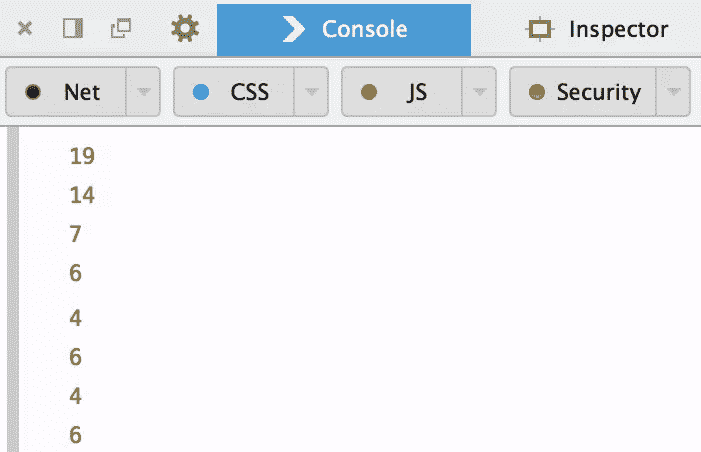

# 移动网络超能力:环境光 API

> 原文：<https://www.sitepoint.com/mobile-web-superpowers-ambient-light-api/>

网络已经成为一个虚拟的环境，带来了全方位的体验。如果有人想在野餐时讨论新的蝙蝠侠电影时，在智能手机上查看关于本·阿弗莱克饰演蝙蝠侠的最新令人沮丧的言论。他们可以随心所欲地阅读评论。我们生活在这样一个时代，作为开发者，我们可以为公众提供资源、知识和经验，无论他们身在何处，都能满足他们的日常生活和随机兴趣。随着新设备 API 和传感器的出现，我们开始看到允许我们响应其环境、位置和设备状态的可能性。

设备 API 领域发生了很多事情。对于像我一样渴望开发的人来说，这是一个令人兴奋的机会，可以开始探索我们如何使用这些即将到来的 API 来改善我们网站/web 应用程序的访问者体验。

当他们访问我们新的“哥谭”电视节目 fansite 时，他们是不是在一个黑暗的房间里，不希望明亮的白色背景灼伤他们的视网膜？

他们会在前面提到的野餐中挣扎吗——透过正午的阳光斜睨着我们的文本？

他们的手机电池即将耗尽，这使得他们在阅读最新的蝙蝠侠同人小说时，可能不想播放哥谭市天际线的流媒体视频背景吗？

在这一系列文章中，我将介绍各种类似的 API，以及每个 API 的演示和潜在用途。希望它能改变你对即将到来的项目的一些想法！

我们将从 W3C 环境光 API 开始，它允许我们对设备周围的光线水平做出反应。

## 环境光 API 的基础知识

环境光 API 为开发人员提供了一种感知设备周围光线强度的方法。它以[勒克斯](http://en.wikipedia.org/wiki/Lux)为单位测量设备周围的光线，勒克斯是衡量光线强度的国际单位。MDN 关于使用光传感器的[的文章](https://developer.mozilla.org/en-US/docs/Web/API/DeviceLightEvent/Using_light_sensors)很好地概述了这些勒克斯值范围所代表的含义:

> 10 ~ 50 勒克斯:昏暗环境
> 
> 100 ~ 1000 勒克斯:正常
> 
> 10000 勒克斯:明亮

我建议您对每个实现都使用这些值进行一些反复试验。在下面的演示中，我的亮度触发点略有不同。

### 浏览器兼容性

环境光 API 仍处于早期阶段。在撰写本文时，只有 Mac OS X 版的 Firefox 22 和 Android 版的 Firefox 支持它。希望进一步的支持将很快到来，但是它可以优雅地降级-如果一个设备或浏览器不支持该 API，那么它将被忽略，我们将继续下去，就好像它从未存在过一样！对于那些使用支持的浏览器的用户，我们给他们更好的体验。

### 在 JavaScript 中使用这些值

要读取设备周围的光线强度，请向`window`对象添加一个事件监听器，监听名为`devicelight`的事件。该示例将我们的 lux 值返回给`console.log`:

```
window.addEventListener("devicelight", function (event) {
  var luminosity = event.value;
  console.log(luminosity);
});
```

在 Mac OSX 版火狐上返回这个:


## 我们可以用这个环境光 API 做什么？

想想这里的可能性，你可以进入一个全新的响应式设计领域。您不仅可以响应用户的视窗大小和设备，还可以响应他们的环境是非常亮还是非常暗，并做出相应的调整。

## 演示时间到了！

为了展示这个 API 的潜力，我们将从构建一个包含一些文本和一个 svg 图像的简单单页网站开始。我们将能够通过改变 body 标签上的类名来操纵它们的外观。

我们将从一个非常基本的响应页面开始，没有任何环境光 API 实现。下面显示了该页面的一个简短片段。对于完整的起始标记，请参见此[代码笔](http://codepen.io/patrickcatanzariti/full/DqgcH)。

```
<!DOCTYPE html>
<html>
<head>
  <meta name="viewport" content="width=device-width, initial-scale=1.0, maximum-scale=1.0, user-scalable=no" />
  <title>Ambient Light demo - Text changes</title>
  <style type="text/css"> body {
      font-family: "Trebuchet MS", sans-serif;
      font-size: 16px;
      padding: 0 50px;
    }
    h1 {
      text-align: center;
    }

    @media all and (max-width: 960px) {
      body {
        padding: 0 25px;
      }
      svg {
        clear: both;
        display: block;
        float: none;
        margin: 0 auto;
        width: 80%;
      }
    } </style>
</head>
<body>
  <h1>The Gentlemen's Book of Etiquette and Manual of Politeness</h1>
  <svg><!-- our svg element here --></svg>
  <p>Man was not intended to live like a bear or a hermit, apart from others of his own nature, and, philosophy and reason will each agree with me, that man was born for sociability and finds his true delight in society. Society is a word capable...</p>
  ...
</body>
</html>
```

我们将通过添加 JavaScript 来引入环境光 API 调用，该 JavaScript 读取我们的`devicelight`事件，并根据它接收的亮度值来更改我们的`标记的类名:`

 ````
<script>
window.addEventListener("devicelight", function (event) {
    var luminosity = event.value;

    if (luminosity <= 5) {
      document.body.className = "darkness";
    } else if (luminosity <= 50) {
      document.body.className = "dim";
    } else if (luminosity <= 1000) {
      document.body.className = "bright";
    } else if (luminosity > 1000) {
      document.body.className = "ahhhmyeyes";
    }
  });
</script>
```

如果光线真的很暗，那么我们的设备似乎处于几乎漆黑的黑暗中(很可能是晚上或者他们在黑暗的小巷中正要阻止午夜珠宝店抢劫)。对于这些设备，我们将背景涂成深紫色，将文本和 SVG 图像的颜色变浅:

```
.darkness {
  background-color: #2d004f;
  color: #b5aaff;
}
.darkness svg path {
  stroke: #b5aaff;
  fill: #b5aaff;
}
```

在光线较暗的情况下，我们将背景的紫色调浅一点，同时也将文字调浅:

```
.dim {
  background-color: #6600b4;
  color: #b5aaff;
}
.dim svg path {
  stroke: #c8c3ff;
  fill: #c8c3ff;
}
```

我们的平均光照范围的颜色将是相对平静的紫色和较暗的文字。我还在我的 CSS 定义中为任何不支持 API 的设备或者 API 还没有生效的时候加入了相同的颜色。所以这将是我们默认的风格:

```
.average {
  background-color: #ab49f6;
  color: #333;
}
.average svg path {
  stroke: #333;
  fill: #333;
}
```

通过同时定义`body`和`.average`样式，可以在一个地方定义所有这些样式。或者你不能为`.average`设置任何样式，这样它就会回到`body`的默认样式。这是个人喜好。在一个生产站点上，为了保持事物的整洁和易于理解，我会倾向于使用最后一个选项，而根本不定义`.average`。对于这个例子，我已经定义了它，这样任何浏览这些例子的人都很清楚。

当它开始变得有点亮的时候，我们把背景变成白色，把我们的文本和图像设置成黑色。我们还增加了字体大小，以便于阅读:

```
.bright {
  background-color: #fff;
  color: #000;
  font-size: 20px;
}
.bright svg path {
  stroke: #000;
  fill: #000;
}
```

如果我们达到非常亮的亮度级别，我们使用与`.bright`类相同的样式，但是我们将增加一点字体大小:

```
.ahhhmyeyes {
  background-color: #fff;
  color: #000;
  font-size: 22px;
}
.ahhhmyeyes svg path {
  stroke: #000;
  fill: #000;
}
```

### 在活动

实际上，在测试时，有三种照明水平非常突出，所以我在下面列出了这些照明水平的例子。

在相对平均的光线下(下图是我坐在火车上时拍摄的):


平均照明

在非常明亮的室外条件下，我们的页面变得更容易阅读:


明亮的灯光

在非常暗的条件下，页面会变暗，这样我们就不会让用户被强光弄瞎:


黑暗照明

### 平稳过渡

为了确保颜色平滑变化，避免任何突然的样式变化，我们在`body`标签的样式中添加了 CSS 过渡。通过列出您将要更改的特定属性，可以更有效地做到这一点。为了简单起见，在这个例子中，我坚持使用`all`:

```
-webkit-transition: all 0.5s ease-in-out;
-moz-transition: all 0.5s ease-in-out;
-o-transition: all 0.5s ease-in-out;
transition: all 0.5s ease-in-out;
```

过渡也有助于表明用户没有被转移到不同的网站。突然从黑白设计变成彩色设计很容易让用户困惑。我发现 CSS 转换稍微缓解了这种混乱。

我们的环境光 API 授权页面可以在这个[代码栏](http://codepen.io/patrickcatanzariti/full/jmaHI)中看到

## 微妙的 YouTube 电影

你知道电影院灯光变暗宣布电影开始的那个欢乐时刻吗？我认为这将是一个有趣的演示想法，建立自己的 YouTube 电影院，配有花哨的红色窗帘。当你关掉自己房间的灯看视频时，电影院也会调暗自己的灯光。

在第二个演示中，我们上面的许多概念仍然非常相似。我们没有影响`body`元素，而是使用了一个名为`.lights-off`的新元素，它被用作视频后面固定位置的黑色覆盖物。

```
<div class="lights-off"></div>
<h1>YouTube Cinema</h1>
<div class="youtube-video">
  <iframe width="640" height="360" src="//www.youtube.com/embed/3wyXaAXajhc" frameborder="0" allowfullscreen></iframe>
</div>
```

它一开始是完全透明的，所以我们漂亮的窗帘可以透过来看:

```
.lights-off {
  background-color: #000;
  height: 100%;
  left: 0;
  opacity: 0;
  position: fixed;
  top: 0;
  width: 100%;
  z-index: -1;

  -webkit-transition: opacity 0.5s ease-in-out;
  -moz-transition: opacity 0.5s ease-in-out;
  -o-transition: opacity 0.5s ease-in-out;
  transition: opacity 0.5s ease-in-out;
}
```

然后我应用了一个`.darkness`类，它将我们的`.lights-off`元素的不透明度增加到 70%。这具有调暗灯光的效果:

```
.darkness .lights-off {
  opacity: 0.7;
}
```

我们的 JS 也变得更短了:

```
window.addEventListener("devicelight", function (event) {
  var luminosity = event.value;

  if (luminosity <= 5) {
    document.body.className = "darkness";
  } else {
    document.body.className = "";
  }
});
```

### 这看起来像什么？

我们的前(开灯)和后(关灯)两个例子显示:


你可以在这里查看这个演示:[http://codepen.io/patrickcatanzariti/pen/uxEkc](http://codepen.io/patrickcatanzariti/pen/uxEkc)。

## 紫色书页？电影院？真的吗？你为什么需要这个？

真实世界的用法不需要像我的文本例子那样丰富多彩。你应该力求微妙:

*   不要在弱光下切换到深紫色，你可以将背景切换到浅灰色而不是白色。
*   你可以淡化任何明亮的按钮，任何字体图标或 SVG 图标也可以改变。
*   在非常明亮的情况下，你可以增加颜色之间的对比度。与其使用彩色的行动号召按钮，不如将按钮改为黑白，或者将文本颜色加深，将按钮背景变浅。

## 物联网可能会喜欢这个

在物联网领域的设备上使用这样的想法是有潜力的。我脑海中浮现的一些可能性:

*   通过网络供电的触摸屏控制整个家庭的墙壁，根据房间的光线水平显示不同的内容。
*   一个用于电视或空调的远程控制移动 web 应用程序，当房间一片漆黑时，它提供一个黑暗的界面，但当房间被照亮时，它提供一个更明亮的界面。
*   家庭安全系统或电话会议系统等视频流应用程序，可根据室内光线水平自动提高视频播放的对比度和/或亮度。

## 结论

环境光 API 是一个小而有效的功能，可以添加到您的军火库中，以应对今天我们的设备所使用的越来越多的环境。它为我们提供了一点点额外的信息，而这些信息可以产生巨大的影响。希望随着我们的设备功能不断发展，在正午的阳光下眯着眼睛看手机的痛苦很快就会减轻。

这只是众多新设备 API 中的一个，请关注我的下一篇文章，在那里我将探索另一个将为开发人员带来更多新潜力的 API。

有没有特别想了解的 API？请在下面的评论中留下你的想法。

## 其他资源

对于那些有兴趣阅读更多关于环境光 API 的内容的人，这里有一些有用的链接:

*   [https://www.w3.org/TR/ambient-light/](https://www.w3.org/TR/ambient-light/)——W3C 推荐的环境光候选标准
*   [https://developer . Mozilla . org/en-US/Apps/Build/gather _ and _ modify _ data/Responding _ to _ light _ conditions](https://developer.mozilla.org/en-US/Apps/Build/gather_and_modify_data/Responding_to_light_conditions)–MDN 关于“应对光照条件”的文章
*   [https://developer . Mozilla . org/en-US/docs/Web/API/device Light event/Using _ Light _ Sensors](https://developer.mozilla.org/en-US/docs/Web/API/DeviceLightEvent/Using_light_sensors)–MSN 文章《使用光传感器》。
*   [https://developer . Mozilla . org/en-US/docs/WebAPI/Using _ Light _ Events](https://developer.mozilla.org/en-US/docs/WebAPI/Using_Light_Events)–MDN 关于“使用光事件”的文章

## 分享这篇文章`