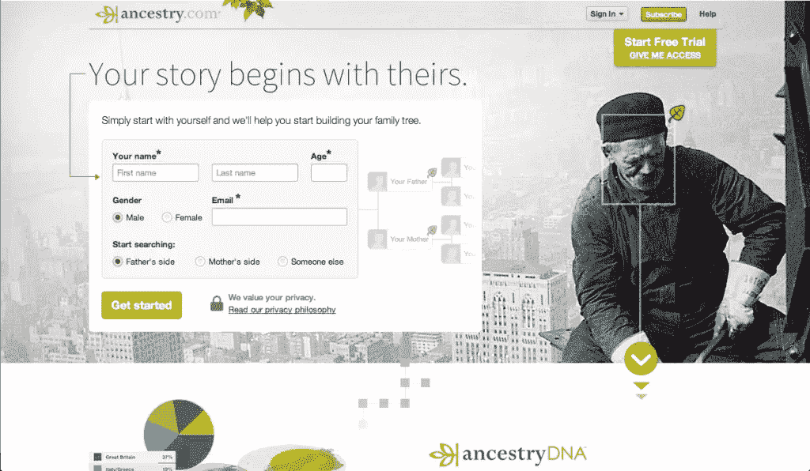

# 响应式设计 vs . m .网站

> 原文：<https://www.sitepoint.com/responsive-design-vs-m-sites/>

在 2014 年，将移动体验隔离到一个子域，即臭名昭著的“m”域，似乎有点过时。在快速发展的移动网络开发领域，你是否应该考虑进行这样的隔离，这是一个合理的问题。

在这篇文章中，我从很少有实体再使用‘m’域的前提出发，提出了一些不使用的理由。然后，扮演魔鬼的倡导者，我会提供一些原因，为什么你可能想要一个单独的子域重定向您的移动用户群。

## 为什么没人再做了

### RWD 所有的事情

响应式 web 设计、移动优先设计和渐进增强作为设计模式的出现受到了许多设计师和开发人员的热烈欢迎。他们改变了设计和开发的方式。网站设计，尤其是那些从零开始的设计，越来越多地从“自下而上”而不是“自上而下”开始。移动优先的设计不是创建一个漂亮的、功能齐全的、能在大型桌面上很好显示的网站，也不是在用户的屏幕缩小到移动时取消或隐藏功能，而是从一个在最小的屏幕上有吸引力和功能的设计开始。在此基础上，设计师逐步增强界面，以获得高清桌面体验。

更进一步，Scott Jehl 最近建议与其说是“移动优先”战略，不如说是“全球优先”战略。设计一套所有屏幕都必须具备的风格，然后根据浏览器的能力进行增强，这取决于 Scott 所谓的“切芥末”测试集。

### 一个品牌，一个代码库，一个领域

较早采用“m”域的原因之一是需要维护单独的代码库。一个移动团队可能维护一个，一个 web 团队维护另一个。有一种观点认为“m”网站的表现必须不同于“www”网站。但是这种策略中固有的维护问题令人望而生畏。

维护大量的开发人员，并确保两个前端代码库和一个后端系统之间的数据一致性，这可能是维护的噩梦。如果用户因为 iPhone 上的网站看起来与桌面上的完全不同而感到困惑，这种精神分裂的网络到手机的存在可能会损害你的品牌。

与其维护两个代码库并潜在地迷惑客户，一个小型的敏捷团队可以使用现代策略来提供一个干净、快速、响应迅速的体验，这种体验从桌面到移动都可以很好地退化。

像[Ancestry.com](http://www.ancestry.com)这样的功能性网站已经转向一个可接受的网络到移动响应网站，并且运行良好。

## 为什么还没完成

### 遗留代码和移动设备的幻影

一些网站已经接受了新技术，要么通过网站重新设计创建一个新的移动优先的网站，要么转换他们的遗留代码库以支持响应式设计。其他网站采取了另一种策略，即隔离他们的“www”和“m”域名，并相应地呈现不同的用户体验。

电子商务网站 Sephora.com 就是一个很好的例子。访问[www.sephora.com](http://www.sephora.com)会把你带到一个无响应的标准桌面网站，上面有一个大滑块和许多(诱人的)商品，可供购物者放入购物车。在你的手机上访问同一个网站(或者在你的桌面上访问 http://m.sephora.com 的，你会被引导到一个非常漂亮的‘m’网站，它看起来与‘www’网站完全不同。

虽然购物体验同样诱人，但我确实花了六次点击将一件商品添加到我的购物车，而在桌面网站上只需三次。显然，庞大的产品线迫使移动团队在移动网站上以不同的方式筛选库存，仅仅是为了能够显示产品。

虽然我不知道 Sephora 开发团队的构成(没有双关语)，但我猜测公司的大量库存使得经理们选择将代码库分成两个不同的领域，因为它们在不同的设备上显示完全不同。

我敢打赌，遗留代码库对任何倡导移动优先、响应式设计策略的人来说都是巨大的挑战。这个代码库已经存在一段时间了。快速浏览一下源代码就可以发现 jQuery 1.6.3 的用法，我们决定创建一个独立的移动网站，而不是转换一个大型的成熟的电子商务网站。对于像丝芙兰这样的大型成熟公司来说，这种策略可能很有意义。看一下“m”站点的源代码，就会发现 jQuery 1.8.3 被正确地加载到了一个新编译的连接文件的页脚中，并加入了一些现代元素，比如延迟加载库和浏览器检测。

与每个设计决策一样，在开始重新设计之前，必须权衡策略的利弊。如果您的公司拥有用最新技术创建新网站的特权，并且/或者是一家小商店，那么利用最新、最好的响应性、移动优先的设计模式更有意义。

然而，如果您正在处理一个大型的、成熟的、遗留的代码库，管理层规定了某些设计，和/或您的团队很大，您可能会被要求分叉代码库并创建一个新的移动存在。只要你的公司能够有效地维护两个代码库，这可能就是你的一个潜在策略。你可以把它看作是“重新启动”你的网络战略的一种方式，允许你创建一个新的“m”网站，它可能会发展成为一个真正的移动优先网站，可以满足你的“www”需求，并在未来实现网站的统一。

如果你有兴趣了解更多关于响应式网页设计的知识，可以看看我们的新书，克里斯·沃德写的《快速启动响应式网页设计》。

## 分享这篇文章